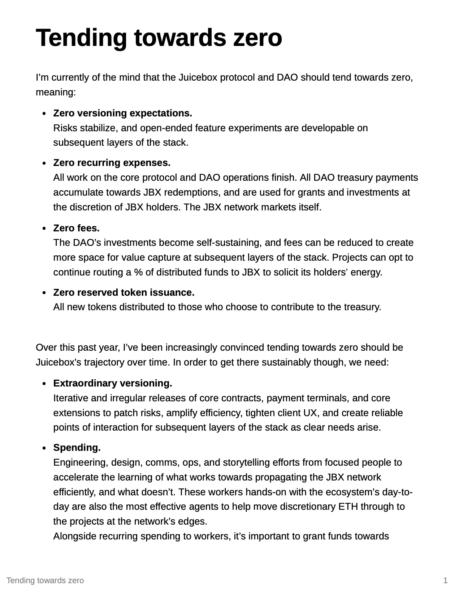
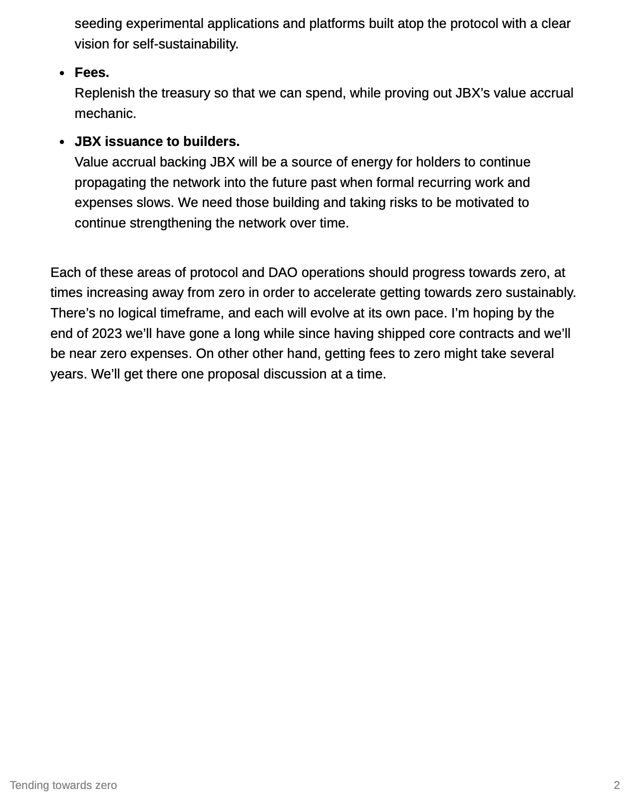
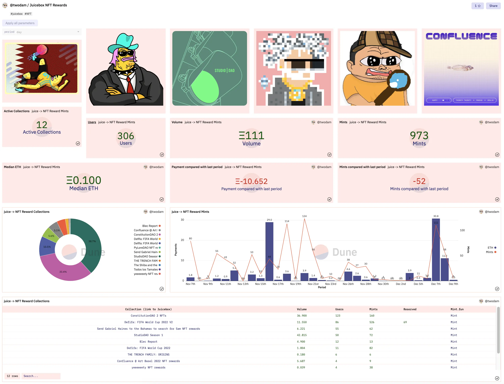
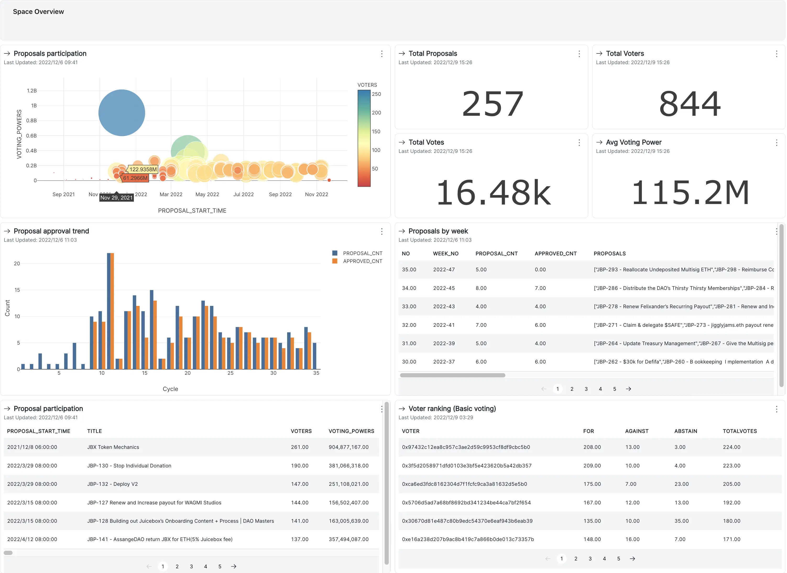
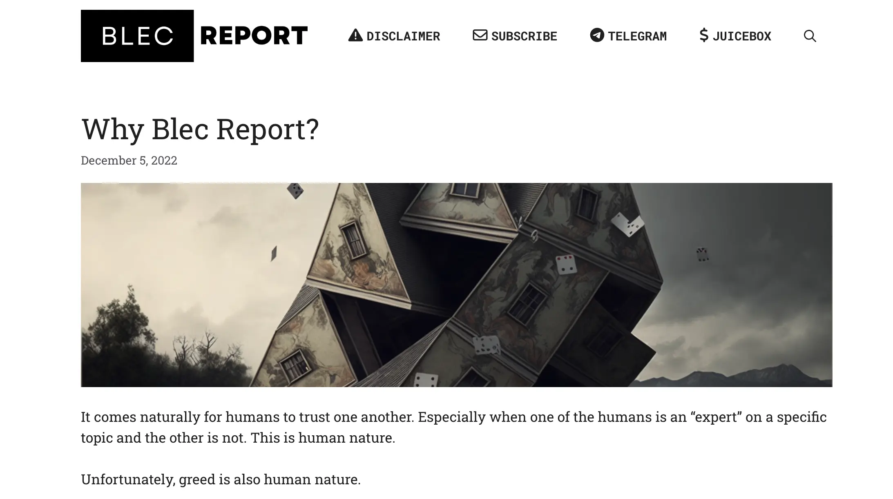
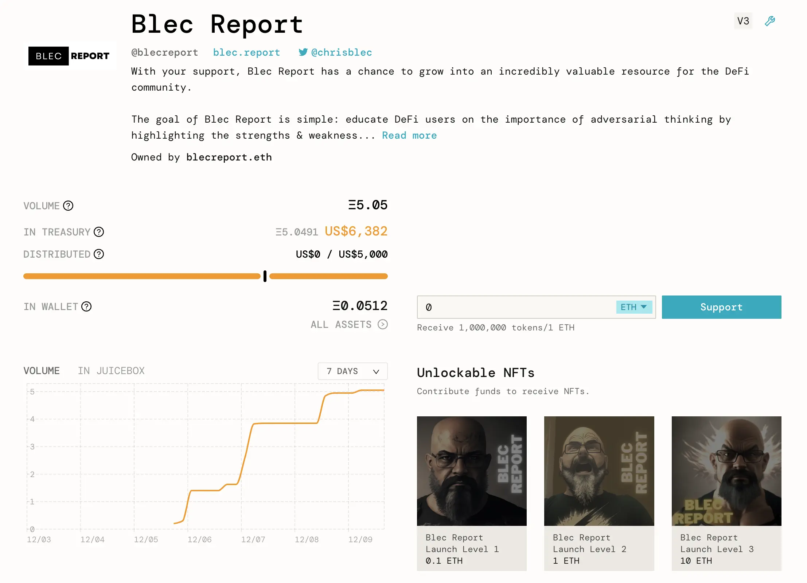
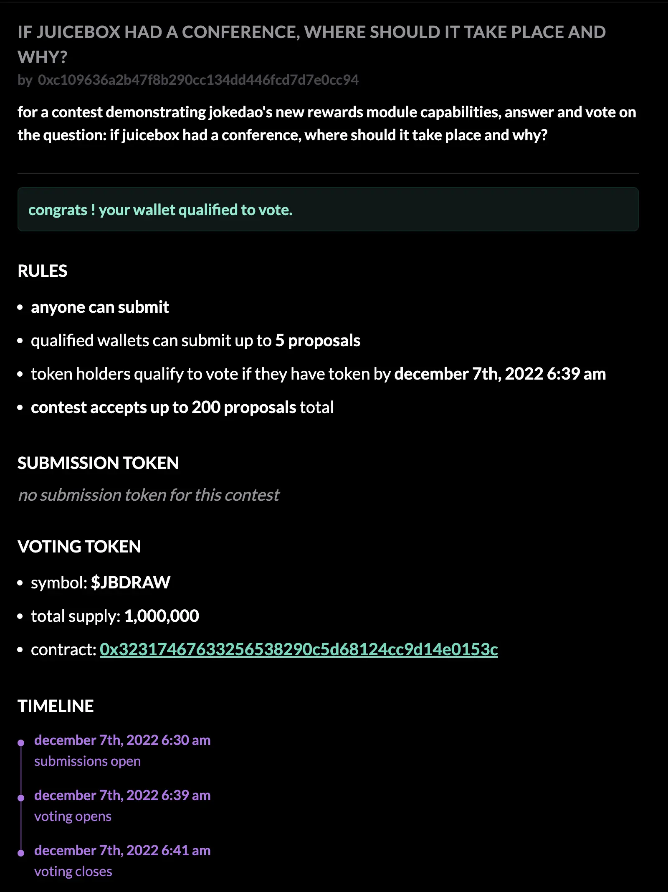
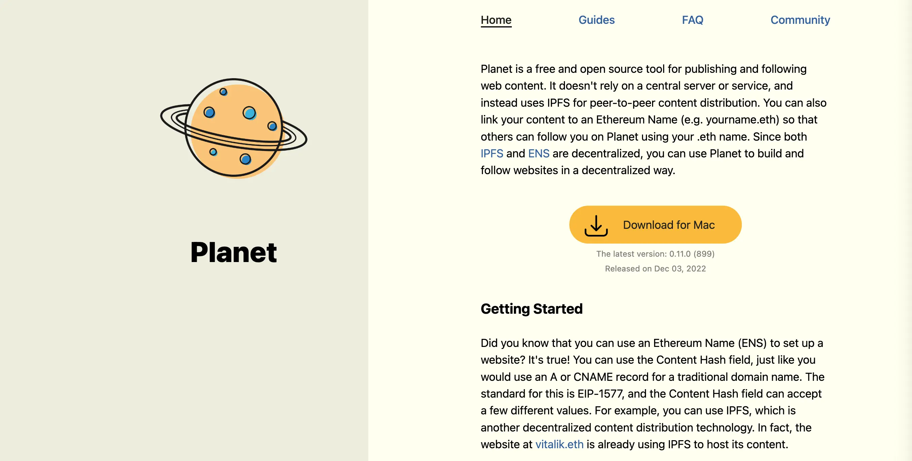
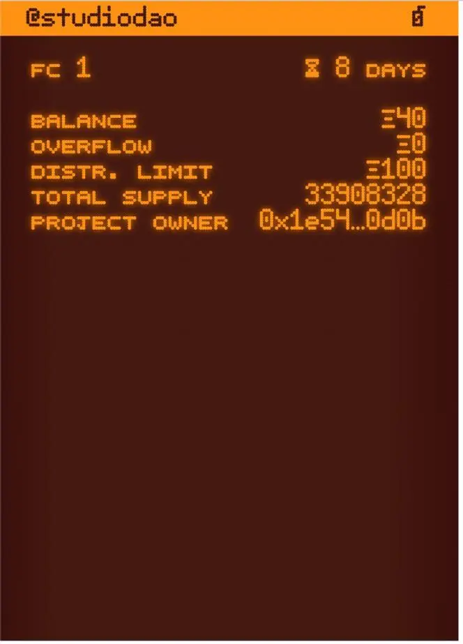

Art by [Sage Kellyn](https://twitter.com/SageKellyn)

## 协议及 JuiceboxDAO 趋零构思 by Jango

这是 Jango 最近在思考的一个构想，从不同的角度，把这个想法当作一面透镜来审视前几个筹款周期的提案。这个构思是关于我们当前各方面的决策，包括在费用支出、协议迭代至不同改良合约、建议前端配合相应的客户端，以及协议费用及 JBX 代币的发行等等。

一方面，我们会面对压力，要向某个方向扩张决策来容纳更多的事物、更多的人、更多的支出及更多的承诺。但另一方面，同样有压力要把决策趋向零，意味着要收缩决策及实质上减少治理脆弱性和 JBX 决策带来的摩擦点，从而建立一个技术上更稳定的金库，生态内的项目在自身协议费用逐渐减少的同时并不需要预期金库会发生变化，也不需要做一些关于金库的承诺。

这两方面的压力都是有意义的。我们需要把我们已经在 JuiceboxDAO 和 Juicebox 协议作过的开发和运营的努力，和我们要发展的方向，两者相结合在一起。与此同时，承认要趋向零的话，我们必须思考如何在可持续发展的前提下来实现。以生态网络为背景，可持续性意味着我们的网络是有效的，并且拥有支持新成员新项目学习如何发展的各种属性。

以下是 Jango 贴在战略频道的内容，这些是他正在思考的问题，以此来抛砖引玉，请大家给予反馈、批评及其他意见。我们可以以这些内容为镜，来审视来年或将来的运营情况，同时反省过去一年我们的一些习以为常的操作。

Jango 同时表示，要实现这一目标，我们应逐步逐个提案地来推进。目标是要找到一个可持续发展的模型。在某一个位置，核心协议要缩减，同时因为解决了一些风险问题和提供足够的资源让人们可以在后续层堆栈中自己创造机会，所以它也是稳定的。前置在 JuiceboxDAO 上面的支出需求会进一步减少，JuiceboxDAO 成了一个底层，可以在类似 Defifa 及 Peel 前端这样的外推性项目上做大量的工作，与此同时寻找这些项目自力更生的办法。我们有一个底层可以重构这些机会和风险。然后就是 JBX，在理想的情况下，作为生态系统的能量，在网络及许多更具战略性的述事组件都转移到堆栈的其他层的同时，进行自我推广。

Jango 认为，鉴于我们金库的性质，假设它会保持不变，我们也应该意识到情况不会永远都这样。趋零将会把资金转移到网络的边缘，就好像我们需要这些支出来促使一个自我维系点的出现，同时创造一些项目通用的工具。他同时认为，如果我们可以创造出足够的这些组件，并且构建这种基础作为原则，它将帮助我们周围所有的其他项目能够自行承担起风险与机会的责任。

##  迁移功能工作报告 by Jango

我们的 V1 及 V2 的分发组件即将开发完成，本周后期将可以进行发布。我们还会设置好 V3 代币，这样各个项目可以启动自己的 V3 代币并从 V1 或 V2 金库迁移过来，这个开发工作还没有最后完成，目前还在修改整理，但时间上应该快了。Jango 预计年底前可以发布出来让前端来接手。

## 数据面板演示 by Twodam

Towdam 打造了一个新的 [Dune 数据面板](https://dune.com/twodam/juicebox-nft-rewards)来追踪 Juicebox 协议上创建的所有 NFT。

同时，他还创建了[另一个数据面板](https://app.flipsidecrypto.com/dashboard/snapshot-plus-data-ueqrnb)来统计一些 Snapshot 投票相关的数据，Snapshot 空间里面所有的 DAO 都可以使用这个面板。

## Blec Report 项目 by Chris Blec

[Chris Blec](https://twitter.com/chrisblec) 在会上自我介绍，他是一个 DEFI 生态的分析师，花费很多时间在推特上调查 DEFI 项目及去中化，试图找出用户们需要注意的与信任及中心化等相关的一些问题，通过批判来加强这个生态的健康度。

Recently he has launched a website [blec.report](https://blec.report/) to post his opinions about DEFI and crypto.

最近他搭建了 [blec.report](https://blec.report/) 来发表自己关于 DEFI 和加密货币的看法。

在 Jango 的帮助下明白 Juicebox 的一些机制后，他同时还创建了一个叫 [Blec Report](https://juicebox.money/@blecreport) 的项目，来支持自己全职投入这方面的工作。

会上，Chris Blec 分享了他认识了解 Juicebox 的经验和一些认知的障碍，对我们提高与潜在用户的沟通很有帮助。他还表示愿意参与向社区解释 Juicebox 协议机制的工作，希望能帮助 Juicebox 吸引更多用户，因为他觉得 Juicebox 是一个非常有用的工具，将会是其他众筹平台非常好的替代选择。

## JokeDAO 奖励模块演示 by Seanmc

上周 Seanmc 在周会粗略对他们的奖励模块进行了介绍，这是 JuiceboxDAO 对 JokeDAO 拨款第二个阶段的工作内容。目前他们已经完成了这个模块的产品化，所以再次来到周会，想要举办一个比赛来展示一下产品的动作情况。

Seanmc 创建了一个以 “如果 Juicebox 要举办一场会议，应该在哪里举行，为什么？”为指令的[比赛](https://www.jokedao.io/contest/polygon/0x177D12eFe658CCADAacf4F735aa14F18d4Df3645/rules)。大家可以按照这个指令在比赛中提交他们的提议，又或者使用专用的投票代币对提交的建议进行投票。比赛中获胜的提案会按预设的规则来按比例分配发送到奖励模块中的资金。在这个演示里，第一名获得 50%，第二名 33%， 第三名16%。

同时他们表示接下来将会尝试允许所有人部署自己的奖励模块。如果实现的话，在同一个比赛里就会有同时有多个奖励模块接入，按不同的参数来给予不同的名次各自的奖励。

## Planet 应用演示 by Livid

[Livid](https://twitter.com/Livid) 来到我们周会，介绍一款搭建和托管去中心化网站的原生MacOs 应用。

一般情况下，如果你想要在 ENS 域名上面托管一个网站，这个过程会涉及静态网站生成器以及 IPFS。由于目前可用的产品不多，你可能需要使用像 Fleek 这样的中心化服务商，又或者用你自己的电脑来运行一个 IPFS 节点。除此以外，还会有一些编写命令的门槛，所以很多想要自己搭建的人往往都望而却步。

这个团队一直在开发这款名为 Planet 的应用，通过这个应用，用户们可以建立一个区块并发布到 IPFS 上面。应用有一个内建的 IPFS 节点，因此允许用户从他们的 Mac 机器来托管网站，同时无需用到 CRI。到[这里](https://www.planetable.xyz)浏览他们的网页。

在周会上，Livid 演示了如何用 ENS 域名生成一个网站并托管到 IPFS。他还展示了这款应用最近发布的新功能，允许用户使用 ETH 通过 ENS 域名来对一个作者进行打赏，同时还会将相关文章的 URL 附加到数据字段中，以便这些作者日后可以翻查资金的来源。

他还提出一个想法，在他们的应用里添加一个 Juicebox 的图标，可以像普通 Juicebox 项目的支付按钮那样使用，这样创作者们就可以通过他们创建的 Juicebox 项目来接收资金了。创作者们仅需要在 Planet 应用的设定内添加一个 Juicebox 合约地址就可以实现，很酷。他最近一直在研究 Juicebox 的技术细节，希望可以早上实施这个功能的整合。

Planet 是一个开源软件，代码库在[这里](https://github.com/Planetable/Planet)。

## TokenURI 编译器演示 by Nichoas

Juicebox 项目的所有权由一个 NFT 来表示，持有这些 NFT 的地址就可以变更相关项目的筹款周期参数。目前 V1 及 V2 协议上项目的所有权 NFT 都是没有元数据的，所以 Nicholas 一直在编写一个 tokenURI 编译器，类似一个外挂部署的合约，从而在 NFT 上显示一些项目相关的资料。JuiceboxDAO 通过先前一个[提案](https://juicetool.xyz/snapshot/jbdao.eth/proposal/0x44ca6ed9c0ea0bcaac4a6cc96127de3185e2eac2cf1a8b47c2f026680a6c6c4c)授权在月底前可以部署这样一个合约。

Nicholas 在会上分享了一些 NFT 的图像，这些都是完全链上生成的，橙色是默认的主题颜色。

P

Juicebox 的项目方如果想要使用这个橙色的主题，并不需要额外做任何事情。当然他们也可以选择在 NFT 上使用不同的主题。

Nicholas 预计这个功能的 V1 版本将在这个月圣诞节前发布。
