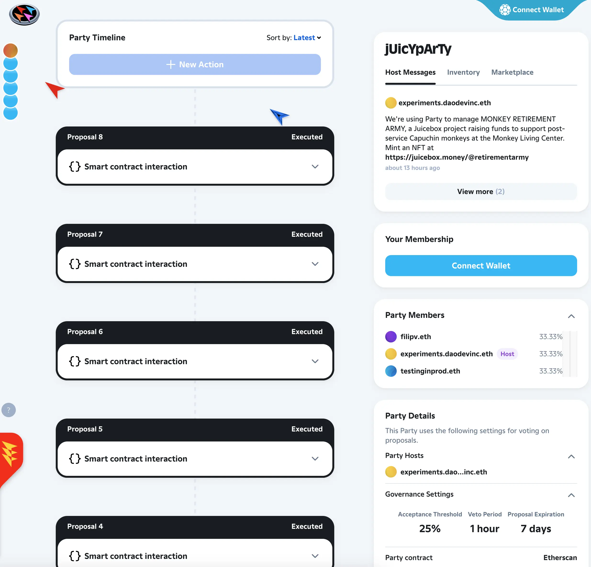
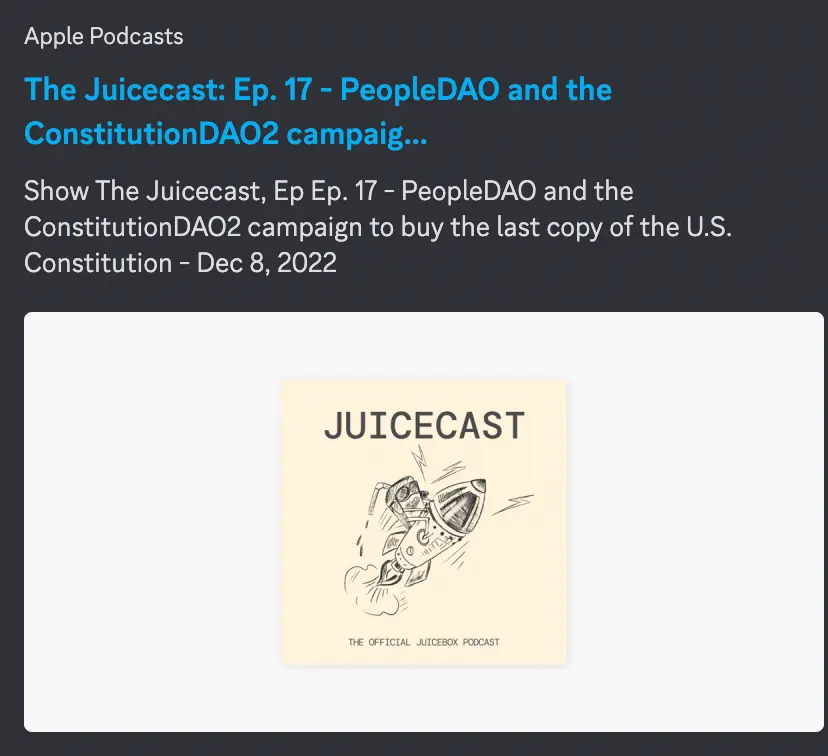

插图作者： [Sage Kellyn](https://twitter.com/SageKellyn)

## Juicebox 回顾及 2023 机会展望 by Jango

在会上 jango 分享了他看到的生态系统里的一些机会，同时表示他正在进行年底反思及工作调研，在推动自己思考之余也希望能给其他人一点启示。因为他在生态系统内参与的工作项目比较多，应该由他来把所有工作整理到一起，帮忙我们评估社区明年应该关注的事项，以及评估过去一年有成效或成效不大的工作。

### 产品

##### 多资产金库

这个产品的目的是允许项目持有 ERC-20 标准代币及以这些代币来接收付款、用这些代币来分配以及除了 ETH 之外同时 ERC-20 代币的赎回，还允许观察项目的人能看到项目在金库里持有的所有资产。同时还允许项目在支出时在 ETH 和 DAI 资产之前进行转换，这样的话即使资产转换也不会影响代币的赎回价值。他认为有很多项目还在外围等待使用 DAI 或者其他稳定币，特别是那些预期金库规模比较大的项目。在这方面应该有挺大机会。

##### veNFT
我们今年很早的时候就做了很多 veNFT 项目的工作。从合约的角度及 Juicebox.money 前端的角度来看，工作差不多都已经就绪。这个项目可以提供一种新的会计方法，允许人们锁定自己的代币从而获得代表锁定时间的一个 NFT，这个 NFT 同时又可以用于治理及其他大家希望的用途。

##### 产品发现

产品发现我们已经讨论过很多了，尤其是最近。我们应该怎样通过展示机制及 UI 的选择来更好地帮助用户找到更好的项目呢？我们也讨论了 veNFT 这个按时间授予代币可以在某种形式上作为一种影响项目展示的工作，可能还需要进行试验。

##### NFT 内容种类

我们今年开发了 NFT 奖励这个重大项目，这很好。我想这个项目最近也找到一些很酷的用例，在此要谢谢 ConstitutionDAO2 项目实际上逼着我们很快地完成了 NFT 赎回的机制。这是一个试验这个产品很好的方式，但我还觉得支持新的内容种类也会很酷，目前我们仅支持图片及 Gif，我们将来才能让产品支持声音及视频内容？

##### NFT 市场

这个产品允许人们通过不同的展示筛选及分类模式来浏览所有 Juicebox 项目的 NFT，在某种程度上给予项目更多视觉效果及个性，允许项目在自己页面和整个生态里设计自己的图案。

##### 模板

我们今年下半讨论模板的事情会比较多。我们会继续帮助用户以最低的成本来启动一些特定目的的金库。这里提醒一下，在年底的这个时候，我已经明白，这个问题最好先从合约端来开始解决，就好像 Defifa 项目、Blunt Finance 项目等那样，它们实质上在合约内硬编码了一些特殊目的，这样前端团队就可以放弃部分一般的 Juicebox 属性。这可能是提高创建体验的一个先决条件，而且从前端角度来看不应该太急进，因为没有更为简化的创建模式的背后如果没有合约来保证，很难真正地解决问题。

##### 开放授权、一次性钱包及借记卡

我们讨论过开放授权、一次性钱包及借记卡，目标是使我们的产品更容易让非 web3 人群或者我们希望引导进入 web3 的人群更安全地参与进来。

##### 合约功能对等

有很多合约和 NFT 的功能没有体现到产品上面，推出这些功能会很有用。比方说 NFT 治理、NFT 保留率，还有一些筹款周期里可以打开的选项。还是那句话，顺应需求把添加这些功能是很有必要的，就如 ConstitutionDAO2 需要赎回 NFT，我们就优先填补了一些合约对应的功能，但展望未来，我们应当考虑提前来实现这些功能。

### 合约工作

合约工作的目标其实是完全创造这些可靠的核心组件，让项目可以更有效地利用来开展运营。以下是所有项目都可以适用来解决效率需求的一些通用化工具。

##### 审计 veNFT

待 veNFT 开发完成后，我们应该对这个新的会计工具进行审计。感谢Viraz 及 0xBA5ED 在开发这个项目上的工作。但在迎合项目需求之前，我们应该对它进行一次审计。

##### 回购委托

目前，Juicebox 的各个项目金库收到款项时，都会分发新的项目代币。但如果这个项目代币存在市场价格的话，项目应该可以在发行新代币之外，还能选择提供在市场上兑换的功能，从而保证项目付款人以最优的成本获得项目代币。

##### V3 代币

项目可以部署他们的 V3 代币。接下来我们会发起一项提案来部署 V3 JBX 代币。部署完成后，它会保持 V1、V2 及 V3 的代币余额，以保证赎回价值不受影响。所有的资金会汇集到 V3，可以被正确地赎回。所有的 V1 及 V2 代币持有人，不管他们的代币是领取或未领取的，都可以把代币发送到 V3 代币，V3 代币会自行向发送的人铸造 V3 代币。我们的目标是  V3 代币应该收集所有这些代币并持续地使用正常的 V3 金库来铸造 V3 代币。

##### 委托注册

我们启动使用这个委托模式的 NFT 奖励，使用这个模式的还有 Defifa 和 Blunt Finance，还会有其他创建客制化金库的新生项目也会需要使用。我们怎样可以创建一个可靠的注册机制来备案所有这些委托，从而令项目能够更加便利地即插即用这些委托功能呢？项目可以选用 blunt 筹款轮、NFT 奖励还有许许多多即将开发出来的筹款限制功能，我们要把这些委托功能很方便地提供给需要使用的项目。

##### 筹款周期排序器

这个是要通用化 Defifa 的构想，可以把组成游戏的几个筹款周期通过硬编码的方式进行预先排序。Defifa 的游戏版本偏定制化，但理论上来说，在部署的时候你就可以明确：”我想要运行 5 个筹款周期“。你需要部署项目并把项目方设置为一个编历你提前设置的筹款周期的合约。然后项目就会按周期来运行。这是运行预设的多个筹款周期的一种途径。

##### 721 委托

我们计划对 721 委托做一系列的迭代，这个 721 委托其实就是 NFT 奖励。我们目前已经有一个 v1.1 版本，提高了信用系统的可靠性，同时更改了一些用户的交互方式，让这些交互更为切合我们所观察到用户实际使用 NFT 时的诉求。讲完这个总结后，我会继续讲一下这个问题。

##### 兑换分配器

兑换分配器是 Dr.Gorilla 一直开发的一个产品，允许通过兑换来从金库进行支付。我可以从 ETH 金库支付 DAI 给一个受益人。兑换分配器先进行兑换再发送给受益人。这个概念同样可以用于兑换一个资产然后再付回项目的一个付款终端，从而实现项目资产的转换。

##### 客户鼓励

这个事情我们已经讨论了一段时间的。 这个话题经常出现，但我们从未真正尝试过汇总一些数据来证明，激励客户继续促进网络增长和增加网络流量是否可行或者有多可行，这个工作有一定意义，但我们还没有完全确定相关策略。 这个工作可能不属于合约层面的，而是某种意义上要系统化的事情。

### 项目

在利用核心协议和核心组件并扩展出去为项目创建者提供一些功能这一点，我们的项目世界发生了许多很酷的事情。

这些都是本身就应该受到尊重和追求的机会。 很酷的是，它们往往具有独立的风险状况，因此我们可以将资金投入其中，我们可以尝试有效地管理这笔资金以实现目标。 但是，如果该项目出于某种原因失败了，我们可以从中吸取教训，并将其视为一项实验。 这些项目在很多方面都很有用，我们在过去一年中看到的很多产品及项目从某种意义上来说都是从协议孵化器诞生的。

贡献者构思想法并实际解决问题，同时创建系统来提供通用的解决方案，并慢慢建立自己的项目金库自给自足，并不再依赖 juiceboxDAO 来维系自己的运作。

以下项目不分先后。 这份文件出不是要讨论项目的优先级别，我想我们大家都有责任按照我们看到的机会以及大家的兴趣确定这些工作哪些更重要。

##### Banny 世界及 WAGMI 工作室

我想我们都认识到通过 Banny 以及 Sage 和 Mieos 还有所有参与过的人的努力所实现的项目、角色和叙事。 这很棒，实在是太棒了。 我们在发展的整个过程中都非常创造性地使用了这些美好的时刻、人物和想法，而且还有很多事情要做。 这就是一个可能存在的想象世界，而我们的目标就是这个世界的这个角色如何继续茁壮成长。

##### Peel

Peel 显然是协议连接世界的重要通道，但在我眼中，它的目标是允许人们与 Juicebox 协议及其活动历史进行可信和有用的交互。 这非常重要，因为我们围绕这个目标及我们的产品，成功创建了一个金库、生态系统和社区。 这感谢 Peel 团队过去一年里极富创造性及高效地完成这项工作，确实未来还有很多工作要做，其他前端也可以向 Peel 借鉴和学习。

##### Juicetool
关于 Juicecool，向 twodam 致敬，他的这个项目实现了整个生态系统中的一次性事件和信息真正便利的交互。 在过去的一年里，Juicetool 提供了解决重要问题的许多小要素，以及一些我们需要关注的各种信息。 特别是在过去几个月的版本控制工作中，我们略微扩展来适应版本控制的复杂性以便整合再发展的时候，类似的这些工具帮忙良多，同时让我们在接下来有需要做同样动作的时候更有信心。

##### Nance
Nance 作为一个 API，用来管理定期治理系统的提案过程及提案结果执行的各种数据，然后让 Peel、Juicetool 和 Cogni 等项目来利用这些信息。 因此，还有很多工作要做。

##### Cogni
Cogni 是一个概念，同时也很有意思，项目的目标是创造着眼未来对项目会计的理解。 我们在接下来五个融资周期中预算支出是多少， 我们的支出是否跟我们承诺的一样？这个项目跟 Nance 一起配合，会让重新配置筹款周期变得简单，因为很多项目方通常会更渴望这种治理与筹款周期捆绑到一起的运营方式。

##### Merch 主题商品

最近有很多关于主题商品的讨论，主题商品是 STVG 最早开始试验的，从中获得很好的效果。我希望看到如何使用 NFT 使这个主题商品成为一个更有吸引力的交互点。 这个组合正在筹划之中，我没有关注太多，可能稍后周会上会有更令人激动的工作汇报。

##### Lexicon Devils and Forming

这群充满活力、才华横溢、充满艺术气息的人将这种建筑和体验融合在一起，我要对他们说非常感谢。 还有些人想以此为基础来继续创造。 我们如何才能在类似的空间中提供与 Forming 一起的其他体验，以真正利用这个时刻，让人们聚集在一个共享的数字空间中，共同体验音乐、艺术品、氛围、服装等。这个项目今年让我大开眼界。 感谢你们所做的一切，Lexicon Devils。

#####  文本 NFT 元数据 URI 解析器

我觉得 Nicholas 一直在开发的这个展示项目所有权 NFT 元数据的工作有很多很酷的机会。 这个用 NFT 来显示重要信息的构思非常厉害，不但能对 Defifa 有用，也可以对整个生态项目的项目数据有用。 这个解析器所用的字体编自 Peri 编写的 [Capsules 字体](https://cpsls.app/#/)，这也很棒。 我认为，正好我们扩展了 NFT 功能，如果有一个非常干净的系统来创造一些既有美感又能传播信息的 NFT，效果肯定非常好。 我们随时都可以加入一些更引人注目或更独特的艺术作品。 能够在 NFT 上展示一些代表某个项目的信息，这再好不过了。

##### Juicecast 播客

这个项目令人振奋，它把我们所做的一切都人性化了，让我们可以讲述故事、互相交流、传播项目的愿景、跟进并真正为项目发声。 非常感谢 Matthew 和 Brileigh 接手这个项目，很好奇你们明年的想法和计划会是什么样的。

##### Defifa 世界杯游戏

我认为 Defifa 作为一个项目，本身就肯定有很大的发展空间。 大家已经在 Discord 为明年我们可以参与的所有比赛设计积分系统。 我明年要在这个项目投入很多时间去进行试验， 非常期待看到这个项目的进化。

##### StudioDAO
一会儿周会上还会单独介绍一下这个项目的进展情况，但它作为一个项目之上的项目来组建一个由更具针对性和目的性的诸多子项目形成的项目网络，这个发展方向的机会巨大。 再加上主创团队搭建的法律框架非常酷，既有实验性又很酷。 我认为当它的可行性得以证实，能为其他项目提供很多帮助。

##### Bananapus
这个项目我称之为 bananaspus ，暂时还没跟任何人提过，这是一个 L2 行动计划。 我们如何才能让 Juicebox 跨多个 EVM 链运行？ 这个运行的复杂性非常高， 因此它可能会脱离 JuiceboxDAO 独立开展。 请持续关注我们将会在这个方面将要采取的行动。 有趣的是每次我们克隆到另一个 EVM 的时候，我们其实就是把所有已经构建好的东西都搬过去而已。有时会让人有一种感觉，在到处复制之前，我们在主网上还有更多工作要做，因此我们不希望把版本控制和管理的负担也都附带过去。但主网之外的其他链上有很多机会这是肯定的。

##### Blunt Finance

Blunt Finance 的这个构想我认为非常有用，其实就是一个更偏筹款功能项目专用的第一个筹款周期，可以设置未来的筹资周期来自动给予第一个筹资周期的捐款人一定程度的奖励。 而且在这个特别的初始融资周期中，项目的运行有更严格的限制，例如说，如果筹款达不到目标，合同所有者会自动将筹到的款项转到第二个融资周期并实施退款。 如果筹款达到硬顶，项目就自动转到项目方名下，然后开展正常的运营。 我认为像这种合约层面比较简单的捐赠体验，会让我们发展得更好。

##### 集体拍卖委托

就像 ConstitutionDAO2 刚刚尝试过那样，不过这个是自动化的，并且包含拍卖执行人和预言机混合体。

##### 活动及票务

提到活动，有很多值得我们投入资金到某个项目做的活动。 我们可以向项目投入资金并将其用于票务和分发活动纪念品，例如视频、音乐、音乐或活动中发生的事情，让参与项目的每个人都从工作和参与中受益。

***

这些是我一直在思考的东西。 希望有助于大家对我们当前的处境以及未来方向的思考，同时希望能对我们当前的工作提供一些个人见解。

##  721 委托 1.1 版本

我们在 NFT 奖励存储库上开了一个 PR，用于 NFT 奖励的 1.1 版本迭代，这个版本稍微简化了标志结构，删除 `MintBestAvailable` 功能，实质上就要求用户明确自己想要铸造什么。

新版本还改进了信用系统，有些时候项目间互相支付，但却不能明确想要铸造什么 NFT，这种情况就会很有用。 目前，如果付款方没有明确的指示，合约就会尝试按最佳选择来铸造。 我们在新版本想要实现的是，如果不能明确指示，则付款人可以把付款获得的信用累积起来，最后再汇总来进行铸造。

这些是基于用户体验的小改进，是我们与 Peel 一起按用户体验情况确定的，并很好地支持最近的部分筹款活动的正常开展。

Jango 说他会和 Peel 讨论具体细节，但总而言之，一切已经就绪，随时都可以进行部署。

## 治理流程法定人数的报告 by Nicholas and Filipv

Nicholas 提示，过去一两个筹款周期，我们对 Snapshot 投票中的法定人数标准进行激烈的讨论。 目前为止法定人数设定为 8000 万个 JBX 代币，但令部分 DAO 成员意外的是弃权票一直没有计入总法定人数。

Nicholas 刚刚发起了一个[提案](https://juicetool.xyz/nance/juicebox/proposal/6490892f6e934011b9915152db873ace)，建议将 JBX 的法定数量从 8 千万 增加到 1 亿，相当于所有代币供应量的 4.7%，同时将弃权票计入总法定人数。

通过将弃权票计入总法定人数，投“弃权”票的人实际上是将他们的选票委托给其他投“赞成”或“反对”票的人。

## 项目发掘 by Filipv

Filipv 介绍说，我们获得了 Sapana 的封闭测试资格，Sapana 是一个为 Lens 和 Mirror 做后端搜索管理的服务商。 团队在他们的 API 实现了一项新功能，允许 Juicebox 用来搜索 juicebox.money， 而且支持对项目标题、描述和类似内容进行全文搜索。

Juicebox 也加入了 Dune API 的封闭 Beta 测试，可以使用搜索和其他的一些服务。 想要获得 API 密钥或访问权限的人都可以联系 Filipv。

Filipv 与 Nucleus 展开接触，Nucleus 是一家用加密资产支持来发行实体卡或虚拟卡的服务商。 Nucleus 为我们开设了一张卡，相关的 KYC 及其他事宜由他们来负责。

## WAGMI 工作报告 with Mieos

WAGMI 目前正在做一些反思，考虑他们 2023 年应该如何开展工作。Mieos 希望另行组织一个会议，一起讨论大家对 WAGMI 的看法和意见。

## Banny Warhol by Jmill and Genekogan

Jmill 和 Genekogan 正在开发一个名为 Eden 的项目，该项目主要使用生成 AI 来工作，就像大家熟知的 Dall-E、Stable Diffusion 等。

不久前，他们产生了尝试用 Banny 图片来微调 AI 艺术模型的想法，其实就是作为 Stable Diffusion 的一个版本，根据 Banny 的一些艺术作品来训练 AI 生成。

Genekogan 说底层的技术其实就是 DreamBooth，这种技术可以让人们在 Stable Diffusion 词汇中加入新的概念、角色或风格。 这是一个经过微调的 Stable Diffusion，专门针对 Banny 的照片进行一系列的优化。

Nicholas 问他们是否打算开发一种可以作为服务来销售的产品，Genekogan 则回答说是有这个打算，但他们仍在尝试不同的做法，或者开发一种面对客户的服务产品，又或者进一步探索这些技术，让更多人来使用和测试。

## StudioDAO Update by Kenbot

StudioDAO 的第一个融资周期最近结束，他们成功筹集了 40 多个 ETH，包括主要来自 JuiceboxDAO 的拨款。

他们最近的主要任务是通过让非 web3 用户更轻松地购买他们的 NFT 来吸引更多成员加入社区。 同时他们专注与 Peel 合作，创建一个真正最小化的流程，以便潜在用户可以轻松创建钱包并获得 NFT。

StudioDAO 还将为 MoonDAO 制作一部纪录片。 MoonDAO 已经通过了与 StudioDAO 合作并为这部纪录片拨款的提案，他们将支付 10 万美元来启动这个项目。 他们谈妥与电影制作人的合作之后，将创建一个专门的 Juicebox 项目，让 MoonDAO 把资金投入项目。 Kenbot 认为这个事情将极大促进生态系统的发展。

 另一方面，StudioDAO 也一直努力让更多的电影制作人加入生态系统。 Kenbot 对他们在接下来的6 个月内可以孵化的电影制作人项目数量非常有信心。

## 集体持有 Juicebox 项目演示 by Nicholas

Nicholas 介绍，PartyBid 是一款筹款购买 NFT 的工具，可以用来募集资金购买 NFT。 但他更感兴趣的是它怎么可以代替 Gnosis Safe 来管理 Juicebox 项目，因此他决定创建一个 Juicebox 项目来演示怎样使用 PartyBid 来管理项目。

Nicholas 获得了 PartyBid V2 的内部试用，V2 不仅支持持有 NFT，还可以用 NFT 来执行交易。 Peri、Filipv 和 Nicholas 在 PartyBid 上创建了 [一个 JuicyParty](https://www.partybid.app/party/0x56bc9de3dc9556a3282ed4e7ba8f86d5cb7d8cd8) 并收购了 Nicholas 预先创建的 Juicebox 项目。 在用 JuicyParty 控制这个 Juicebox 项目后，他们试着执行一系列不同的提案，重新配置 Juicebox 项目的筹款周期和更改一些元数据。

因为 Filipv 突发奇想，他们用于试验这个操作的 Juicebox 项目改成了 [退休猴子军团项目](https://juicebox.money/@retirementarmy)，以支持 Monkey Living Center 的退役猴子，筹款 100% 捐赠给这些猴子。 此外，他们还在项目中设置几个 NFT 等级。

最酷的是，这个 Juicebox 新项目的所有配置都是使用 PartyBid 的交易实现的，包括项目元数据、NFT 等级和项目句柄等。由于 PartyBid 是全链上模式，因此不涉及到类似 Snapshot 这样的链下投票。 所有的配置提案经过投票通过后，就会在链上相应得到执行，这是一个很好的小型治理实验。 他们还与 PartyBid 的工作人员讨论了如何改进 PartyBid 用户界面以便更好地与 Juicebox 展开合作，让小型组织用来管理他们的 Juicebox 项目。

Filipv 和 Nicholas 也在寻求 PartyBid 的 Party 治理中使用 Juicebox 项目代币的可行性。

##  Juicebox 协议分析 by Nicholas

Nicholas 粗略介绍了一些他认为可能很意思的项目。

- [TanlentDAO - 研究协会](https://juicebox.money/@researchguild)
- STVG 最近创建的 [项目](https://juicebox.money/v2/p/352) ，筹集资金送新耳机给一批学生。
- 苏富比今天宣布，他们将推迟拍卖宪法的第二份私人副本，因此 ConstituionDAO2 亦即 WAGBTC，正在考虑他们是要结束活动，还是在放开退款的同时继续筹款。

## Juice 播客  Matthewbrooks and Brileigh

Matthew 和 Brileigh 刚刚发布了 [新一期 Juicecast 节目](https://podcasts.apple.com/ca/podcast/the-juicecast/id1623504302?i=1000589496263)，ConstitutionDAO 回顾系列播客的终章，这一期是有关于 PeopleDAO 的 和 ConstitutionDAO2 最近的筹款活动。

他们还在我们的博客上发布了一篇全面介绍 ConstitutionDAO [文章](https://docs.juicebox.money/blog/2022-12-13-constitutiondao/)。

## Forming 新活动 by Lexicon Devils

Lexicon Devils 的 Darbytrash 宣布他们将在 1 月 6 日举办一场 Forming 与  [Songcamp](https://twitter.com/songcamp_) 合作的活动。

