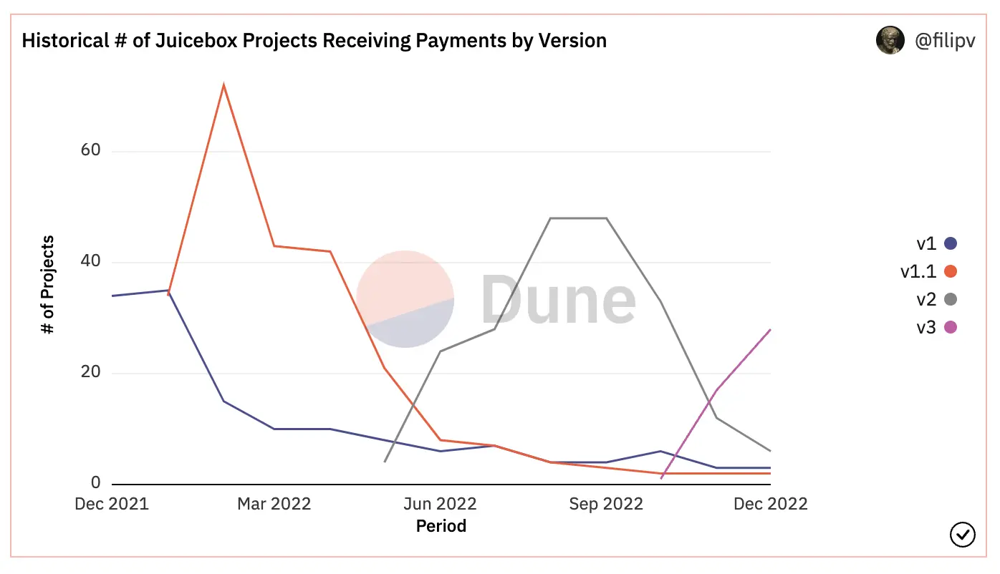
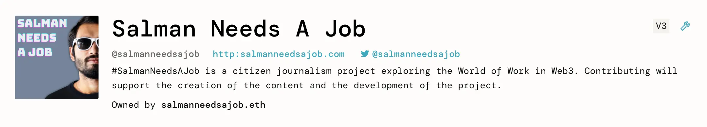
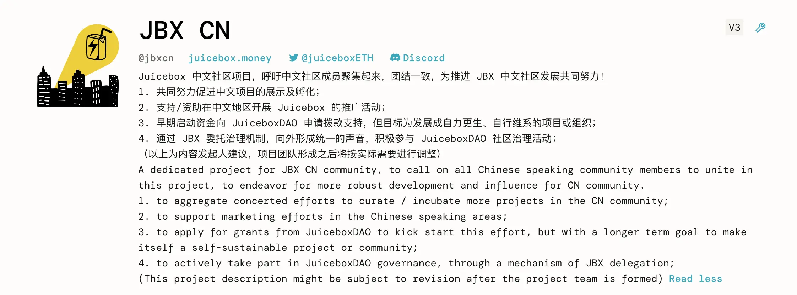
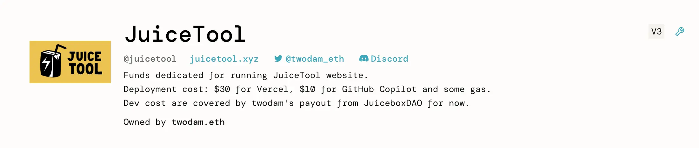

Art by [Sage Kellyn](https://twitter.com/SageKellyn)

## 保留代币讨论召集 by Nicholas

这个话题的讨论始于 12 月初 Jango 考虑向在保留代币名单上的贡献者分发 JBX 的各种途径。

Nicholas 最近发起一个关于[向保留代币名单分发 1500 万个 JBX](https://juicetool.xyz/nance/juicebox/proposal/0562102b96224ba1b7fb820d2ca5e4ec)) 的提案，旨在建议一个向 Juicebox 贡献者分配 JBX 的方案。这个提案在 JuiceboxDAO 的第 38 个治理周期的温度测试阶段受到[非常激烈的讨论](https://discord.com/channels/775859454780244028/1052301913879744552)。社区成员在这个想法上提出了不同的看法。讨论从统一给保留代币名单分配 JBX 代币是否有意义，甚至发展到我们是否应该重新考虑保留代币的作用。

Nicholas 呼吁社区成员积极参与这个讨论，预计这个讨论将会在新年假期后继续进行，我们将会就如果看待代币保留率这一问题进行充分的讨论。

Jango 提出，关于如何向新进成员或一直做贡献的成员分配 JBX 这一讨论，在某种程度上是一个宏观的问题。这个问题在金库运营的早期发挥了良好的作用。但在某个时期，我们同样应该回顾一下我们正在使用的这些工具。不光是为了我们，同时也是为了更广泛的 Juicebox 生态，因为我们是要提供这些工具给其他人，以便帮助他们启动社区及逐渐扩大规模。

## Juicebox 分析总结 by Nicholas

使用[Filipv 创建的数据面板](https://dune.com/filipv/recent-recipients)来比较 Juicebox 协议上不同版本项目的收款情况，我们可以看到 V3 协议的使用趋势正在健康发展，而 V1 和 V1.1 协议的项目正慢慢式微，尤其是像 Lexicon Devils 这样的 V1 上少数仅存的活跃项目都转移到 V3 之后。

谈到协议的不同版本，Jango 说最近他对 Nicholas 和 Peri 发起的版本命名讨论很感兴趣。这个讨论探讨关于 Juicebox.money 网站是否应该弱化其关于协议版本的提示，从而避免引起用户的混乱。他同时提到，很高兴我们的版本控制工作让我们可以很舒服地对智能合约进行迭代，如果没有这个工作，这些智能合约将是固化不能调整的。在版本控制的同时，也让其他社区选择是否要一起迁移过来新的协议版本。如果我们重做这个版本控制的工作，有些命名的方法其实是本可以稍微改进一下的。这件事情鼓励我们用一种开放的态度来看问题。目前已经有很多项目迁移到了 V3，但我们可能还是会搭建很多版本控制的基础设施来开拓发展的路径，只要我们觉得值得冒这些或者某些功能足够重要。

### 新项目介绍

- [Salman Needs A Job](https://juicebox.money/@salmanneedsajob) 一个探索 Web3 工作世界的公民新闻项目。

  

- [中文 Juicebox 项目](https://juicebox.money/@jbxcn) 由 Zhape 创建，旨在向 Juicebox 生态内的中文社区项目提供更多的支持。

  

- [Juicetool 项目](https://juicebox.money/@juicetool) 由 Twodam创建并用于筹款运营 Juicetool 网站。

  

- [zhougsoft](https://juicebox.money/@zhougsoft) 由一个 mfer 社区的成员 zhoug 所创建。

  

### 之前等待 V3 的一些项目的现状

1. Jmill 及 Genekogan 致力于构建定制化 NFT 策略的项目 Abraham Eden。他们一直在等待 V3 协议用来销售他们的 NFT，这些 NFT 可以作为使用他们的 AI 生成的机器学习服务的能量包。
2. Thirsty Thirsty 是由葡萄酒加美食爱好者建立的一个社区，他们正计划以两周为步调实施治理，从而扩宽当前 NFT 持有人的决策宽度。人们开始给社区赋能，并考虑提案建议社区在 Juicebox 建立金库来协调社区使命的实现。这是一个非常酷的，放眼长期发展的项目，他们试图在推动治理和财务动态的同时，采用更具持续性的可再生商业模式。
3. [The Shiba and the Whale - A Doge Anime](https://juicebox.money/@mecenia),  这个项目致力于制作一部主题动画。它给其他艺术创作者们提供一个通过 Juicebox 项目来推动事情的良好模式。

## Defifa 现状 by Jango

世界杯已经落幕，而这个 Defifa 锦标赛项目表现得非常有趣又鼓舞人心。我们正在计划这个 Defifa 试验的下一个步骤，在 2023 年再举办一些比赛，对一些运行良心的组件进行迭代之余，再来反思一下表现不佳的情况。

与此同时，我们正在给当前这个 Defifa 实例划上最后的句号。从现在开始到 12 月 25 日，大家都可以按实际的情况来提交记分卡。12 月 25 日后，持有 NFT 的人就可以投票并认证出正确的记分卡。认证活动结束后，项目金库将会解锁，大家可以按自己队伍在比赛上的表现及持同类 NFT 人数的多少来获得属于自己的金库份额。

还有很多东西我们可以来补全，以便在下一年中进行迭代。我们可以在 mint 与认证记分卡之间的期间来玩积分分配的游戏。

我们还将会尝试在明年一月份的 NFL 季后赛来运行一次游戏来迭代一些参数。明年还会在不同范畴的 5 到 6 个锦标赛上来进行试验，如英雄聪盟、NCAA一级男子篮球锦标赛或者女子足球世界杯等等。

开始来挖掘这些内容将会很有意思。我们很快就可以在 Defifa 的框架下来试验一下积分系统和类似的参数。然后希望我们能尽快找到一个感觉良好和保证安全的模式来开发 Defifa 的创建流程，这样大家都可以来创建和运营自己的比赛。

还有一件很酷的事情，这一次游戏开发者们每 10 个 NFT mint 出一个来给开发者金库。鉴于 NFT 的铸造数量及其可在金库赎回的事实，这个项目最终在资金上持续发展的试验也获得了成功。

我们需要重新评估这个项目的可持续性模型，并确保我们把事情都做好了。但这个项目有非常大的可扩展性，可以用于其他任意项目的筹款活动。

还有很多很多的想法我们可以来迭代。我们当然应该梦想远大，但脚踏实地一步一个脚印地发展也很能令人振奋。

## GasWoman 和 Juicy Spider by Filipv

### GasWoman

当前，多签成员在 Gnosis Safe 上执行多签交易时，可能会产生一些 gas 费用。 我们需要向那些多签成员退还一些费用。 GasWoman 是 Filipv 创建的一个通用工具，通过获取所有 Gnosis Safe 交易并发起相关的退款交易。 这是一个非常简单的工具，可能对某些人和项目有用。

接下来，Filipv 计划为项目上的触发交易开发同样的统计工具。项目的触发交易是指一些项目上的公共交易，任何人都可以在 Juicebox 项目上触发交易来分配项目的支出。如果能找到一个办法来补偿触发这些交易的 gas 费用，会非常有意义。

Jango 同时提醒说，支出合同里其实有一项功能可以允许项目向触发交易的人发送一定金额的资金。因此，实际上项目是可以将这个触发交易的 gas 费用包含到项目的支出里面，直接来鼓励其他人或者套利机器人来帮忙触发这些交易。

### Juicy Spider 项目搜索

juicebox.money 目前仅支持搜索项目句柄，这并不算方便。最近 Filipv 一直跟 Sapana 接触，寻求一个更好的解决方案。

[Sapana](https://sepana.io/) 是一个为 Dapp 做后端搜索管理的服务商，最近他们给了 Juicebox 他们 Sapana 的封闭测试权限。Filipv 于是用它来构建了一个简单的索引器及客户端，让我们可以在 Juicebox 上面搜索项目的元数据及其他参数。这个软件的代码仓库在[这里](https://github.com/jbx-protocol/juicy-spider)。

Filipv 开发的这个 Juicy Spider 项目搜索工具其实就是抓取 Juicebox 上面的项目信息并生成用于搜索的 API。现在 Peri 正在努力把这个工具集成到我们的 juicebox.money 网站上去，以便在 juicebox.money 提供一个开放访问的 API 端点来供大家以后使用。

