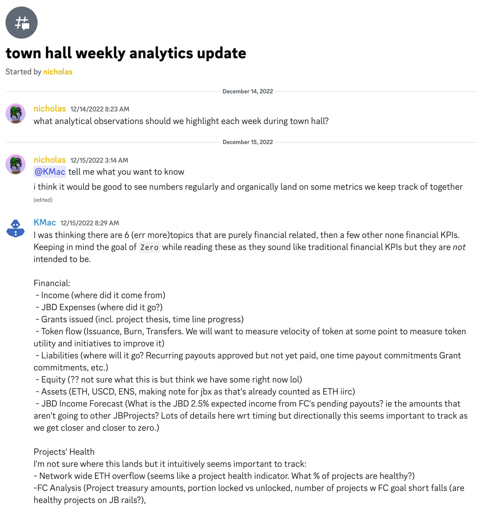
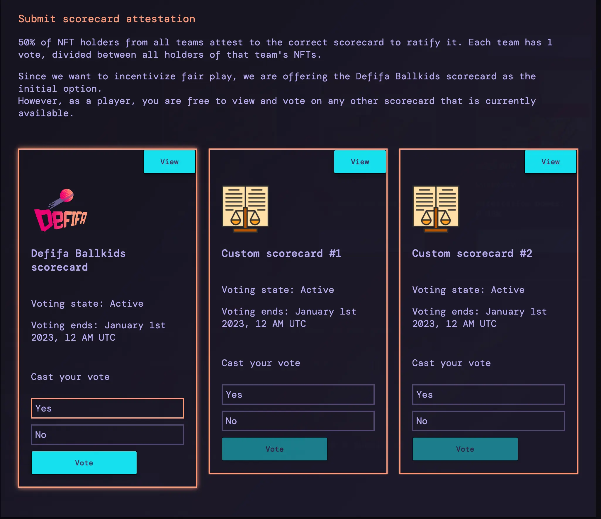
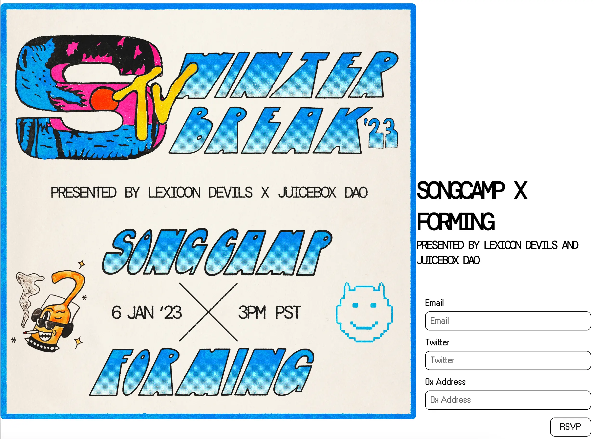
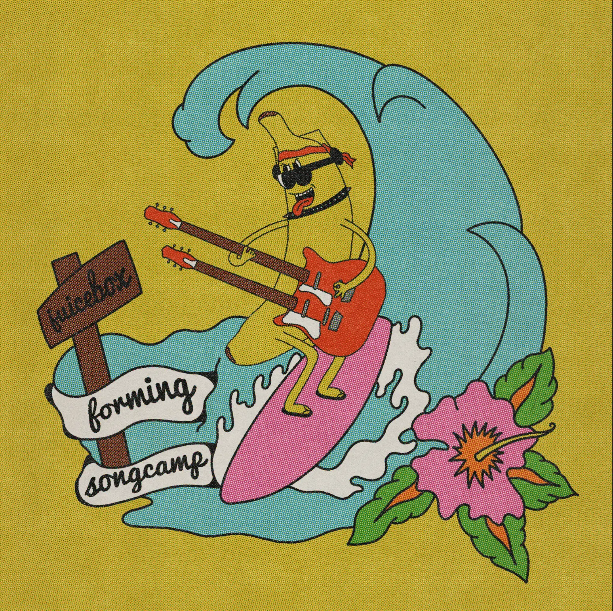
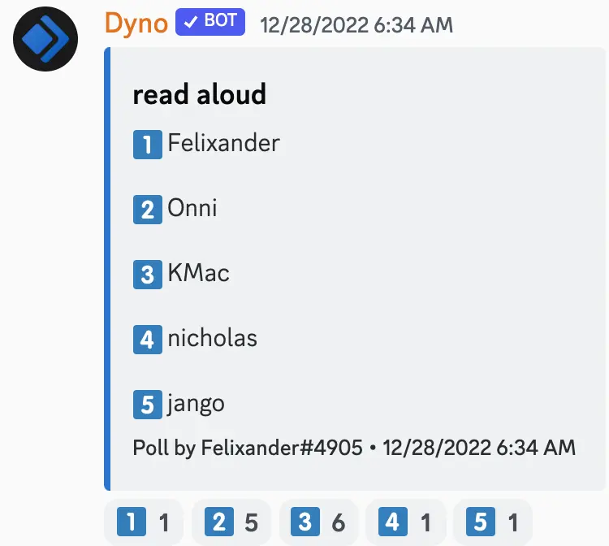

Art by [Sage Kellyn](https://twitter.com/SageKellyn)

## Juicebox 数据分析报告 Nicholas

我们上周有 15 个新的项目，整个协议有 5 个 ETH 进账。过去 30 天收到付款超过 1 ETH 的项目数量创下 4 月以来的新高，新创建项目数量也是过去三个月以来最多。

我们有一位社区成员 KMac 建议了一些我们可以定期追踪的统计数据。Nicholas 也提议，或许我们应该在周会上增加一个环节定期分析这些数据来了解 Juicebox 协议的健康程度。

Filipv 认为我们可以讨论决定一些重点关注的领域，这样就可以开发一些专用的数据面板来用于周会的分析用途。

## Defifa 认证  Jango

我们正在做 Defifa 的一些收尾工作，在这个过程中学到了很多。我们从 Governor Bravo 合约的治理投票系统借用了很多的治理属性。

世界杯结束后的一周，用户就可以开始投票了，合约设定的投票期限为一周。所以记分卡上传完毕之后，会有一周时间让大家投票批准记分卡。下周如果我们能够获得至少 50% 的 NFT 持有人投票认证记分的话，我们就可以顺利结束这个 Defifa 游戏，然后再去争取在下次活动中进行迭代。

会上 Filipv 帮忙演示如何在 [defifa.net](https://defifa.net) 上认证记分卡。

我们的下一步计划是将在明年一月的 NFL 季后赛再组织一次 Defifa 游戏。虽然会有一些新的图案和标志，但我们不打算在 NFL 比赛中进行太多的迭代升级，主要还是会尽可能沿用目前的合约和前端，及使用类似 defifa.net/nfl2023 这样的网址。

我们可以再来测试一次这个游戏并做一些细微的改进，同时为明年一些其他的比赛做策划，以便在那些比赛上试验理多的一些新的功能或组件。

关于怎么改进游戏体验或者建立用户的信心，我们现在有一些非常有意思的构想，但可能得先看一下 NFL 季后赛上的运行情况如何，再来决定怎样把这些构想付诸实施。

## Gnosis Safe、项目搜索及搜索引擎优化的工作报告 Filipv

在 Gnosis Safe 新的 app 上，Juicebox 不再是一个默认的应用，这是由于一些自动连接的问题造成的。Filipv 提交了一个前端的合并请求，一旦这个 PR 获得批准并合并之后，我们就可以重新作为默认应用自动连接到 Gnosis Safe。

上周 Filipv 在周会上演示了他开发的基于 [Sapana](https://sapana.io) 的项目搜索功能，Peri 在这个基础上作了一些调整并提交了一个 PR。这个项目搜索功能应该很快会在我们的前端界面实现。

通过 Acidicsantana 和 Filipv 的努力，我们提交了一个关于搜索引擎优化的一个 PR。实现的话，docs.juicebox.money 及 Juicebox.money 的搜索结果将会慢慢得到改善。

## Forming 工作报告 Darbytrash

Lexicon Devils 将会在 2023 年 1 月 6 日与 [Songcamp](https://twitter.com/songcamp_) 合作举办一场 Forming 活动，表演嘉宾是 Songcamp 的 OG 成员，名单已于昨天公布。

同时他们在  [Forming 主页](https://forming.lexicondevils.xyz/) 进行参与登记活动，登记参与的人都有机会获得 Lexicon Devils 的 Voxels 可穿戴设备的空投。

Jango 问到有多少人申请参与此次活动的表演，以及甄选 Forming 的表演者的流程是怎样的。Darby 解释，此次活动共收到 8 - 9 份申请，主要由 Songcamp 社区来决定表演人选，然后再由 Lexicon Devils 来负责这些表演内容的编辑及展示。申请参与 Forming 表演有一个条件，录制的表演内容必须是专门为 Forming 活动准备的。

Lexicon Devils 的 [Forming 项目](https://juicebox.money/@forming) 最近也迁移到了 V3 协议。他们晚些时间会在项目推出一些不同等级的 NFT。

## 猜谜活动 Felixander

Felixander 在周会上提供三句提示，其中两句是真话一句是假话，让参会者猜是以下哪一位说的这些话。

提示：

1. 我曾经成功从一位 FASB 的前主席、一位 SEC 专员及一个电子表格领域的先驱募资搞一个项目，但最终项目失败了；

1. 我曾经和以赛亚·托马斯（著名 NBA 球员）一起打篮球；
2. 我写了一本书，卖出 100 万册。

正确答案是 Kmac

第三句是假话。

## 年终思考及反省

**Jango:**
过去的这一年，有很多新的非常出众的贡献者参与进来，对于一直参与贡献并努力寻找新的方式有序地处理那些原本就纷乱的工作来说，这不是一段很短的时间。这个肯定是值得我们庆贺的。

我很期待我们社区明年会以怎样的方式来存在。过年一年是精彩的一年，我非常享受其中，同时也心存感激。来年可能会有更多的事情落到实处，这让我非常激动。

同时要多谢 Jigglyjams 今年开发出 Nance，明年我们将继续完善并将其打造成一个与 Juicebox 各项流程息息相关的一个后端工具，非常令人期待。

Matthew 和 Brileigh 制作的播客节目质量也越来越好了。目前这个制作的步调很合适，而且在制作的同时还在持续进行改进。

**Nicholas:**

Matthew 和 Brileigh 在 Juicenews 社区通讯的工作上同样做得非常好，这个内容目前是一个让大家及时了解 Juicebox 生态的非常好的窗口。

感谢 ONNI 创建了[Marfa Giant 项目](https://juicebox.money/@marfagiant)，在一个小镇上来引导居民进入 Web3 世界及实现 Juicebox 的价值。最近他还参与到 JuiceboxDAO 的市场推广工作里来。

**Jango:**

非常感谢所有今年参与了版本控制工作的各位成员，这个工作包括了从编写测试 V2 合约，到通过 Code4rena 审计发现一些小问题，到放弃修补 V2 合约并选择开发新的 V3 合约，并在这一连串的工作中找到一些版本互通的标准。正因为这样，我们来年得以在这个基础上继续开发这些非常有趣灵活的工具。对于合约开发的成员来说，过去的这一年既令人沮丧，也曾令人兴奋，充满了乐趣。

我感觉每个人都有作为 Juicebox 创始人的视角，很多工作都不是有固定形式的，社乎每个人觉得自己理解应该怎样做来构建这些可重现的时刻。我很好奇，基于 Juicebox 的发展潜力，应该怎样通过治理系统来维护 Discord 的组织。我对些感觉很兴奋。

我们最近在展开一些非常棒的讨论，这些讨论公开但又复杂，需要我们很高的协调能力。或许我们比去年多了更多问题的答案，但同时可能还有更多更多的问题等待我们去探索。

**Darbytrash:**

我赞同去年是非常有趣非常疯狂的一年，它是我有生以来最富创造力和回报最多的一年之一。我在 Juicebox 获益良多并作为社区一员心存感激，很高兴能跟大家一起前进。谢谢！

