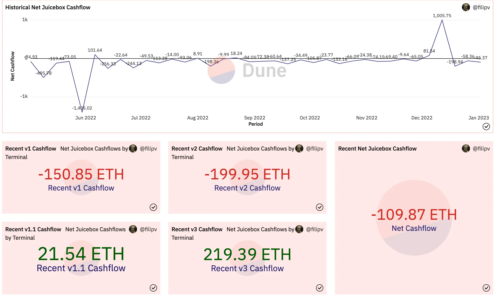
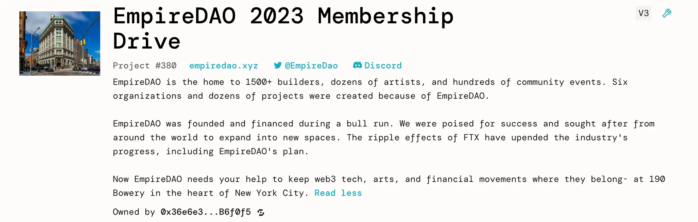
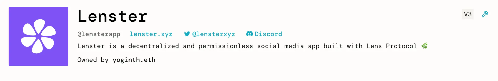
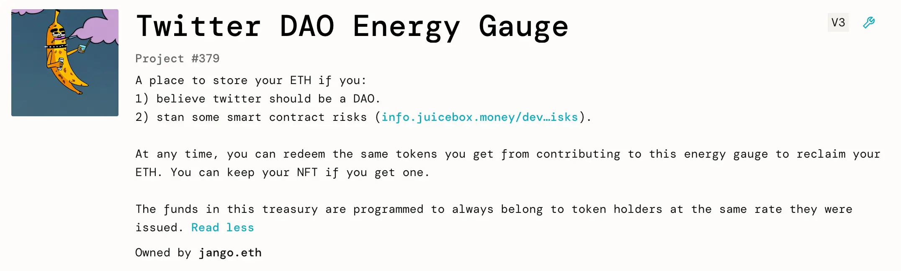
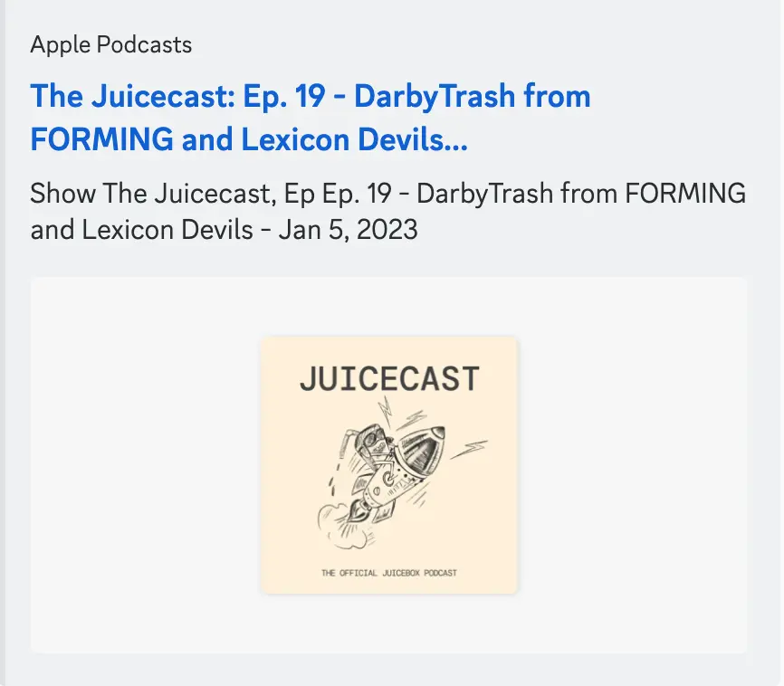

Art by [Sage Kellyn](https://twitter.com/SageKellyn)

## 协议数据分析及新项目介绍 Nicholas

上周整体没有太多活动。协议总共有 62 ETH 的付款额，但包含了向 Peel 等项目的支出，主要属于项目间往来付款。上周共有 2 个新项目创建，可能是由于节日原因。

Juicebox 历史现金流：

新项目介绍：

- [The EmpireDAO 2023 Membership Drive](https://juicebox.money/v2/p/380)

    EmpireDAO 一个位于纽约的共享工作空间组织，目前租约遇到了一些问题。本项目旨在筹款帮助他们留在目前的地址并避免创始人个人破产。

    

- [Lenster](https://juicebox.money/@lensterapp)

    Lenster 是 Lens 协议的其中一个前端。这可能是一个用于试验 Juicebox 的项目。

    

- [Twitter DAO Energy Gauge](https://juicebox.money/v2/p/379)

    本项目由 Jango 创建。想法源于最近关于推特是否应该更 DAO 化的一些讨论，Jango 创建了一个项目金库，以便有需要的人可以安全地把他们的资金保管起来，并可以随时取走。

    

## TokenURI 编译器工作汇报 Nicholas

基本上 tokenURI 编译器 V1 版本已经准备就绪。一旦 Nicholas 提交的关于延长多签设置 TokenUriResolver 权限的[提案](https://juicetool.xyz/snapshot/jbdao.eth/proposal/0x4d1f6e8576fbdd5c61f1b3bebd775e153fa49ee70e0cbee53561ba75bb4ac381)获得 DAO 的批准，我们不需要等待重新配置的延迟阶段就可以对其付诸实施。因此最快下周，我们将可以设置这个代币编译器的第一个版本。

## DAO 基本理念的反思 by Jango

JuiceboxDAO 基本概念的文件可以在[此处](https://www.notion.so/juicebox/Juicebox-DAO-Foundation-7bd59d35f08443b18e83e710df49ee3b)查阅。

Jango 认为当前是一个反思我们很久以前所做承诺的良好时机，他计划下一治理周期提交一项提案来对这份文件进行更新。

上月以来，Jango 就开始撰写和分享自己的一系列的想法，并最终形成了关于我们当前[众多工作机遇](https://jango.eth.limo/A7C5927A-08F1-425F-B440-8DF4BCF00DEE)的一些观点。

很显然，所有事情都在不断发展，这是一个针对 Discord 内的工作讨论及我们一直以来通过提案来作出的承诺的一个反思。因此，这个反思既不是什么新生事物也不为求影响深远，更多只是为了能够找到一些恰当的说法，来概括大家在通过不同的方式来思考创建项目、向项目分配资金或者为 DAO 做贡献时所应处的场景。

### 使命宣言

迄今为止，我们的使命是 ”公开地在以太坊上，帮助人们更有信心地运营从初创到规模化的可编程及社区集资的金库“。

在协议的进化及安全性方面，我们曾经历过很多压力，确保协议正确地部署及调整，同时又考虑到人们在与这些合约交互时可能会面临的风险。

截至去年年底，我们发现了一个比”社区筹资”更为重要的需求，要求我们设法提高项目的数量分布或者帮助项目来实现这个需要。我们需要帮助融资资金在系统的流转，同时让投资方在和 Juicebox 项目打交道时更有信心。对于我们来说，在生态系统内分拨一定的资金给我们看好的项目确实不难，但对于一些诸如个人投资者、风险投资或其他形式的投资方来说，要在 Juicebox 生态内做出自信的投资决定并非易事。

有些场景似乎已经整合在我们当前的使命宣言里面，但似乎在去年底以来及预计今年，这些方面变得更为突出。

关于 L2 的一些可行性，去年有过一次很好的调研，但每次我们要推动一个想法，不管是跨链桥或者多链代币设置，最后都遇到一些类似的障碍。Jango 建议，我们应该继续推动这些好的想法，同时坦然接受可能会出现各种阻碍的现实，少些追求完美，多些鼓励尝试。

### 价值观

Jango 建议我们把这一部分留待提交提案频道之后再展开讨论。

### 重点领域

Filipv 认为这些内容最初编写之后到现在，我们的运行方式发生了一些变化。他觉得我们现在较少针对某个重点领域，而是更多地以具体项目为基础来开展工作。例如说，在 Discord 内，我们的讨论也从一般的重点领域频道，转移到特定的项目频道。

Jango 对这个想法深有同感。去年我们见证了诸如 Peel、WAGMI 等许多项目的诞生，它们其中不乏一些从一开始就不以服务 JuiceboxDAO 为主要目标的项目，更多的是大家开始向某一个方向开展工作，逐渐发展出或许能够自力更生的一些系统。

Jango 认为，重点领域清单上的有些项目可能已不再是我们希望强调的方向，或者应该把这些内容删减掉。同时最好能清楚认识我们关注的事情，或者增加进来，或者对现有项目进行重新规划。

举个例子，治理仍是 DAO 仍然希望倾斜资源的方面。作为金库的 DAO 管理职责所在，将由我们真正地解答“ 我们在治理上的支出究竟为了我们，还是因为我们希望支持一些可能会在 JuiceboxDAO 之外获得发展空间的项目？”如果答案是后者，我们应怎样来组织及思考这个问题？

谈及项目，Jango 认为 JuiceboxDAO 最大的资产不在于持有 ETH 或 JBX，反而可能会是它持有的诸如 Peel 代币、WAGMI 代币、Lexicon Devils 代币等我们已经开始投入资源进去的这些项目的代币。他想知道我们应如何来思考及创造一些工具来构建这些项目，以及反思这方面的工作效果如何，不光要看这些项目怎么样来向 JuiceboxDAO 提供服务，还要看我们所有个人怎么样支持这些项目的蓬勃发展。

至于协议，Jango 觉得我们正处于定义我们应在协议层面负责到什么程度的最后阶段。过去一年协议的开发做了非常大量的工作，长远来说我们肯定不希望一直这样做。我们可以把某些责任下放到类似 Define、有望扩张到其他 L2 的项目、Nance 等项目上面。但是与此同样，运行监测和文档编辑仍是值得做的工作，尽管目前尚不确定是以个人工作或者是集体 JBX 责任的形式来开展。这些工作不会有报酬，DAO 也不会在协议层面上分配它的资源。这些工作只是属于我们关心部分，或者在这里难以最好地表述出来。

即使这个提案这次不能通过投票或者甚至连 Snapshot 阶段也进入不了，我们也可以获得一些不同的信息来进行反思。可能逐条地审核用处并不是太大，最好是大家可以从更高层次来展开讨论，让所有人都能发表他们的意见。

KMac 则建议，我们应该更关注协议的安全性，最重要的是关于合约的审计怎么来做，由谁来进行维护，要维护哪些内容，以上这些工作的流程在多大程度上做到无需许可。

Filipv 提出，除了开发前端及良好的协议客户端，通过各种形式来与协议整合也是一个值得关注的领域。例如我们如何让 Juicebox 更兼容 WordPress 或者 Lens， 我们有没有自己的 npm 包，我们有没有提供 PHP 库实现与 Juicebox 的互动，这样都可以让 Juicebox 在更多的方面更加易于使用。

同时 Filipv 建议我们应该在重点领域加入项目能见度及展示等内容。

Nicholas 提出我们可以确保工作都囊括在重点领域内，但这些领域只是用于帮助思考我们应该要做的工作。我们做这些工作不是因为它们列在这里，而要要通过这些工作来实现我们的使命宣言。

Jango 认为 JuiceboxDAO 在考虑我们的基础设施、使命、所关注的项目及关注的原因等方面的一致性还是比较高的。这种高一致性帮助我们克服了一些暂时性的噪音并创造出更有前瞻性的发展趋势。Jango 希望我们可以继续保持这个特性，并在发展的同时注意聆听我们真正的想法。

### 成员资格

文件的最后一项是成员资格，包含 JBX 及投票。Jango 说，他对于今年我们在这个方面的扩展感觉很兴奋。我们将重新就 ve 代币展开讨论、集中资产到 V3 金库及重新实现代币的赎回价值。我们会再次审视成员资格的部分，可能会添加一些新的内容。

我们围绕成员资格开展的治理流程进化良好，也很稳定，我们可以提供给其实 Juicebox 项目使用。我们可以把它视为项目金库的一种成员资格，在这里我们对金库负有集体的所有权责任，因此我们应该致力于寻找为人们创造一些机会，让他们可以更好地为 JuiceboxDAO 和其他项目做贡献。

Jango 觉得我们的使命宣言并不单纯是 JuiceboxDAO 的使命，从产品的角度来看，我们不单止是提供可编程金库，而是更进一层向项目提供资金及成员资格的协调运作，代币作为某种成员资格的象征，例如金库的、俱乐部的、某些职责的、类似 Defifa 这样的游戏的、还有非盈利机构的成员资格。我们有很多例子和案例分析可供借鉴，来弄清楚 Juicebox 项目、资金及成员资格在所有这些不同的链上或者链下组织内的协同关系。

## Forming 工作报告 Darbytrash

Darby 敦促大家尽快到 [Forming 主页](https://forming.lexicondevils.xyz/)进行参与 Fomring X Songcamp 合作活动的意向登记，登记者有望获得 Lexicon Devils 的可穿戴设备的空投资格。

[Forming 项目](https://juicebox.money/@forming)已经迁移到 V3 协议并部署了一些项目的 NFT。项目筹集到的资金将全部发放给参与Forming X Songcamp 活动演出的人员。每次 Forming 活动，所有的活动演出人员都会设定为项目当期分配受益人，活动结束后，他们就会自动获得这段期间项目筹集资金的分配。

Darby 非常认可这个 Juicebox 的 NFT 功能，表示应该要感谢所有的开发人员，同时认为这个功能会带来很大的改变。

Jango 建议 Lexicon Devils 在我们 Voxels 空间的休息区展示 Matthew 及 Brileigh 制作的[怎样在 Juicebox 上创建NFT 的教学视频](https://youtu.be/pgpK3LofDSU)，以便参与活动的人员可以了解一下如何利用 Juicebox 来部署自己的 NFT。

Darby 还宣布，Lexicon Devils 有在今年纽约的 NFTNYC 上搞一次现场 Forming 活动的想法，他们很希望跟与社区内的人讨论这个计划的可行细节。

Matthew 和 Brileight 发布了Juicecast 新一期[采访 Darbytrash 的播客节目](https://podcasts.apple.com/ca/podcast/ep-19-darbytrash-from-forming/id1623504302?i=1000592726192)，介绍 Forming 诞生的缘起，还有它过往及将来计划的一些活动。

## DAOPlanet 报告  DAOofSteve

DAOPlanet 的 Steve 说，他们的项目目前正在从 V2 协议迁移到 V3 协议，STVG 正在协助他们做这个工作。项目迁移有望在本周内完成。

Steve 介绍，他们今年将继续在 ETHDenver 期间举办 DAODenver 活动。这次他们计划活动采取免费进场的方式，所以预期会比去年的参会人数增加不少。他还介绍了他们的酒店住宿套餐及与 CityDAO 进行的合作。

Jango 觉得降低参会门槛这个举措很好，或许我们社区的成员也可以设法帮助 DAOPlanet 项目获得一些发展的动力。

## Defifa NFL 工作报告 by Jango

Defifa 初代版本的世界杯游戏已经成功结束。

我们第一轮游戏做过贡献几个人和一些感兴趣的新朋友一起，计划为即将举行的 NFL 季后赛做一个迭代的 Defifa 游戏。

Jango 说，目前美工的制作已经基本完成，还差一些合约的小调整，他对新的游戏感到很有信心。

Filipv 建议我们应该为 Defifa NFL 季后赛游戏共同来做一些的推广，包括在 Discord、推特及 Telegram 等上面发布内容来扩大参与度，还可以考虑投放一些广告。

KMac 回应说，这个 NFL 的迭代版本 mint NFT 的时间窗口很短，从参赛队伍的宣布都季后赛开始只有不到一周的时间，还要考虑合约部署等的需要。不过他很愿意一起在投放广告方面做工作。他认为找到投放广告的盈利平衡点应该不难。如果我们把游戏开发人员的 mint 作为一种收入来看待，我们可以来试下是否能达到收支的平衡。从机制的角度来看，可以进行这方面的尝试。

