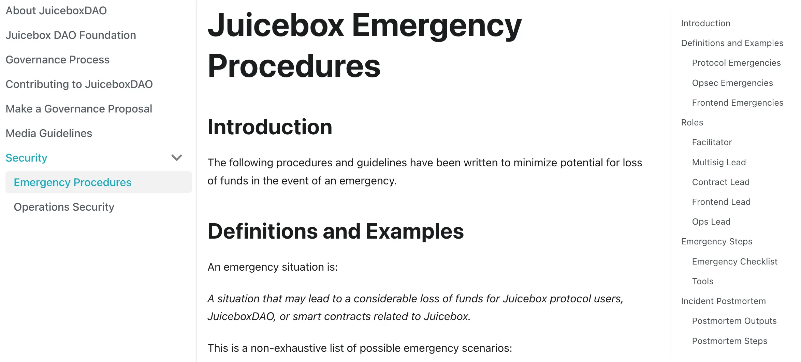
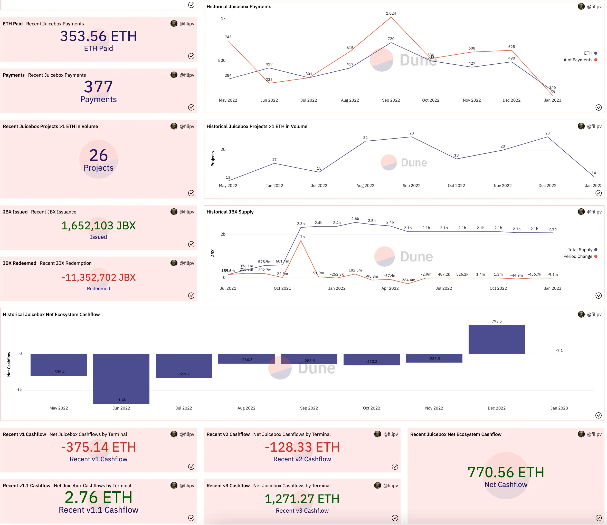
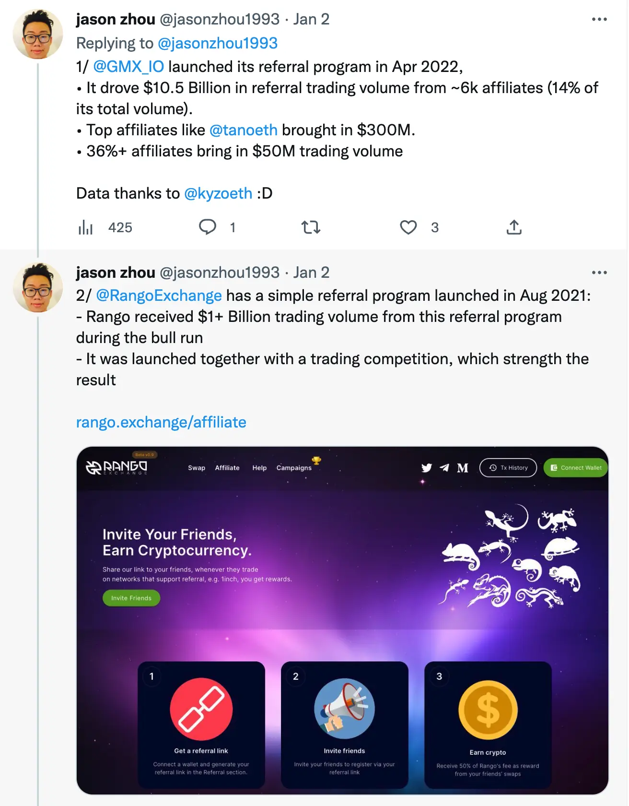
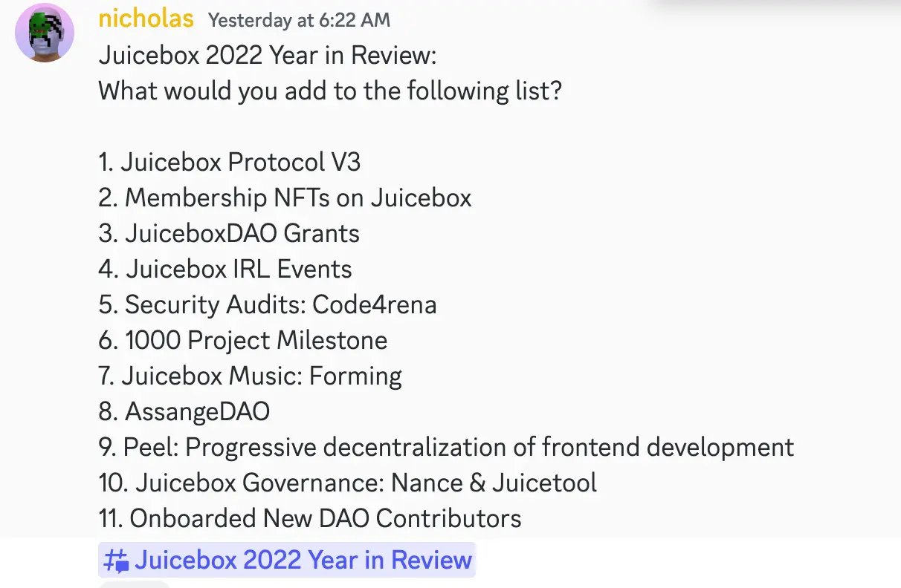
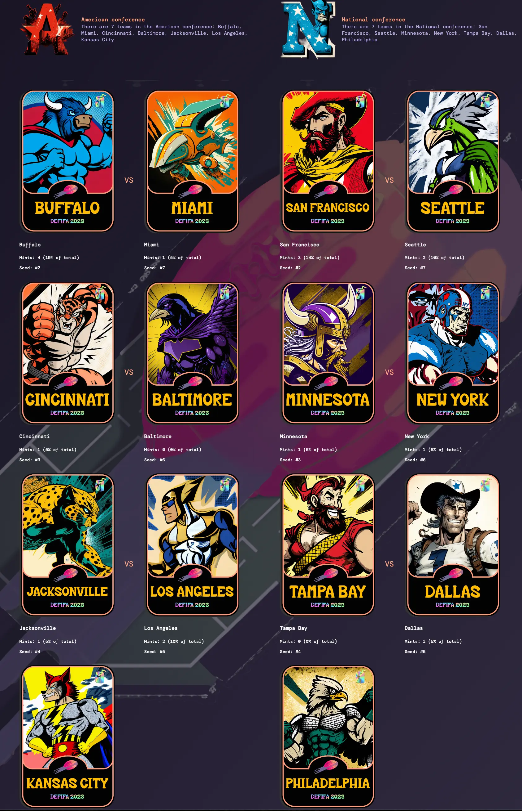
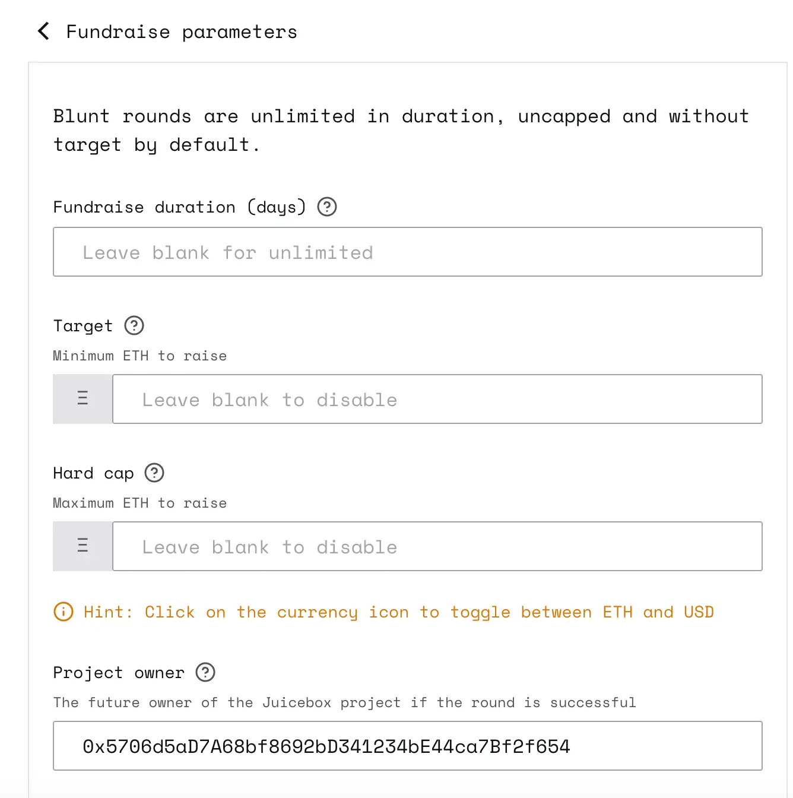

Art by [Sage Kellyn](https://twitter.com/SageKellyn)

## 应急预案及运营安全 Filipv

[Filipv](https://twitter.com/filipvvvvvv) 最近编写了关于应急预案的两份文件，他认为我们应该提前应对一些紧急情况提前设置一些应急流程。

第一份文件是[Juicebox 应急流程](https://docs.juicebox.money/dao/security/emergency/#definitions-and-examples)，总结了紧急情况下我们应该采取的措施。

第二份文件是[贡献者安全操作指引](https://docs.juicebox.money/dao/security/opsec/) ，是给 DAO 的贡献者的一般性安全指引。

非常欢迎针对这些文件的任何反馈。同时 Filipv 计划下个治理周期提交一项提案向 DAO 申请授权在出现状况时使用这些流程，以便多签可以相应采取必要的措施。

## 协议数据分析 by Filipv

Filipv 制作了一个专用于周会协议分析的数据面板，可以在[这里](https://dune.com/juicebox/townhall)查看。

他在会上简单介绍了一下数据面板上的各个项目，包括新建项目数量、支付的平台费用、项目付款、近期 Juicebox 付款、活跃项目（金额超过 1 ETH）数量、新发行及赎回（销毁）的 JBX 代币数量，还有各个 JuiceboxDAO 的支付终端现金流，等等。

## Qwestive 推荐计划演示 JZ

[JZ](https://twitter.com/jasonzhou1993) 以前曾是 JuiceboxDAO 的一个贡献者，目前在一个专门从事 Web3 推荐平台的  [Qwestive](https://www.qwestive.io/) 团队工作。他这次参加我们的周会，是因为认为推荐计划比较适合 Juicebox 生态，希望在周会演示并进一步介绍具体的原因。

### 为什么要选择推荐计划？

按 JZ 的说法，推荐计划目前已成为 Web3 通行的获取新用户方式，让支持某个项目的人来帮忙吸引更多的新用户。

为证明自己的说法，他举例了两个使用推荐计划在新增用户和资金方面获得巨大的成功的 Web3 项目，分别是 GMX.io 和 Rango Exchange。

他的结论是，推荐系统可以形成很大规模的引流。

### 为什么适合 Juicebox？

去年年底以前，JZ 一直在与我们负责培育项目的 STVG 进行接洽。凭借他之前作为 Juicebox 贡献者的经验，JZ 认为， Juicebox 是 Web3 世界的一个非常强大的社区，同时也是一个非常好的产品，确实非常适合实行推荐计划。他同时认为，如果我们能够设置一个合适的计划来激励社区成员和合作伙伴来引流，有望能给 Juicebox 带来可观的成长空间。

同时，JZ 指出，Juicebox 扮演的角色，不限于引入项目，还要扶持他们获得成功，这些需要付出很大的努力。如果我们制定出适当的激励政策，可能会让负责培育项目的人更为负责，也更有动力帮助项目真正获得成功。

### 怎样来做？

JZ 在会上演示了Juicebox 可以如何用 Qwestive 平台来设置一个推荐计划。可以在[这里](https://www.loom.com/share/00259b4eeaed47fba64be81a186c667e) 观看 JZ 专门为 Juicebox 制作的演示视频。

我们可以允许任何来创建属于自己的推荐链接，如有需要，我们也可以把推荐人范围限制为持有一定数量 JBX 代币的人，或者是合作伙伴白名单上的人。

奖励架构可以很灵活，既可以奖励固定金额的 ETH、JBX 或者 NFT，也可以分等级按推荐效果来给予不同的奖励，甚至是设置为一个动态的指标让推荐人可以获得 Juicebox 收取项目平台费用的分成。

这个推荐计划还可以定义为向点击链接并创建项目的被推荐人分配奖励，

### 周会上相关的讨论

Filipv 认为推荐计划将是一个鼓励大家参与项目培育的很好途径，同样也可以让从事内容创作、能见度和培育项目工作的人之间的利益得到平衡。

Jango 提问这些推荐计划是追踪链上事件还是只是网站活动，JZ 解释他们是通过捕捉点击链接并创建项目的人的钱包来进行链上数据的追踪。

Nicholas 同意这个推荐计划很有意义，尤其是在创建项目方面。同时我们可以设置不同的推荐计划或者其他工具，并提供给生态内的项目方使用。

讨论的最后，[Jango](https://twitter.com/me_jango) 提出一个初步的构思，我们可以分配一部分的保留代币用于推荐的奖励，并把这些奖励发送至一个合约或某个负责任的实体来管理这些 JBX 的发放。因为每当有款项支付进来会相应铸造 JBX，这样大家获得的奖励也可以得到金库价值的支撑。我们可以把推荐奖励嵌入到保留代币架构内，初期可以由某些愿意做这些工作的人来负责发放，后期可以开发一些自动的架构来实现。

## Juicebox 2022 年度回顾工作 Nicholas

[Nicholas](https://twitter.com/nnnnicholas) 目前和 Matthew 及其他社区成员合作做一个 Juicebox 2022 年度回顾的工作。他列出一个我们生态内去年的重要事件表单，也呼吁大家有其他看法可以向他提议。

## Defifa 工作报告 Jango

就在周会当天，Defifa 球童团队刚刚部署了新一代的 Defifa 游戏来配合今年的 NFL 季后赛赛事。团队正争取尽快进行迭代，这样可以更好的研究游戏项目并尝试新的想法。

这次他们尝试了几样新的东西。第一个，改进了认证流程。上次 Defifa 世界杯的认证时间点有些尴尬，这一次他们试图在超级碗开始的时候就开始认证记分卡。

第二个，在截止 mint 和比赛开始之间，会有一个短暂的赎回窗口，这样一来，如果人们对所有 NFT 的数量分布感到不满意的话，可以选择赎回部分持有的 NFT，但是不会再有人来试图利用赎回后形成的套利机会来再 mint 新的 NFT。

第三个，这次不再设置交易截止期限。所有 NFT 全程都可以正常进行交易。

Kmac 作为新游戏的主要负责人之一，对为新版本 Defifa 付出努力的人表示赞扬。Mieos 和 Sage 在艺术设计上做了非常棒的工作，Blaz 是负责前端工作的绝大部分工作，而 Jango、Viraz、0xBA5ED 和 Dr.Gorilla 则是负责合约开发的团队。

Jango 表示我们正在讨论如果利用这个锦标赛模式的机制来真正地帮助其他社区展开筹款。例如说 StudioDAO，他们可以围绕奥斯卡奖或者其他电影节的其中一些分类奖项来开展一个竞猜游戏。我们肯定希望能看到我们能够真正地利用这个元素来给文化和艺术方面的筹款活动添加一个辅助的组件。

Jango 同时提到，团队计划也会在 March Madness （全美大学体育协会第一级男篮锦标赛，因比赛大部分在三月分举行，又名疯狂三月）举办 Defifa 游戏。我们创造了 Defifa 球童这个游戏开发队伍的概念，但 Defifa 是一个开放性的 DAO，我们的主旨是参与游戏的人很有可能受到激励来参加并承担起下一次游戏的组织责任。Defifa 的组织是开放性的，我们正计划开展链上治理来实现它的去中心化。

## Blunt Finance  Jango

[Blunt Finance](https://blunt.finance/) 是[JuiceboxDAO 资助](https://juicetool.xyz/snapshot/jbdao.eth/proposal/0x3346171415210d0523079ccde7af7e4f417e45ec7daabb9f037bbaba0c69a550)的另一个项目，在过去的数周时间里进行了一些令人赞叹的进化。[Jacopo](https://twitter.com/jj_ranalli) 主要负责这个产品的前端和合约的开发。

我们将它简化成真正针对一个具体的用例，即在创建筹款活动时提前设定好筹款的目标。

项目创建方可以在筹款参数内设置筹款时长、筹款目标、硬顶和项目方等。如果筹款时间结束，而且筹款达到目标，项目的所有权将会转到预设的项目方，并继续以普通 Juicebox 项目的形式继续运行。如果活动结束时，筹款目标没有实现，刚合约会自动安排第二个筹款周期来实施退款。

这个培育项目的方式相对风险较低，同时只需一个指令也兼顾了简洁的原则。希望我们会看到一大批项目的创建并努力实现他们的目标。 人们向这类项目捐款需要承担的风险更小，无须担心项目方私下对项目属性进行各种变更。

我们将会看到这个项目试验性地开展。如果这个概念有效，Jango 很肯定 Juicebox.money 也会把它整合到创建流程让有类似需要的人来使用。

我们正在对用合约来持有项目这些概念进行不同的试验，看这种情况下项目应该或者能够实现怎样的功能，前端设计简单化，合约上又可以大幅降低风险。

Nicholas 也表示了对 Blunt 机制的认同，尤其是目前这个简化版本。它跟 Kickstarter 的机制很相似，众筹达不到目标的话，捐款人可以获得退款。他认为这个功能很强大。

在 Jango 看来，如果用一个合约来控制第一个筹款周期，在成功筹款的情况下，可以把项目所有权转移到管理第二个筹款周期的合约。这样就可以在不受任何个人、多签或链上治理合约的干涉的前提下，创造一个所有权转移的链条来实现一个项目的全部周期，甚至决定项目的最终结果，正如 Defifa 所做的那样。他希望这个项目可以打开我们的思维来寻找其他的机会，同时希望鼓励所有人一起来参与构思。

Jango 很喜欢用更小的责任运营更简单的代码块来进行各种试验的这个想法，如此一来，随着试验结果在人们身边星星点点地呈现，至少我们还可以对存在的风险能够了解得更多一些。

## NFT 代币经济模型 Nicholas

NFT 功能在 Juicebox 上获得巨大的成功，很多有趣的项目正不断出现。但至今为止，我们还没有真正地看到过很热门的 NFT 产品，或者 Juicebox 生态内的 NFT 在二级市场有明显的交易活动。

因此，Nicholas 想到要帮助项目们围绕自己的项目代币创建适合的代币经济模型。他认为对于绝大部分项目来说，他们可以在 Juicebox 生态内直接销售的成员代币或者其他形式的代币，其实蕴藏着巨大的机会却并没有得到充分的利用。迄今为止，我们还没有看到任何一种代币机制真正的大放异彩，比方说，还没有一个诞生于 Juicebox 生态的 NFT 系列能够在生态之外广受欢迎。Nicholas 一直在与其他人讨论 NFT 的其实运营模式，而不是说就这样搞几张小图片就指望大家都会乐意来捐款。

过去几周 Nicholas 一直在想一个构思，把低价格的 NFT 用于单次的投票用途。价格非常便宜或者至少相对亲民的 NFT 让购买者有机会参与单一轮的提案投票，来决定部分或全部资金的分配， 而到了下一轮治理，沿用类似的机制，但就会转用新一批的 NFT 来进行投票。

基本上，Nicholas 的想法是建立一些能发挥运营指南作用的机制，来帮助 Juicebox 的项目获得稳定的收入来源。

Jango 告知，其实我们还一些通过 NFT 控制的合约功能还没有在前端展示出来，他目前正积极与 JonnyD 及 Strath 一起合作，争取这些功能能够更好地呈现到大家面前。这些新的功能包括保留 NFT、NFT 用作分层治理形式的治理代币、项目方按需铸造 NFT 等等。

## ComicsDAO 推广Gogo

Gogo 宣布他们已经找 Sage 帮忙成功打造了几款令人赞叹的面具，用来在新的筹款周期上部署他们的 NFT 产品，相信会极大帮助他们实现自己的计划。

去年对于 ComicsDAO 来说是令人难以置信的一年。今年，他们继续策划一些大的计划，诸如启动 AI 漫画等等。ComicsDAO 的发展就是对捐款人最好的回馈。

