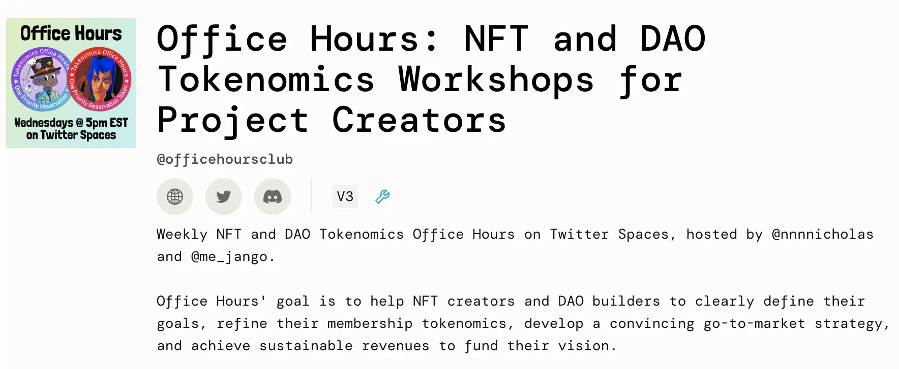
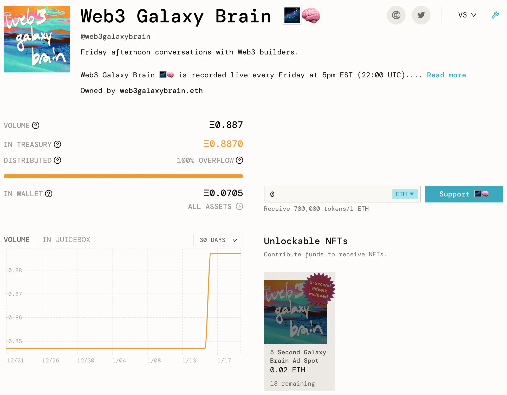
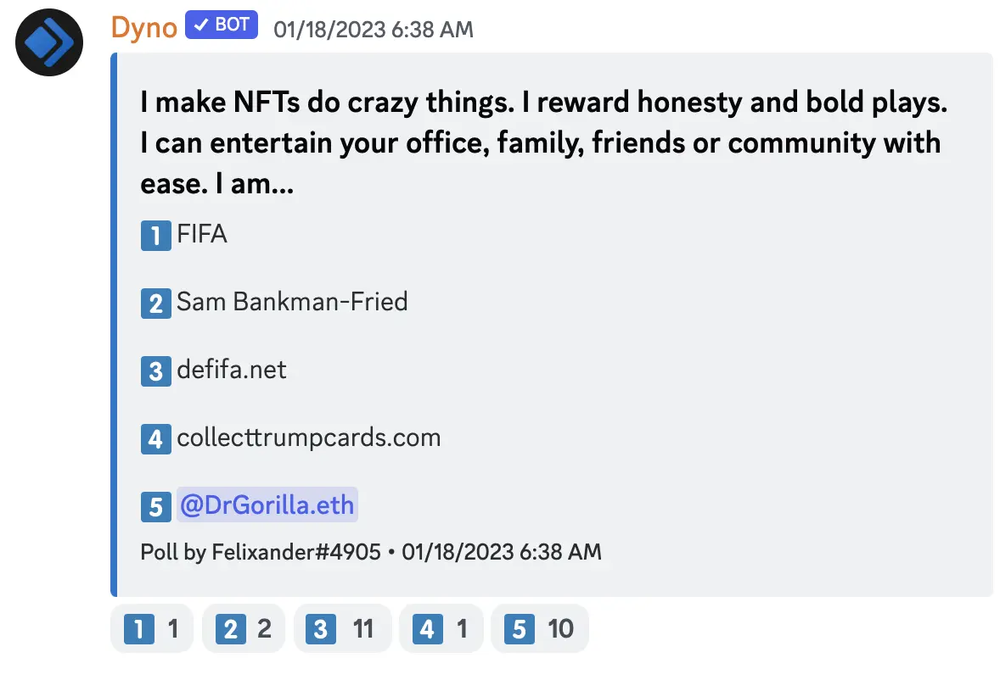
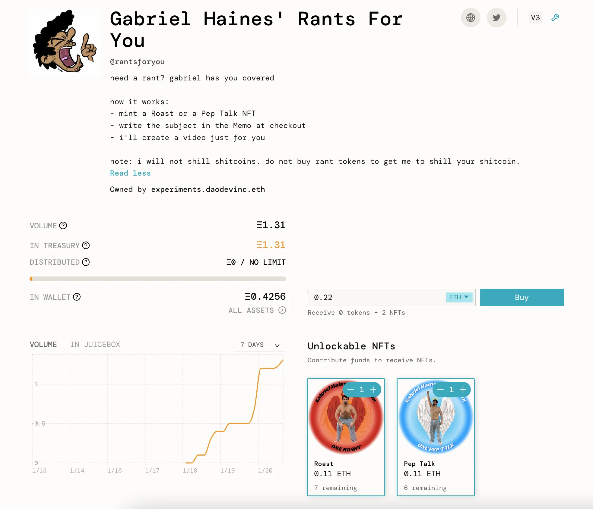
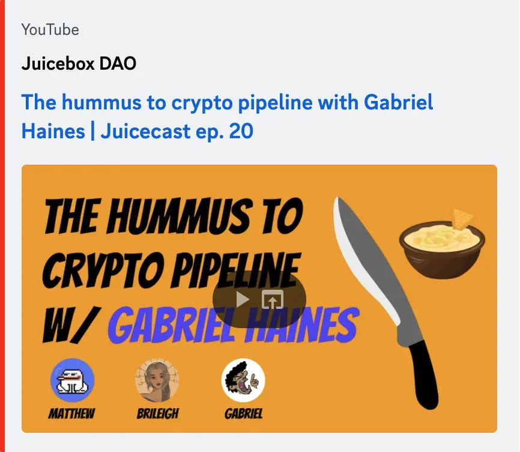
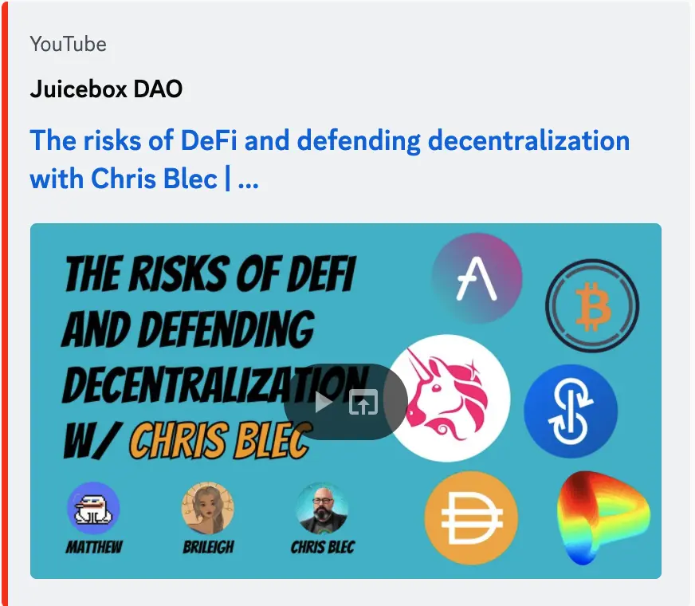
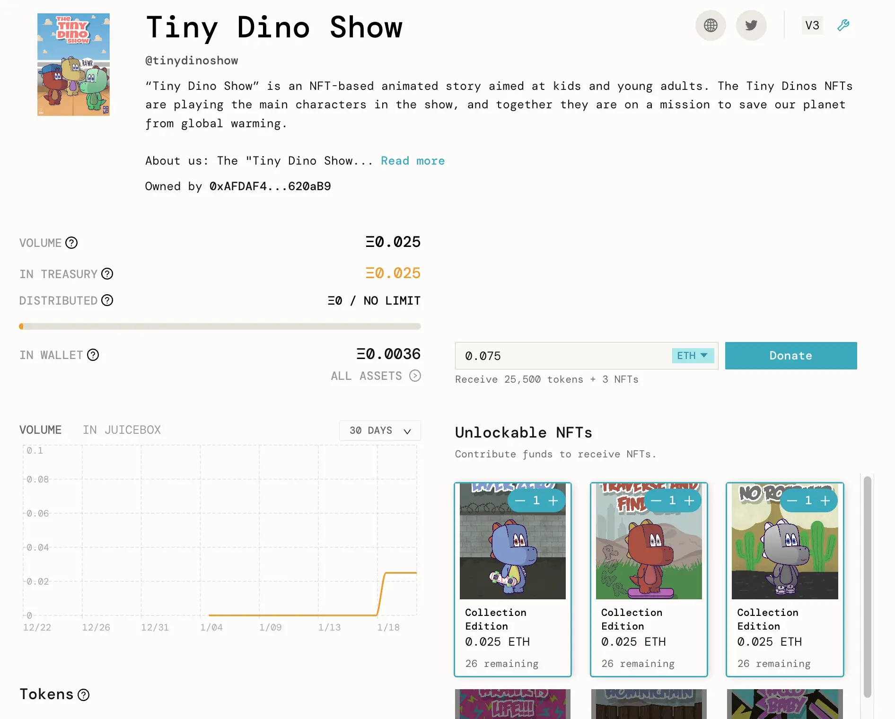

Art by [Sage Kellyn](https://twitter.com/SageKellyn)

## 答疑论道（Office Hours) 宣传 Nichoas

Nichoas 将和 Jango 一起在 [ Twitter Space](https://twitter.com/nnnnicholas/status/1614985966548094977) 主持一个 NFT 代币经济的答疑节目。他们将和元宇宙的 OG [jin](https://twitter.com/dankvr) 谈论 [openvoxels](https://twitter.com/openvoxels)，还和 [DangerZoneDAO](https://twitter.com/DangerZoneDAO) 的 [Ibn Inglor](https://twitter.com/IbnInglor) ，一个考虑创建 Juicebox 项目的音乐人一起聊天。

同时 Nicholas 也在尝试让大家在 [Office Hours 项目](https://juicebox.money/@officehoursclub)上 mint NFT 来优先在节目上讨论他们的项目这一做法。

答疑论道这个节目的主旨是讨论 NFT 代币经济模型或者成员代币经济模型，以帮助人们用良好的成员动态指标来创建项目。

Jango 也表示，我们过去一年半接触到的大多是以筹款为目标的项目，而且他感觉这类项目仍将是 Juicebox 发展的主要方向，但对于不仅为了治理或共同行动而创建项目的组织来说，怎样创建更强大更具持续性的商业模式这个话题非常有意思。

Nicholas 还为他的 Twitter Space 播客 [Web3 Galzxy Brain](https://juicebox.money/@web3galaxybrain) 创建了一个 Juicebox 项目，在项目中 mint 一个 NFT 即可获得他节目里 5 秒的广告时间。这也是其中一个试验，希望寻找一些有趣的用例让人们在以后在他们的项目里使用。

## 商品销售演示 STVG

STVG 一直致力于实物商品的相关工作，试图创造一种销售商品并把销售收入转到 Juicebox 项目的模式，

他的做法是在[Slice.so](https://slice.so/)上设置一个 Slice，连接到打印服务提供商 Printful 的 API，购买的产品将由Printful 制作并运送给买家，同时部分销售收入会发送到 Juicebox 上的 [The Brigade projoect](https://juicebox.money/v2/p/390)。 他在周会上简单演示购买一件 OG Juicebox 连帽衫。

STVG 还在研究另一种做法，购买商品与在普通 Juicebox 项目上铸造 NFT 一样，购买后会弹出一个窗口让买家输入他们的信息，以便卖家可以获取信息并在 Printful 下单。

Filipv 建议他做一个教程让项目创建者可以自己来使用。

STVG 说他正在这样做。同时他还和 SharkDAO 及 Bankless 项目管理团队一起探讨他们可以怎样使用这个模式。

Jango 对于需要在 Slice 和 Juicebox 网站之间来回跳转表示怀疑，认为我们应该想办法改善这个体验。

STVG 表示，如果在 Slice 上尝试的模式成功的话，或者 Juicebox 可以把一些按需服务的 API 整合进来，方便项目创建者用于商品的销售，这样可能对创建社区或凝聚支持者有利。

## DAODenver 活动 Steve@DAOPlanet

Steve 在周会上分享了一个[提案的草案](https://www.notion.so/juicebox/Juicebox-DAODenver-ETHDenver-BUIDL-Week-Side-Event-Sponsorship-5b117e82d6b745449204a099275235f4)， 提议 Juicebox 赞助 DAOPlanet 的 ETHDenver 的外围活动 DAODenver。他希望获得我们社区对这个提案的一些反馈，确保他们要做的事情大家都感兴趣。

他也表示正在把他们原来的 V2 项目迁移到 V3，铸造项目代币来分发给以前支持过他们的人。

## Abraham Eden 项目演示  Jmill

Jmill 目前正在和他的朋友 Gene 及 Alexander 一起搞一个名为 Eden 的项目，作为 Stable Diffusion 及其他 AI 模型的生成艺术 API。他们计划把这个 Eden 项目打造成一个生成艺术的社交社区，用 NFT 来作为 API 的充值额度。

在周会上，Jmill 用他在 Goerli 测试网上的 Juicebox 项目来做演示，通过在 Juicebox 上向项目付款铸造 NFT，并同时在他们的生态系统里获得相应的 API 充值余额。

但是目前，真正的充值余额记录还不是在链上的，他希望在 ETHDenver 上进行开发，打造一个真正链上的余额系统，让主网 NFT 可以在 2 层网络获取余额，用一个中转器来支付 gas 费用。

同时，他们的项目是开源的，所以任何人想用 Juicebox NFT 来用作支付 API 费用的话，可以参考他们的[GitHub 代码库](https://github.com/abraham-ai)。

Jango 觉得他们目前在我们的 Banny Warhol 频道做的 Banny AI 生成器挺好用的，他对在这方面扩展商品模式很感兴趣。Jmill 则建议或许我们可以把 Banny Warhol AI 生成器整合到 Juicebox 的项目创建流程，如果项目方想部署 NFT 又没有好的 JPEG 文件，他们可以用这个 AI 生成器来生成一些 Banny 形象用于 NFT。

Jmill 和 Genekogan 去年 12 月曾参加我们的周会，介绍他们的 Banny Warhol 产品，请参阅[这里](https://docs.juicebox.money/town-hall/22-12-13/#banny-warhol-with-jmill-and-genekogan)。

## Felixander 的竞猜游戏

竞猜的提示是：我让 NFT 做一些疯狂的事。我奖励诚实勇敢的玩家。我可以轻易地让你的办公室、家庭、朋友之间或社区内充满乐趣。我是......

正确答案是：defifa.net。

## Gabriel Haines 项目宣传 Nicholas

[Gabriel Haines](https://twitter.com/gabrielhaines) 是一个推特上拥有 4 万多关注的 KOL，以分享一些赤裸上身挥舞砍刀大喊大叫的视频而为人熟知。

Nicholas 最近与他合作创建了一个新的 Juicebox 项目，Gabriel Haines 会在项目里出售两种 NFT，他会分别为购买这些 NFT 的人做贬损或者打气的视频。在整理这个周会概要期间，这个项目已经成功创建并已收到不少付款。

Gabriel 也已经不是第一次出现在 Juicebox 了，去年有一个 [Juicebox 众筹的项目](https://juicebox.money/v2/p/327) 筹款送他去巴哈马群岛寻找 FTX 的 SBF。

## 能见度工作报告 Matthew and Brileigh

Matthew 和 Brileigh 最近对上面提到的 Gabriel Haines 进行了视频采访，在[这里](https://www.youtube.com/watch?v=nBi49fBHaeo)可以观看。

同时他们还发布了新一期[采访 Chris Blec 的 Juicecast 节目](https://www.youtube.com/watch?v=mJ5CKcW4GsQ)，Chris Blec 以研究并发表针对一些 DEFI 协议的批判性文章闻名，这些文章发表在他的网站 [blec.report](https://blec.report/) 上，而且他还在 Juicebox 上创建了一个 [Blec Report 项目](https://juicebox.money/@blecreport)来筹款支持他的工作。

## Tiny Dino 节目 Cheugy

[Cheugy](https://twitter.com/hollowcapital) 是一个最近在 Juicebox 上创建的项目的创办人之一。他们的项目名为 [Tiny Dino Show](https://juicebox.money/@tinydinoshow)，这是一个 NFT 项目，也是最近出现的 CC0 （知识共享许可协议）授权项目之一。他们立志要利用这个免费的 IP Tiny Dinos 来制作一个节目。

他们决定要用这个 Juicebox 项目发起捐款活动来支持节目的制作工作。同时他们刚刚在 Tiny Dino 社区的 [prop house 轮提案遴选](https://prop.house/tiny-dinos/round-1)中胜出，将会获得 2 ETH 的拨款。他们打算把拨款转到他们运营的这个 Juicebox 项目，让他们的社区来见证项目的发展。

这个 Tiny Dino 秀是一个面向幼儿及儿童的教育性节目。他们计划制作一些关于气候变化、保护地址以及创造和保存绿色能源的新途径等具体的内容。

Cheugy 认为 Juicebox 这个模式非常适合希望实现治理的项目。他希望稍后能够了解更多 Juicebox 可实现的社区治理用例。

