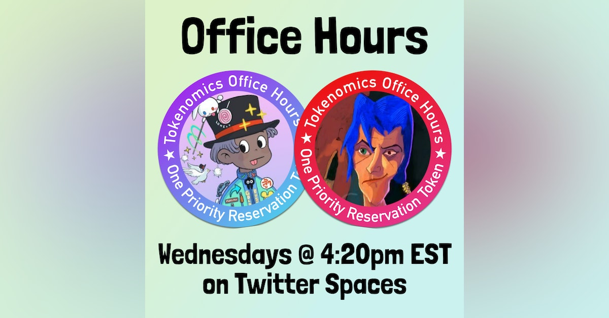

Art by [Sage Kellyn](https://twitter.com/SageKellyn)

## JBX: 2023 年 1 月 Jango

Jango 在他[个人 ENS 地址](https://jango.eth.limo/E202254A-5CB0-4213-9486-C63615B26E52/)发布了一篇文章，梳理了我们一段时间以来通过提案等形式零星地讨论过的想法及他的一些观察。

Jango 上周提交了[一份建议调整及重新批准 JuiceboxDAO基本理念的提案](https://juicetool.xyz/snapshot/jbdao.eth/proposal/0x32764c1e75e71fffcd6b3b048cea1ae2eeac23fa8d22ce99de720973970102c7)，鼓励我们来创造一个更稳固的生态系统，以便我们可以慢慢减少日常责任耗费的精力。本提案已得到 DAO 的批准。

目前我们正准备在 V3 金库上部署 V3 JBX 并开始从 V1 及 V2 的迁移，这是我们一个令人兴奋的里程碑，也是我们版本控制工作的最后一环。从合约的角度来看，原 V1 及 V2 JBX 代币的持有人可以把他们的代币改善到 V3 代币地址，V3 代币合约会在把历史版本代币回收到合约内的同时相应铸造出 V3 JBX，并报告所有三个协议版本的代币总供应量。

因此不久之后，我们的赎回就可以得到恢复。赎回机制是我们去年前年开展的一个大型试验，目的是要测试如果通过赎回来获得对金库的控制权，这样一来，JBX 在某种程度上有了一个地板价支撑，同时人们可以选择赎回来退出。

Jango 认为现在是从大局角度来反思 JBX 有什么成功之处、有什么脆弱点及我们怎样开始筹划下一步事宜的很好的时机。这也是源自我们最近作出的大量的产品方面的努力，诸如 NFT、版本控制、修补 bug，从而为项目创建者及项目支持者创造更好的体验。

### Current Strengths 当前的优势

- 避免被投机者价格捕获

  如果 AMM 价格上升到一定程度，人们会选择从金库来铸造新代币，这样保留代币的接收者会重新获得他们的影响力。

- 定期集合决策

  我们只需每两周决策及执行一次，因为支出及金库的动能指标都是以筹款周期为单位展开的。

- 免费投票

  免费投票对加强治理参与是一个重大的加分项。

- 赎回

  在支出促进网络发展及累积资产之间有一个永恒的创造性张力。由于 JBX 事实上由我们支出用的代币来实现价值支撑的，如果成员对这个张力的演化失去信心时，可以选择退出。

### 当前的脆弱点

- 我们依赖 9 / 14 的多签成员来执行决策。

  多签成员的参与及忠诚都是必备的条件。

- 治理代币流动性高

  有可能会出现安抚短期价格波动决策的情况。

- 给缴纳费用及保留代币受益人的发行率远低于公开市场价格。

  项目购买 JBX 成本过高，保留代币受益人的发行比率不如理想，同时市场上出售 JBX 的需求未得到满足。

- 保留代币分配优先次序

  随着网络的扩张，不可能完全确定保留代币分配的公平性，而保留代币率又是 DAO 抵御投机价格捕获免疫系统的关键一环。

- JBX 治理流程

  目前参与治理成员里面持仓超过 1 千万个 JBX 的相对较少，提案经常需要仰赖固定几个成员的显性支持来获得通过。

我们目前处境良好，但这些脆弱点仍然存在风险，并阻止我们最大生产力的实现。

因此，我们或许应该在接下来的一段时间划拨出一定的时间和资源来创造一个更少脆弱性更能催生发展的 JBX 根基。

### 三个解决脆弱性的提案

#### 巧妙的 veNFT JBX 链上管理 Juicebox 项目所有权 NFT 的发展

这意味着 JBX 应该直接控制金库，同时应该直接从金库获得价值支撑，从某个意义上来防止我们所观察到的多签脆弱性。

关于 ve 机制在投票权重及时间长度等方面的细节还存在一些问题，还有一些研究工作要做。

- 工作原理

  - 锁定 JBX 一个特定的时间来铸造代表这部分锁定 JBX 的NFT。JBX 从钱包、市场或者其他地址提取出来，锁定到这个合约里，相应地锁定人获得这个 NFT。在我们的原型化产品里，我们用一个非常棒的 Banny 系列来实现这些 NFT 的视觉化。
  - 这个 NFT 及其底层的 JBX 仍可以用于随时按当前赎回比率来赎回金库内的资产。
  - NFT 是可交易的。

- 理由

  - 我们想要的状态是关于金库的决策主要由那些持有的资产与网络的长期财务及文化价值相一致的人，而不是更注重短期原因的人群。
  - 这个方式更自动化，而且它允许分布式参与，不用依赖于多签。
  - 它表示对当前版本 JBX 代币的信心，这个责任会落在 Jango 及合约开发组的肩上，力求使当前版本的金库更为可靠并为各种实验建立信心。
  - 尽管同样具有流动性，但可转让 NFT 没有价格图表可供分析趋势，反而它的价值与诸如源起、投票历史及艺术性等其他文化现象相关联。不可转让 NFT 的利弊取舍太多，Jango 没有找到很好的理由来认真开展讨论。
  - 它允许提案开始运用这些质押部位来进行分配，同时降低分配的 JBX 在市场上抛售的风险，并实质上鼓励社区的参与度和文化的形成。
  - 这个产品可以分阶段实施，所以我们可以推出 veNFT 并继续沿用 Snapshot 的治理模式。我们并不是非得马上就转移到链上治理。
  - 它的图案非常有趣。想下 Nouns 的运作模式，就知道在治理参与和赋予个性方面存在着巨大的潜力。如果 JBX 持有人可以选择他们自己的头像或图案来参与治理，我们会有大量的工作可以做，而且治理的参与会自然而然地转化，不用非得加上产品的干预。
  - 小型实验性项目的大多数日常活动都可以转移到更便宜的执行层，而主网上的 JuiceboxDAO 将只负责一些较少发生且更为重要的决策，让链上交易费用更物有所值。（非 ve 专有特性）
  - 链上运营将极有可能加深大众对 JBX 机制及其治理的兴趣。加上那些把规则、机遇和决策都写到链上的社区将会有趣得多。

- 缺点

  - 投票参与度可能会降低，因为获得 JBX 的用户体验中增加了步骤，还要调用另一个交易来锁定并铸造 NFT。启发式设计的其中一部分就是降低工作原理的认知门槛。我们要在 UX 设计与探索一个鼓励参与的合适机制之间找到一个平衡。
  - 投票将不再是免费的。

- 风险

  以后的代币迁移将会困难得多，因为我们把 JBX 锁定住了。

Jango 认为我们针对这个产品已经讨论过很多，合约也已经编写完成。我们需要进行复核和审计，可能做一些调整。这是一个我们去年就讨论和开发的产品，Jango 觉得随着我们作为 DAO 进入一个新的阶段，是时候重新考虑它的实施了。

#### 在 JuiceboxDAO 筹款周期上使用回购委托

- 工作原理

  ETH / JBX 在 AMM 上的交易价格明显优于 JuiceboxDAO V3 的发行率时，如果有人向金库支付费用或直接通过支付函数来付款进来，回购委托会把这部分 ETH 转到 AMM，购买 JBX 回来并分配给付款人及保留代币受益人，而不是把 ETH 留存金库并发行新的 JBX 代币。

- 原因

  这样做的原因很简单直接，主要是为了把 JBX 从希望抛售的人手上转移到目前为生态系统创造价值的人手上。

- 缺点

  我们接收到金库里的 ETH 会变少，不过 DAO 持有大量 JBX，发行新 JBX 代币 也不符合我们的利益最大化。这是一个更有效把 JBX 转移给更合适的人的途径。

#### 修订的保留代币分配策略

想象一下我们把保留代币的 60% 分配给 DAO，30% 分配给履行日常职责的个人贡献者，10% 分到一个费用模块来让 JBX 的 ve 质押人每周或者固定周期来分享这段期间的发展。

通过试验把 10% 转到费用模块，我们开始把网络的发展回馈给忠诚的网络成员，随着网络发展，慢慢地把这一份额向上提升，可能是最有意义的事情。

这里的想法侧重 JBX 的质押数量的比例多于质押时长，因此 ve 未必是一个合适的机制，但这里有些很有意思的东西，我们鼓励网络通过把部分新增价值分享给忠诚的成员来发展自我。

- 原因

  - 我们尚未在保留率上进行过太多试验，但它可能是催化大量发展最重要的潜在能量。它之所以重要，是因为 DAO 选择把通胀压力都指向这里。

  - 我们向一些并没有承担太多管理 DAO 的风险和创造 DAO 的机会的日常职责的人分配了保留代币，挤占了那些更多承担这些职责的人的份额。这是一件小事，但意义重大，尤其是因为在我们仍然需要的时候，有很多人承担了非常多的责任。

  - 我们应当以扩张网络为目的开始考虑创造一个以提案为基础来分配 DAO 的 JBX 的先例。

    与其奉保留比率为圭臬，不如考虑开始把 JBX 分配作为提案的一部分，或者事实上鼓励大家这样去做。

    保留代币应用于补充这部分供应，因此我们把 DAO 的份额提升到 60% 左右的幅度。

    JBX 的付款终端将会大有帮助，这样我们可以以筹款周期为基础来预算、安排及自动发放这些分配，就如我们目前分配 ETH 一样的做法。我们可以想象每个筹款周期分配 ETH 及 JBX 给预设的钱包地址。

  - 费用分配模块存在巨大的机会，在鼓励创造性行为的同时奖励忠诚、参与及风险承担。

很明显，以上这几点会慢慢地在未来的筹款周期出现到提案当中，我们会对此展开讨论。如果我们计划分散运营，以便每个人都可以专注于后续的各方面 Juicebox 试验，我们需要创造一个更强韧、更自动的基础来催化自身的发展及减少脆弱点。

### Discussions on the town hall 在周会上的讨论

**Kmac**: 如果 JBX 付款终端最终得以实现，是不是实质上就意味着可以用 JBX 向网络里的任何项目进行支付？

**Jango**: 我在预想 JBX 付款终端的时候，没有太多考虑支付的功能。理论上来说，你可以给其他项目增加一个支付功能，但如果我们缩小应用范围，它可能仅用于分配目的。DAO 可以用 `add to balane`方法来把 JBX 添加到筹款周期的分配计划，然后就象目前对 ETH 一样来计划及分配。

但是理论上，如果你是另外一个项目，比方说 Peel，你想接受 JBX 并按 10 PEEL / JBX 的比例来返回 PEEL，你也可以这样来进行整合。

**Jigglyjams**: 我问一个关于付款终端的问题，似乎你打算分配比从保留代币转过来的还要多，是这样吗？

**Jango**: 没错。我们可以把保留比率的分配直接转到这个终端，我们还可以把 DAO 目前持有的也注入这个终端，让它来使用。

**Nicholas**: 你预计如果我们转到链上治理之后，我们是会更依赖自动化的筹款周期，还是仍然会每两周来编写一次新的周期配置？

**Jango**: 我不清楚。我觉得每两个星期接收一次新的想法是一个很好的时间长度，但如果我们希望大家都通过各种项目来寻找各自的机遇的话，这些项目本身会发展并会出现治理的需要，这样一来就会变得劳心劳力。少一些繁琐的 JuiceboxDAO 对大家都更有裨益。

## 外联工作报告 ONNI

ONNI 整理了一些文档让我们更容易把 Juicebox 的叙事转介到媒体，这些文件对项目创建者同样有用，或许更加有用。他将会在以后几天把这些文档上传上来。

他们将于周五召开一次会议，商议如何组织新闻发布会、如何联络媒体来对项目进行报道，等等

Matthew 和 Brileigh 做了一个新闻通讯，我们现在有一个订阅这个通讯的邮件地址列表。ONNI 认为这个邮件地址列表是 Juicebox 的一个资产，它能发挥的作用越多，Juicebox 就会变得越强大。

ONNI 计划下周与一些项目创建者联系，希望能让他们的项目成员都来订阅我们的 Juicebox 新闻通讯。他认为这样做的好处是可以让 Juicebox 变得更强大、提高 JBX 代币的价值、帮助确保项目的生存以及通过加深他们的参与来加强这些项目。

## 能见度工作报告 Matthew and Brileigh

Matthew and Brileigh 最近开始制作一些关于各种 Juicebox 相关功能的教程，诸如设置项目句柄、V3 迁移、设置项目的直接付款地址。他们也开始制作 Juicebox 项目创建流程的教程。

除了这些视频教程，他们还在撰写相应的文本教程，因为有些人觉得跟着文章一步步地操作会更容易。

Matthew 说，如果大家对某个功能有了解的需要，可以在 Visibility 频道跟他们提出，他们会尽量帮忙制作相关的教程。

他们还打算制作一些具体用例的视频，如为开源软件创建的 Juicebox 项目、内容创作者的 Juicebox 项目，等等。

## 答疑论道工作报告 Nicholas

他们最近把答疑论道这个节目的时间更改为每周三东部时间下午 4 点 20 分。

本周举行的是这个节目的第三期，节目讨论的主要是关于 NFT 代币经济学以及创建 Juicebox 项目各种创想。

前面第一及第二期节目的可以在[Juicecast 播客页面](http://podcast.juicebox.money)找到。

