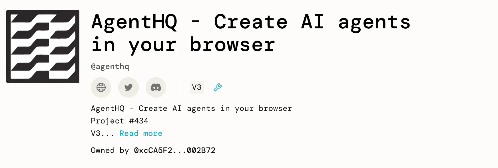
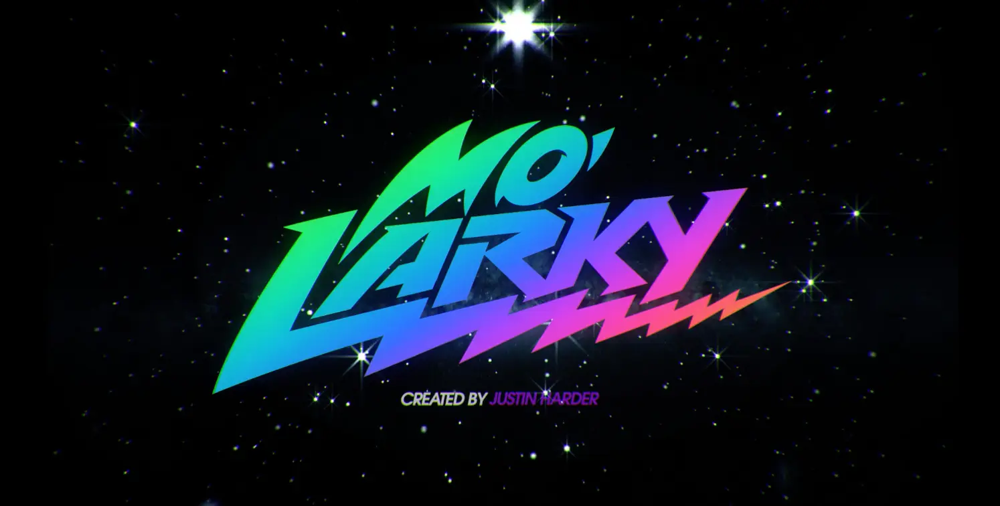
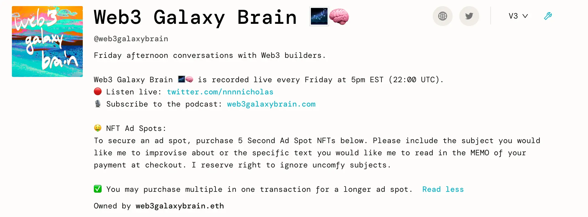
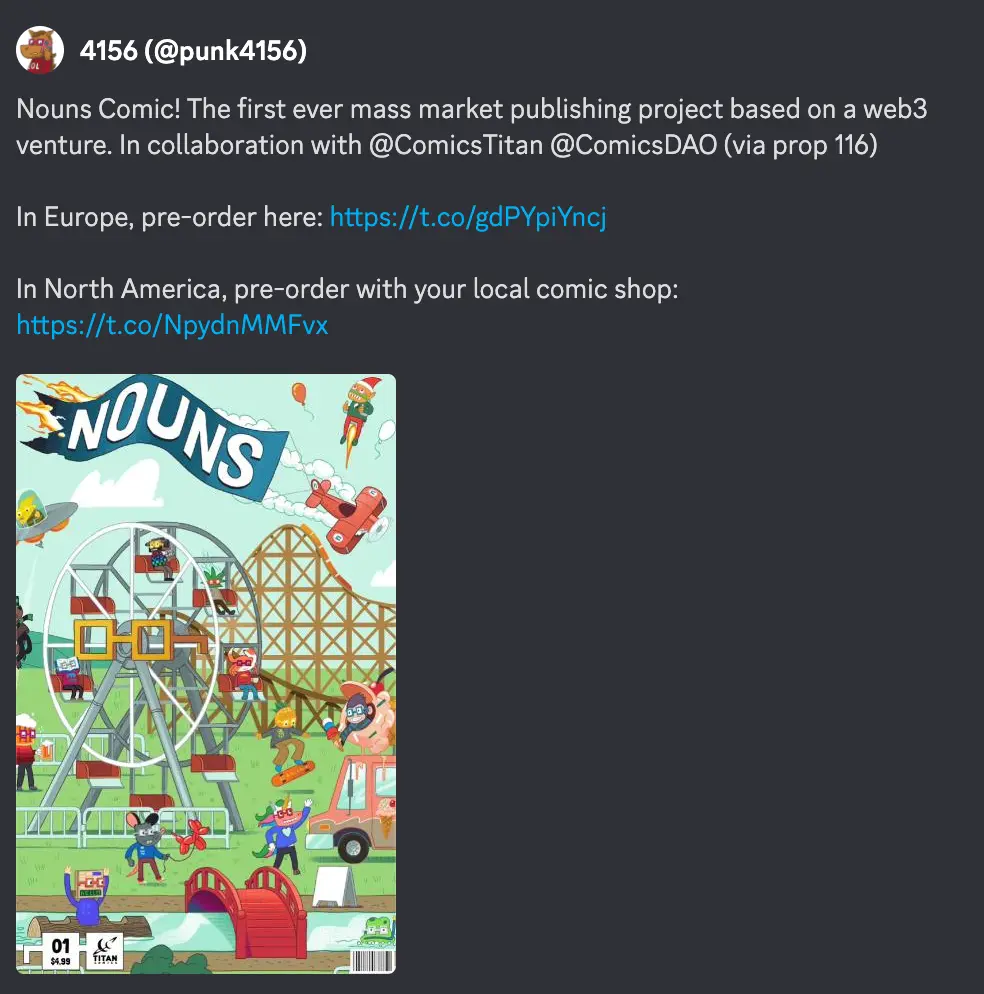
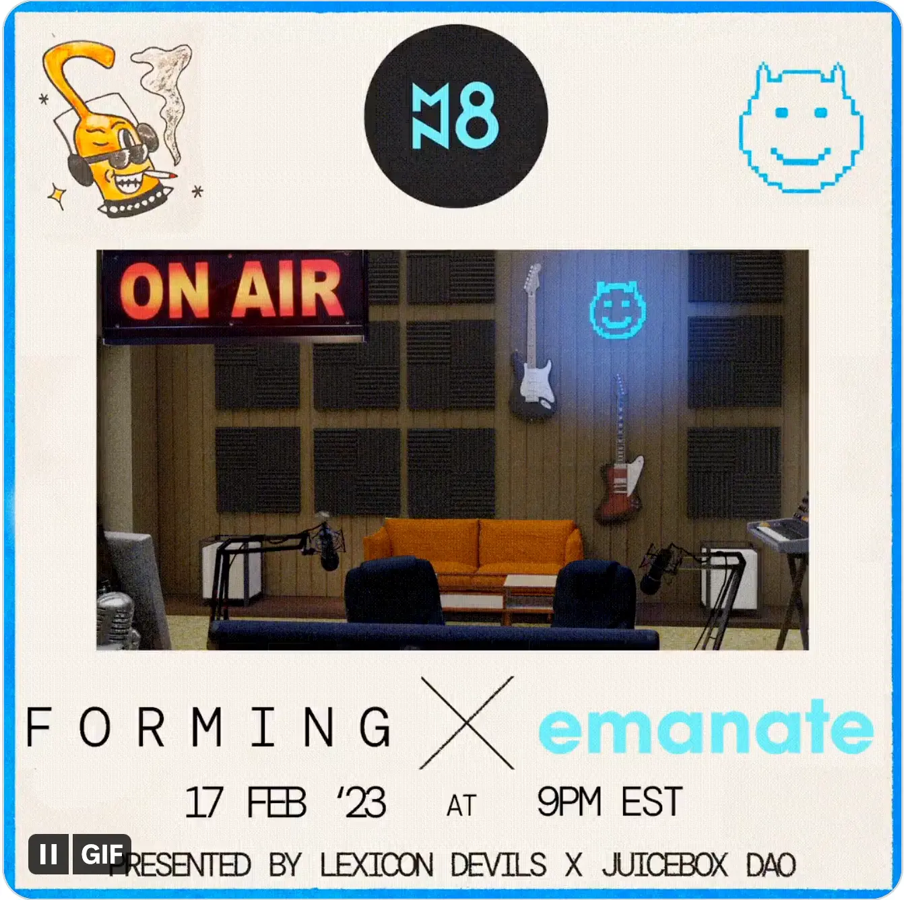

Art by [Sage Kellyn](https://twitter.com/SageKellyn)

## V3 JBX 部署 bug 事后剖析 Jango

最近我们一直在讨论 JBX 当前的优势和缺点，并进行 V3 代币迁移最后的收尾工作，我们已于上周三正式签发 V3 代币。

几个小时以后，Jango 在查看 JuiceboxDAO V3 项目页面的时候，发现金库里的保留代币数量异乎寻常地高。他马上意识到这是由于 V3 代币计算 V1 和 V2 代币供应量的一个缺陷造成的。这个产品设计决策的初衷是为了 V3 的赎回流程能够更加流畅，结果却暴露了一个计算上的 bug。

这个问题有一点敏感，因为如果当时有人触发分配保留代币的交易的话，巨量的保留代币就会分配给保留代币受益人名单上的人，这样一来我们的处置方式就会不一样了，而且比较麻烦。

这个情况发生之前的一个治理周期，我们刚刚批准了一个 [JuiceboxDAO 应急策略的提案](https://juicetool.xyz/snapshot/jbdao.eth/proposal/0xa12e8e5c7ae629548ae984b6a0e3e7454125e339079c65ca0f7eefcf20fddff5)。此这里感谢 Filipv 提前做的调查，感谢 Dr.Gorilla 的协助及各位对这个提案的批准。我们立刻按照这个应急策略来执行各项工作。

鉴于项目方可以在筹款周期内更改保留代币的分配去向，我们通过多签来把保留代币的分配对象全部改为 DAO 的钱包地址，把多余的代币转到这个地址并马上发起交易把它们全部销毁掉了。感谢多签成员的及时反应，我们得以快速执行这些操作。

### 影响

如果你是一个 Juicebox 项目，你完全不受影响。这个情况只涉及到 JuiceboxDAO 金库、JBX 代币及保留代币受益人。如果你的项目在 V3 协议上运行，稍后会建议你把 JBController 迁移到新的 V3.1 版本。

如果你是一位 DAO 的贡献者，目前暂时不再分配保留代币，这个状态可能要等到我们彻底解决错误发行保留代币的问题才会改变。

如果你是 JBX 代币持有人，开放赎回的时间线将会向后延迟。目前 V3 金库上的赎回比率为 0%，我们先解决首要问题，然后再继续执行原来的计划。

如果你一位多签成员，可能还会继续有保留代币转入 DAO 的地址并需要销毁。如果有人想发起一个提案来把代币的分布恢复原状，除了需要多签及 DAO 走多一些流程之外，这个是可以实现的。

### 现状

按目前的做法，V1 和 V2 金库收到其他项目的费用及直接付款的时候，都会铸造出新的金库代币，并同时发行相应的保留代币。如果现在有人向 V1 金库付款，V1 金库铸造保留代币的同时 V3 金库也会出现同样情况，这样两个金库的保留代币都会增加，这个情况不是我们想要的。因此多签就有责任把 V3 上面的多余代币进行销毁。

接下来我们要推出 JBController V3.1 来彻底解决这个问题，虽然只是轻微调整了代币的计算方式，这个 JBcontroller 版本会更稳定可靠。

在之前，如果你在新的筹款周期调整保留代币比率，而又没有提前按旧的保留率把保留代币分配出去的话，原来的计算方式会基于当前未分配总量并按照新的保留率来计算保留代币数量，原来的保留率就似乎没有出现过一样。这是我们之前计算保留代币的方式，通过升级到 JBController V3.1，我们以后将不会采取这样的方式计算，并将解决当前的总量并恢复 V3 金库的保留代币运作。

Jango 发起了一个[按事后剖析形成的恢复工作计划的提案](https://juicetool.xyz/snapshot/jbdao.eth/proposal/0x5b11df589ac1c3bfd40bce63351099e0223d12a1aaf5bd9439a5ba61bb302437)，至整理这份周会概要时，这个提案已经获得 DAO 投票通过。

至于为何我们选择了升级 JBController 至 V3.1 版本这个做法，是因为这样做的话，我们可以保持 V1 及 V2 金库现有的运作模式，从而避免完全停止 V1 和 V2 的运作造成我们失去两个协同工作的金库这一遗憾，因为原来计划金库迁移的初衷就是想要保证多个金库的协同合作关系。

### 教训

一旦我们把问题解决，不要面临一些紧急的处理措施之后，我们可以回过头来重新评估在这个过程中吸取的教训，以防止日后类似情况的发生，或者至少降低情况发生的机率。我们需要在 GitHub 代码库执行更为严格的检查制度，因为其实理论上来说，这次 V3 JBX 迁移部署前的测试本应该是可以涵盖得更全面，这个情况也有可能可以避免。

同时我们也要在不同代币和项目上改善相关权责的厘定问题，要意识到有一些特定的代码，虽然体量不大或者针对某些需求被动编写，但重要程度可能非常高，我们需要给予开发人员一定空间让他们专注工作，避免太过受同时发生的其他开发需求的影响。

我们还从合约角度进行一些思考，来评估低概率代码事故和压缩交易成本之间怎样进行权衡利弊。

Jango 认为我们采取前面的应对措施之后，目前保留代币的风险就能得到解决。

正如我们上周在周会讨论的那样，我们当前正在思考怎样尽可能地降低风险和脆弱性，来构建更强大更有韧性的 JBX。

### 结语

我们花费一周半的时间来修复这个问题并进行记录，再帮助人们学习 JBController 3.1 的利用之后，就可以收获多一个版本控制的实例。在某种意义上，我们默认付款终端和控制器可以通过相对简单的路径进行迁移，只是需要更多的组件协同工作来进行实现。但与其等到以后发生风险或者遇到重大机遇，倒不如在目前还没有太多链上治理流程且核心基础设施负担不大的时候来做这些工作会更容易一点。我们现在主动进行尝试，会比日后被动应对要好。考虑到目前的需求，收获这样一个实例是很有意义的。我们把它记录下来，把整个处理过程中不断进行剖析并从中学习。然后，如果日后我们需要重复这个工作的，就有了非常明确的步骤指引。到那个时候，让我们回到原点，这应该是我们构建更多表层试验和构想延展的新产品的很好起点。

## Dripbox 工作报告 by Mieos

Mieos 最近创建了一个 Dripbox 项目，项目将结合 Sage Kellyn 的艺术作品进行运营。

Dripbox 将会提供一些盲盒形式的 NFT 产品。如果购买了这些 NFT 的人想要搞清楚 NFT 的盲盒里是什么东西，可以访问另一个 [Dripbox 的相关网址](https://forms.bueno.art/dripbox) ，连接钱包并验证持有的 NFT 之后就可以提供地址来接收发出的盲盒。

提供这些盲盒的费用全部用项目金库里支出，金库的所有剩余资金将会在某个 "Slurp Overflow" 期间向 NFT 持有人开放赎回。所以相当于一个设置了盲盒费用的折扣率并使用 Juicebox 赎回机制的项目。

这是一个小小的试验，Mieos 计划初期尝试一些酷炫简单的产品，希望能在今年内推到项目的进一步发展。

## 项目工作报告 STVG

### AgentHQ 项目

STVG 在 Juicebox 上创建了一个 [AgentHQ 项目](https://juicebox.money/@agenthq)帮助筹款支持 [Agent HQ](https://agent-hq.io/) 的发展，这是一个通过输入一些网址或 PFD 来创建自己的 AI 信息中心的工具。

STVG 通过输入一些 Juicebox 相关的链接和文档，用这个 Agent HQ 创造了一个 “Juicebox 学习中心”。 他在周会上演示怎么与创建的 AI 进行互动交流。他认为我们可以通过这个更好地向项目创建者解释一些技术术语，最终把这个演变成一个解答关于 Juicebox 问题的产品。

### Merch Squad

STVG 将参加 Nicholas 和 Jango 主持的最新一期 Office Hours，一起讨论 NFT 部署以及与实体商品如何相结合。

同时 STVG 还和 Justin Harder 商议为一个表演节目 Molarky 创建一个 Juicebox 项目，并计划发行一些一周或者 14 天的开放式NFT 系列，买家可以同时获得一件 Juicebox 或者带 NFT 图案的衣服。

## 工作汇报 Nicholas

### 答疑论道（Office Hours）

Nicholas 和 Jango 定期每周三 EST 时间下午 4:20 分举行一个 Twitter 空间的答疑论道节目。STVG 是最近一期节目的嘉宾。

过往的三期节目已经由 Matthew 和 Brileigh 编辑整理并上传至 [Juicecast](https://anchor.fm/thejuicecast)。

### Galaxy Brain 广告

Nicholas 目前在他的 Juicebox 项目 [Web3 Galaxy Brain](https://juicebox.money/@web3galaxybrain) 上进行他推特空间播客[Galaxy Brain](https://web3galaxybrain.com/) 的五秒钟广告位招租。有兴趣的人可以在项目购买一个 NFT 来让 Nicholas 临场发挥或读出一段买家的付款留言。他的这个项目是为了试验用 Juicebox 的 NFT 来进行一些实用性的销售。

### Gabriel Haines 项目前端开发召集

Nicholas 正着手[Gabriel Haines 项目](https://juicebox.money/@rantsforyou)的更新版本工作，他们正考虑要创建一个独立网站来与项目的 NFT 和类似 0xsplits 的协议来进行交互。他希望邀请有兴趣参与前端开发的工作的人来一起讨论。

## ComicsDAO Nouns 漫画书 Juicebox 广告页面 Gogo

ComicsDAO 正在为 Nouns DAO 制作一本漫画书，这是第一本由 Web3 机构出版发行的实体漫画。因为之前 JuiceboxDAO 在 ComicsDAO 成立及创建项目时给予过他们大力的支持，他们现在很愿意在这本书上为 JuiceboxDAO 预留一个广告页面做宣传或者分享一些有价值的内容。

Gogo 建议大家都去 ComicsDAO Artwork 的讨论频道参与讨论，分享一下自己觉得这个广告页面应该呈现什么样的内容比较合适。

## Forming 宣传 Darbytrash

下一期的 Forming 活动将于 2023 年 2 月 17 日举行，届时 Lexicon Devils 将与[Emanate](https://twitter.com/EmanateOfficial) 进行合作，并邀请 [djlethalskillz.eth](https://twitter.com/djlethalskillz) 作为表演嘉宾。

