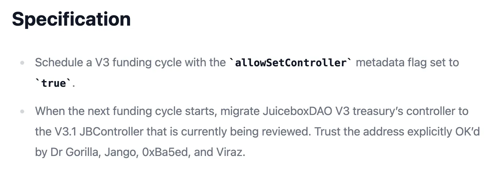
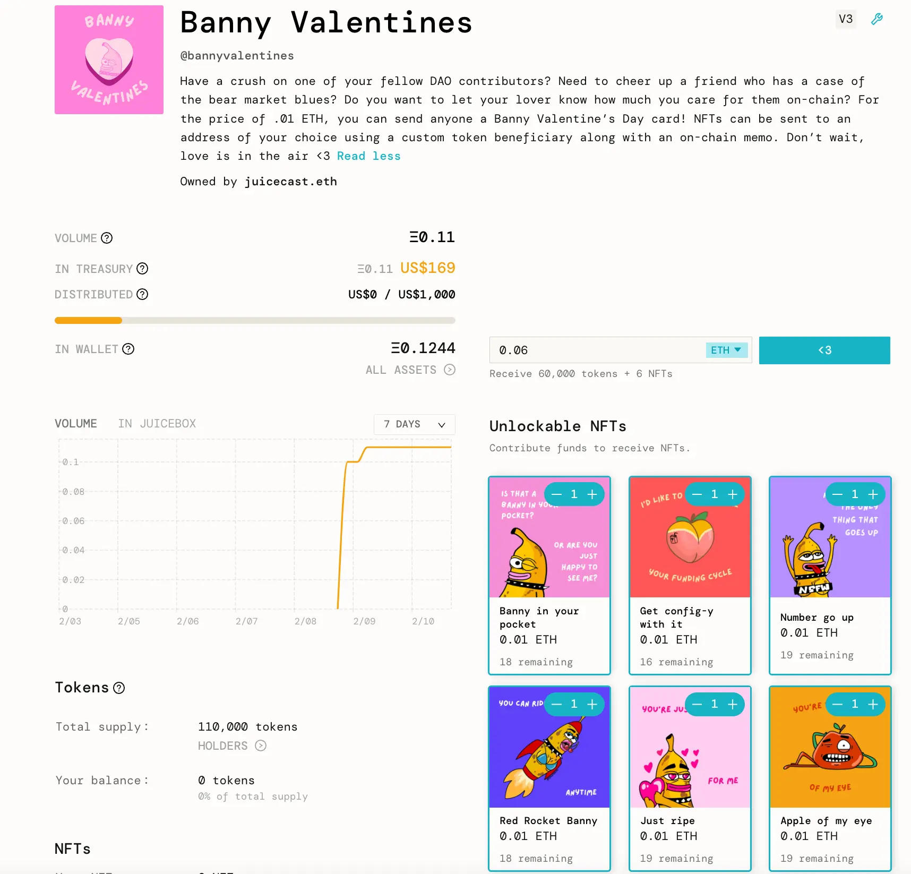
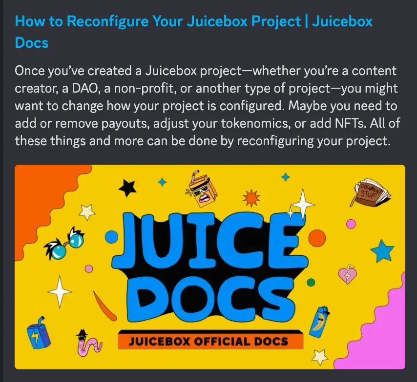
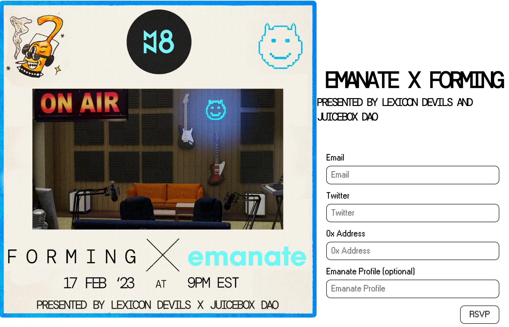
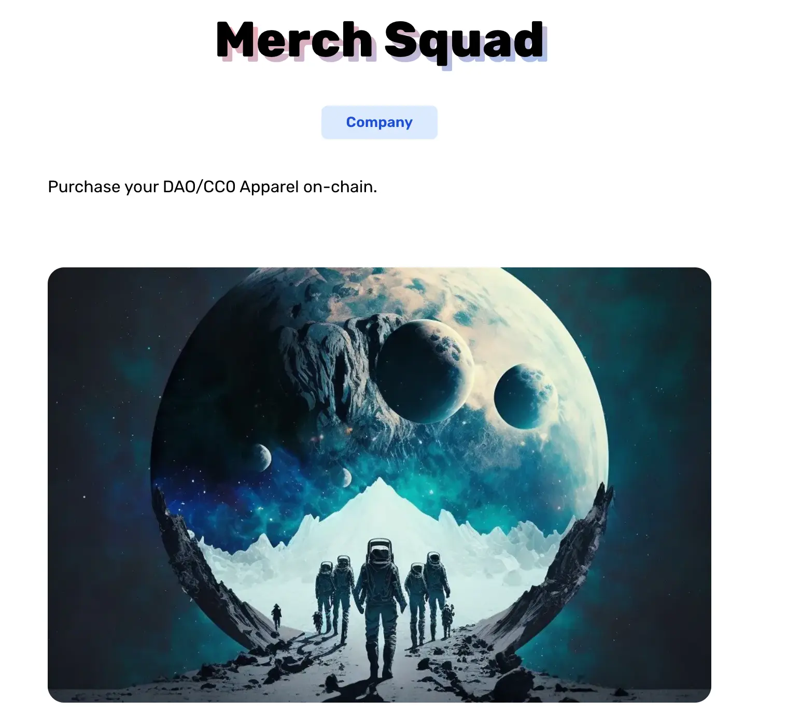

Art by [Sage Kellyn](https://twitter.com/SageKellyn)

## 事后剖析工作报告 Jango

关于迁移 JBController V3.1 的 [治理提案](https://juicetool.xyz/snapshot/jbdao.eth/proposal/0x5b11df589ac1c3bfd40bce63351099e0223d12a1aaf5bd9439a5ba61bb302437) 已获得通过。非常感谢 Dr.Gorilla、0xBA5ED 和 Viraz 测试及发布这个最新版本的 JB 控制器，用于修复在部署 V3 JBX 时暴露的保留代币计算的缺陷。

部署 JuiceboxDAO 这个控制器迁移的交易由 Dr.Gorilla 发起并经 Jango 检查，接下来由多签进行验证并签名。完成之后，我们就用 DAO 认可的流程初步解决了主要的问题。因为提案的最后阶段，我们进行了工作细节的修订，提案内容存在一些不确定性，我们是在提案通过之后才发布了这些合约及获得合约的正式地址。

这个工作还带来了一些其他的情况，我们可能会预防性地审查一下控制器组件。几个周期前出现过一个问题，因为其中一个支出对象 Defifa 项目的金库暂停，导致当时分配支出的交易失败。因此我们将快速审核一下其他组件，并考虑对它们也进行版本控制。这些组件只限于控制器及付款终端，不会像上次那样需要重新配置筹款周期及代币。

之后，我们将会进入一个非常好的状态，并且基本完成了所有可用的版本控制路径，来应对我们可能发现的风险因素，希望这些风险出现的机率极低。同时版本控制本身也应该保持非常简单，因为这些版本控制在引入一些新组件的同时自身也会存在风险。

非常感谢 Dr.Gorilla，尤其是他在开发 JBController V3.1以及迁移组件的过程中发挥的领导作用。

其他项目方将很快可以在 Juicebox.money 上迁移项目的控制器，这个控制器的作用其实就是铸造代币及监听付款终端指令，等等。

新的项目将会使用新的控制器来创建。我们可能下周能够把 Juicebox.money 上的用户界面组件做好，Aeolian 本周正在做这个工作。很感谢 Aeolian 及 Peel 团队与项目方一起来确保这些前端组件能够符合项目的要求。同时我们会通过技术文档及其他贡献者制作教程的形式来跟进这些界面的使用指引。

谢谢大家的快速反应，感觉似乎因此我们所处的状态会更好些。尽管在 V3 迁移的过程中，我们自给自足的方案带来了一些小问题，让我们进行了一些反省并在这一过程中吸取教训，Jango 觉得解决之后，我们的情况应该会更好。

## Banny 情人节 Matthew and Brileigh

Matthew 和 Brileigh 创建了一个名为 [Banny 情人节](https://juicebox.money/@bannyvalentines)的项目，这是他们与 Sage 合作进行的一个试验。

这个项目部署了几个情人节卡片 NFT 来供大家 mint 来送给自己的朋友或心爱的人。他们希望用这个有趣的小项目来在情人节前的这段时间来帮助推广 Banny。Matthew 和 Brileigh 计划向情人节前为这个项目发推的人送出这些 NFT。

这个项目同时也很好地展示了指定代币受益人这个功能，大家在购买这些 NFT 的时候，在付款过程可以填入其他的钱包地址，就可以把 NFT 直接发送到这些地址里去。

除了这个项目，他们最近还制作了一个[如何重新配置项目](https://docs.juicebox.money/user/guides/reconfigure-project/)的教程。接下来他们还将制作更多的教程和其他教学性材料。

## Juicecast 的 Ticket to Space 节目 Kenbot@StudioDAO

Ticket to Space 是 StudioDAO 即将为 MoonDAO 制作的一部纪录片，同时也会是 StudioDAO 网络上一个独立的项目。Kenbot 表示他们将采取一个通过系列访谈来吸引关注的启动策略，采访嘉宾将包括一些与这部影片相关的电影制片人、其他制作太空主题的制片人、MoonDAO 的贡献者以及一些现实生活中的科学家们。

因此他们计划与 Matthew 及 Brileigh 来制作一个 Juicecast 的系列播客节目，对 Ticket to Space 这个项目进行一个深入的介绍。他们希望通过合作及从其他 DAO 获取帮助来促进项目的进一步传播。

Matthew 建议 Juicecast 系列播客可以考虑在筹款活动开始前分期发布不同主题的播客节目。Ken 表示他并不期望这个项目一开始就能火爆，他们计划逐步来推进这个工作。因此可能会先制作一期节目，积累一些经验并视反馈情况再继续进一步采访与这个影片相关的人。

Ken 说他们下周情人节期间将会在 Mirror 上发布这个项目的公告。

## Forming 宣传 Germs

Lexicon Devil 将于 2 月 17 日与 [Emanate](https://twitter.com/EmanateOfficial) 合作举办一期新的 Forming 活动。这个活动的参与意向登记现已在 [Forming 的主页](https://forming.lexicondevils.xyz/)开放。

## Merch Squad 项目 STVG

STVG 想知道大家有没有兴趣去 [Merch Squad 项目](https://slice.so/slicer/2?product=5)购买他最近推出的 Juicebox 长袖罩衣，他用这个来尝试销售一些与我们生态系统相关的商品。

