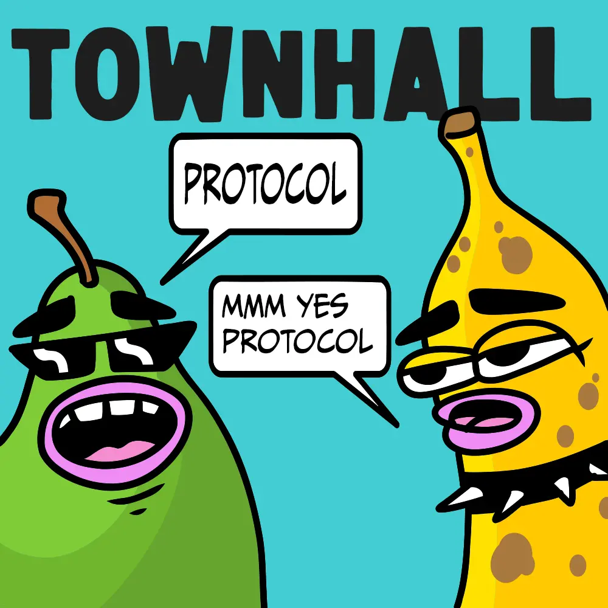
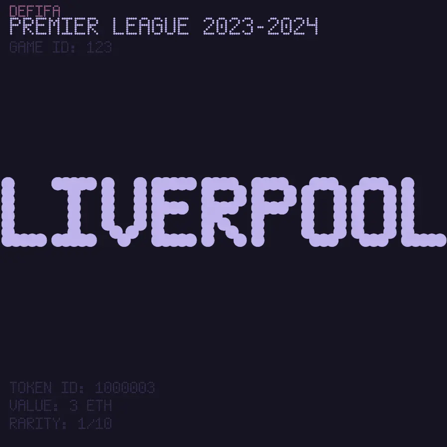
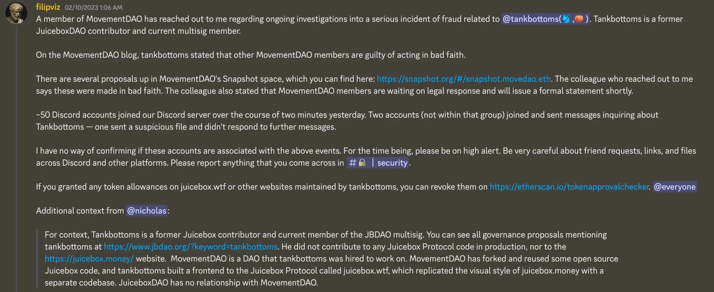
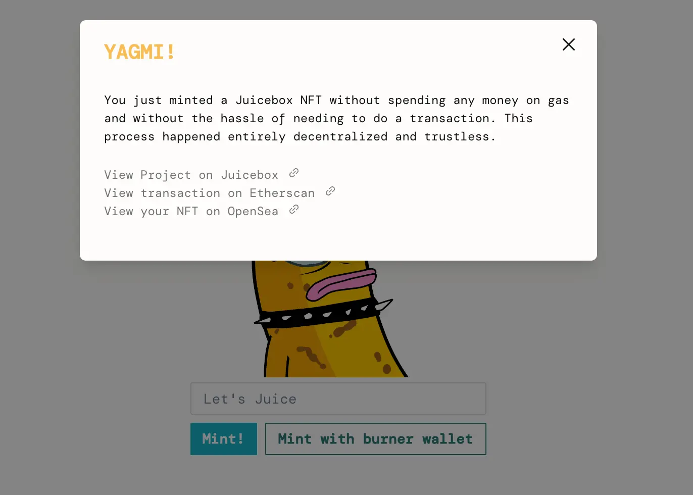
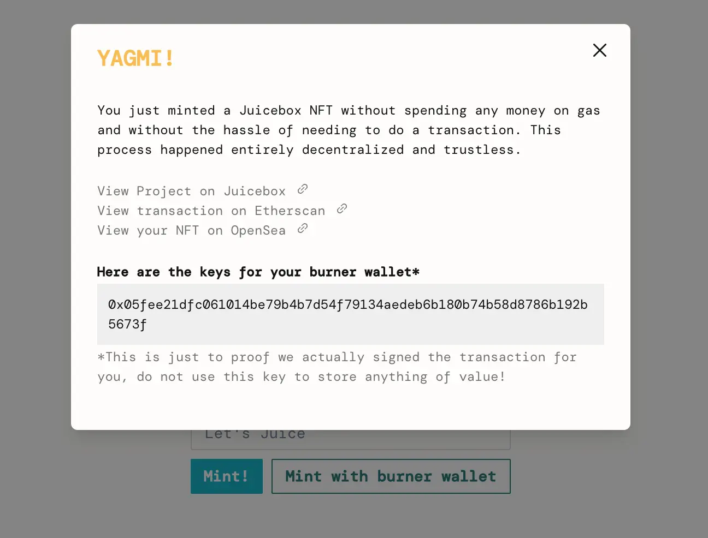
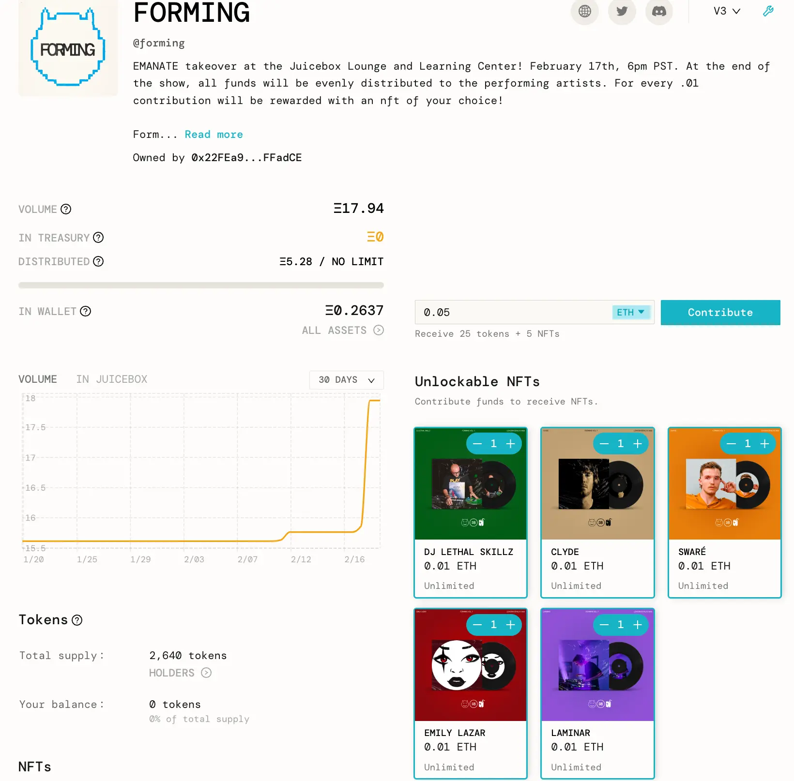
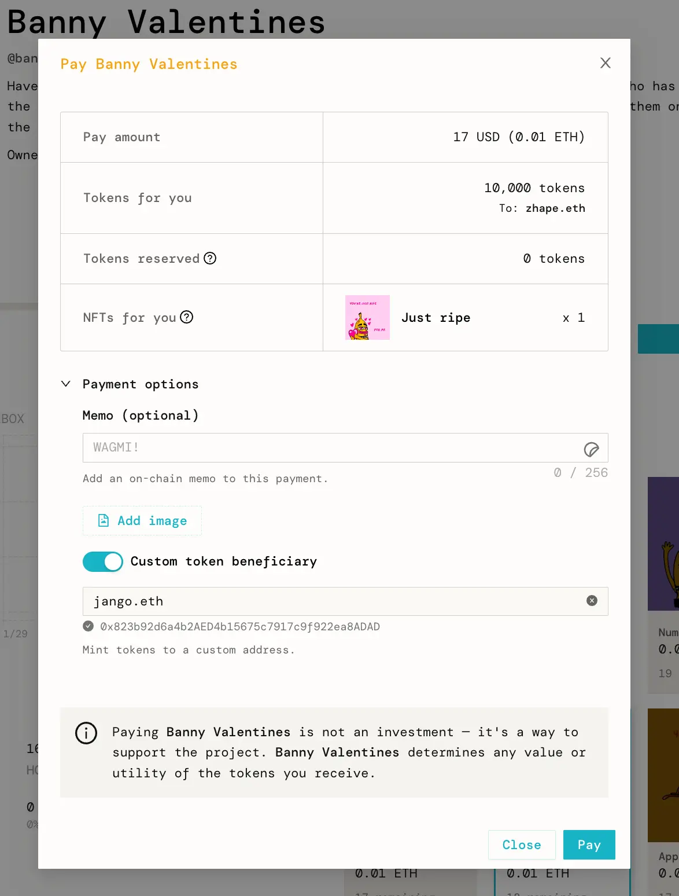
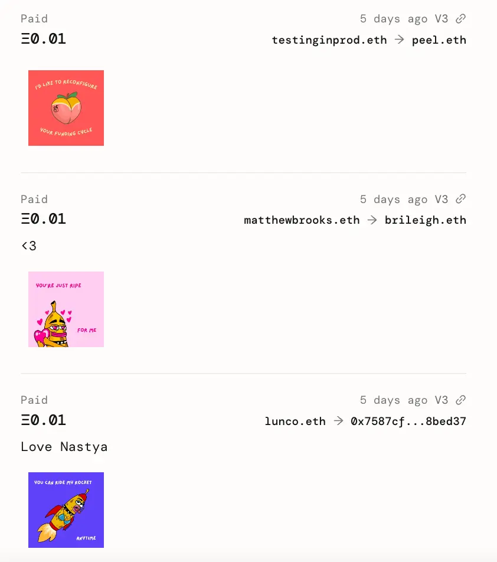

Art by [Sage Kellyn](https://twitter.com/SageKellyn)

## 版本控制 / 事后剖析报告  Jango

JBX V3 合约部署之后三周，我们发布并迁移到 V3.0.1 版本 JBController，但因为本周期的支出是用 V3.0 JBController 来安排的，就引起了分配方式的错误。

目前造成的影响是大家暂时不能收到本周期的分配，我们需要发起一个交易，把控制器回退到原始的版本，分配支出后再转移成新的控制器版本。操作流程已在[这个提案](https://juicetool.xyz/snapshot/jbdao.eth/proposal/0xb7b3ccd64f9b27ed001e7d086b11ae1dc78c56bd525840636a1a79d62ba14ccc)中列明，目前正在投票表决。如果提案获得批准，我们将可以在下个周期修复这个错误并完成支出的分配。

我们下面的工作是要修复过去几个月发现的一些其他问题。其中一个就是，如果你从一个项目向另一个项目付款，但如果后者的金库暂停收款的话，整个交易都会回滚。

我们期待着这种更加长期的迁移版本，上述提案中也有提及这个问题。如果提案得到批准，它应该会在接下来的几周内得到实现。一切顺利的话，那么我们将完成系统中最大限度的迁移工作。尽管同时增加了复杂性和错误，但考虑到当前的情况和产品所承受的压力，跑通依赖内部产品升级的流程是非常不错的。

感谢合约团队在过去一周鼎力支持，确保迁移工作得以顺利展开，感谢前端团队对控制器和新终端对接的处理工作，从而使其他项目都能使用到最好的最可靠的版本。

希望接下来的几周我们会能够到新版本的最终部署。 系统中暴露的风险大家都很清楚也在文档中清晰表述，造成的影响非常小。版本控制实际上只是为了降低未来项目的风险，鉴于我们将来可能不再对协议进行日常管理，项目的运行趋于自动化，他们可能不清楚曾经出现过这些问题，而且可能也不会按我们的建议仔细阅读文档。

## Peel 工作报告 Aeolian

上次 Peel 在周会上做工作报告是 2022 年 11 月 15 日。

Aeolian 首先认为我们最近在的进展确定遇到一些问题，过去几周发现了一些比较严重的 bug。 尽管这些错误很快得到解决，但我们已经认识在这个方面进行改进的必要性。

多个版本控制工作正在进行，因为我们发现应用的某些部分需要改进，这是版本控制的一个很好的转折点。 随着很多内容进入版本控制，许多 UI 的不同部分也需要进行修改以支持这些合约的多个版本。

这些工作取得重大进展，我们即将推出一个 UI 让其他项目把控制器和 ETH 支付终端升级到最新版本，然后就可以开始他们的代币迁移流程。

Also there are some exciting new fuctionalities available with the efforts of Peel:

经过 Peel 的努力，还实现了一些令人兴奋的新功能：

- 视频 NFT。这个产品将于本周末发布。届时项目将可以用 MP4 文件来部署 NFT；
- 项目页面支持多选 NFT。人们现在可以一次性选取想要 mint 的 NFT 再付款，这个功能源自于 Defifa 项目的创新。
- Juicebox.money 项目 Safe 页面中的交易对比图。 多签成员签署新的周期配置交易之前，可以在这里比较新旧周期的差异；

搜索功能也即将推出，Peri 一直在努力开发。 这个确实是应用的另一个重大变化，有很多组件需要整合，因此 Peel 团队希望放慢进度，以便在推出产品之前对更多细节问题进行打磨。

Aeolian 还提醒我们可以关注一下创建流程的改良，我们按照新的反馈不断发展和迭代。

## SVG 模板 Nicholas

最近 Nicholas 在整理代币解析的文件，刚好 Jango 需要一个链上 SVG 解决方案来为 Defifa 创建 SVG 元数据，所以 Nicholas 创建了一个 [SVG 模板库](https://github.com/jbx -protocol/juice-svg-template) ，希望对其他人也有所帮助。

在周会，Nicholas 演示了怎样使用这个模板生成一个 SVG 。 可以通过在 `SVG.sol` 中进行更改来设计自己的 SVG。 可以使用这个模板为 NFT 奖励、项目或任何他们感兴趣的东西制作自己的链上 SVG 元数据，它内置了 Juicebox 合约支持。

然后在这个代码库的 `project-handle` 分支，人们可以调用一个复杂一点的测试来把 Juicebox 项目句柄加载到 SVG 中的。

Jango 这周一直在试用这个模板。 他想用它来做一个 Defifa NFT 的自动生成终端，这样任何人都可以使用和创建自己的 Defifa 游戏。 我们可以尝试在 NFT 上显示数据并使用 Peri 的链上字体来个性化定制。 他认为这是一个非常酷且有用的工具，尤其是在像 Juicebox 这样的数据繁重的协议上，快速可视化 NFT 上的数据将成为许多项目的默认选择。



Nicholas 补充说，对于 NFT 项目而言，直接从区块链提读取代币元数据也非常酷，这样即使 Juicebox.money 或其他协议终止 IPFS 的固定服务，NFT 也不会消失掉。 对于想要更加自主的项目或想要保持匿名的创始人来说，这个功能也非常实用。

## 一个 DAO 贡献者的反思 Jango

上周 Filipv 在我们的公告频道中报告并分享了一些关于前 JuiceboxDAO 贡献者 tankbottoms 的事情。 上周，MovementDAO 的多签成员联系了 Filipv，称他们发现 Tankbottoms 在 2010 年曾被判欺诈罪，并提供了大量 PDF 文件作为证明。 他还从 MovementDAO 多重签名中转走了数百万美元。

除了有部分贡献者同时在两个实体工作，以及 MovementDAO 分叉了 Juicebox 的一些开源代码之外，JuiceboxDAO 与 MovementDAO 之间没有任何关系。



以这个特定的事件为契机，反思作为一名 DAO 成员如何看待我们目前习以为常的提案节奏和贡献者步调，Jango 希望能反思事件始末以及它的原因，然后反思一下我们怎样以此为鉴，避免类似事件再次发生，并对那些进展顺利的方面给予肯定。

Jango 在[他的个人 ENS 地址](https://jango.eth.limo/905FFC14-1A87-4FBA-B81F-00DEB2B5FBEB/)上发表了一篇文章，并在周会上一一进行解释。

- Jango 认为他在对其他人的信任和支持上偏过于乐观，并且对任何具有多种结果的事情持开放态度，没有真正地对后续发生的情况发表自己强烈的意见。 他的这个做法容易被其他人利用。 他对发生的事情感到非常失望，并反思他应该如何把握支持他人的一个尺度。

- 他认为在某种程度上支持某些想法或人就像支持某些事情，往往结果不一定好，这样做还可能会对其他有不同做法或步调的人造成伤害和打击。 这个问题值得以一种松散的社会取向观察的角度来进行反思，但不管怎样是有价值的。

- 他觉得很多人在 DM 的表现和公开场合出入很大。 有趣的是，不同的对话，不同的解读，可以产生不同的看法。

- 良好的沟通显然非常重要。对 DAO 来说尤其如此。  我们可以观察沟通不畅的时刻并进行解决，反思他们的阴暗面以及我们如何来改进，这样我们至少可以更一致地理解我们所处的当前环境，从而思考如何向前发展。

- 我们默认的最多 7 个周期报酬期限的惯例似乎确实会降低一定的风险，这是值得肯定和高兴的事情。 在 Jango 看来，这个惯例是从最开始的无序状态慢慢演化形成的。 长期报酬提案可能会引起大家反思，可能会出现质疑和反对的声音，并在社会和技术的角度给予贡献者一定的压力，把主动权更多地转到 JBX 社区的整体价值观。 这个价值观不断变化并且很难正确把握，因为不存在绝对对错之分，都是人与人之间互动形成的产物。

- 来自其他贡献者和 JBX 持有人的质疑对于 DAO 的健康非常必要，但是作为最先提出质疑的贡献者可能是有风险的，也很难做得到。 Jango 认为我们应该支持质疑的声音，并通过某种形式或做法来这个做法合理可行。

- 我们前几个治理周期确认的基本理念中概述的 DAO 价值观确实留有解释空间。 其中有很多内容都是关于怎样在紧迫性和忍耐性之间找到平衡，视乎哪些事情能使工作流程顺畅或是否具有特殊价值。 留有解释的余地是一件好事。 这些不是要么遵守要么打破的条条框框，而是一整套高尚的价值观来指导我们反思并厘清找到平衡在面对这次的事件意味着什么。

- 随着时间的推移能最大限度地减少坏风险并提高好风险，这样的强大 DAO 免疫系统的建立，需要大家的注意力和品味。 品味很难正确把握，因为我们是一个不断发展的社区，社区里有不同的的兴趣、品味和宽容度。 很多事情靠的是直觉或品味，还有很多是技术性的，我们必须保持开放的态度并接受与我们观念不同的人。 这是一种平衡，但需要注意力和品味，而且我们必须在各自负责的事情上相互信任。

  存在一些不良的影响，但它们只是我们正在构建的系统的一部分。这是一个对抗性的环境。 还有些专门设计的不良影响会附加到这些系统上面，我们要看如何来克服它们。 在某种程度上，DAO 已经公布的风险缓解措施都做得很好，但显然还有很多工作要做。

- 开发一个高效且始终如一的机制，逐渐将 JBX 转移给贡献价值的工作者和捐款人是一个优先事项。 这是一件棘手的事情。 回购委托很快就会推出，这是我们最近讨论到的 JBX 策略所覆盖的。 我们还讨论了更多客观的代币情况，并且我们已经从技术和治理的角度意识到了这一点。 可能我们还必须考虑到我们所处的更广泛的社会环境。

提供很多机会或开放空间让某些事物落地生根，很多时候它们会因此而绽放，但还有些时候它们只是占据了空间资源，并对真正有趣亟待培育的美好事物造成压力。 我们整个旅程都会踩着这种取舍得失的舞步来行进，身处其中固然很酷，但这个过程也需要我们大量的反思，并实际面对有时可能与创造更开放的美好金融世界的乐观情绪相悖的后果 。

### 周会上的讨论

**Aeolian**: 谢谢你 Jango，说得很好。有一个你提到的问题，我一直在思考，我相信其他人也一样，作为提出质疑的贡献者是会有风险的。

我也不清楚这个问题应该如何解决。之前质疑反对过一些提案的人都会明白在很多层面上这个事情不容易做，需要参与到提案细节讨论，既费神也费时。而且显而易见，你突然公开对其他人的薪资报酬提出异议，肯定是你自己有不利的。但有人愿意投入精力时间来促使提案内容在合理区间，很明显是这是非常重要的，很有可能也可以在某种程度上避免类似最近这个事情的发生。

**Filipv**: 我很赞同。我觉得 Aeolian 说得很好。不单止是提案，我们作为一个 DAO 所面对的每个事情都是这样的。人们倾向于在每个事情都要达到共识，这某种程度上是人的本质使然。你如果身处一个小团体，就会需要其他人的认可才能办成一些事情。不同意大家的意见并不容易办到，但我们都需要不断地提醒自己避免这个本质偏见的影响。

我觉得可以表达自己的意见，希望我们可以在讨论中找到最准确的答案，即使没有人敢说永远都知道问题的完美答案。希望我们可以一起向着这个方向努力。

## OpenGSN 解释及演示 0xBA5ED

[OpenGSN](https://opengsn.org/) 是一个开放的 gas 网络，它基本上允许你可以进行交易但无需支付 gas 费用。你其实并不是自己执行交易，你只是对一个消息签名，交易就会被发送到一个去中心化的中继网络，再传播到链上。

以下是这个功能的几个用途：

- 提升项目的用户体验。项目需要引入新用户的时候，首先这些新用户需要创建钱包并可能要走一些 KYC 的流程，然后才能入金把 ETH 转入钱包。然后他们还要执行一些实际的交易操作，面对一些 gas 价格的选择及接下来的一整个交易流程。
- 鼓励用户执行某些行为，如果他们这样或那样做的话，项目可以代为支付 gas 费用。
- 还可以实现某些需要执行的任务的自动化，这样一来，贡献者不用再手动发起交易。

0xBA5ED 在周会上展示如果不用支付 gas 费用或者自己发起交易来 mint 一个 Juicebox 项目的 NFT。这是他在 Goerli 测试网上用于试验和[演示的地址](https://demo.ba5ed.com/) 。



如果大家用自己的钱包签名交易会觉得担心，0xBA5ED 还增加了一个 “用一次钱钱包 Mint” 的选项，点击之后会自动在浏览器创建一个一次性钱包，并用这个钱包来执行这个交易。这种情况就不用用户来签名。



Juicebox 项目里的 `分配` 功能就是一个很好的例子。目前 Juicebox 项目分发支出需要由某个人点击 `分配` 按钮来触发交易，而且这个人还需要支付这个交易的 gas 费用，还未必能得到项目的报销。如果用这个 “用一次钱钱包 Mint” 的办法，理论上来说谁都可以点击 `分配` 按钮，并在浏览器内生成一个一次性钱包签署交易并发送到中继网络提交上链，gas 费用则由项目金库来支付。

0xBA5ED 编写了一个支付程序，允许用户来设定可以触发交易的地址，可调用的合约，可调用的方法，并且可以部署系统合约来验证调用数据的真伪。

通过这个演示，他希望让我们了解更多关于 openGSN 的原理，以及降低 Juicebox 进入门槛的作用。

## Forming 宣传推广 by Darbytrash

Lexicon Devils 将于 2 月 17 日与 Emanate 合作举办最新的一期 Forming 表演活动。

在 [Forming 的 Juicebox项目](https://juicebox.money/@forming)上，Lexicon Devils 公布了他们计划了一段时间的 NFT 方案。从本期活动开始，他们每个月会按参与演出的表演者来提供他们个人化的 NFT。跟以往一样，这些表演者会被设为项目当前的分配受益人，活动结束后，Forming 项目金库内的资金会自动分发给他们。



## Banny 情人节项目 Matthew 与 Brileigh

Matthew 和 Brileigh 与 Sage 合作，创建了一个 [Banny 情人节项目](https://juicebox.money/@bannyvalentines)，提供了一个情人节的 Banny NFT。

如果有人想购买一个 NFT 并赠送给另一个人，他们可以在付款弹窗内打开 “指定代币受益人” 选项，填入受益人的 ENS 地址或钱包地址。付款完成之后，这个 NFT 就会去到指定的受益人手上。



同时我们的前端也刚刚实现了一个新的功能。如果付款时打开了指定代币受益人选项的话，交易的发起人和代币受益人都会在项目的活动列表上显示出来。


```