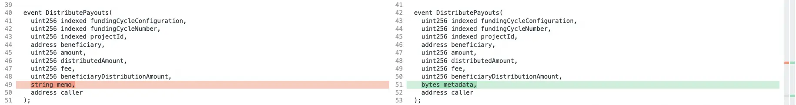
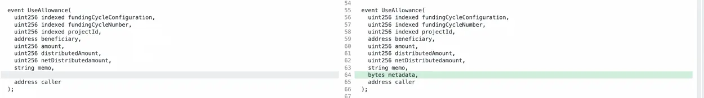
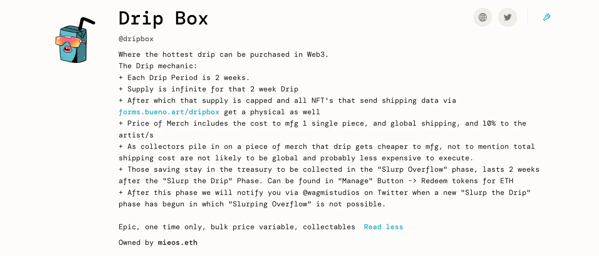

Art by [Sage Kellyn](https://twitter.com/SageKellyn)

## 控制器及终端 3.1 变更明细   Jango

最近协议出现了一些问题，如我们在过去几周遇到的代币迁移错误等。我们从吸取的教训进行一些改进和修整。 Jango 对我们在控制器和终端所做的更改进行了概述，以供使用当前终端和控制器的项目参考。 尽管这个概述更偏向技术方面，但从用户体验的角度来过一遍并加以解释应该还是有用的。

***你可以在[这里](https://juicebox.notion.site/e940e45c08774388bdd31b21f38e4f30#b728fd6e3e734d5aad35dd636c401ec6)查阅 Jango撰写的这一份概述全文。***

以下对 Juicebox 项目中三个延展性的表面组件所作的更改：

### 控制器

*可以在[这里](https://www.diffchecker.com/bEuD9b4b/)查看前后代码的对比。*

每个项目都使用相同的合约，但通过各自的项目 ID 来进行访问，然后每个项目都可以选择使用其中一个规范控制器。 控制器合约存储在名为 JBDirectory 的合约里面，你可以向其查询项目当前使用的是哪个控制器，它将会返回控制器的当前地址。

这个控制器拥有代表一个项目来铸造代币、销毁代币并跟踪其他一些事项的权限。 它还有代表每个项目在 `fundingCycleStore` 和 `tokenStore` 中进行操作的独特权限。

现有项目可以选择是否要迁移到新的控制器，我们对新控制器所做的更改是针对两个保留代币相关的的函数接口`reservedTokenBalanceOf` 和 `totalOutstandingTokensOf`。 这个新版本的控制器不会向后兼容旧版本的付款终端，因此项目要实施迁移的话，必须同时将控制器和终端都迁移到新版本。 新项目的创建也一样。

基本上这只是一个非常简单的小改动，仅改变了访问一个项目分配上限的位置。 之前，你可以直接在控制器中使用 `controller.distributionLimitOf` 进行访问，项目将返回分配的设置情况以及适用于哪个终端等属性。 通过 `overflowAllowanceOf` 来访问的溢出允许也是这种情况。 但现在，这些数据会通过 `fundAccessConstraintStore` 这个独立存储进行访问，它解决了我们在进行第一次迁移时遇到的支出分配问题。

还有一些更改是关于如何访问保留代币余额的。未分配的保留代币数量不再以当前保留率来计算，现在每次收到付款时都会对保留代币进行自动记录。你可以向新控制器获取特定项目 ID 的保留代币余额，它将会返回完整保留代币值。`totalOutstandingTokensOf`也是这样。

如果你对这个原始接口没有显性依赖，则所有这些控制器的更改都很小且无关紧要。但是如果你有这个依赖，就需要想办法与这些升级的 API 进行连接。

### 付款终端

*可以在[这里](https://www.diffchecker.com/7Zf5CnrL/)查看完整的代码差异。*

你可以将支付终端看作是存储资金的地方。它代表项目接受新的付款，允许代币持有人赎回代币以获取其资金份额，并允许任何人触发分发资金的公共交易。

#### 具体内容

付款终端的更改非常微小但很有意义。由于我们要发布一个与新控制器兼容的新终端，我们还顺便修复了几个筹款周期前遇到的一个问题，我们尝试向 Defifa 项目支付拨款的时候，由于这个项目的支付终端被暂停，导致整个分发交易都回撤了。

我们打包了一个功能来捕获支付某个项目或分配器时返回的错误，并把回撤的资金重新注回支付项目的终端，以便整个交易中的其他分配操作可以照常进行，而回撤的分配将会被终止掉。然后我们发出事件，以便 subgraph 可以检查是否有交易撤销发生并进行索引。

付款终端中的另一个更改是对 `addToBalanceOf` 的调用，以前调用这个 `添加至余额` 函数来向项目金库注入资金的时候，它会自动绕过代币铸造。我们一直通过调用这个函数来返还暂扣的平台费用。如果项目向 Juicebox 生态外发送资金时选择保留平台费用，他们可以向项目重新注入资金来退回相应的平台费用。

现在，`addToBalanceOf` 的调用将不再自动执行这个操作。addBalanceOf 现在有单独的一个重载方法，显式指定新增的 boolean 参数为 True 时才会返还费用，而不再是默认这样做。

#### 新事件签名

- `distributePayoutsOf` 函数以前会发出一条备忘录，这个做法意义不大，因为这是一个公共交易。因此我们用 `_metadata` 参数代替 `_memo` 参数，允许调用者在元数据的第一块中发送他们的项目 ID，这样我们就可以使用事件来统计生态系统中哪些项目做过增值贡献。

​          `distributePayoutsOf` 很重要，因为它属于累积及记录平台费用的函数。

- `useAllowanceOf` 函数，我们还没有在客户端中发布这个函数，但我们应该考虑在项目页面中提示这个功能，即使 UI 暂时还不支持。

  它的 API 也在保留 `_memo` 参数的同时加入`_metadata `参数 ，因为只有项目所有者会进行调用，所以应该保留 `_memo` 参数。

####  分级 721 委托

分级 721 委托是项目可以用于他们的 NFT 的一项扩展功能。

在创建流程中有一些新属性与 NFT 功能有关：

- 项目所有者现在可以指定版权税率和版权税受益人。这些以一些交易市场会监听的标准来进行公布。
- 同时加入类别，项目方可以按类别来添加不同的等级。他们可以按特定类别获取 NFT 并开始围绕这些等级来创建一些新组织特性。
- 项目方还可以在创建等级后再设置分级的元数据，无需另行部署 tokenURI 解析器。他们只需上传经过编码的 IPFS 哈希，然后 NFT 的元数据将被上传并更改。

很显然，NFT 的相关内容也需要对应新的控制器和终端，因此新项目将使用所有这些新合约。

此外，由于 NFT 部署现在使用代理部署模式，部署 NFT 合约的成本将会比以前便宜得多，这是一个非常大改进。

希望我们能够向更具韧性的方向发展让项目方不用过多担心风险，同时为各种功能增加一些不同的机会。

## Ticket To Space 工作报告  Kenbot@StudioDAO

Ticket To Space 是 StudioDAO 与 MoonDAO 准备一起制作的一部纪录片，计划记录了一位 Ticket To Space 获奖者的旅程和故事。

StudioDAO 即将启动一个 Ticket To Space 的筹款活动，Kenbot 认为这对于 MoonDAO、Juicebox 和 StudioDAO 来说都是一个巨大的胜利。他同时认为，通过 Matthew、Brileigh、Jango、Mieos 及 Aeolian 等人在这个过程中投入的创意能量，我们将迎来一个美好的时刻，这是一些大型公司无法做到的。

他对如何进行一些 NFT 的投放非常感兴趣，这些 NFT 更多是以开放版本的形式并附带销毁功能。他计划充分利用 Juicebox V3 协议的各种功能，向支持者们提供各种不同等级的 NFT。

一方面，他们将提供一些高端 NFT，每个价格为 50ETH 或 10ETH。 比如，他准备去 Nouns DAO 发起一个提案，让他们购买 50ETH 的 NFT 以获得在电影中对 Nouns 支持的致谢。 但另一方面，也会提供开放版的 NFT，它们将成为更多自下而上的驱动力，让数十万人参与到项目中。

## Drip Box 工作报告 by Mieos

[Drip Box](https://juicebox.money/@dripbox) 是 Mieos 最近创建的一个项目，目标是销售一些 NFT 附带的盲盒商品。

人们可以在项目里铸造 NFT ，然后转到另外的网站去验证他们的持币，提供邮寄的地址，以便可以把盲盒寄给他们。 等销售阶段结束，扣除所有成本和费用后，项目金库将向 NFT 持有者开放，让他们赎回自己的剩余份额，某种意义上相当给买家一些折扣或退款。 这个模式的逻辑是，购买 NFT 的人越多，商品的采购成本和运营开销就会分摊和降低，进而可赎回的剩余资金就会越大。

Mieos 认为他需要研究如何营销及为这个项目造势，适当地扩大项目的影响规模，从而进一步把商品的折扣提高。

他花了很多时间研究采用哪些高端产品来放入盲盒。第一个 NFT 投放将命名为 bug-out bag，盲盒里面会放一系列人们任何时候都用得上的物品，随手拿上就可以出门远行。

Mieos 和 Jango 还讨论了投放一些制作人 NFT 的可行性，让一些潜在的赞助商来做产品的品牌赞助。

