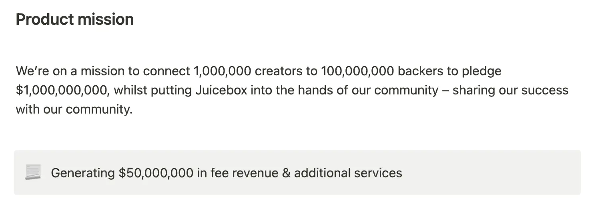
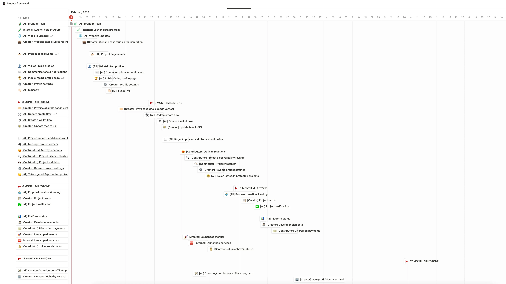
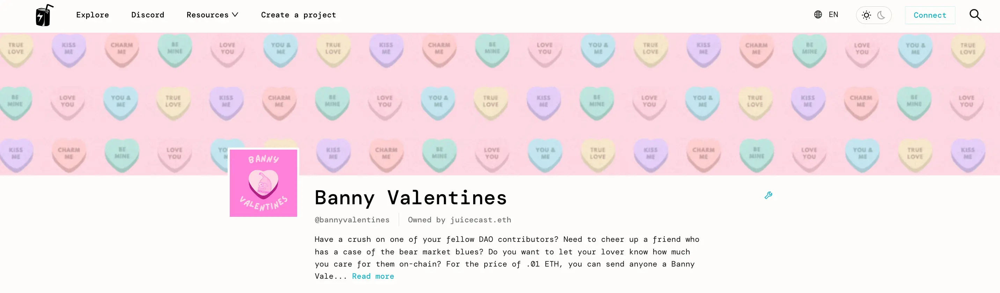
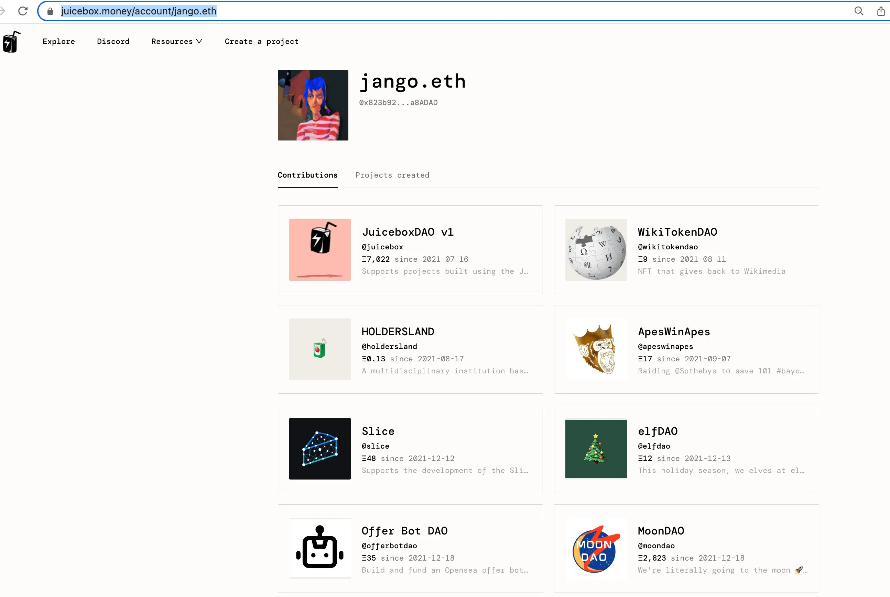
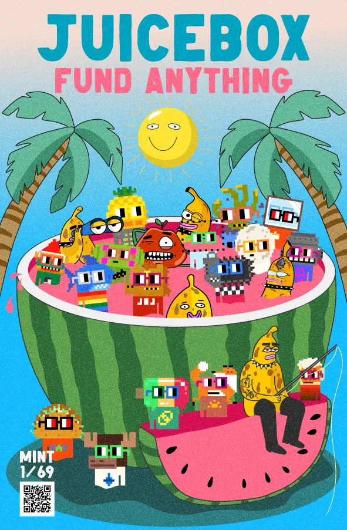

## 路线图介绍  Tjl

Tjl 在周会上做了一个路线图的介绍，这是 Peel 最近拟定的一个工作指引，作为他们努力的方向及审视的标准，从而向着一个统一的目标及愿景进发。

### 产品框架

这份文件的全文可以在[这里](https://grand-popcorn-c81.notion.site/Product-framework-dc8da04f5b7e4197bd27ebbf5fa43e9b)查阅。

从整体角度来看，这份 tjl 拟定的产品框架是基于大家的一连串的研讨会、一些前端分析、链上链下分析以及 Strath 做的用户测试及回访等工作之上的。感谢所有相关人员的努力，这些都是这项工作得以完成的前提条件。

按照这个路线图，我们将通过涓滴效应，从高层次的愿景出发，帮助明天的创建者们启动、募资及管理互联网上最大胆的项目。

我们肩负一个使命来努力实现以下这些数字的目标。即使我们只实现这些目标的 10%，也将是一个巨大的胜利。

部分产品目标：

- 线上最简便的融资渠道；
- 鼓励追梦者启动梦想并获得成功；
- 创造世界上最大的捐款人网络；
- 把捐款人和项目连接在一起；
- 使向项目捐款更简便易行；
- 向企业世界介绍透明融资的好处；
- 打造更值得信任更可靠的 Web3 平台。

我们致力实现的价值有信任、透明、可靠、有趣好玩、社区驱动及定制化控制。

### 产品路线图

- 第 1 阶段：重塑品牌。

   重构 Juicebox 品牌，沟通更广的受众。

- 第 2 阶段：吸引用户。

  这个阶段实现一些不同的功能，诸如引入头像及电子邮件沟通方式。

  感谢 Filipv、Matthew 及 Brileigh 之前在产品推广这个领域做出的贡献。

- 第 3 阶段：扩大垂直营销。

  深入扩展市场深度，捕获新的细分市场。

- 第 4 阶段：优化市场范围

  改善项目展示及发现功能，提升捐款参与度，提升我们的机会。

- 第 5 阶段：提升参与度

  我们目前在用户早期发展阶段的创建项目和融资中发挥了很好的作用。但是，后期还有许多工作可以做，正如 Nance 和其他人正在做的工作一样，来扩展 juicebox.money 在用户早期发展后阶段的参与度。

- 第 6 阶段：支持及服务

  深度引入新的支持服务。

- 第 7 阶段：扩大规模化实验

以上图表中的各项基本与上面的各个阶段相契合，中间设置了一个时间里程碑。我们对这些目标的估计偏保守，因此很有可能这些目标会更早实现。

1. 首先是品牌重构，启动一个测试项目，对网站做一些升级，涵括网站上的一些案例研究。
2. 深入项目页面，改进页面设计，着手用户头像设置。
3. 再回到项目创建流程，扩展功能。
4. 然后再围绕项目可见度增加新的功能：
   - 展示项目进度，支持在项目页面开展讨论；
   - 可以向项目方发消息；
   - 对活动的做出反应；
   - 项目可见度平台；
   - 可以观察项目及订阅项目最新情况；
   - 加强设置
5. 到 6 个月里程碑的时候，我们预期会增加参与度功能，诸如创建提案及投票，项目认证，等等。
6. 之后的阶段主要是围绕可靠性展开，包括平台状态的功能、开发者元素、多元化支付，等等。

当 Filipv 在会上问及我们什么时候会终止 V1 协议支持的时候，Aeolian 解释说，目前终止 V1 支持的主要障碍是实现代币迁移功能，以让 V1 项目把代币迁移到 V3，相信这个功能最近几天就能实现。代币迁移工作完成之后，我们就可以对外公布 V1 协议服务的终止。他同时认为，我们会一直保持对 V1 项目的读取支持，这样大家就能持续访问原 Juicebox 项目及 ConstitutionDAO 项目等。我们可能仅会移除 V1 协议的编辑功能，但如果 V1 项目确实仍需要进行编辑，我们可能会保留某些 V1 项目的支持。

### JB 品牌重塑概要

周会的前一天，来自 WAGMI 工作室和 Peel 的一众贡献者共同开会探讨品牌建议的方案。这是产品路线图中的第一个项目，旨在重塑 Juicebox 品牌的身份辨识，从而获取更多的发展机会。

他们在会议上达成共识并一致同意[品牌重塑概要](https://grand-popcorn-c81.notion.site/JB-branding-brief-d9fa806598354ece8d9c73b8f4c10820)的内容。两周之内，我们将夯实品牌重构的坚实基础。

## 功能报告 Aeolian

1. 封面图。项目目前可以在他们的项目页面顶端加入一个封面图片，如下图。

   这是一个 Matthew 和 Brileigh 做的添加页面封面图片的教程：

<iframe width="560" height="315" src="https://www.youtube.com/embed/DniwX3OQTUQ" title="YouTube video player" frameborder="0" allow="accelerometer; autoplay; clipboard-write; encrypted-media; gyroscope; picture-in-picture; web-share" allowfullscreen></iframe>

2. 项目页面选项卡。项目的各项信息如筹款周期参数，支出等将会整洁地在不同的选项卡中展示，而不是都密集地堆积在同一个区域。
3. ENS 头像。我们将在项目活动记录区域中，在钱包地址的旁边展示这个地址设置的 ENS 头像。
4. 个人页面。我们将会为每个用户设置一个自己的信息页面，展示他们所捐献过或创建过的项目，晚一些更会加上这个用户钱包地址的在 juicebox 生态内的所有活动记录。

5. 目前 Juicebox 已支持使用视频文件来部署 NFT。

    Matthew 和 Brileigh 制作的视频 NFT 的教程：

   <iframe width="560" height="315" src="https://www.youtube.com/embed/bPEus8si2yM" title="YouTube video player" frameborder="0" allow="accelerometer; autoplay; clipboard-write; encrypted-media; gyroscope; picture-in-picture; web-share" allowfullscreen></iframe>

## 新的创建流程变更 Wraeth

我们目前的项目创建流程，筹款目标和支出是两个分开的步骤，要分开设置。但是因为 Juicebox 项目的筹款目标其实就是项目某个筹款周期的支出分配上限，也就等于所有支出之和，因此我们计划把这两个创建步骤整合到一个支出的选项中。

在新设置支出选项，不用再单独设置筹款目标，你只需要在有限、无限和无三个选项中选择合适的一项。

有限筹款目标意思是项目会有一个具体的分配上限，亦即是所有支出金额的总和。

无限筹款目标意味着项目的分配上限没有限额，所有的支出受益人将按百分比来进行分配。

无筹款目标，顾名思义即项目的分配限额为零，项目将不能分配资金。

## STVG 介绍 AgentHQ 的创始人 Bruno

Bruno 是 [AgentHQ](https://agent-hq.io/) 的创始人，他试图打造一个简单有趣的 AI 赋能工具，让非技术人员都可以创建自己的基于不同语言模式的 AI 工具。

AgentHQ 支持用户在浏览器内创建一个 AI 助手，还提供很多的内嵌工具供用户选择，例如文本总结、文本生成、API 对接、API 数据的读取和推送，甚至与用户的邮箱进行关联。

STVG 创建了一个 [AgentHQ Juicebox 项目](https://juicebox.money/@agenthq)并移交给 Bruno，希望能够利用 Juicebox 来进一步支持 AgentHQ 的发展。

## Nouns 漫画书广告页面 Nicholas

ComicsDAO 即将为 Nouns DAO 发行一本实体漫画书，为表示对 JuiceboxDAO 在 ComicsDAO 创建早期的支持和帮助的答谢，他们主动提供这本书中的一个广告页面供 JuiceboxDAO 使用。

经过 Sage 和 Nicholas 的共同努力，我们现在已经完成这个页面的制作，Nicholas 在周会上分享出来，希望得到大家的一些意见反馈。

扫描图像上的二维码将会跳转一个 Juicebox 项目，该项目将会推出用同一个图片制作的限量版 NFT 供大家购买。

Nicholas 认为这个广告页面是一个与 Nouns 社区的受众交流的好机会，还可以互相传播社区文化。同时由于 Nouns 在某些领域与 Juicebox 有重叠，其实两个社区之间是可以互相兼容，共同探索更多的发展机会的。
