## 品牌重塑报告 Strath

过去的数周，我们一在进行关于 Juicebox 品牌的讨论，努力获得更多新用户及在他们中间建立信任。我们得出的结论是，如果我们要发展、与新用户建立信任及吸引更大型的项目，我们需要考虑建立一个与这些用户定位更一致的品牌，让他们觉得这个品牌是顶级且可信赖的。

#### 目标

品牌重塑的目标：沿续现在的创新及独特的基调的同时，为 Juicebox 打造一个全新的外观。使 Juicebox 用起来更简便、更亲切及更得心应手。创造一个强品牌形象及与新用户和垂直渠道之间建立信任。

首要的一个便是可信赖度，因为人们在 Juicebox 上需要交易大量的资金，但同时我们也想为这个体验带来一些乐趣和人性化的元素，特别是通过品牌重塑在保持界面整洁之余，仍保留我们喜欢的肆意妄为的 Juicebox 氛围。

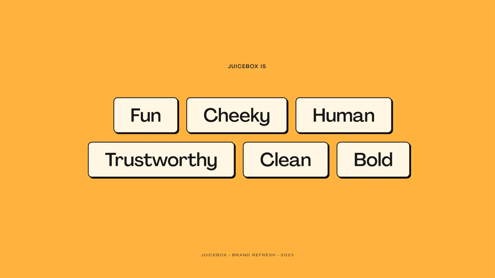

#### 愿景

以下是 Strath 制作的一个情绪板，他将与 WAGMI 工作室联手合作，创作一些插图及真正地带出 Juicebox 的氛围。

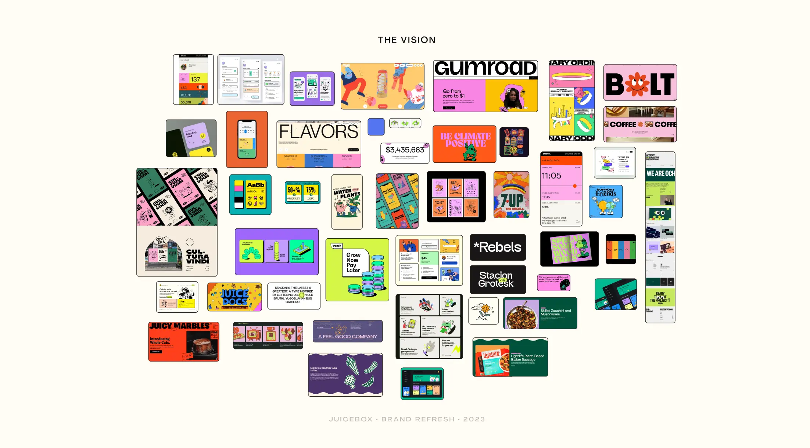

 #### Logo 品牌标识

对于品牌标识，我们在不忘本心的同时，争取给它一个清新、整洁及独特的感觉。

归功于 Sage，我们当前的品牌标识一直以来都发挥很好的作用。改进的标识和原来的区别不大，本质上沿用了现有的设计，并使它更合适缩放、用于不同颜色背景、适配不同的字体等等。我们只是对旧的设计进行小幅度调整，以便用于更多的用例。

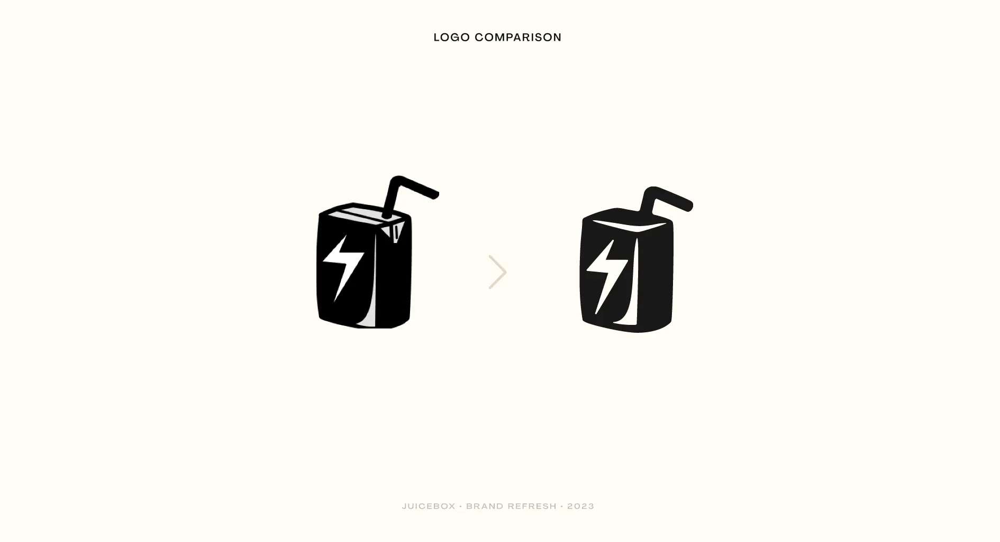

我们目前没有官方的品牌标识组合，我们现在设计的方案是这样的：

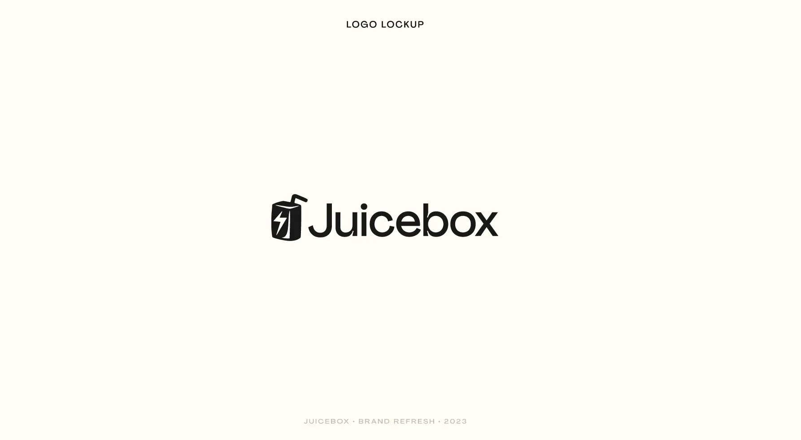

下图是与其他行业品牌标识组合的对比。我们的与其他高科技企业的不相伯仲，但又保留了独特有趣的感觉。

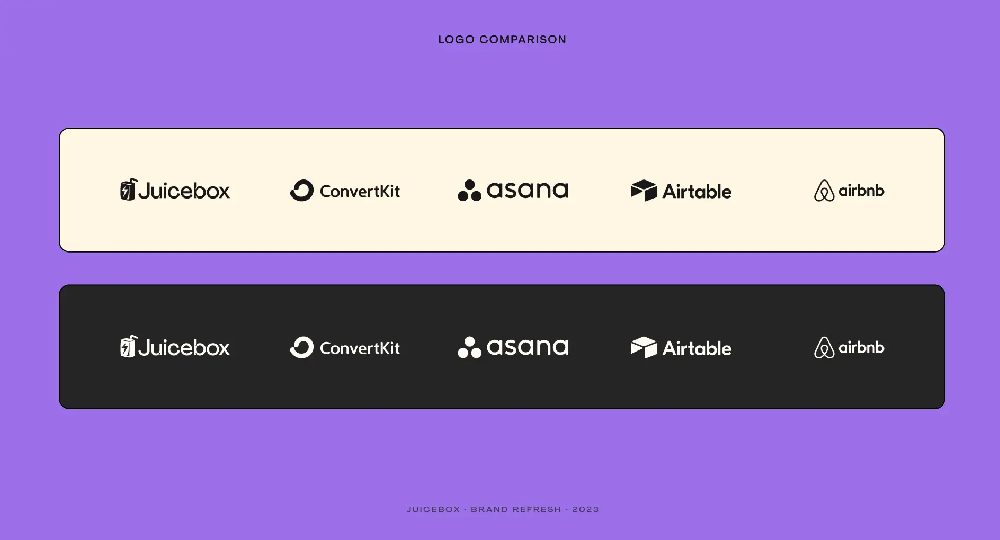

#### 调色盘

这个明显对我们非常重要。Strath 想要选择一些真正适合 Juicebox 的，令人想起热带丛林和美好时光的场景。新的 Juicebox 调色板在建立信任及提升辨识度的同时，还能表现出我们欢乐的本性。

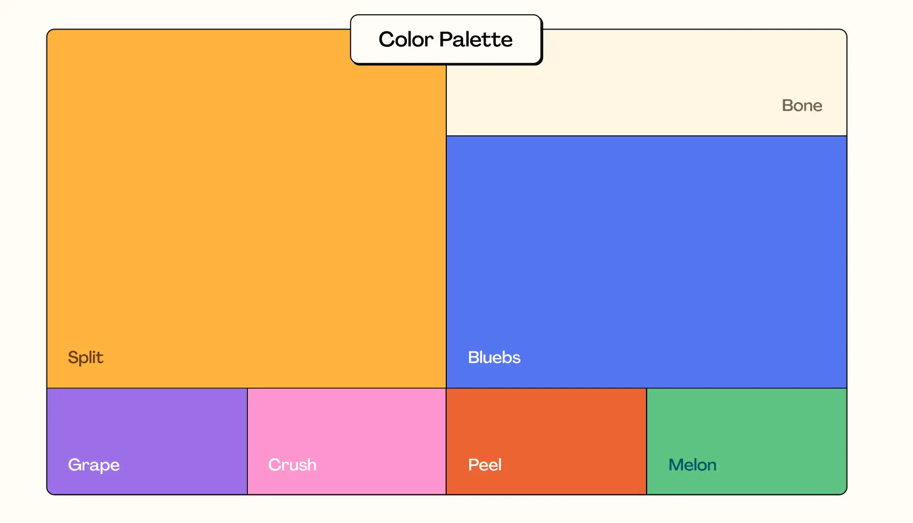

#### 字体设计

关于这个话题有很多的争议。要停止使用我们沿用至今的 DM Mono 字体，无疑是一个很大的变化。但是时候我们要转换一个字体了。

Agrandir 是一款现代的无衬线字体，主张不完美带来的美感。它的设计理念是敢于作为中性现代主义字体的一个对立面。Agrandir 接受自己的形状，不对齐、古怪且时尚。它赞美人性，而不是机器。

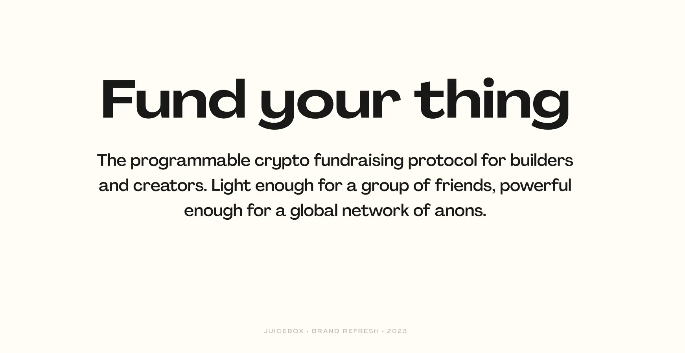

#### 图形设计

这是另一个我们做品牌重塑时一定会涉及的工作。我们的图标需要有趣、俏皮及有现代感，为用户界面带来活动。这个转变相当容易，但效果会很明显。

在 Strath 做过了很多用户调查里，人们都说他们希望看到更多视觉上的表现，因为 Juicebox 上需要阅读的内容和复杂的术语已经足够多了。他认为我们可以通过图标与插图相结合，真正让我们的内容资源更生动更易用。

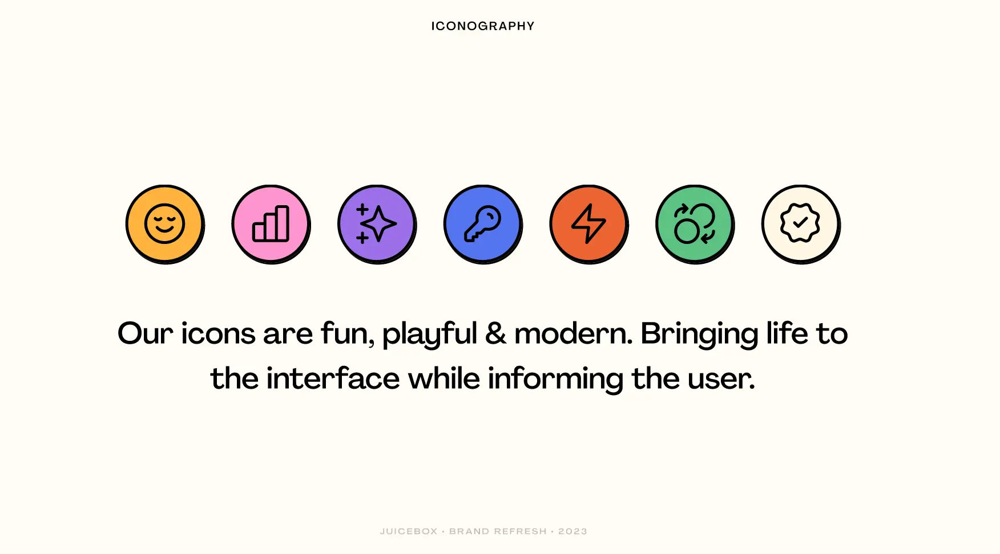

#### 插图

在 Sage 的帮助下，我们将会继续使用以前那种风格的插图，但会带来更多一点有趣、好玩和时尚的氛围。加入一些水果或者其他 Web3 Juicebox 相关的元素，效果会更好。

在这个领域我们可以创造其他人无法复制的独特身份。

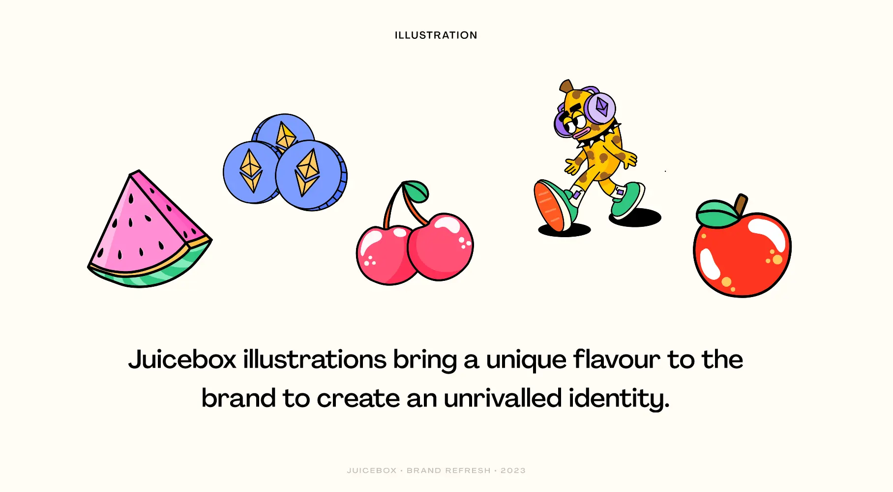

#### 用户界面

这可能是一个每个人都会问到的问题。我们重新构建的界面是什么样的？

我们真正需要做的是，让体验变得更加有趣和好玩，但仍然真正能吸引用户参与一些最主要的活动。

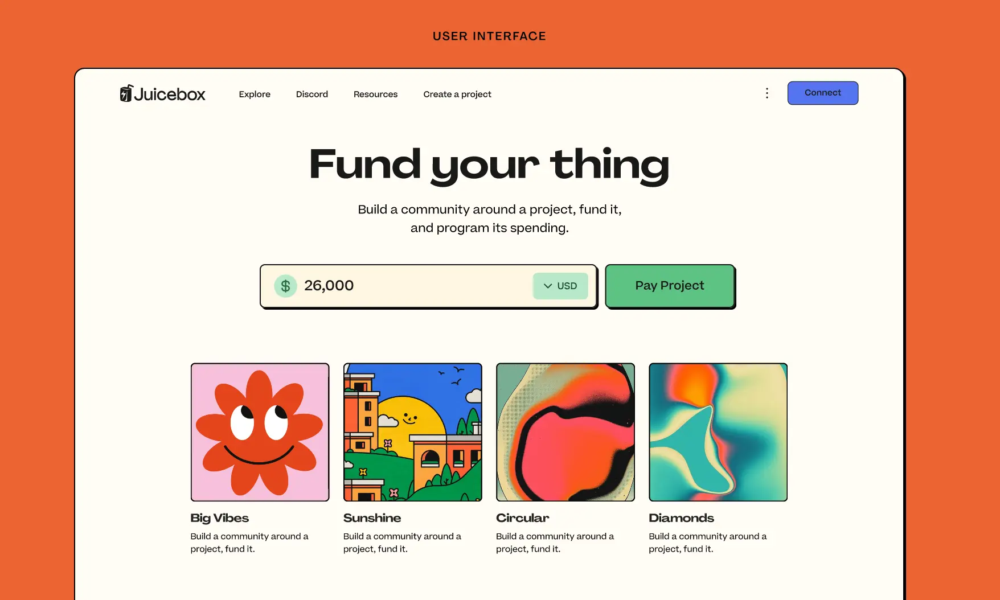

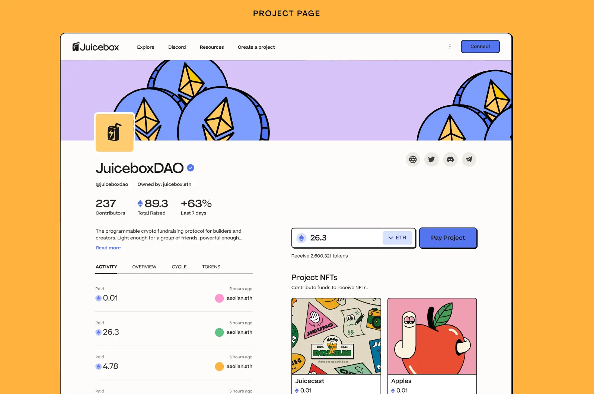

#### 时间线

品牌重塑将分阶段推出。 我们将有一个非常具体的计划来说明我们将如何分阶段进行品牌推广、更新字体、推出新颜色，然后从慢慢开始重新设计一些 UI 元素。 我们将无缝切换到重塑后的品牌。

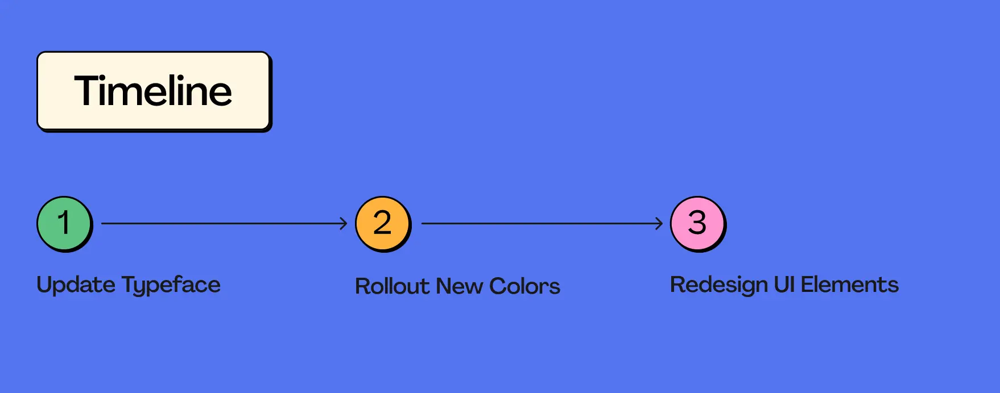

### 演示后的讨论

**Jango**: 非常棒。这里包含了大量的工作，非常感谢你们最近一段时间把这些工作整合到一起。

**Strath**: 谢谢。 虽然看起来只是一些新的颜色和东西，但提出这些想法并对其进行完善需要做大量的调查研究和工作。 这些也不仅仅是一些随意的选择，而是非常有目的性的选择，帮助我们向着这个方向发展。

也要感谢 Tjl，他针对我们的发展方向和定位提出了很多具有洞察力的意见，真是帮助很大。还要感谢 Sage 和 WAGMI 团队营造的氛围。

**Jango**: 对我而言，真正发挥作用的是 WAGMI 的那些定制化的插图，定义了我们的竞争点并保持这个方向，这就是这些插图在我们网站上发挥的作用。 我相信 WAGMI 能够提供一些插图来很好地契合目前这种新的审美。 它将继续发挥积极的作用来为网站的使用定调。

最后我还要提一个整体层面的反馈意见。目前 juicebox.money 在某种意义上介乎于更面向开发者的单调审美和目前这个新版本更多倾向于好玩有趣的审美之间做一个取舍。

看着你们继续把 JBX 推向这个方向，有点朝圣者尴尬的感受。我觉得很有必要全力去探索这个方向的意义，我也相信有很多用户对这个改进感到认同。但这样一来，可能需要另一个客户端或其他形式的审美去迎合类似开发者社区的需要。这样完全是没问题的。

我觉得两种形式都可以，甚至说应该，同时存在。但在同一界面同时实现两种形式不太现实，所以我们集中精力实现这个新的，做一次尝试。

但我也想确认另外那种更机器、更单调及更直截了当的形式，仍然是有效的，可能在将来某个时候获得一定的认同。那样的话真的会非常非常酷。我认为两种形式可以互相借鉴，同时又迎合特定的受众、特定的工具集等等。但从项目方和付款人的角度来说，目前这个新的形式确实很令人兴奋。

**Strath**: 说得没错。当然可以有更迎合开发者的做法，但我觉得在我们继续发展壮大的情况下，提供一个能让两个不同受众都接受并喜欢的选择，是至关重要的。

**Peri**: 谢谢，Strath。这个展示内容花费了很多的精力，而且看起来也很棒。谢谢你做的详尽展示，以及对所有内容的详细解释。在这里我同意 Jango 的观点，我认为目前针对我们想要改进的内容来做优化绝对是有意义的。我认为你们所做的所有工作，将会令那些因为各种原因觉得现在的网站不好用或者不适合他们的人大大改观。这对那些人是非常有帮助的。

如果日后有一个版本的 UI 更偏向于开发者喜好的话，我是完全支持的。但我很赞同我们目前的侧重点选择，我认为我们将会取得很好的发展。

## Juicecast 播客新节目 Ticket to Space   Matthew and Brileigh

Matthew 和 Brileigh 刚刚发布了关于 MoonDAO 的 Ticket to Space 纪录片的新一期播客节目。

<iframe width="560" height="315" src="https://www.youtube.com/embed/OWt_zWWoFz8" title="YouTube video player" frameborder="0" allow="accelerometer; autoplay; clipboard-write; encrypted-media; gyroscope; picture-in-picture; web-share" allowfullscreen></iframe>

MoonDAO 去年举行了一场比赛，随机抽取 Ticket to Space 免费 NFT 的持有人，胜出的人将乘坐蓝色起源号飞船前往太空。 来自北京的一位 MoonDAO 成员赢得了这个机会，他将被送入太空。 MoonDAO 计划拍摄一部关于这位获胜者整个旅程的纪录片，这部电影将通过 StudioDAO 制作。

Matthew 和 Brileigh 最近与来自 StudioDAO 的 Kenny 和 Rachel，以及两位电影制作人 Susie 和 Fernando，还有 MoonDAO 的创始人之一 Pablo 进行了对话。 他们围绕这部有史以来第一部关于 DAO 的纪录片 Ticket to Space 开展了一次圆桌讨论。

此外，StudioDAO 将启动一个 Juicebox 项目来支持这项工作，人们将可以通过购买 Ticket to Space 的 NFT来支持这部纪录片的制作。

## Krause House 项目的介绍 Nicholas

[Krause House 50pt Game Charity Bounty](https://juicebox.money/v2/p/436) 是 Acidicsantana 创建的一个 Juicebox 项目。 这个项目发起众筹并计划把项目众筹的资金交给单场得分超过50分的NBA球员来支配。 符合条件的球员按照项目详情中的要求与项目进行互动，就可以解锁这个 Juicebox 金库中的资金并发送到他指定的慈善机构。

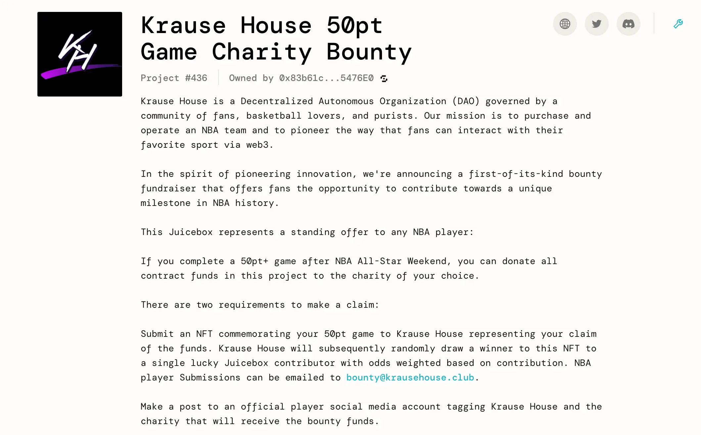

Nicholas 对整体机制非常感兴趣，他认为有几点值得为未来的项目借鉴。

首先，这里一个赏金项目。大家通过众筹来募集赏金，预先设定明确的目标，并在项目描述里明确项目的机制。 Nicholas 认为，对于构建项目或帮助人们构建项目的人来说，应该像这个项目一样从 Kickstarter 的传统筹款活动中获得更多灵感。

但更重要的是，当项目实现筹款目的的时候，会解锁其他功能，例如把 NFT 奖励给随机抽取的捐款人。这种模式更接近 Kickstarter 真正成功的模式，即为捐赠者带来好处。

Nicholas 还认为，通过金库累积的资金来解锁其他功能或行动，也可以激励人们的捐赠和参与。 以这个项目为例，一个共同爱好者团体募集款项，直到他们的资金足够吸引到更具影响力的人的注意并跟他们进行互动。

这个项目的一些元素值得在以后项目学习参考。 他鼓励大家认真研究一下这个项目。

## 路线图流程报告  Tjl

Tjl 上周在我们的周会上展示了 Peel 和 juicebox.money 的路线图。

他认为 Peel 正在努力以分项目制的工作方式来逐步实现路线图的计划，并通过类似今天的品牌重塑展示的方式来及时通报每个阶段工作的进展情况。

他们规划的路线图目前在 Linear 进行实时更新，任何想关注这个工作进程的人都可以申请登录权限。WAGMI 团队、Brileigh 和 Matthew 等贡献者将会共同制作一些推广内容，向最终用户和社区成员提供路线图进展的最新信息，从而与他们建立更深层次的联系。

