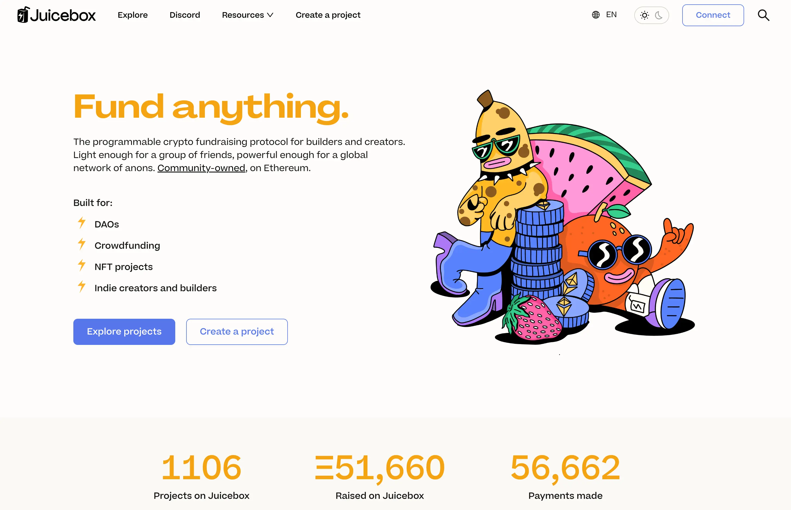

## Peel 工作报告 by Tjl

### 品牌重塑及网站更新

Peel 团队最近一直在与 WAGMI Studios 合作，进行品牌重塑的项目。今天他们完成新品牌的设计并在我们的网站上进行更新。

感谢 Strath 主导这个项目，Sage 精彩的插图，还有其他团队成员，尤其是 JohnnyD 和 Aeolian，他们全都做了很了不起的工作。这是团队的一个巨大的努力成果。两周前我们还在讨论这个工作方向，两周后团队就成功确定方向、与 WAGMI 工作室展开合作、进行整个品牌的更新、通过 DAO 的批准并最终在我们的网站上发布出来。

我们希望能够从社区获得关于这个新的品牌重塑的意见及反馈。

不单止网站主页，整个应用的各个页面，如果创建流程、项目发现及项目页面等等都进行了更新。

### 待发布的功能

他们不但在网站上发布了品牌重塑的成果，同时还一直在致力于开发其实即将发布的新功能。

- Wraeth 做的用户个人页面设置、钱包身份验证和电子邮件引擎。 他还成功把用户的个人资料页面跟他们的钱包连接起来。 目前，用户可以连接他们的钱包，然后彻底个性化个人资料。用户可以添加他们的电子邮件地址，这些邮件地址将在以后用于启动一些基于产品的营销工作。
- 项目标签。 这是 Peri 最近一直在开发的一个功能，使我们可以按不同类型，例如艺术、NFT、游戏等来标记项目。
- 排行榜和公告通知。 也是 Peri 开发的新功能。 排行榜会在主页底部区域进行展示，而公告则会在主页右上角发布通知和消息，让用户对我们生态系统的新情况能够及时了解。
- Aeolian 做的对 JBController3.1 和 JBETHPaymentTerminal3.1 的前端支持。 Multisig 签署交易批准迁移这些组件后，这些新版本合约的前端支持就进入测试阶段，相信很快会准备就绪。 同样由于这次升级，在我们合约开发团队的努力下，在 Juicebox 协议中部署 NFT 的 gas 费用将大幅降低。

## L2 工作报告 by Jango

过去的一段时间，以太坊出现很多次超高的 gas 费用，这种时候 Juicebox 协议的使用成本就会非常高，这是我们一直都知道的事实，也是在以太坊主网部署的弊端。

正如我们正在摸索怎样在主网上运营各种组织的金库一样，从某种意义上说，在过去几年中，我们一直就不同的链上独立的金库和会员资格这个问题不断进行讨论。。 最近我们在 Discord 协议频道的 #Juice Distributor 讨论组内展开这个问题的讨论。

下一阶段，我们将尝试在 L2 网络上运行一个新的金库，试验一些不同的东西，并尝试采取新的策略，避免给 Juicebox 或正在这个金库上运行的组织带来额外的负担。

在过去的一段时间里，我们注意到在核心金库上进行版本控制和迁移工作所需要付出的代价。 即使 JuiceboxDAO 在不久的将来可能会希望采用扩展到其他 L2，通过运行一个单独的资金库来降低风险是有意义的，这个金库设置自己的激励结构，通过常规的 Juicebox 金库组件与 JuiceboxDAO 进行关联。

Jango 写了一篇[博文](https://jango.eth.limo/03EDF541-0137-45F7-834B-B346DD0CEBD5/) 总结了他在最近的讨论中对这一问题的一连串想法。 目前还没有太多的具体细节，但他希望接下来能够更定期地进行分享。

## 令牌解析器预览 by Nicholas

Juicebox 协议中的项目新的令牌解析器大致是这个样式。

如果项目方想尝试自定义项目的令牌解析器的主题，他们可以使用[默认令牌解析器合约](https://goerli.etherscan.io/address/0x280dd5911677ADcA9411936F0EEA97510284f4a6#readContract)，或从[这个 etherfunk 界面](https://goerli.etherfunk.io/address/0x280dd5911677ADcA9411936F0EEA97510284f4a6?fn=setTheme&args=%5B%22340%22%2C%22FF6B93%22%2C%22FFB3C7%22%2C%22FFB3D&run=21%5) 只需输入项目 ID 和相关的 HEX 颜色，这样会更方便。

如果人们想要设置自己的图像格式，他们还可以转到 [令牌解析器合约](https://goerli.etherscan.io/address/0xd32Bbb759246FCFbe1cB17f8730051dd7e006D7c#readContract)，类似一个主注册表合约。 项目所有者可以设置自己的令牌解析器，可能需要编写一些 Solidity 代码，解析器将使用他们想要的任何合约来生成图像。

这个机制很好，因为令牌解析器合约指向默认令牌解析器合约，在这种情况下，我们将能够更改默认解析器的外观，添加元数据或改进其他细节，而无需覆盖由项目方自己设置的令牌解析器。

这个功能已在 Goerli 测试网上部署，等[延长多签设置令牌解析器权限的提案](https://www.jbdao.org/p/356)通过后，将会在主网进行部署。

## ComicsDAO x Juicebox Art Reveal by Nicholas, Sage and Gogo

以下是在 WAGMI Studios 和 Nicholas 的努力下创作的图片。 我们将提交给 ComicsDAO 并印刷在 Nouns DAO 的第一版漫画书内。

通过底部的二维码，人们可以去到一个 Juicebox 项目，并在那里铸造这幅图的限量版 NFT。NFT 销售的收益将分配给 WAGMI Studios（50%）、ComicsDAO（25%）和 JuiceboxDAO（25%），这也是展示 Juicebox 协议分发机制的好方法。

这件作品经历了很多次修改，他们一致同意，应该尝试创造一些 Sage Kellyn 艺术风格，通过一个有趣的场景将 Juicebox 和 Nouns 社区聚集在一起。 NIchilas 认为我们在制作更复杂的插图的创作过程中学到了很多，希望其中的一些经验可以应用到未来的项目中。

在决定将哪些 Nouns 角色画到作品的时候，Nicholas 建议选择了在社交媒体或 Twitter 上比较活跃且相对较有影响力的人所拥有的 Nouns，这样他们更容易在情感上对这幅作品产生共鸣。

## SongADay 项目 by Nicholas

在 Nicholas 的要求之下， [Jonathan Mann](https://twitter.com/songadaymann) 亦每日创作一首歌的作者，为 Juicebox 创作了一首歌曲。

<iframe width="560" height="315" src="https://www.youtube.com/embed/uPIEcjbttWo" title="YouTube video player" frameborder="0" allow="accelerometer; autoplay; clipboard-write; encrypted-media; gyroscope; picture-in-picture; web-share" allowfullscreen></iframe>

与他制作的所有其他歌曲一样，这首歌在 SongADAO 网站上作为 NFT 进行[拍卖](https://songaday.world/auction/5181/)。 Nicholas 创建了 [一个 Juicebox 项目](https://juicebox.money/v2/p/455) 进行众筹，使用筹集的资金成功拍得这个 NFT，并将其发送到 JuiceboxDAO 的多重钱包内。

Nicholas 还认为独立音乐家通过拍卖集资来运营他的 NFT DAO 平台这个方式非常有意思，他们使用的机制也可能会为其他 Juicebox 项目带来启发。

