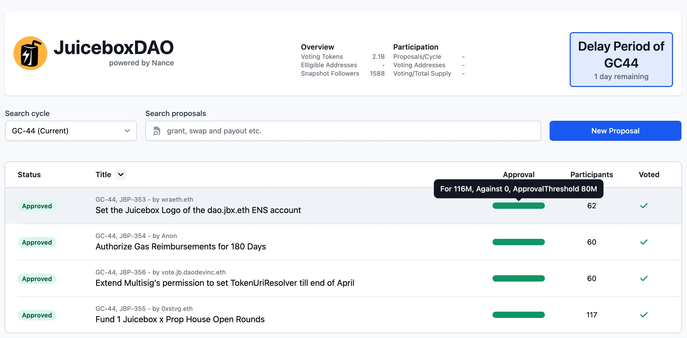
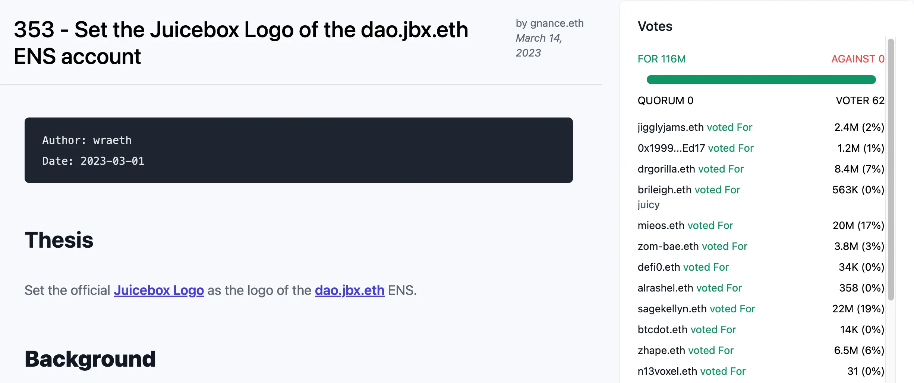
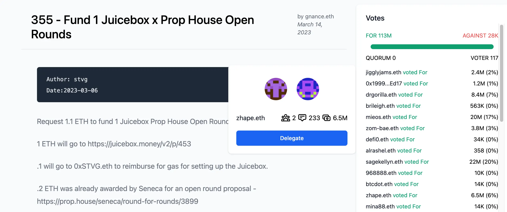
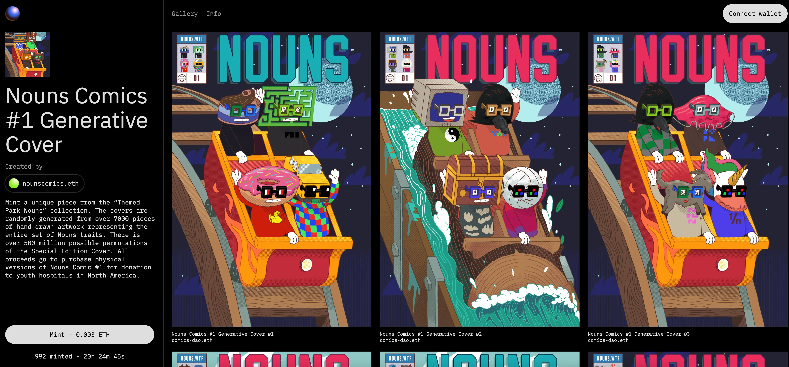
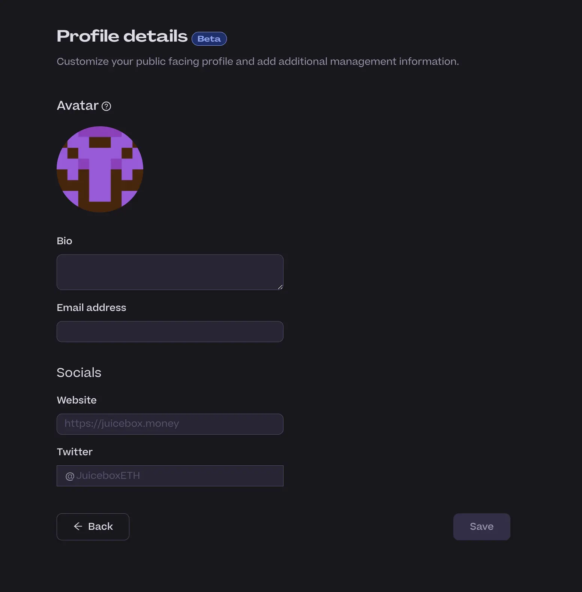
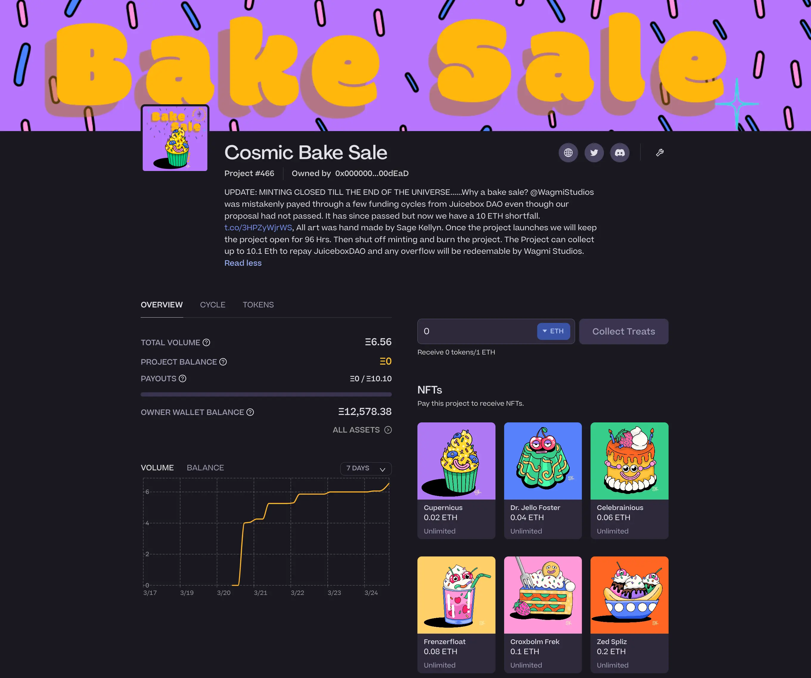

## Jbdao.org 工作报告 by Twodam

在周会上，Twodam 展示了最近他与 Jigglyjams 对 jbdao.org 做的一些改进，我们最近在这个网站上开展 Snapshot 投票。

- 新的 UI 设计，页面上配置了更多图像；
- 通过一个投票进度条来展示投票的状态；

- 提案可以按多项不同属性进行排序，如状态、标题、参与人数等；
- 实现了提案的短链接，如：https://www.jbdao.org/p/353；
- 以及展示投票情况的边栏（如下）；

- 鼠标悬停在投票人地址会展示投票人信息，如委托投票状态、投票历史及投票权重等，同时也支持投票委托的方便操作。

## Juicy 报销工具 by Filipviz

目前，DAO 贡献者部署 Juicebox 合约、分发 JuiceboxDAO 的支出以及分配保留 JBX 代币的时候，都要先个人承担发起这些交易产生的 gas 费用，然后再通过个人提案来向 DAO 来报销这些费用。

Filipviz 最近发起了一个[提案](https://www.jbdao.org/p/354)授权多签来报销这些费用，提案已经获得 DAO 的批准。但是如果要逐一翻查交易记录和执行交易的地址，并整理报销的具体明细再手动排队交易上链，将会是一项非常烦琐及累人的工作。

于是他开发了一个名为 Juicy 报销工具的 Node.js 应用，帮助简化这项工作。通过这个工具，使用者指定一个 Gnosis Safe 多签或任意 Juicebox 项目并划定时间范围，就可以抓取所有相关的交易并生成两个文件。一个为用于 Gnosis Safe 交易创建器专用的 JSON 文件，另一个为普通的 CSV 文档。用户可以使用这两个文件来通过 Gnosis Safe 或类似 [Disperse](https://disperse.app/) 这样的应用来执行报销 gas 费用的交易。

在周会上，Filipviz 展示了怎样用 Juicy 报销工具来生成文件，然后再用 JSON 文件来在 Gnosis Safe 多签上排队交易。

## EduDAO 介绍 by Felixander

Felixander 在周会上分享他关于一个 EduDAO 的想法和计划，并希望可以在治理模式上得到我们社区的一些意见反馈。

项目的概念是要最终创建一个学校的网络，共享开源的区块链知识课程内容，并允许所有人创办自己的学校及利用这些课程。这个项目同时也在探索如何对当前的教育系统和资质认证系统进行变革，Felixander 认为这些都已经失效。

按 Felixander 的说法，要实现这一概念的目标，要经过三个阶段。

1. 首先在公立学校设立科技实验室。这一步 Felixander 已经与全美第二大校区洛杉矶的某些学校达成协议。这些科技实验室旨在进行科技和创新方面的教育。
2. 下一阶段是创办一些课后培训项目。
3. 最后一步就是发展成为一个全面的学校。

Felixander 预计如果资金及支持到位，这三个阶段有望在一年半到两年期间完成。

他同时认为，最好 EduDAO 不要直接管理或参与资金的管理，DAO 集中于课程的开发和展示上面。同时他正在设计一个代币模型，让在 DAO 内付出更多努力的教育者们可以获得更多的决策权限。

至于 EduDAO 的目标，尽管他目前已经覆盖幼儿园至 8 年级阶段，但最终的计划是要从幼儿园覆盖到 12 年级的全面教育系统。他同时在周会中举例说明通过这个系统的教育，8 年级的学生应该达到一个什么程度的水平。

STVG 目前也在与 GeniiDAO 合作开展类似的工作，并计划在 Juicebox 上创建一个项目。他们正在讨论学校脱钩及开源课程资源等方面的想法。他提出或许可以和 Felixander 一起分享思路及共同合作。

## ComicsDAO 工作报告 by Gogo

ComicsDAO 正在为 NounsDAO 出版一本实体漫画书，他们最近开始了一个[Nouns 第 1 期漫画生成封面的 NFT 开放式铸造](https://zora.co/collections/0xf3d27d5143c92b5b2618ab46db1b7666350353b7)活动，销售所得将用于购买实体漫画书并捐赠给北美的儿童医院。

## Peel 工作报告 by Peel 团队

Peel 上周实现的品牌重塑，目前获得了社区正面的响应，同时也看到网站流量的轻微提升。

### 项目标记 by Peri

我们正为项目增加一个新的数据结构，让项目方可以从 10 个不同的预设标记里选择 3 个来标记自己的项目。这样相信可以打开 Juicebox 项目的可探索性。

目前，我们的 “探索项目” 页面的搜索功能还比较简单，只支持项目句柄的搜索。我们最近用 Sopana 重整了搜索的功能，令搜索体验大大得到提高，尤其是我们现在增加了项目标记的支持。

我们将可以在整个应用按类别来突出展示不同的项目，让在 Juicebox 上创建项目的人可以更容易向潜在的支持者展示自己的项目。

### 个人资料页面及事件通知 by Wraeth

上周我们发布了支持编辑用户个人资料的功能，大家现在可以在个人页面添加头像、个人简介、推特账号、网址等等。

我们下一步将要整合的功能是在用户的邮件地址和钱包地址之间形成联系。这一功能计划在下周推出，将支持项目的事件通知，这样一来，如果某人向一个项目付款，那么将来这个项目发生“支付事件”时就可以收到邮件通知。

### JBM 的前端支持 by Aeolian

新的项目将会用 JB3.1合约进行创建，NFT 的部署也会用到新的 NFT 合约，这个合约同时支持按 NFT 系列进行分类以及收取 NFT 版税，后两个功能目前还没有在 juicebox.money 的前端页面展示出来。

同时，Aeolian 也将与合约开发团队及其他贡献者一起合作，推进代币迁移流程的工作，使我们最终能够把 V1 JBX 迁移到 V3 JBX。

## WAGMI 烘培销售 by Mieos

二月初的时候，WAGMI 工作室更新他们的长期报酬提案时，没获得 DAO 的通过。尽管他们之后再次提案获得了批准，但在这一期间，由于记账的错误，DAO 向他们多发了两个周期的报酬。

他们计划筹款来退还给 DAO，同时也进行 Sage Kellyn 的全新作品的开放式 NFT 铸造试验，因此他们创建了一个叫 [Cosmic Bake Sale](https://juicebox.money/v2/p/466) 的 Juicebox 项目。

