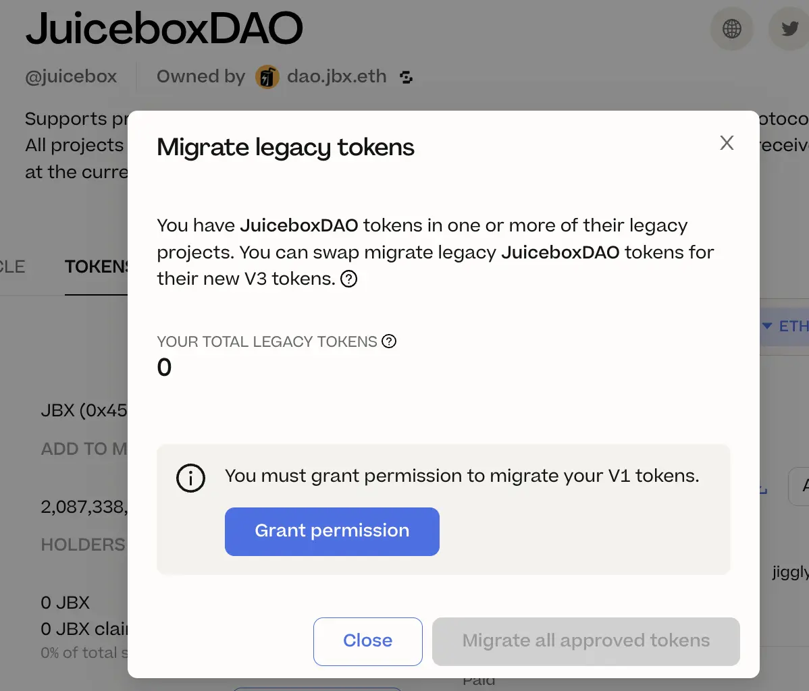
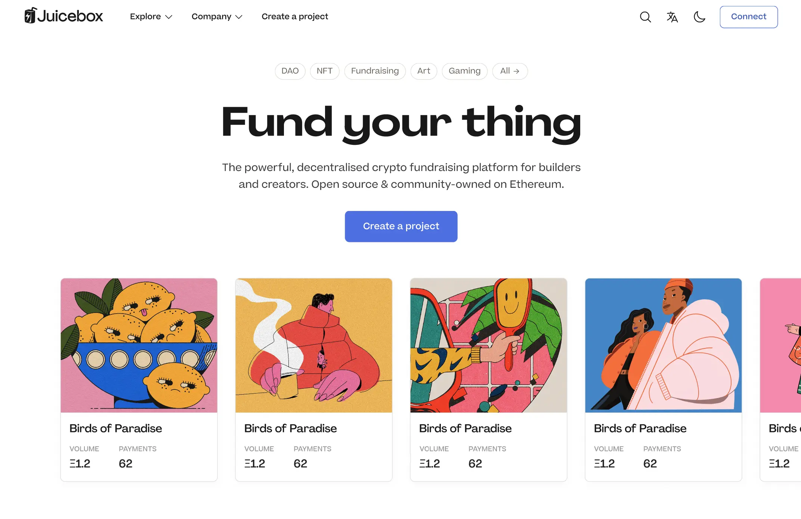
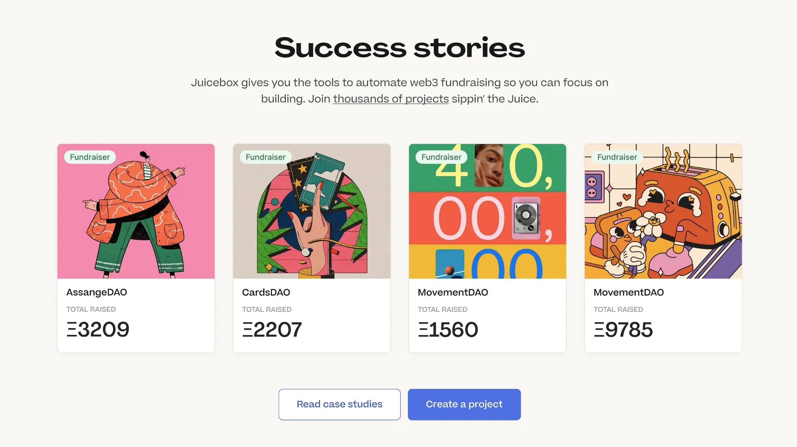
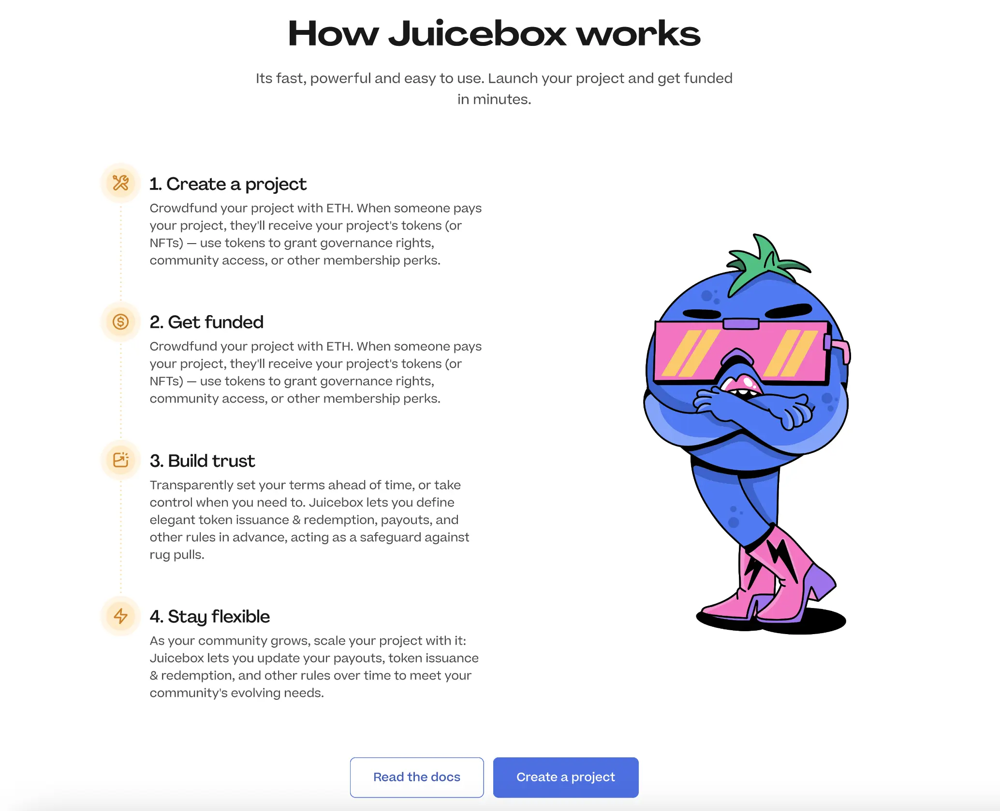
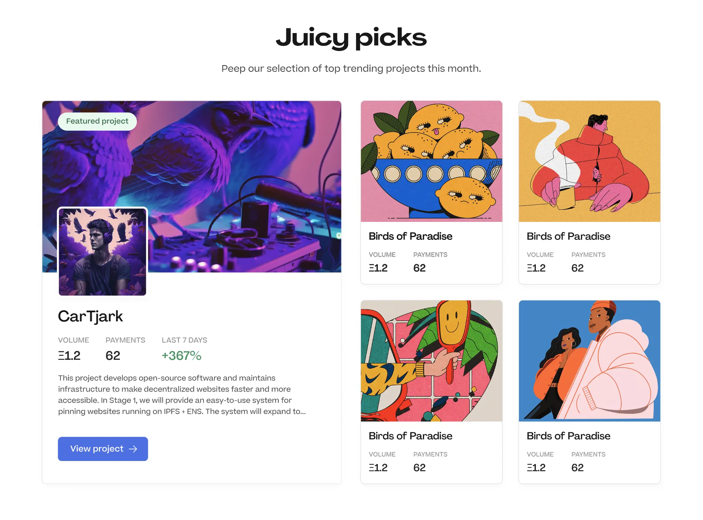
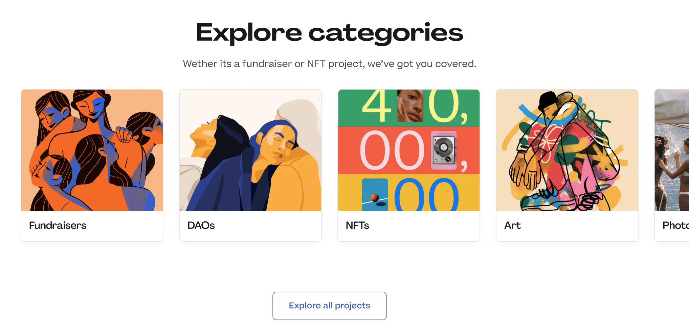
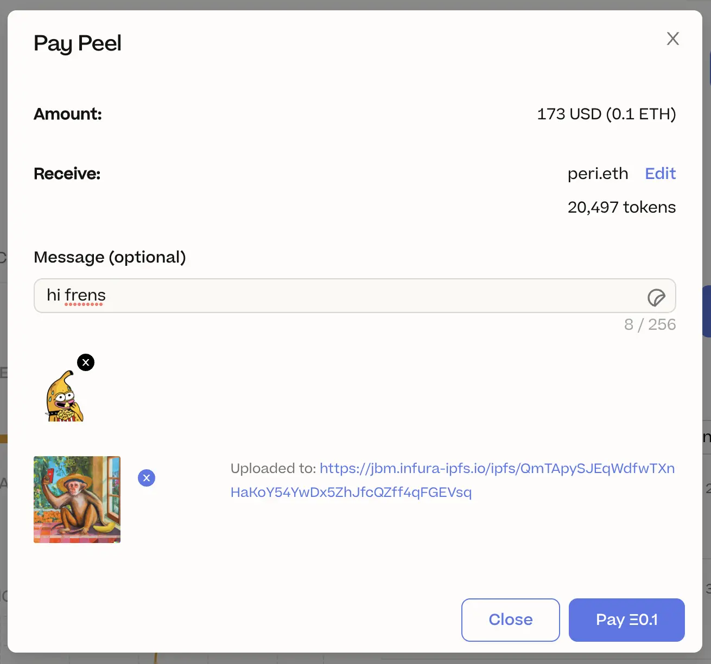
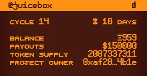
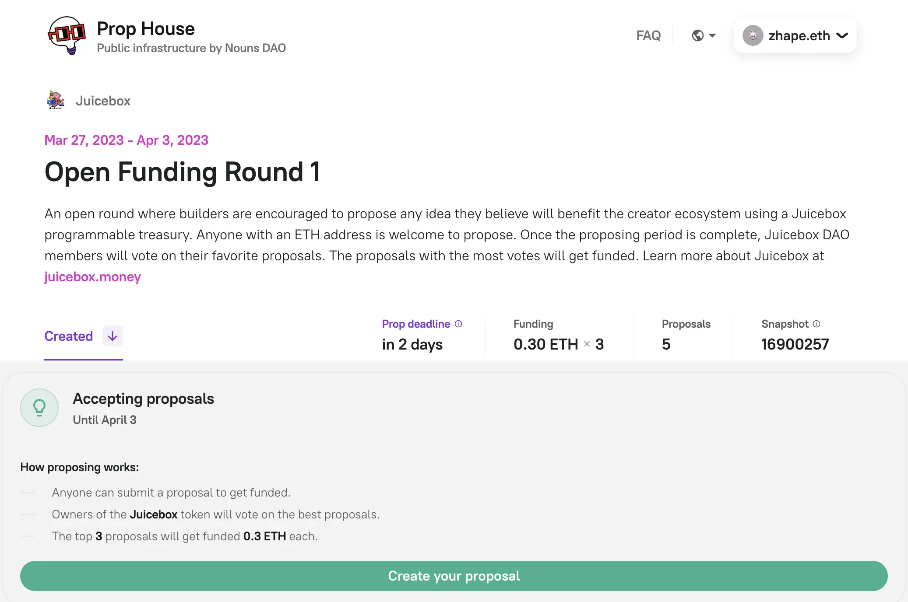
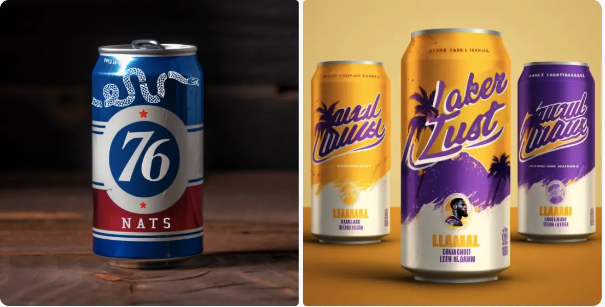

## JBX V3 迁移 by Jango

JBX V3 的迁移已经接近准备完成。Jango 已将他持有的部分代币用于各种测试。

我们正在为迁移准备一个非常简洁和安全的用户体验。下周我们将会有通报更多的细节和迁移代币的详细指引。 我们为版本控制工作付出了很大的努力，同时非常感谢 Aeolian 在相关前端工作做出的巨大贡献。

## Peel 工作报告

### 初步主页设计 by Strath

Peel 正在致力于加强 juicebox.money 主页的功能，更偏重于项目创建者的支持，以及使用户更容易发现不同类别的相关项目。

他们重新设计了主导航栏，把它减少到三个大类，再从中指向细分的类别，更加重视 “创建项目” 功能，并在右侧简化了选项。

Peri 开发的项目标签将在主页右上角显著地展示出来，大大加强相关项目的可发现性。

在中间区域，他们加入了项目选项卡来展示热门的项目。

他们同时计划推出一个 ”成功项目“ 的区块来展示一些早期项目的安全研究。这一区域旨在提供一些项目的成功之处，而不是单纯转到这些项目的页面。Peel 可能会把 Filipviz 做的一些成功案例使用在这里。

还有文档的区域：

除此之外，他们还计划引入一个全新名为 “果汁精选” 的区块，介绍每个月由社区在 Discord 投票选举出来的流行项目。投票结果将通过一个独一无二的 ”果汁精选“ 的项目标签在网站上展示。

最后，我们将增设通过不同类别来探索项目的区块。

### 邮件通知 by Wraeth

目前用户可以编辑他们的个人资料来添加自我介绍、邮件地址、推特帐号，等等。

- 用户如果在个人资料内添加了邮件地址的话，如果他们在 Juicebox 内进行付款，将会收到交易收据的邮件。

- 用户还可以订阅某些项目，如果项目发生任何活动，如收到付款等，他们将可以通过登记的邮件地址接收到项目这些活动的邮件通知。

### 代币迁移 by Aeolian

在我们开始迁移代币之前，还有一些最后的步骤需要完善，不过目前工作流程只剩最后的 5% 了。

下周我们将推荐清晰的文本及视频教程来协助迁移。我们相信将会很快完成所有的版本控制工作。

### 支付模块 by Peri

Peri 目前正在改进支付模块，也就是大家准备向项目付款时弹出的窗口。

### 后续项目 by Tjl

Peel 团队目前正在完成网站几个页面的更新工作，包括主页、介绍页面以及 DAO 的页面。他们计划在下一周推出这些更新。

除了这些更新，他们还将重整项目页面，以便更好满足捐款人和项目创建人的需要。他们将全面重新考虑页面的设计来展示更多相关的资讯并吸引更多的捐款。

## 代币解析器 by Nicholas

代表 Juicebox 上面项目的所有权的项目 NFT 之前是没有元数据的一个空代币。Nicholas 最近开发了一个代币 URI 的解析器来为 Juicebox 的项目 NFT 提供动态及定制化的元数据。

这个代币解析器具有几个功能，包括通过一个链上生成的 SVG 来查看项目的实时情况、自定义项目 NFT 的颜色，甚至可以用一个定制的元数据解析合约来代替默认的解析器设置等。

要了解更多这个代币解析器工作原理的信息，可以在[这里]((https://docs.juicebox.money/dev/api/extensions/juice-token-resolver/))查看相关的介绍文档。

## StudioDAO 工作报告 by Kenbot

StudioDAO 计划通过 StudioDAO Backlot LLC 来和 Ticket to Space LLC 来签署合同，来确定投资的关系以及 DAO 和 Backlot 的下游收入来源。

与此同时，Ticket to Space 的影片的拍摄已于近期开始，导演 Fernando 和 MoonDAO 的创始人之一 Pablo 参加了一个 Blue Origin 的活动。在活动上，他们拍摄了一些幕后素材，并采访了几个高管关于他们对于送一个中国人乘坐 Blue Origin 飞船进入太空的看法。

## Prop House Juicebox 公开资助轮 by STVG

STVG 在 Prop House 上启动了一个 Juicebox 的公开资助轮，任何人只要有使用 Juicebox 的可编程多为来推动创作者生态的想法，都可以参加提案。提案截止之后，将由 JBX 持有人来对这些提案进行投票，前三名的获胜都将分别获得 0.3 ETH 的资金支持。

## Defifa 工作报告 by Jango

Defifa 团队计划将于 4 月中启动一个 NBA 季后赛的一个活动，并同时推出活动的创建流程，让所有人都可以设计并创建自己的锦标赛赛事。Mieos 和 Sage 正在为这个 NBA 比赛构思点子，其中就包括用不同的罐装饮料来代表每个 NBA 队伍的想法。

