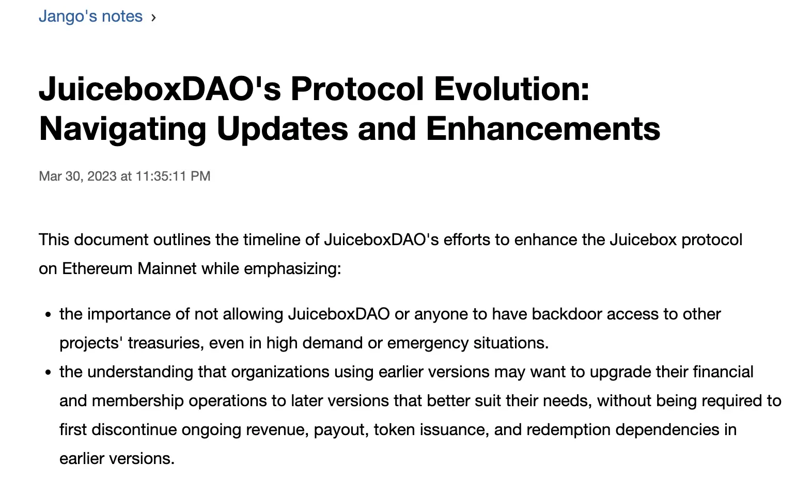

## Peel 工作报告

### 网站更新介绍 by Strath

这个项目，包括重新设计主页，然后创建一些支持页面，如“关于我们”，及创建一些案例研究、活动动态等等。

项目的目的是使项目页面更加实用，突出项目创建者，突出项目本身，促进捐款及项目的可信度，让用户登陆我们页面时感觉更加清晰明确，从而让我们的协议增加一些不同的竞争价值。

#### 主要区域

在这个设计版本中，热门项目被提升到主要区域的位置。我们即将实现项目标签，并将其作为主页的子标题引入页面，这样当用户登陆页面时，可以看到不同类别的项目并点击进一步了解。这样做还可以令空间简洁，并且只设置一个用户行为转化，应该会对促进项目创建非常有效。

- 主要区域讨论

Jango 认为目前的主要难点似乎是人物角色、艺术和风格，因此在主要区域将 Banny 移除似乎是一种利弊的取舍。

Strath 最初犹豫是否要从主要区域移除 Banny，因为新的主要插图非常好看，但他们更倾向于功能性的主页多于美学和功能性的平衡。Strath 认为功能性才是真正驱动人们使用我们协议的主要因素，特别是通过将热门项目放在显眼的位置，将有助于用户快速了解协议并激励他们创建自己的项目。Tjl 也提出，在主要区域突出展示项目很重要，同时也是项目方展示项目和他们的艺术创作的好机会。

他们都同意，如果想要在这个区域展示我们的 Banny 角色，可能要利用热门项目的机制，争取始终有一个 Banny 项目在这里展示出来。

- "创建项目" 操作

Nicholas 询问了“创建项目”功能以及在主页上单独布置这个功能按钮的原因。Strath 解释说他们考虑了不同的选项，但最终决定在主页上集中展示项目及其相关内容。他们取消了“探索项目”的行动转化，将“创建项目”保留为主要希望用户们采取的行动。但是，探索项目仍会作为用户体验的一个内在部分，类似于 Opensea 等其他 NFT 市场那样。这背后的想法是在默认支持用户探索项目的同时，让他们明白自己也可以创建项目。

#### 功能部分：为你的想法量身打造

这一部分只是向人们保证，“这是我们可以为你提供的服务。” 我们帮助DAO、众筹、NFT、创作者和建设者。特别感谢Sage为这些超级棒的插图，真的非常出彩。

#### 功能部分：成功案例

在我们的用户测试中，大多数人使用 Juicebox 或对我们感觉信任的主要原因是有很多大型项目投入了大量资金，并且从未发生任何不良事件。我们对平台上处理过大量 ETH 进行了强调，并且大家都使用 Juicebox 并获得了成功，这样真的有助于巩固新用户的信任。

#### Features Section: How Juicebox works

This section is pretty straightforward and Filipv's new copy has been implemented here. And in the actual build of this, there will be an animated effect with this line going down with scrolling.

#### 功能部分：Juicebox是如何工作的

这一部分非常直观，这里采用了 Filipv 的新文案。在实际的构建中，将会有一个带有滚动效果的上下进度条。

#### 功能部分：为什么选择 Juicebox？

这是一个非常棒的部分，向人们简单介绍一些使用 Juicebox 的好处，强调 Juicebox 的优势，并为他们提供了探索工具，而不必阅读技术文档并花费很多时间来进行研究。

#### 功能区域：果汁精选

这个区域的想法是：每个月我们会选择出五个项目，并给它们打上“果汁精选”的标签，然后把它们在这个区域展示出来。

我们会突出展示其中一个项目（下图左一），这相当于社区对该项目很大的肯定。我们可以把这个作为一个非常有意思的营销工具，举办项目竞赛，让各个项目来争当 Juicebox 本月的特色项目，可能会推动项目在我们社区的参与度。

在营销能见度方面，我们应该还有很多工作可以做。

#### 功能区域: 探索不同类别

我们即将推出项目标签，因此在这里，人们可以浏览所有各种类别，包括筹款活动、DAO、NFT、艺术项目、摄影等等。

#### Final call to action

### 项目标签 by Peri

这个项目标签的背景是，我们希望允许项目所有者从预定义的10个标签里面最多选取 3 个对他们的项目进行标记，主要目的是增加项目的能见度。

对于目前 Juicebox 的用户，如果他们不知道项目名称，或者只是浏览热门或最近创建的项目，很难找到符合自己特定兴趣的随机项目。

一旦项目方将一些标签添加到他们的项目中，用户将能够进入项目探索页面并按特定的项目标签进行过滤。我们的想法是让人们浏览项目的过程更加有限，并希望能帮助他们找到一些感有趣的项目。

项目标签会是一个大的改进，它将与改良的搜索功能一起发布。目前，人们只能通过项目的句柄进行搜索，当搜索功能得到更新时，他们将能够通过项目名称和描述进行搜索和匹配。

这个新搜索功能之所以需要花费很长时间来实现，是因为我们想利用一个名为 Sepana 的工具来构建，但是它自身有些发展问题，一直未能满足我们的需求。

上周我们更新了整个基础架构，以我们在应用内构建的数据库为基础，并放弃了 Sepana。接下来我们会推出一系列的新功能，这将是一次很大的更新，很有意思。

### JBX V3迁移工作报告 by Aeolian 及 Jango

本周我们正式宣布启动 JBX V3 迁移。 V1 JBX的代币持有人可以把代币迁移成 V3 JBX，并将可以在 JuiceboxDAO V3 多库进行赎回。此外，我们的 Snapshot 策略也已经支持 V3 JBX，因此 V3 JBX 也能够投票。

Jango 表示，重新强调传统 JBX 和新 V3 JBX 的功能非常有趣，它们分别由特定的财库提供价值支持，亦代表了我们从 V1 迁移到 V3 的努力。我们现在正在逐步将资金从 V1 金库转移到 V3 金库，V1 JBX将不再有任何价值支持。为了保持 JBX 的赎回价值，大家需要将代币转换为 V3 JBX。

我们发展到今天的历程，是我们进行版本化工作的真正动力。 Jango 对于我们在版本控制工作上所做的努力和实现的成果感到非常宽慰。

Jango 已将他的 JBX 持仓全部迁移为 V3 JBX 代币。

JBX迁移指南：

- [JBX V3 迁移指南（Aeolian）;](https://docs.juicebox.money/blog/jbx-v3-migration-guide/)
- Matthew 和 Brileigh 制作的 JBX 迁移视频教程：

<iframe width="560" height="315" src="https://www.youtube.com/embed/Mk2GdYri1mU" title="YouTube video player" frameborder="0" allow="accelerometer; autoplay; clipboard-write; encrypted-media; gyroscope; picture-in-picture; web-share" allowfullscreen></iframe>

## 版本控制回顾 Jango 的

在把自己所有的 JBX 转移到 V3 的同一天，Jango 写下了一篇[博客文章](https://jango.eth.limo/31469E9F-8C0D-49E9-8003-0077674708A6/)，他一直想写这篇文章来回顾我们的版本控制历史。

他回顾了我们采取过的所有步骤，概述了我们起点，以及如何走到今天的结果。这篇文章的内容可能并不完全与过去的其他内容直接相关，但它讲述了版本控制的故事，并说明了我们所做的选择和取舍的理由。

Jango还谈到，版本控制的工作增加了那些制作跨兼容扩展、参考文档和地址的人的工作难度。但是，他相信稳定的合约基础的建立将为 Juicebox 带来长期稳定性。

Jango对 DAO 整个版本控制过程给予的支持表示感谢，这个过程耗费金钱和需要很高的耐性。他认为 DAO 对版本控制工作的投入将为 Juicebox 带来长期的稳定性，并为未来可能需要进行的任何版本控制工作打好基础。

他还感谢 Peel 团队为我们构建了这些完美的前端体验，感谢合约团队，包括 Dr.Gorilla、0xBA5ED 和 Viraz 等，在过去一年半到两年中编写和测试合约所做出的杰出努力。

## Juicecast 新节目 Matthew and Brileigh

Matthew和Brileigh最近发布了一集新的Juicecast，采访嘉宾是 Jigglyjams，他是我们 DAO 的贡献者之一。目前他致力于开发 Nance，我们生态系统中的另一个 DAO 工具。

<iframe width="560" height="315" src="https://www.youtube.com/embed/bpbzR0VwU-M" title="YouTube video player" frameborder="0" allow="accelerometer; autoplay; clipboard-write; encrypted-media; gyroscope; picture-in-picture; web-share" allowfullscreen></iframe>

下一集，他们将采访来自PurpleDAO的Chris Carella。最近，Purple DAO 出现了一项提案，通过Juicebox 金库资助一个驻点开发者的计划。Purple DAO和 Farcaster 生态系统资助了6.9 ETH用于这个开发者驻点计划。

最近他们还计划录制一个特别的 ETH Tokyo 节目，与 Peel 团队成员 Strath、Wraeth、JohnnyD、Tim 等展开对话及讨论，可能 Aeolian 也会参加。

## STVG 发起的 Prop House 投票

STVG 发起的 [Juicebox Prop House 第一次公开资助投票](https://prop.house/juicebox/open-funding-round-1)正在进行中，他鼓励大家都去投票。

STVG 为此创建了一个 Juicebox 项目，JuiceboxDAO 的拨款将会转到这个项目，而此次公开投票的前三名将被加入到这个项目的支付名单，并在投票结束后分别获得 0.3 ETH 的奖励。

STVG 表示，这是一个非常好的机会，让我们可以在 Nouns 和 Juicebox 之间创造某种交合，并为 Juicebox 带来更多的能见度。

##  Thirsty Thirsty 工作报告  Bruxa

Jango最近在Thirsty Thirsty的 [Snapshot Space](https://snapshot.org/#/gov.thirstythirsty.eth/proposal/0xe5c4c1c754487854b05b938f4e8c884e06f738592bacbd1ddd4e03e10cd0ff00) 上提出了一个提案，希望通过 Juicebox 创建一个 Thirsty Thirsty金库来管理其社区的资金和会员资格，这将有助于他们重新激发其会员的热情并与其他项目建立联系。

其次，他们正在与合作伙伴开展一个有趣的项目，重点是尝试使用加密货币销售日常物品，特别是鲜花。Bruxa 希望能够继续推进这个工作，并在Juicebox 创建专用的项目。

最后，他们将在4月15日 NFT NYC 最后一天举行激活活动，届时他们将与威廉斯堡的一家名为 Dandy Wine 的葡萄酒酒庄合作举办一场品尝鲜花和葡萄酒的活动。

## 代币解析器主题设置演示 & 项目卡片  Nicholas

### 项目卡片

Nicholas 开发了一份实验性合约，即 [Juicebox 项目卡片合约](https://etherscan.io/address/0xe601eae33a0109147a6f3cd5f81997233d42fedd#code)。这是一个 1155 NFT 合约，所有人都可以通过这个合约来铸造 1155 NFT 并复制任何 Juicebox 项目的元数据。

人们可以在 [etherfunk 专用页面](https://etherfunk.io/address/0xe601eae33a0109147a6f3cd5f81997233d42fedd?fn=mint&args=["1"]) 上与该合约进行交互，输入相关的项目 ID 和花费至少 0.01 ETH 的费用，来铸造 Juicebox 项目卡片。

已铸造的项目卡片可以在此 [页面](https://opensea.io/collection/juicebox-project-cards) 上找到。

### 主题选项

[DefaultTokenUriResolver 合约](https://etherscan.io/address/0x9D63AFc505C6b2c9387ad837A1Acf23e1e4fa520#writeContract) 会生成 Juicebox 项目 NFT 元数据的默认橙色主题。在该合约上，Juicebox 的项目方可以访问名为 `setTheme` 的函数，能过向函数传递项目 ID 和十六进制颜色来更新元数据的主题颜色，以满足不同的个性化需求。

另一种更可视化的选项是在 [etherfunk 设置主题页面](https://etherfunk.io/address/0x9D63AFc505C6b2c9387ad837A1Acf23e1e4fa520?fn=setTheme&args=[""%2C"EB4334"%2C"EBAAA0"%2C"BFA09B"]) 上进行。

## 通过 ERC-20 终端开展质押

合同团队尝试在 JBM 代码库创建一个 PR 来支持接收项目代币。

假设我们创建一个接收 ETH 发行 NANA 代币的项目。团队目前正在测试一种方法，让另一个项目能够接受 NANA 代币并生成 NFT，用户可以销毁 NFT 来取回 NANA 代币。为了实现这一点，他们利用 juicebox.money 网站和前端作为通过 ERC-20 终端基本质押机制的入口。通过限定机制的应用场景，他们可以创建一次性的合约来解决多链组织或其他方面的质押问题。

然而，前端通常是一个障碍，因为它对于用户的可访问性和操作便捷性至关重要。Jango 正在考虑如何利用已经开发的 Juicebox 工具和可扩展性来构建各种应用程序，这些应用程序可以重复使用类似的视觉元素，而无需投入大量工作或重新开发。

举个例子，可以是一个“质押”按钮用于质押，一个“解除质押”按钮用于赎回，两个功能都捆绑在某个 Juicebox 金库内，以实现标准化及与其他金库的互通。
