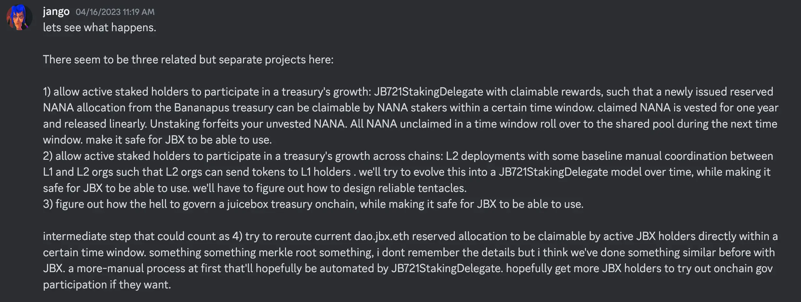
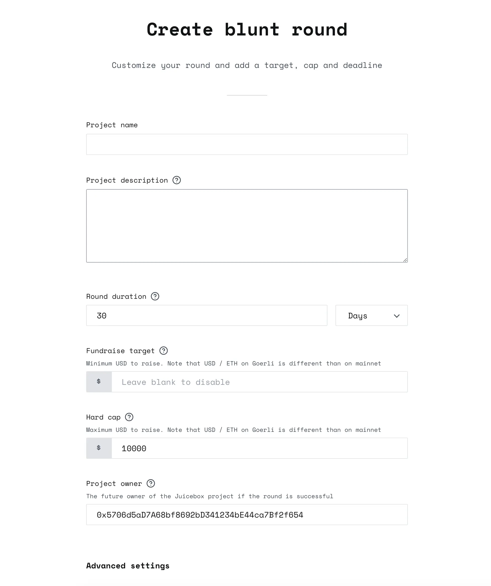
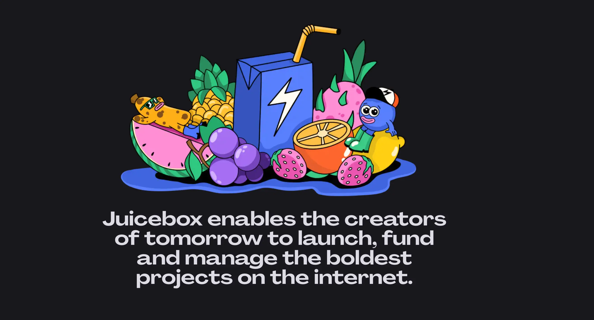
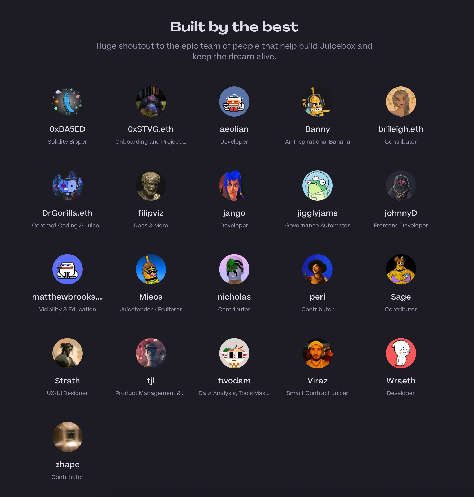

## Bananapus 工作报告 - Jango

[资助 Bananapus 项目的提案](https://www.jbdao.org/p/368)本周已获得 DAO 投票通过。Bananapus 项目的目标是要独立开展一些更为复杂的代币相关试验，避免对 JuiceboxDAO 直接构成太大风险。我们可以不断在前端、合约、能见度和协同工作等方面试验具体相关解决方案。

项目创建了一个专门的 [Bananapus 的 Discord 服务器](https://discord.gg/E2FHqxhVhU)，欢迎大家加入并参与该项目。

目前，Bananapus 并没有具体的路线图或发展计划，但是根据 Jango 在 discord 讨论组里发布的概述，会按以下几个步骤开展工作。

这些可以被视为 Bananapus 的三个目标：

1. 允许活跃的“股东”参与到金库的发展中来。金库的部分保留代币可以分配给代币质押者。

   例如，JuiceboxDAO 可以将其保留代币发行的 10％ 分配给质押 JBX 的人，这样一来，通过发行保留代币来衡量的金库增长，就可以由部分拥有社区并进行质押的人来获取。

   领取的奖励可以在一定时间期限（例如一年）内锁定。如果你在锁定期结束之前解除质押，则任何未授予的奖励将被取消。

   这样做的目标是为了更有效地分配代币，并聚集一批参与金库增长的活跃成员。将代币直接分配给活跃参与者的手中，要比分配给其他组织的项目方更好。

2. 与第 1点类似，但允许活跃的利益相关方跨链参与金库的发展。在 L2 上运营的组织把一部分保留代币分配给 L1 组织的质押成员。当然还有一些复杂性需要解决，但我们将尝试让这些组织相互关联，并跨链共享彼此的成长。

3. 解决如何链上治理 Juicebox 金库的问题，同时让 JBX 日后也能安全地应用这个解决方案。我们将与 Nance 密切合作，将 JuiceboxDAO 目前使用的大部分治理流程借用到 Bananapus 项目。

4. 还有一个中间步骤。现在，Bananapus 把部分 NANA 保留代币发送到 JuiceboxDAO 的 dao.jbx.eth 多签钱包。我们更希望能将 NANA 保留代币直接分配到 JBX 持有人手中。我们将在接下来的几周或几个月内尝试让 JBX 持有人有机会领取实验性的 NANA 代币，让 JBX 持有人可以实质参与到 Bananapus 的链上治理过程里来。

## Blunt 工作总结 - Jango

JuiceboxDAO 还在同一个周期的治理中批准了支持 Blunt Finance 项目的提案。

这个项目已经开发了一段时间，目的是要试验简化 Juicebox 项目的第一个筹款周期的解决方案。

目前 [Blunt Finance](https://testnet.blunt.finance/) 只在 Goerli 测试网进行部署，你可以先尝试一下项目的创建流程。这是一个简化的项目创建流程，允许设置筹款目标、硬顶和代币发行比例。

同时，它还允许设置筹款的时间期限来提高参与者的信心。如果一个项目在一定时间内没有达成筹款目标，将自动触发第二个筹款周期来开展退款，这样可以减轻项目管理的负担。

如果项目成功完成筹款目标，项目的所有权会被传递给预先设定的项目方地址，并在随后的周期按普通的 Juicebox 项目来展开运作。

显然，Blunt项目是完全开源的，所以我们可以从中进行学习、复制、使用和分叉。同时，我们也要认识到，独立开发者主动地开展试验、制作原型并承担相应的风险，这对生态系统是有益的。我们应该共同努力推动创新想法的传播，为其他人提供创新的空间，他们可以根据自身的简化需求来提出新的想法。

同时，Blunt在其系统内有一些商业模式，因此其资金库有可能看到一些增长。它也将进行链上治理。我们需要非常批判地思考如何作为一个生态系统来处理这些问题，在将其提供给人们之前确保审计、安全和可靠。

### Blunt 收取费用的形式

如果项目在预定时间内成功达成筹款目标，该项目的所有权将从 Blunt 合约转移给预先指定的项目方地址。

在项目所有权转移前，Blunt 合约将会为项目配置一个新的筹款周期，把 [Blunt的Juicebox 金库](https://juicebox.money/v2/p/490)安排作项目的支出受益人来收取相关费用。Blunt 的链上治理代币 BLUNT 代币将会相应地发放给这个项目。

因此，在成功的 Blunt 筹款轮之后，预先指定的项目方将会接收到一个设置了 Blunt Finance 报酬的 Juicebox 项目。项目方可以选择在他们自己重新配置之后的筹款周期时删除这项支出。

Blunt 从使用服务的项目收取费用的交易将被视为 Juicebox 生态系统内的项目间付款，因此不会收取 Juicebox 平台费用。但是，如果 Blunt 金库中的资金要离开这个生态系统，仍将产生 JBX 费用。

## Peel 工作报告 - Tjl

由 Peri 开发的搜索功能已经正式上线，这个由 Aeolian 和 Wraeth 共同整合。目前还没有相关的统计数据，但他们将加紧收集一些数据，相信结果会比上一个搜索功能更好。

项目标签也已经投入使用，这也是 Peri 的作品，也是一个重大贡献。项目正在逐步为自己添加上标签，这非常棒。

Peel正在更新网站，已经取得了一些进展。在市政厅里，Wraeth展示了新的“关于”页面，这个页面将与其他所有网站更新一起在本周末发布。

在“关于”页面的“使命”部分，Tjl 建议我们讨论一下如何利用社区筹款里程碑，比如2.50 亿、5 亿、7.5 亿 或 10亿美元等，考虑通过空投或类似的方式让加深社区对我们的使命的了解。

其次，他建议在贡献者部分添加一个“+”按钮，以便链接到专用的文档，向访问者展示如何为 Juicebox 做贡献，并鼓励新的贡献者加入到 JuiceboxDAO。

### Jango 的反馈

Jango 建议我们添加一个 JBX 代币分布情况图表，例如饼图或类似的内容。虽然贡献者成员是日常在开发流程中用他们的专业知识做出了更多贡献，但也有许多项目以支付费用的形式获得了 JBX 代币，还有许多个人是向 JuiceboxDAO 的金库捐了款的，我们仍在使用这些资金来实际开展工作。这些人跟其他人一样都是我们社区的成员。我们不应该忘记这一点。我们必须尊重 ETH，尊重更广泛的社区会员，尊重我们自己作为在这里工作的人，但这种尊重不应该仅限于在 Discord 里面。但应该怎么做这个问题有点模糊而且很不确定。或许我们应该考虑一下怎么来进行这方面的沟通。

## 回购委托工作报告 - Jango

这个项目已经在去年讨论了一段时间，但由于它涉及到 JBX 代币和金库，我们必须先完成了版本控制的所有工作才能正式启用这个功能。

现在，所有版本控制的工作都已完成，我们已经构建和测试过这个委托。唯一的需要做的是进行正式审计，然后等待 DAO 批准将它合并到我们的筹款周期里。

我们都知道，每个进入我们金库的 ETH，DAO 将按照其发行价格铸造新的 JBX 并发行给那些支付费用或点击支付按钮的人。我们也知道，在公开市场（如 Uniswap）上有人愿意以不同的价格出售 JBX。

因此，在公开市场价格低于我们的发行价格的情况下，回购委托将提议 DAO 放弃将 ETH 存入金库，而是将 ETH 中转到交易市场，以确保向我们金库付款的人都可以尽可能多地获得 JBX 代币。

现在 V1 JBX 的 Uniswap 流动池非常浅，而且大家仍在迁移到新的 V3 JBX。因此，回购委托需要确认应该盯住哪些池子。其中一种思路是，先尽可能购买 V1 JBX 并将其 1:1 转换为新的 V3 JBX 后发送给受益人。

希望我们尽快可以开始讨论审计的安排。接下来可能会提交一个提案来支付合约的审计费用，如果进展顺利，我们将很快可以在  JuiceboxDAO 的筹款周期里实际应用回购委托，并把 JBX 分配到活跃的项目和成员手中。

## 721 分级委托工作报告 - Jango

721 分级委托是标准的 NFT 奖励，这是一个我们一直在使用和发展的委托。目前我们的处境不错，委托脱离核心终端控制器基础设施，单独进行迭代演化。

现有的 `JBTiered721Delegate` 需要进行一些改进，目前已经排队等待部署为新版本。

1. 将变量 `contributionFloor` 重命名为 `prices`，因为我们现在更多地将这个变量按价格来处理；
2. 引入可操作性模式，使项目方可以将某些功能委托给操作员，即其他可以代表项目方管理这些功能的合约或地址。这将允许其他合约代表项目发布不同的 NFT 等级，并引入新的功能。
3. 重新评估存储的问题，为某些功能提供更多的设计空间，同时删除一些极少使用的功能，例如锁定功能。

目前仍有一些功能没有在当前版本的前端界面反映出来，我们正在设计这些功能，比如分类和版税功能，后者目前在合约层面已支持项目方部署带有版税的 NFT 系列。

Jango 表示暂时不急于发布或推动任何新的 721 委托，只是想确保大家都知道委托是可以变更的。我们可以更新合约并发布新版本，这并不像其他部分的版本控制过程那样需要耗费大量工作。

当然我们也可以发布新类型的 721 代表，例如 Bananpus 提出的质押委托。NFT 在 Juicebox上 将会有各种不同的使用方式。目前，我们主要集中在其中的一种，就是我们最开始开发的功能，我们创建了一个灵活的委托，使其适用于各种应用场景。

我们既可以专注于某些功能，也可以涵盖更广的需求，还可以以各种方式来具体化我们的工作。但是，构建面向特定委托的前端界面是一个棘手的问题，如果要构建委托来处理各种不同类型的扩展就更为困难。因此，这将是一个长期、需要耐心的过程，但希望我们能够把握这种开放性，让委托在 Juicebox 上更好地发挥作用。

