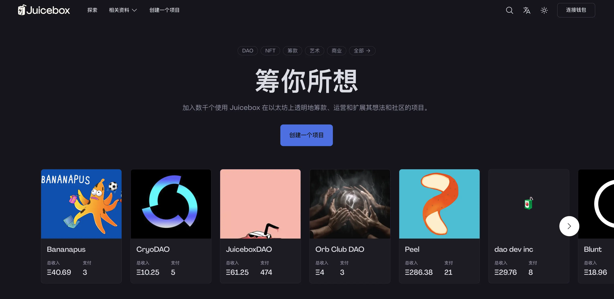
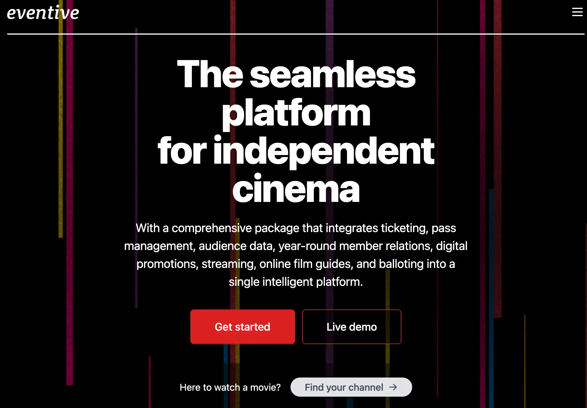

## Peel 工作报告 - Strath

Peel 计划在周会当天发布 juicebox.money 的全新主页，和新的“关于”页面。这次发布经过广泛的规划和准备，包括通过咨询、测试和数据分析，对用户需求进行了深入的研究。Peel 在开发的过程中，还听取了 DAO 的反馈意见。

有一个突出的用户需求， 希望 juicebox.money 显著位置更多地展示项目创作者及其项的内容。包括把热门项目放在主页顶部，并且是团队的高优先级。

Peel 对主页实施了清晰简洁的处理方案，以便用户登陆页面时可以第一时间了解我们生态系统中最近发生的事情。

在周会上，Strath 通过屏幕分享演示并对主页的各个部分进行介绍，包括“为你的创想打造，“成功故事”，“Juicebox 的工作原理”，“为什么选择 Juicebox” 和 “社区精选” 等。

Peel 接下来的两项重要工作包括：

1. 由 Matthew 和 Brileigh 制作的启动材料，将随着网站更新一起推出。这是我们首次在多个平台上实施联动启动策略，包括播客和社交媒体等。
2. 项目页面设计阶段，Peel 在周会前一天召开了工作启动会。Peel 将继续改进项目页面的设计，并希望在接下来的几周内推出。

## 各项目工作报告 - Jango

### Bananapus

Filipv 一直在尝试实例化完整机制的可行性，与此同时，合约团队的一些成员包括 Viraz、Dr. Gorilla 和 0xBA5ED 正在合作开发一个简化版的 721 委托，也就是目前很多项目页面上出现的 NFT 奖励。这个项目仍在持续开发当中。

### Blunt

Blunt 项目准备部署到主网。我们还同时在探索可以让 juicebox.money 进一步改善用户体验，来满足日常用户对简单化筹款模式及低投入工具的需求。

如果一切顺利， Blunt 实验将在 blunt.finance 网站上展开，我们可以在这里对它的安全性进行测试、研究及验证。一旦我们确信这个项目值得在合并到 juicebox.money 并优先进行，我们可以与 Peel 团队展开讨论。

现在 Blunt 暂时只在 Goerli 测试网部署，可以前往 [blunt.finance](https://testnet.blunt.finance/) 进行尝试。

### Defifa

Defifa 没有赶上 NBA 季后赛开赛时启动。Viraz 昨天早上完成了最后的测试，我们在周末对一些细节进行了复核。目前，Defifa 感觉不错，我们计划下周配合 NBA 季后赛中的某一场或一系列赛事来启动锦标赛游戏。

我们的目标是在 NBA 季后赛半决赛和决赛上，使用更新的前端界面、创建流程和更新的合约等，启动 Defifa 风格的锦标赛。

### Thirsty Thirsty

Thirsty Thirsty 即将在 Juicebox 上创建其项目金库。推出新的 NFT 系列运营项目的提案已经通过他们的治理流程获得批准。他们尝试参加尽可能多的活动并举办交流会，在 Juicebox 上建立一个登陆页面来销售会员资格和建立金库将会很有帮助。

尽管最近 Juice boxDAO 的关注点更多在于加速项目创建并简化流程，让人们可以轻松启动项目，但 Jango 认为有一些正在讨论项目，它们可能不会在短时间内就可以实现部署。相反，他建议，可以利用项目配置的草案来向社区介绍项目的具体细节和运作思路。这些计划部署的 Juicebox 项目可以引发不同的想法，而它们的部署可能需要更多的耐性和考虑。

Thirsty Thirsty 准备推出一个“十袋”项目，通过他们的 Juicebox 项目销售 10 袋高品质面粉。他们计划建立一个金库并卖出 10 个 NFT，收益将在分销商、Thirsty Thirsty 和种植农户之间进行分配。这个项目可以作为一个述事手段来展示 Juicebox 商品销售收入的支出安排。

这个项目代表了金库直接与绿色环保产品间结合发展的长期愿景，这个愿景就从最初销售的这 10 袋面粉开始。这种运作方式可能会引发一些思考，如何把这些项目作为叙事的手段，同时进行用户定位及使用 Juicebox 具体目标。

Bruxa 也表示她希望协助提供更为动态的内容来配合项目的叙事，如某些食谱、对农户的采访，或农场及仓库的空中视频拍摄等等。她同时也希望能听取我们社区对 Thirsty Thirsty 提出的意见。

### Art Collection with Nacho Fredes

Jango 计划帮助他的朋友 Nacho Fredes 创建一个项目，他是一位自 80 年代以来一直从事数字艺术创作的西班牙设计师。这个项目叫做“Happy Gods”，由128 幅赞颂幸福的手绘图像组成。

作为该项目的一部分，部分收益将分配给 Nacho Fredes 在西班牙合作的博物馆，另一部分将捐赠给非营利组织。Jango 的目标是在 Juicebox 界面上分发和展示这些艺术品。

总的来说，这个项目旨在支持艺术和慈善事业，同时向更广泛的受众展示Nacho Fredes 的独特数字艺术作品。

### 与 Livid 一起开发 Pinnable CropTop 模板

去年十二月份，Livid 在我们周会上展示了他的去中心化网站建设和托管的应用程序 Planet。最近他创建了一个名为Planetable Pinning 的 Juicebox 项目，并在 JuiceboxDAO 的 Discord 内有专门的讨论频道。

Planet 能够本地托管内容并 Pin 到 IPFS，然后通过 IPNS 指向特定的 ENS 名称。这意味着内容创作者可以从他们的计算机发布作品，一旦内容通过点对点网络成功分发，任何人都可以通过浏览器访问相关的 ENS 地址，例如 Jango 的个人地址 jango.eth.limo。

最近，Jango 和 Livid 一起合作开发了 Planet 的 CropTop 模板，为发布内容提供更视觉化的形式。该模板使用与 Planet 相同的基础技术，并支持用户选取Pinnable 的中央存储服务。用户可以去 Planetable Pinning 项目 mint 一个NFT, 就可以获得相应的中央存储服务。

Jango 分享了创建 CropTop 模板的愿景，希望让用户可以将 IPFS 上固定的图像铸造或记录到区块链上，这些图像无法被所有者删除，并同时通过这个交易为有关的 Juicebox 项目捐款。这样一来，任何人都可以通过一笔交易向某个项目添加内容铸造成 NFT，而项目所有者也可以通过允许人们在项目上自由发布内容，来收取一定费用到项目金库。

虽然还处于研究阶段，但对于托管在 ENS 地址及智能合约上的 P2P 网站，这个想法可以对它们之间的创意交互提供无限的可能，例如，我们可以使用juicebox.money/@juicebox 作为 JuiceboxDAO 的金库信息中心，同时使用juicebox.eth 来展示另一个更独特的页面，从而提供多个进入 Juicebox 项目的方式。

总的来说，这里有无限的潜力。希望 Juicebox 社区能继续创新和利用去中心化技术来构建新的精彩项目。

### Internet Archive

经 Livid 介绍，Jango 去拜访了位于旧金山的 Internet Archive 总部。Internet Archive 是一个旨在存档互联网的非营利性组织，已经运行了相当长的时间。Jango 感觉对 Internet Archive 的使命很认同，尤其是创建 P2P 互联网基础设施，这与 Juicebox 的去中心资金和金库的概念非常相似。

在疫情期间，互联网档案馆因向外借阅数字图书馆书籍被大型媒体集团起诉。因此，他们可能需要大量的资金支持来应对诉讼。鉴于以太坊、加密货币和互联网档案馆社区之间的文化契合，我们希望有机会筹集资金帮助他们实现使命。但问题在于：最佳方法是什么？筹款是唯一的选择吗？还是我们可以提供其他类型的帮助，使永久的、可索引的互联网档案馆成为现实？

目前这个阶段还为时过早，我们需要探索正确的时机和工具，以确定我们如何最好地支持 Internet Archive。通过了解他们的情况并协调我们的工作，我们可以为所有参与的人创造出更合法、更有影响力的结果。

## 关于 NFT 巴西的想法 - Gogo

NFT 巴西将于 6 月 2 日至 4 日在巴西比埃纳尔举办，这将是今年巴西最大的 Web3 活动，比埃纳尔是巴西艺术领域的中心。这个活动的目标受众包括创作者、游戏玩家、艺术家、开发人员、投资者等，旨在为人们提供 Web3 的入门指引。

此外，此次活动的影响范围很大，预计将有约 40,000 人参加，因此 Gogo 认为这将是一个展示 Juicebox 并与 Web3 社区沟通交流的绝好机会。他计划提交一个提案，建议 JuiceboxDAO 以某种方式参加这个活动。

## StudioDAO 工作报告 - Kenbot

他们研究如何使用电影节平台 Eventive，并成功地将两部纪录片和一个视频播客创建他们的电影节。他们还计划支持用户通过法币支付购买 NFT 来获取会员资格，并可以观看这些电影。

有一点尤其令人兴奋的是，Eventive 的 API 支持查询所有用户的行为记录。他们计划利用这些记录对参与电影节、资助电影和分享电影的人开展追溯性的奖励。通过使用数据生成这些活动记录来实施代币奖励，他们希望扩大代币经济并整合为电影节的一个部分。

