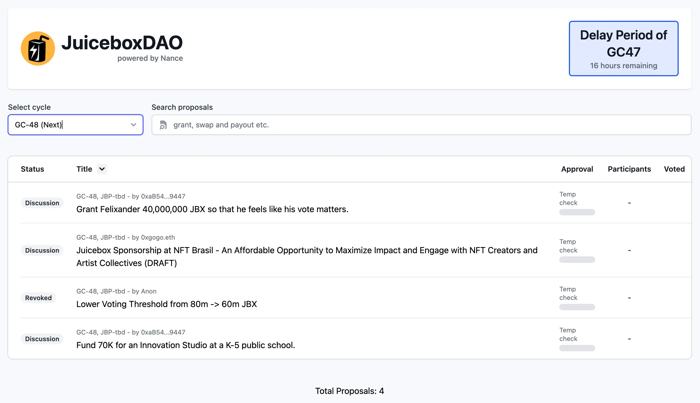
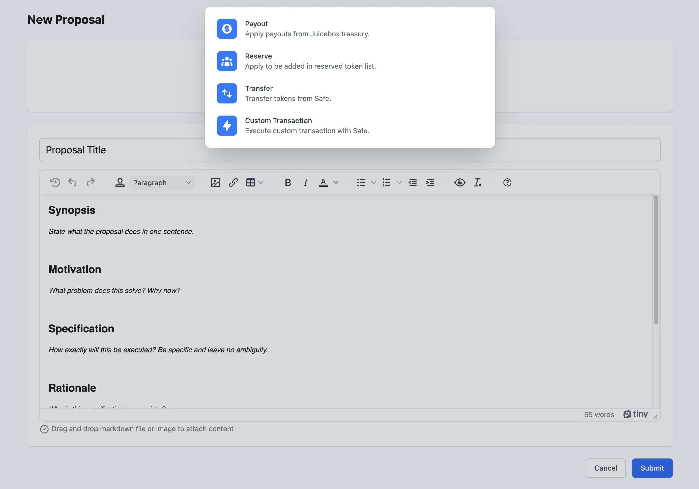
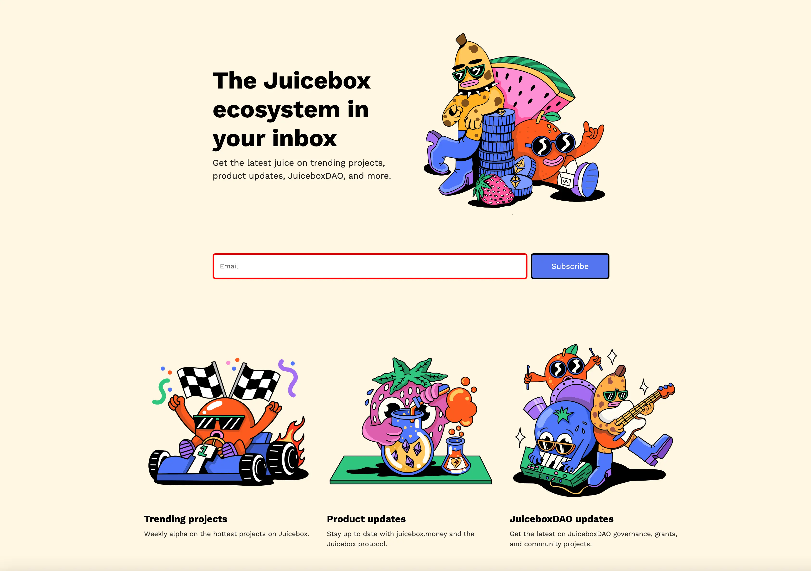
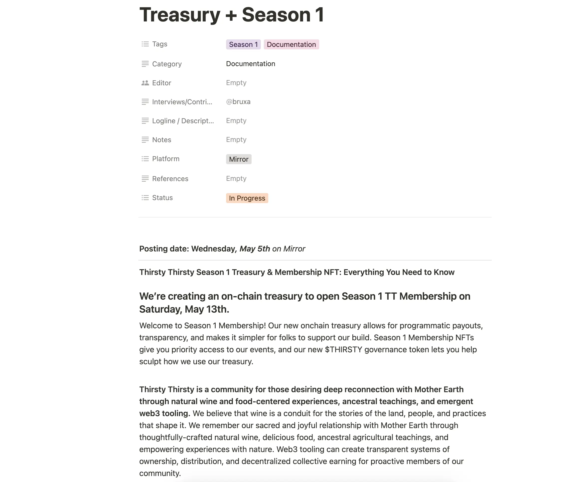

## Nance 工作报告 - Jigglyjams

在周会上，Jigglyjams 介绍了 [JBDAO.org](https://jbdao.org/) 的新主页。

改进的提案流程有一个突出的功能，提案在社区温度测试阶段会提供 Discord 相关讨论频道的网络链接。

此外，新的提案模板允许作者轻松地拖放 Markdown 文件或图像，并通过单击“添加操作”按钮添加支出明细、保留代币分配和多签代币转账等操作。

他们另外一个正在努力的方向是通用化 JBDAO.org，让其他的 Juicebox 项目也可以使用相同的前端界面来管理治理活动。包括 Thirsty Thirsty 和 Bananapus 在内的多个社区都对这个产品表示出深厚的兴趣。

## 能见度工作报告 - Matthew 及 Brileigh

他们最近给 Juicenew 社区通讯创建了一个[新的进入页面](https://subscribepage.io/juicenews)，让大家可以订阅邮件来获取 Juicebox 生态的最新消息。

Peel 团队联合 WAGMI 工作室推出了全新的网站页面，包括升级的主页、一个”关于“页面、案例分析，还包含了增强搜索和项目标签等新功能。Matthew 和 Brieigh 发表了一篇[网站升级的介绍文章](https://docs.juicebox.money/updates/website-updates/)，配合这篇文章还同时发布了一条介绍视频，这些都是新产品启动策略的一部分工作。

<iframe width="560" height="315" src="https://www.youtube.com/embed/1IlGgVO07tg" title="YouTube video player" frameborder="0" allow="accelerometer; autoplay; clipboard-write; encrypted-media; gyroscope; picture-in-picture; web-share" allowfullscreen></iframe>

在新一期的 Juicecast 节目里，他们还将会采访 Juicebox 的新项目 [CryoDAO](https://juicebox.money/v2/p/501)。

## Defifa 工作报告 - Jango

Defifa 团队正在进行一些 NBA 季后赛的锦标赛的收尾工作。他们计划为每个系列赛举办一次 Defifa 游戏，并专注于其中的小型比赛。

Jango 提出了在最近的周期上搞一次铸造 NFT 活动，但目前团队主要集中在完成一些剩余的工作。

## Thirsty Thirsty 工作报告 - Bruxa

Bruxa 撰写了一份关于 Thirsty Thirsty 社区的第一季金库和会员 NFT 的文件，她计划在 Thirsty Thirsty 社区日志上发布，并在 5 月 13 日正式宣布开始。

新的捐款人将可以铸造他们的第一季会员 NFT 并加入治理，与社区其他成员一起建设。此外，第 0 季的会员将会获得 $THIRSTY 代币的空投。

Bruxa 认为，这将为社区提供一个强有力的基础，以进一步探索 Web3 世界，并帮助新的潜在用户了解这个领域内的实际社区机制。

## NFT Brazil 提案 - Gogo

Gogo put up a proposal this week concerning the thoughts of suggesting JuiceboxDAO to attend the NFT Brazil event, which he mentioned in our last Town Hall.

Gogo在本周发起了一个提案，提议 JuiceboxDAO 参加 NFT 巴西活动，他在我们上周的周会中提到过。

他认为这个举措可以从这个活动中为 Juicebox 带来一些价值。他邀请人们一起进行头脑风暴，讨论一些在这个活动期间可以做的有趣事情。

