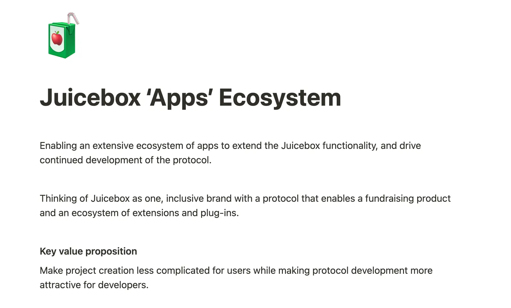
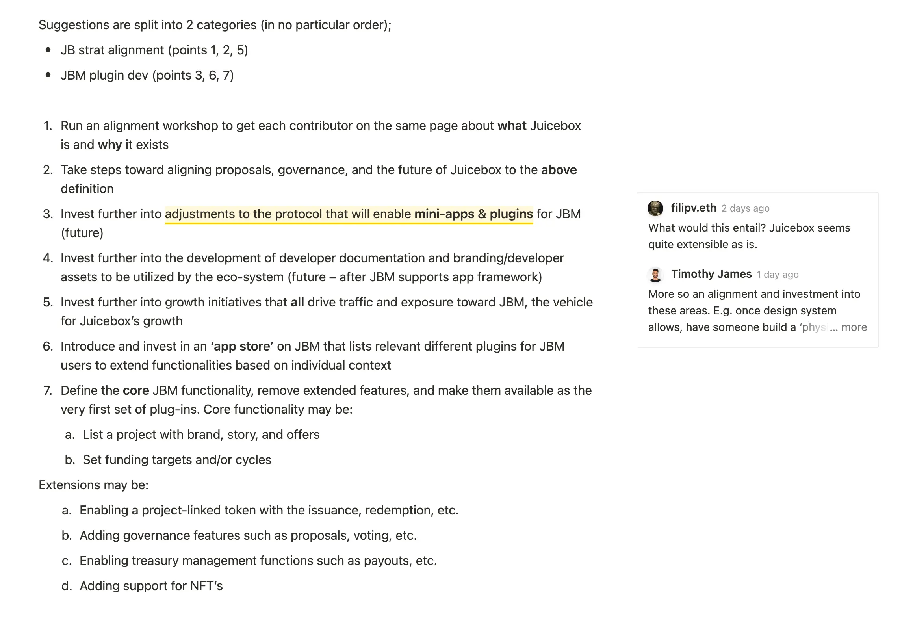
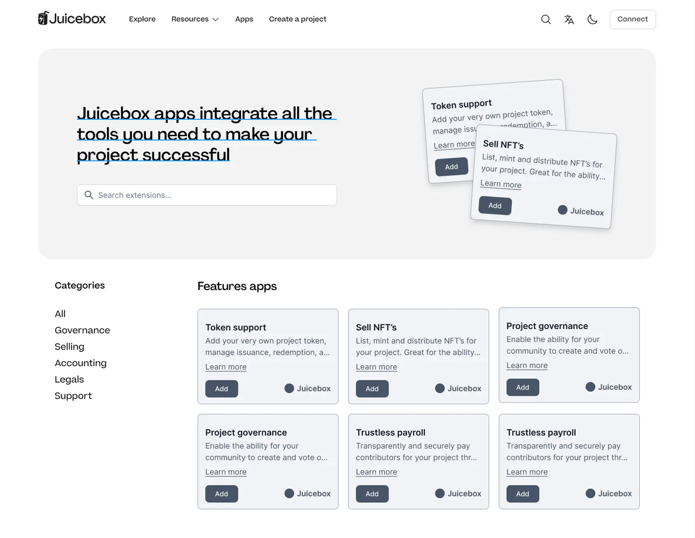
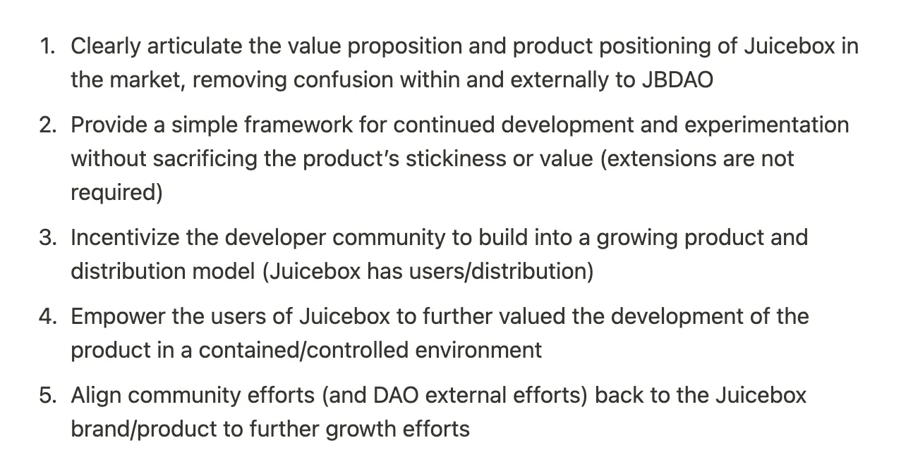
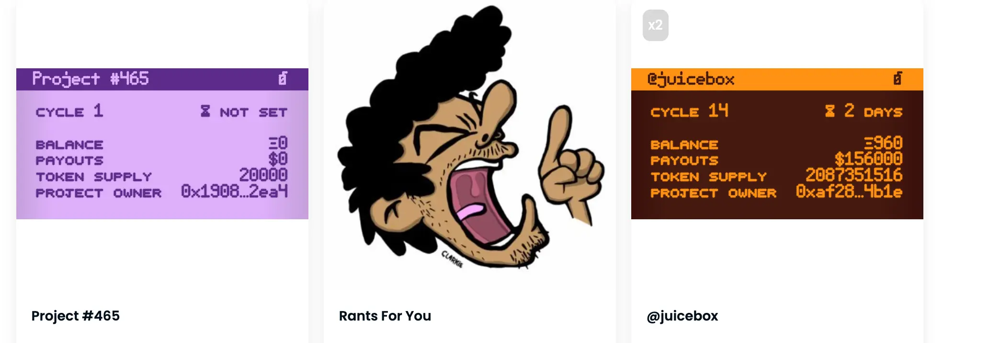
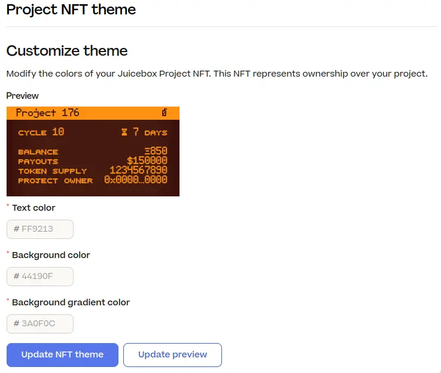
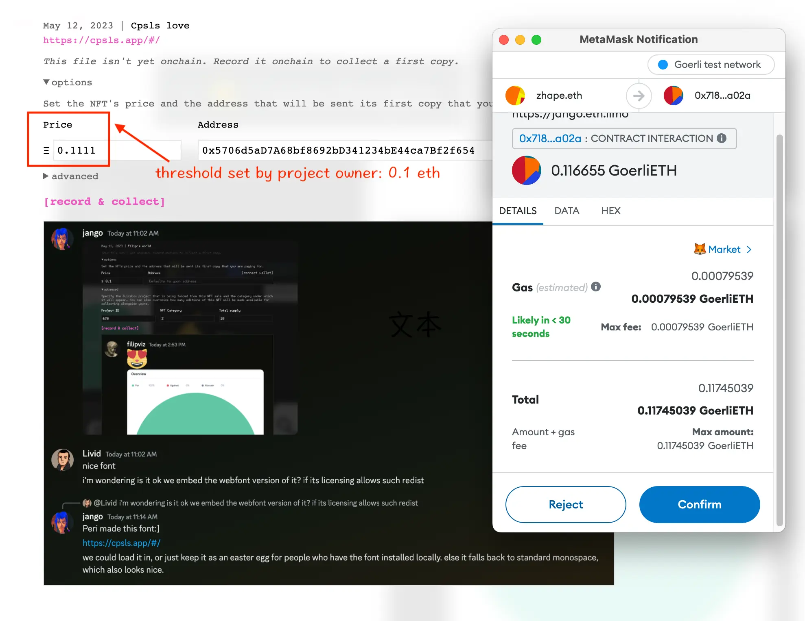
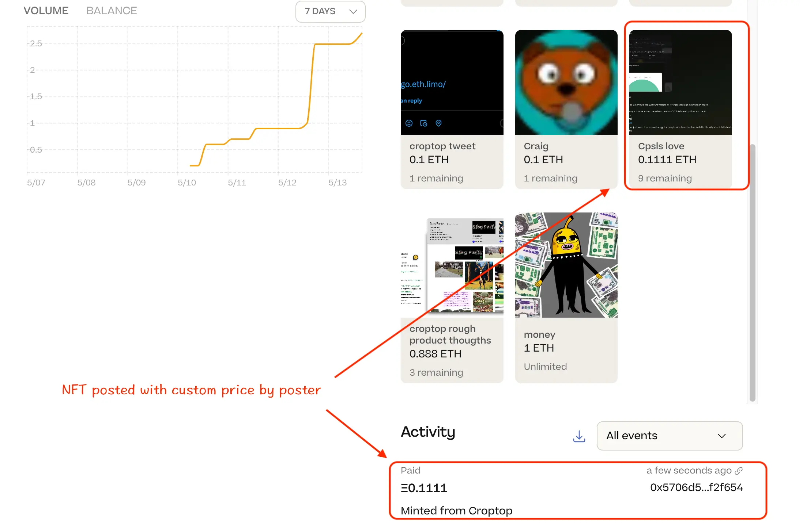

## App 框架介绍 by TJL

最近社区内在 Discord 里出现了关于是否应该把一些扩展功能/合约剥离协议主功能的讨论，于是 Tjl 最近整理出一份 [App 生态系统框架](https://grand-popcorn-c81.notion.site/Juicebox-Apps-Ecosystem-dfd59363bc894f328897e37a3b2bec54)，他相信这一框架能推动广泛的 APP 生态系统来扩展 Juicebox 的功能，并推动我们的持续发展。

在周会上，Tjl 逐项对这份文件进行解释，指出了 Juicebox 生态系统中存在的主要问题，提出了一些建议和相应的解决方案，展望这个框架将会给我们生态系统带来的变化，以及这个工作方向将创造的一些机会。

### 问题

1. **品牌力**：品牌缺乏一致性、稳定性和品牌力，与最初的 Juicebox 无法对接，因此在品牌推广方面受到影响。
2. **DAO 一致性**：在 Juicebox 里，每个人对 Juicebox 的理解都略有不同，导致价值观的不一致，随着时间的推移，就会出现各自对 Juicebox 的描述不一致的情况。
3. **产品复杂性**：很难有效地确定清晰的价值主张来以让 JuiceboxDAO 向着实现产品市场适配（PMF）的方向发展。
4. **增长努力**：我们在专注发展措施和策略方面做得不够好。

### 建议

### 解决方案

解决方案是以 juicebox.money 作为主要载体，从而：

- 首先确定清晰代表 Juicebox 定位的各项核心功能，这些核心功能应该是所有项目都需要的，而其他不确定是否适用每个项目的功能则以插件的形式来提供；
- 然后逐步撤回平台的扩展功能，并内部开发功能匹配的插件来替换。

我们不会改变 Juicebox 的本质，只是想改变我们推广及描述它的方式。然后我们会改变部分的用户体验，并在插件方面开拓更多机会。

### 变化

根据 TJl 的说法，将会发生如下变化：

- 简化的 JBM 创建流程；
- JBX 创建流程采用模块化设计；
- 项目设置模块化设计；
- 项目页面同样采用类似的模块化设计；
- 增加一个新的 JBM 页面或区域用于查找项目插件。

### 工作原理

Tjl 还展示了一些早期阶段的线框图，来形象描述这个措施在 Juicebox 中可以如何进行实现。

他还展示了一些初步的模型，演示这个框架如何在应用商店、开发者资产、列出应用、创建流程、项目页面和项目设置等领域发挥作用。

### 机会

1. 清晰地表述 Juicebox 在市场里的价值主张和产品定位，消除社区内外对这个问题的困惑。
2. 提供一个简单的框架，以持续开发和试验，而不损害产品的粘性或价值（不需要扩展）。
3. 激励开发者社区构建一个不断增长的产品和分销模型（Juicebox 拥有用户/分销）。
4. 在一个受控环境中赋予 Juicebox 的用户进一步评估产品的价值。
5. 将社区努力（和 DAO 的外部努力）与 Juicebox 品牌/产品相一致，进一步促进增长。

### 如何实现？

如果我们选择这一工作方向，需要具备以下条件：

- 我们需要 DAO 的共同认同和支持。我们都朝着一个共同的目标努力，我们都对这个目标有共同的描述，我们都有相同的命运。
- Peel 团队需要略微调整工作优先次序，即使各种准备已经就绪，但我们在构建某些内容时需要略微调整一下顺序。
- 现有 Juicebox 资助项目的合作。
- 合约开发团队的支持
- Filip 进行技术文档的整理。

## 应用框架讨论

**Nicholas**: 这个想法的出发点有很多我是完全同意的，但即使 Juicebox 有非常多的扩展功能，但我认为确定它的核心作用，或者说我们宣传的核心功能，仍然是非常有意义的。

而且我希望能够进一步确定，应用商店不仅出于前端简化的权宜之计，还能帮助提升协议的接受度。

**Tjl**: 我们在一定程度上已经向这个方向努力了，但我认为我们没有做好引导工作，并且因此失去很多潜在的机会。此外，我们也没有把它与 Juicebox 的品牌和增长进行挂钩。

其次，我们确实存在产品市场适配 (PMF) 问题亟需解决。我们还没有找到正确的产品定位，这是由于我们未能就协议的表述达成一致造成的。

**Nicholas**: 要启动这个工作，我们可以使用单个前端来兼容不同的工作流，同步进行更新。如果 Blunt 不需要以单独项目的形式，而是以一个附加的前端界面选项的形式来运作的话，那么一些开发人员，不管来自内部还是外部，Peel 或非 Peel，都可以来参与它的开发。而且也可以马上把它集成到 juicebox.money 上面，而不是需要为它搭建一个全新网站，又或者将 Peel 的资源转过来。

**Tjl**: 完全同意。这绝对是我们最主要的动机之一。我们应该对所有工作进行整理，把资源都集中到一个地方，并构建我们的生态系统，而不是把多个项目分散在不同的地方。

**Nicholas**: 这令我想起我与 Uniswap 或 Matcha 等 AMM 交互并导入非信任代币时的情形。从合约团队的角度来看，我很想知道我们是否可以在前端或协议扩展方面实现一定的标准化，从而把这些扩展功能按可信任或非信任类别来进行添加。打比方说，现在如果你不想要 NFT 功能，在创建流程里很容易就可以把它剔除掉了。

我不知道技术上是否可行，但如果可以更容易添加到界面的话，协议扩展的开发工作将更快速，并且可以多个扩展同时进行开发。

**Filipv**: 我认为通用用户界面可能是最大的难点。如果要让人们开发 Juicebox 扩展功能，我们必须找到一些通用解决方案，这不容易。

**Kenbot**: 我认为 Juicebox 不是一个筹款协议。它的复杂性超出了大多数寻求筹款功能的人所需要的范围。

我认为协议、平台和我们到目前为止所构建的一切，它们的优势都在于作为一个筹款的解决方案。作为一个智能金库，它能记得谁捐过款，并可以在以后给予回报，这使它成为管理资金流的一个强大工具。

我认为 Juicebox 的优势在于它通用的财务工具，而更具体的交互界面则是我们致胜的地方。

**Jango**: 我认为可以从两个角度来看待这个问题。第一个是从收入的角度，这个方向视乎我们真正喜欢做什么和我们对什么充满激情。我们正在构建的与之前为 DAO 带来收入的基本一致，在某种意义上可以把它看作是收入，在另一种情况下也可以把它看作是一个社区建设演练，因为我们使用的大部分资金来自那些不小心捐款进来的个人，并不是来自协议上的项目。

另一个有趣的角度是：我们真正关心的是什么样的项目，我们想要构建的是什么？像 Kenbot、Livid 和 Kmac 这些人正在这里为自己的想法努力。从我们所做过的、所看到过的和所学到的事物里汲取经验，并想办法把这些经验应用于当前正在这里搞建设的目标明确的这一群人。

**Tjl**: 绝对重要。我认为这是首要的。我们要搞清楚我们的发展方向和目的。

**Jango**: 我认为试图找到正确的方式来表达这些应用程序（我们以前称之扩展或模板）的其中一个动机在于，因为最终我们无法真正控制协议的发展方向。统一的价值观和单一的品牌对我们来说是一种奢求。我们原有策略的首要原则是欢迎多样性，并认同应该鼓励大家自由创建，如果创造出来的东西的确很有意思，DAO 可以介入并给它们或多或少的认可。

我在很大程度上赞同这次讨论，但我认为实际上很难或者不大可能达成一致。虽然有点反直觉，我倒是觉得应该考虑如何能够尽可能地对混乱多些包容。

**Tjl**: 我认为至少应该明确我们的方向，这非常重要。即使你认为这是不可能的，我还是认为应该经常开展这方面的讨论，让我们前进方向更有意义。这应该优先于其他所有工作，因为我们对于协议的定位有太多不同的想法。

**Nicholas**: 我认为我们需要明确。搞清楚怎么一回事是合情合理的。我不觉得这与混乱、生产力或创造力有什么冲突。相反我觉得对创造力和混乱是有帮助的。

## Juicebox 项目元数据：静态元数据 - NIcholas

Nicholas 过去几个月开发了一个 TokenUri 解析器合约，在项目所有权 NFT 上展示项目的部分细节。可以在 [OpenSea 的 Juicebox 项目页面](https://opensea.io/collection/juicebox-projects-izoueqj)上看到部分使用这个合约的一些项目的 NFT。他还编写了另一个叫做 Project Cards 的合约，让人们可以铸造一个 NFT 来复制某个 Juicebox 项目的元数据副本，并保存到自己的钱包，可以在[这里](https://opensea.io/collection/juicebox-project-cards)看到 OpenSea 上的 Juicebox 项目卡片。

上周他制作了一个小合约，本质上属于一个自定义的令牌解析器，可以让项目所有者将项目的静态元数据指向一些自定义位置（如 IPFS、HTTPS 甚至 Arweave 上）上的发布 JSON。大家不需要上传或部署自己的合约，只要通过这个合约设置好文本，再把它设置为项目的解析器就可以了。

他打算制作一个专门的网站来让人们更轻松地铸造这些项目卡，但如果有人想要提前尝试，可以按照以下步骤操作：

1. 将所要使用的元数据固定到 IPFS上（使用此模板ipfs://QmQs3MLLqyxVKWn7BccxEmweQ17JfT3ttnmZ7nga7c1D3S）；
2. 调用此合约上的 `setUri`，在[这里](https://etherfunk.io/address/0xbd6cf252598bbfd87a429ded71adf9f8d2bb9558?fn=setUri&args=["500"%2C"ipfs%3A%2F%2FQm.........."])填写项目 ID 和 步骤 1 得到的 URI（例如 `ipfs://...`）；
3. 在[这里](https://etherfunk.io/address/0x2c39bb41e2af6bec6c3bb102c07c15eda648a366?fn=setTokenUriResolverForProject&args=[null%2C"0xbD6cf252598BBFD87a429dED71aDF9f8d2bb9558"])填写令牌 URI 注册表地址和你的项目 ID，把它设置项目的自定义令牌解析器

Filipv提交了一个[针对 Nicholas 所发布合约的合并请求](https://github.com/jbx-protocol/juice-interface/pull/3521)，一旦审核通过并合并进来，项目方就可以到项目设置来设定他们的自定义元数据，不用再直接与合约进行交互。

## V1 支出 bug 的事后剖析 - Filipv

Filipv 最近提出了一个提案，将 JuiceboxDAO V1 的所有 ETH 转移到 V3 金库。

提案获得批准后，Filipv 发起一笔交易，将 V1 金库的筹款目标（即可以从金库提取的总金额），提高到 1 亿 ETH，并将支付受益人设置为 V3 金库地址。多签批准及签署了这个交易。

但 Jango 很快发现实际的接收方不是 V3 金库，而是 V1 金库本身。团队很快发现这是一个 bug，更改 V1 项目的筹款目标的时候，这个 bug 会将分配器设置为零地址，这意味着 V1 金库将向自己付款并相应铸造出新的 JBX 代币。

理论上来说这个 bug 可能会被恶意利用，让 V1 金库一直向自己付款，直到达到 1亿 的支付上限，并铸造出数量巨大的 JBX 代币分配给多签和其他保留费率的接收人。

Filipv 很快隐藏了 V1 项目前端的“发送支付”按钮，而 Jango 则发起交易来重新设置正确的 V1 分配器，该交易很快得到多签成员签署并执行。

Filipv 发布了一篇文章来记录并分析这个 bug，详细阐述了避免出现类似问题的一些想法。可以在[这里](https://docs.juicebox.money/dev/resources/post-mortem/2023-06-05/)阅读这篇文章。

## 社区意见反馈 - Gogo

Gogo 在[两周前的周会](https://docs.juicebox.money/town-hall/23-04-25/#thoughts-on-nft-brazil-by-gogo)上提出建议，希望 DAO 能够参加 NFT 巴西活动，但会上只是让他去提交提案，并没有给他机会充分解释自己的想法。他后来发起了[关于 NFT 巴西的提案](https://www.jbdao.org/p/378)，并在上周再次来到[周会](https://docs.juicebox.money/town-hall/23-05-02/#nft-brazil-proposal-by-gogo)上建议大家一起头脑风暴，讨论我们在 NFT 巴西期间可以搞些什么酷的活动。但该提案最终没能通过社区的温度测试。

他在本次周会上指出，我们社区似乎欠缺讨论和提出想法的空间。作为一个 2021 年就参与进来的 OG Juicebox 成员，Gogo 觉得自己对我们的社区是充满热情的。这是他第一次想直接和社区一起为 Juicebox 做些具体的事情。但他感到自己不太受欢迎，也没有讨论和交流的空间。

但是，他第一次向 Nouns DAO 提交提案时，与整个团队开了四次会来收集该社区的反馈并策划最佳方案。他后来提交了一个提案，并根据社区的意见修改了许多细节，最终该提案获得通过。

他建议，我们应该有一个交流的空间，一个 DAO 一起思考想做的事情的空间，并对参与的人有更多的包容。

Jango 非常感谢 Gogo 提出意见。他觉得我们花了很多精力在发掘新客户和实现产品市场适配上面，但考虑到我们目前构建的工具，这些工作其实意义不是太大。他建议，我们应该优先考虑当前建设者和社区成员的需求，而不是不断去寻找新客户或收入增长点。他更倾向于与当前社区成员建立稳固的关系，并提供必要的支持和资源，帮助他们取得成功。

Jango 还强调了关注个人而不是收入和产品市场适配的重要性。他更希望培养一个充满激情的建设者社区，共同打造创新的解决方案。

Mieos 则认为我们需要在互爱互助的大家庭氛围和开发受市场认可并持续盈利的产品之间找到一个好的平衡点。他觉得我们最近在提案讨论时有点过于严肃，也许是因为我们之前有段时间过于放松，现在又有点矫枉过正了。他建议我们应该设法提供更多具建设性的反馈意见，在给予和接受方面更加包容。他很感谢 Gogo 发现问题并愿意站出来提出意见。

## 演示 Planet 的 Croptop 模板 - Jango 及 Livid

Livid 简单介绍了[Planet](https://www.planetable.xyz/)，一个可以让用户在他们的 ETH 域名上运行网站的应用程序。这是一个完全去中心化的解决方案，用户的内容和域名完全由他们自己的私钥控制，不需要服务器和中心化管理。

在周会上，Livid 演示了如何将屏幕截图发布到 ENS 域名的网站上，并在 [Jango 的 ENS 网站](https://jango.eth.limo/) 上收集其中一张图片然后把它铸造为 NFT。

Jango 在会上介绍了 Planet 应用 Croptop 模板的工作机制。

用户使用 Planet 应用创建网站并发布内容之后，这些内容实质上是托管在本地计算机上。关注你 Planet 的人可以在 P2P 网络中访问和传播这些内容。

这些内容保存在 P2P 网络中，最初是可以删除或解除引用的。但是一旦有人收集了这些内容，它们就会永久地存储和保留，最初发布内容的人无法再将其删掉或清除。

或许这是搭建去中心化网站的一种途径，网站托管在以太坊网络上，而网站内容则是以点对点的形式存在。唯一的不足是如何才能真正把它打造成筹款工具，可以在 Juicebox 金库发布图片和发行 NFT。

最近，Jango开发了一个 Croptop 合约，将这些内容收集或铸造为 NFT，并发布到 Juicebox 的项目上面销售。

Juicebox 上的任何项目都可以授权这个合约在它的项目页面上发布新的 NFT。迄今为止，我们对 NFT 的心理模型都是只有项目方才可以在项目页面上发布新的 NFT，但现在他们可以授权 Croptop 合约在项目页面上发布新的 NFT，视乎需要可以把这些 NFT 分成不同的类别，这样 Croptop 合约发布的 NFT 就可以与项目原有的 NFT 共同或分开展示，具体取决于项目方的想法。

然后，项目方还可以设置一些阈值，例如可以发布在项目页面上的 NFT 的最低价格和最小数量。用户在项目使用 Croptop 合约发布自己的 NFT 时，就可以为自行设置 NFT 的价格，只要价格高于项目方之前设定的阈值即可。

在上面的例子中，[Jango 的 ENS 网站](https://jango.eth.limo/) 上的一张图片被收藏/铸造并发布到 [Test Croptop](https://goerli.juicebox.money/v2/p/670) 项目页面（Goerli测试网），同时支付了 5％ 的费用到另一个 [Croptop Publishing Network](https://goerli.juicebox.money/v2/p/669)（Goerli测试网）作为使用 Croptop 合约的费用。（目前，Croptop 仍然是 Goerli 测试网络中的实验项目。）

因此，任何人都可以在某个项目页面或其他 Feed 聚合的页面上发布他们喜欢的艺术作品或图片。用 Croptop 合约在某个 Feed 上发布内容，你会在发布 NFT 的同时第一个把它铸造出来，因此你实质是向项目支付费用来发布新的内容。

也许会出现一个跟现在相反的新做法，项目所有者不再发布 NFT 供用户铸造，而是社区聚集起来决定应该在某个项目上发布哪些内容。
