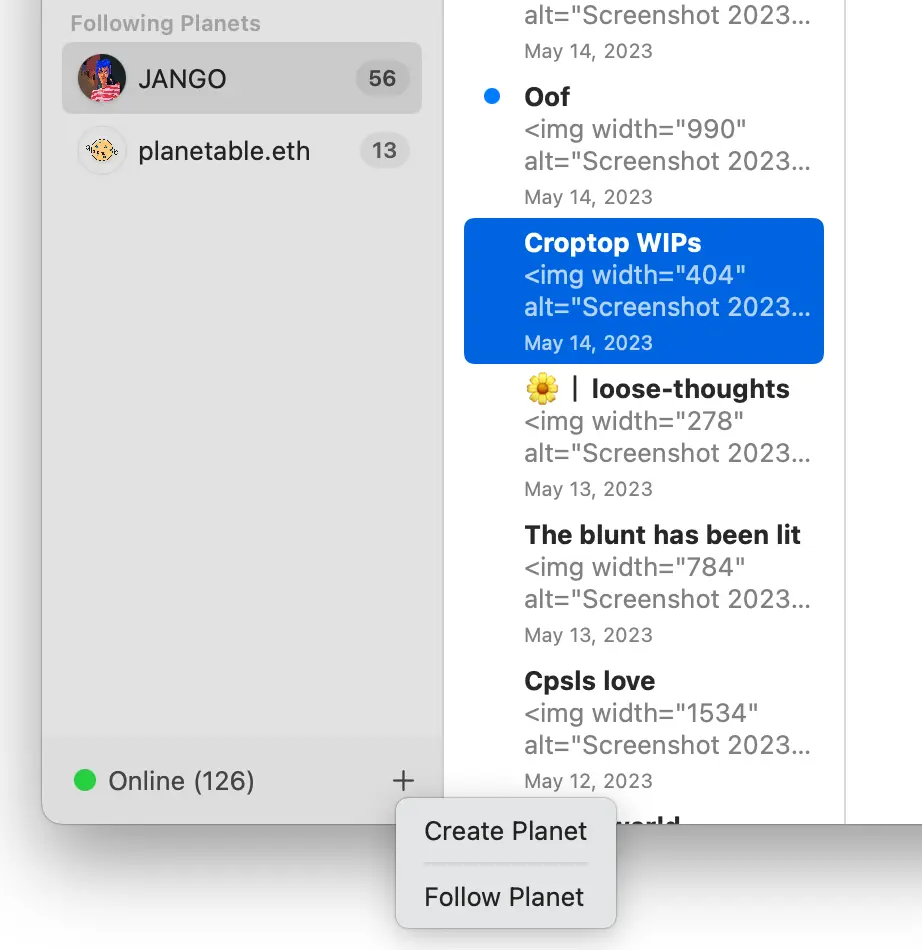
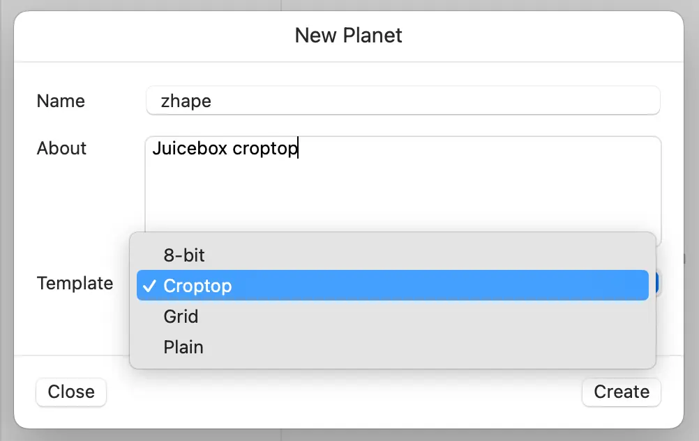
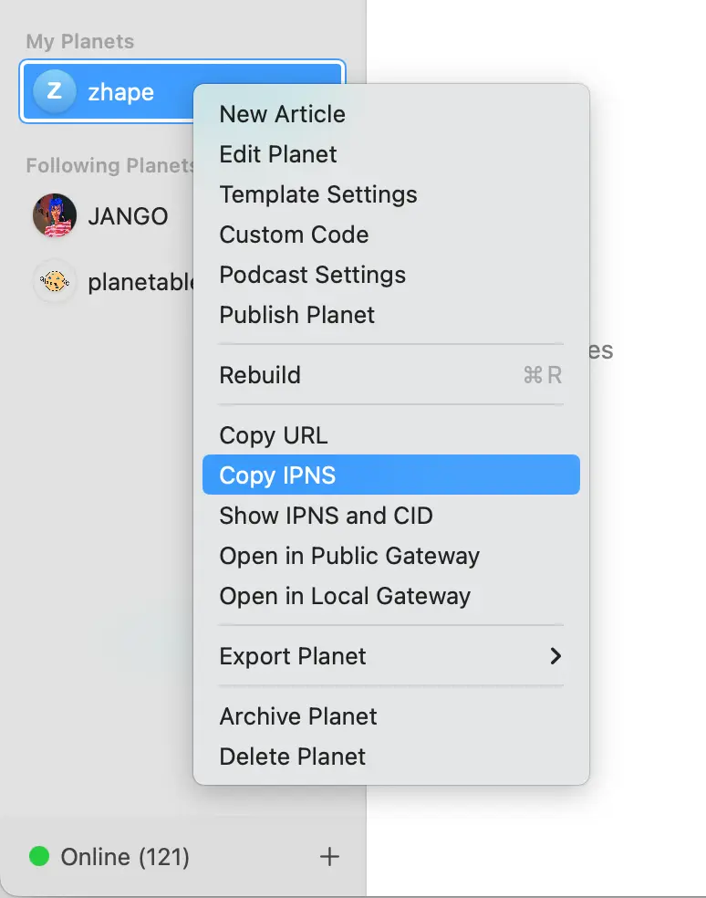
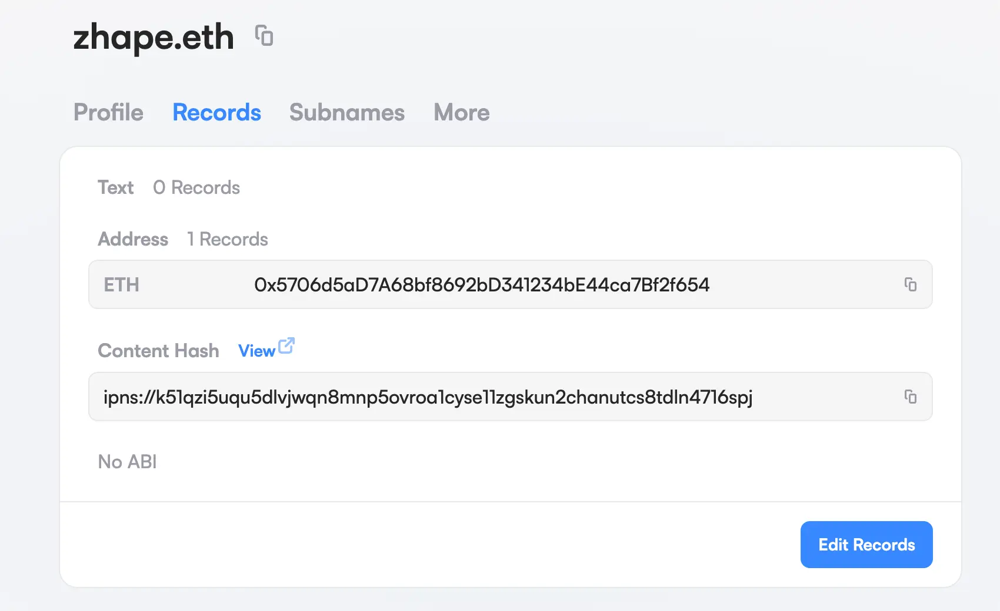
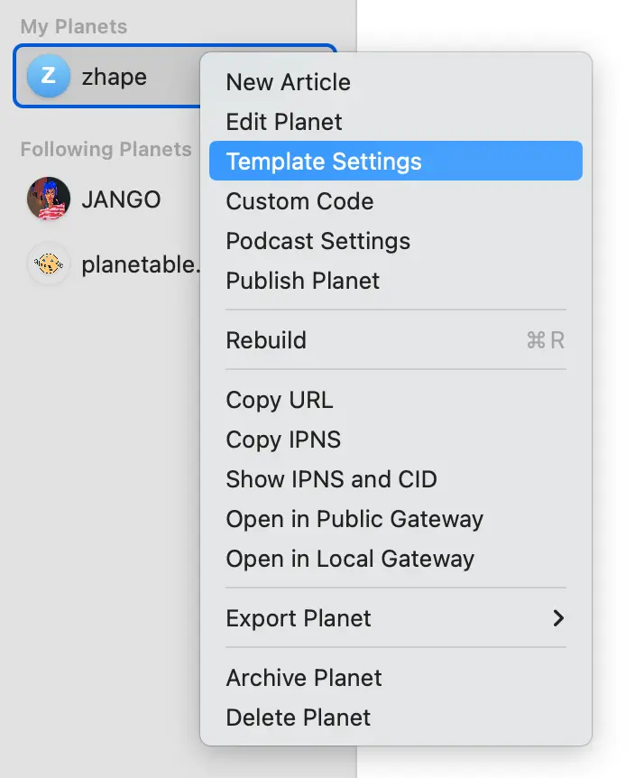
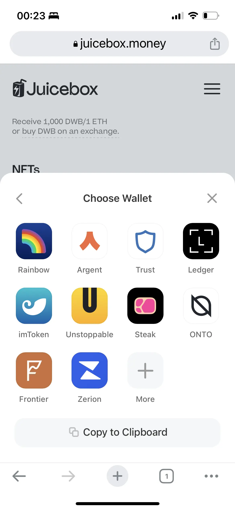
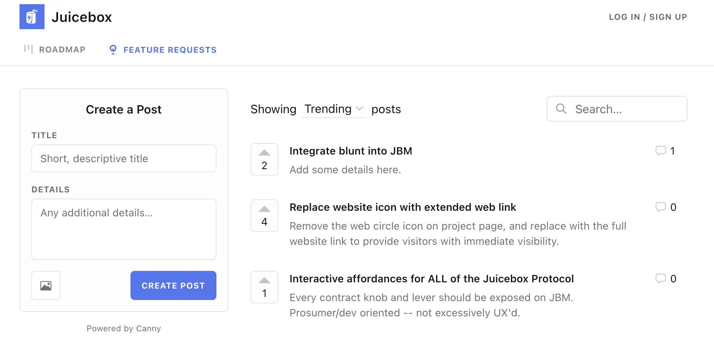

## 用 Blunt 来公开启动 meme 代币 - Jango

Blunt 是一个 JuiceboxDAO 支持并资助的项目，目标是要试验一些募资初始阶段的特定功能。可以通过创建 Blunt 筹款轮来制定一些非常明确的规则，诸如筹款硬顶、筹款目标及筹款期限等等。例如，如果一个筹款活动未能在设定的期限内达到设定的目标，合约会自动配置一个筹款周期来向参与筹款的人开启退款。反之，如果筹款成功，则项目的控制权将会自动转移给预设的项目方钱包地址，项目之后将按普通 Juicebox 项目来开展运营。

Fair Lunch 是旨在帮助人们公平去中心化地集资创建 meme 代币的一个项目。集资成功之后，铸造出来的 meme 代币和集资的 ETH 按事先设定的比例自动在 AMM 上创建一个流动池，确定 meme 代币的公平机制。

在周会上，Jango 展示了怎样用 Blunt 来创建一个 Fair Lunch 的集资项目。集资成功之后，项目的控制权不再转移给预定的项目方，而是转移到 Fair Lunch 合约，该合约相应配置一个新的筹款周期，允许项目方铸币并把项目金库内的 ETH 分配到 Fair Lunch 合约，再按某个比例来配对 meme 代币和 ETH 并添加到 AMM 的流动池。

从模式上来看，协议内有一个标准的 ERC721 钩子 `onERC721Received`，我们可以用于监测项目的控制权什么时候从 Blunt 转移到 Fair Lunch 来触发后续的一连串操作。

Fair Lunch 项目由两个参数来决定，同时这两个参数也是 Fair Lunch 合约的典型特性：乘数及分割参数。

- 乘数参数设定创建代币流动池时的初始价格。乘数为 1 则按 Blunt 轮时规定的代币/ETH 比例来铸造代币。乘数越高，则初始流动池的代币价格越低。
- Blunt 项目的控制权及金库资金转移完成后，就可以设定 Juicebox 分割参数，可以把金库中的部分资金分割出来转给一些受益人地址，剩余资金则继续用于创建流动池。

## Planet 应用的 Croptop 合约 - Jango

Planet 应用提供了一个用 ENS 域名来创建网站的去中心化解决方案，网站内容可以固定到 IPFS 并通过 IPNS 地址来指向该 ENS 名称。内容通过 P2P 网络来进行传播，无需依赖运营商或者其他中心化的服务提供商。一旦这些内容经其他用户传播并收藏，原先发布的人都无法再删除掉了。

这个 Croptop 合约是 Jango 为 Planet 开发的一个专用模板，帮助把去中心化的 ENS 网站变成筹款的工具，让大家可以把网站的内容发布到 Juicebox 项目上并作为 NFT 提供铸造。

如果想尝试使用一下这个 Croptop 模板，请按以下步骤（目前应用仅提供 Mac 版本）：

1. 到[这里](https://planetable.eth.limo/insider/)下载这个 Mac 应用：

2. 点击"Create Planet"来创建你的星球；

   

3. 创建时选取 Croptop 模板（也可以在后期编辑）；

   

4. 创建完成后，右键点击并选择 Copy IPNS 来复制 IPNS 地址；

   

5. 去到 [ENS app](https://app.ens.domains/) 页面编辑你 ENS 名称的记录，把复制的 IPNS 粘贴到 Content Hash 一项并在前面加上 ”ipns://"前缀；

   

6.  一旦你的星球通过 P2P 网络传播之后，你就可以在浏览器内输入类似 jango.eth.limo 这样的地址来访问你的星球。

7. 右键点击你的星球，选取"模板设置"可以填写 Juicebox 项目的 ID，你的 ENS 域名网站的内容就可以发布到该项目并作为 NFT 供用户铸造。

   

8. 前端界面将很快会在项目设置里面支持项目方把 Croptop 合约设置为项目的操作员，获得在项目发布 NFT 的权限。

如果对怎样在 ENS 域名网站上收藏图片并发布到一个 Juicebox 项目有兴趣，可以到[这里](https://docs.juicebox.money/zh/town-hall/23-05-09/#%E6%BC%94%E7%A4%BA-planet-%E7%9A%84-croptop-%E6%A8%A1%E6%9D%BF---jango-%E5%8F%8A-livid)阅读 Jango 和 Livid 在上期周会上的介绍。

尽管 Planet 支持本地计算托管网站内容并通过 P2P 网络进行传播，但目前的传播速度还有一定局限。Planet 创建了一个叫 [Plantable Pinning](https://juicebox.money/@pinnable) 的 Juicebox 项目，提供中心化的 pinning 服务，让传播速度大大加快，如有需要可以到他们的项目铸造相关 NFT 来获得该服务。

如需更多了解 Croptop，欢迎加入[Croptop 的 Discord](https://discord.gg/tjkZrhhMAU)。

## Peel 工作报告 - Tjl

最近 Peel 的工作包括：

- Peri 一直在后台做了很多 Apollo 和 Subgraph 相关的工作，提高了开发者体验及协议的表现。

- 新的 NFT 合约已经上线 Goerli 测试网，如果能得到合约开发团队的支持，下周应该可以实现产品化。

- “编辑支出”区块出现比较大的 bug，是由于建构不当造成的。JohnnyD 已经修复完成。

- 在连接钱包区域新增了 ConnectKit 钱包，为拥有钱包的用户提供更流畅的用户体验。移动端的显示效果交易也很不错。

  

在周会上，Tjl 着重介绍了 [Canny](https://canny.io/)，这是一个支持用户提出功能请求或发表反馈，并同时支持对这些请求或反馈进行投票的工具。Peel 团队已经在前端的工作中使用这个工具一段时间了。最近 Nicholas 建议我们应该把这个工具的使用范围扩大，让 DAO 的所有成员都可以在 Canny 发布他们的工作进度、想法或者反馈。目前可以到[这里](https://juicebox.canny.io/feature-requests)来发布信息并一起投票或留下意见。

这可能是初步了解社区成员关心事项或发展方向的一个很好途径。

