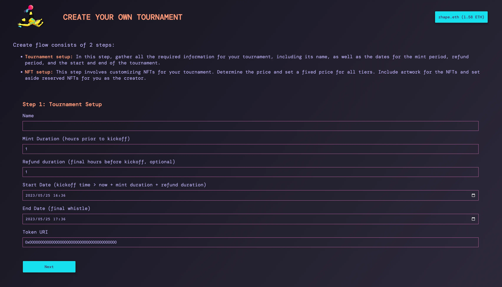
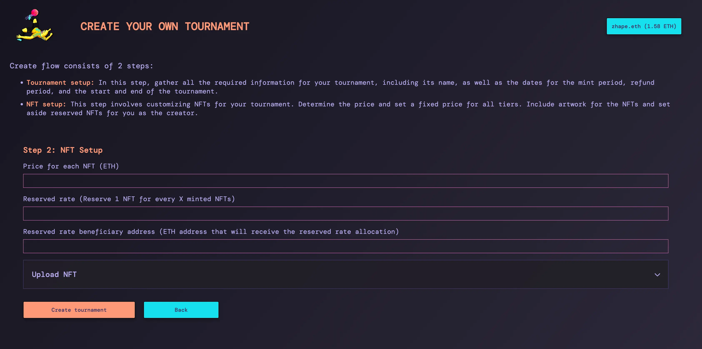
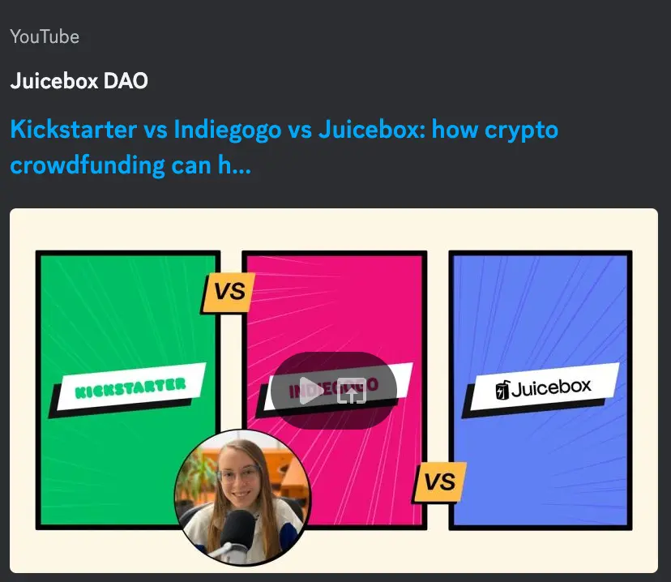
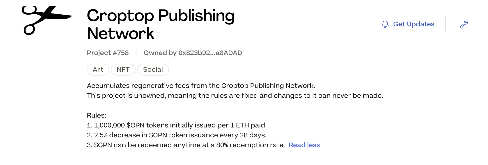

## Defifa 演示 - Kmac

Defifa 项目在去年底获得了 JuiceboxDAO 的资助并组织了一次世界杯游戏，这次游戏获得一定的成功。随后，他们又在 2023 年初组织了一场 NFL 季后赛的锦标赛。

在这一过程中，团队意识到创建锦标赛的概念应该对公众开放，而不仅仅限于自己的使用。这促使他们开始探索开发一个协议和平台，用于创建游戏及游戏室的参与体验。

Kmac 主导向 Seed Club 和 Base 生态基金申请资金支持项目的发展。此外，他们最近也准备向 JuiceboxDAO 提交类似的资助提案。

在周会上，Kmac 使用他创建的一个示范游戏介绍了 Defifa 锦标赛的游戏流程。这个游戏围绕 Spotify  2023 年 6 月份选出的播放量最高歌手来进行。参与者可以铸造代表不同歌手的 NFT，铸造的费用作为游戏的奖金池。奖金池的分配设计如下：50% 给选中了最受欢迎歌手的玩家，30% 给先中了第二名的玩家，剩下的 20% 平均分配给选择了第三到第五名的玩家。

锦标赛游戏按照以下流程展开：

1. 开幕式：铸造阶段，参与者可以铸造他们选择的 NFT。这个阶段，他们可以随时退出并获得退款。
2. 退款截止期限：参与者可以查看游戏的铸造状态并评估自己的获胜几率，他们在退款截止期限前都选择离开游戏并获得退款。
3. 游戏开始时间：游戏正式开始，资金池被锁定，不再允许退款。
4. 游戏结束时间：游戏结束，所有玩家一起验证游戏最终结果并传播上链。根据结果，资金池中的资金对获胜的 NFT相应提供价值支持。持有这些 NFT 的人可以选择销毁并获得 ETH，或保留 NFT 并在市场上交易。

### Defifa 的创建流程

在周会上，Kmac 展示了 Defifa 的新创建流程，并大概介绍游戏创建的两个步骤。

1. 第一步是设置游戏的名称、NFT 的铸造时限、退款期限以及游戏的开始和结束时间。

2. 第二步允许用户自定义锦标赛的 NFT，包括设置价格和设定分配给预定受益人的保留代币比例。

虽然创建流程仍在不断改进中，Jango 着重介绍了合约中两个值得关注的但仍未在用户界面中支持的功能：

- 支出限额：这个功能可以将游戏金库资金的一部分分配给慈善机构或其他 Juicebox 项目。游戏开始之后，就可以把资金分配出去，剩余的资金则用于游戏运行。
- 保留比例分配：用户可以为每个 NFT 等级或每个比赛团队指定一个保留代币受益人。例如，某支参赛队伍的 NFT 每十个会保留一个给某个受益人地址，而另一支队伍的保留 NFT 则分配给另一个受益人地址。

Jango 表示希望更深入探索合约的工作机制、用户的感受以及他们在使用过程中可能发现的应用模式。

此外，Jango 强调，过去举办的两次游戏中，相关的艺术作品除了作为金库提供价值支持的 NFT 之外，其实还有更重大的意义。这些富有表现力的游戏卡片或者可以长久在持有者钱包内展示自己，我们应该思考如何把这些作品与即使举行的游戏相结合来进一步扩大他们的影响力。

最后，Jango 提到，defifa.net 上的所有组件应该都可以与 juicebox.money 兼容，这样用户在两个平台都可以参与游戏。只要平台能够识别 Defifa 委托并创建解析 NFT 视图的适配器，就可以通过统一的交互和连接标准来实现不同前端对游戏的交叉访问。

##  社区能见度工作报告 -Matthewbrooks

Juicecast 的新一期节目Matthew 和 Brileigh 计划采访  [Planet](https://planetable.xyz/) 的开发者 Livid，他还在 Juicebox 上创建了一个叫 [Planetable Pinning](https://juicebox.money/@pinnable) 相关项目。

除此之外，他们还将会采访 [CryoDAO](https://juicebox.money/v2/p/501) 项目的团队。

为了提供更多用户资源，他们最近发布了几个视频和博文，发布了各种不同的指引。他们计划在下周的周会上进行演示。请继续关注更多更新和精彩演示！

## L2 和 Croptop 工作报告 - Jango

经过 0xBA5ED 和 Viraz 的努力，Bananapus 质押组件取得了很大的进展。我们期待在接下来的一周看到下一个更新。

关于 Juicebox 协议原定上周的 L2 部署，工作稍有延迟。因为团队决定将代码库分开来管理，即保持 Juicebox 原有 V3 代码库不变，另外创建/分叉一个专门用于多链项目的新库。一旦新代码库建立并运行起来，他们将争取把它集成到 Defifa 里面。

最近几周，Jango 一直致力于 Croptop 模板的更新。此外，他还在 Goerli 测试网络上推出了新的实验性 [Croptop Publish Network](https://goerli.juicebox.money/v2/p/758) 项目，作为一个没有项目方的出版中枢，支持把 P2P 网络传播的内容作为 NFT 来发布及铸造。

