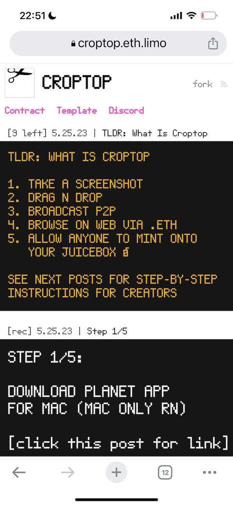
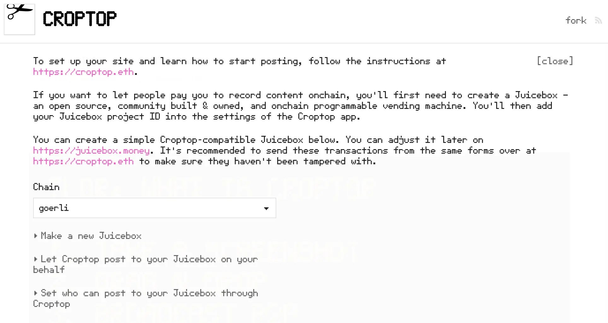
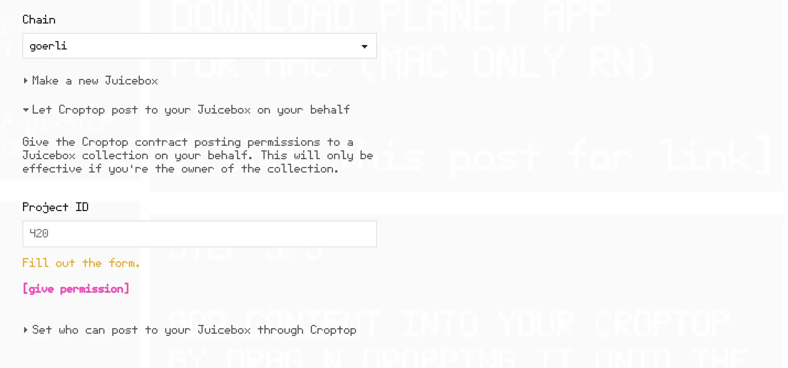
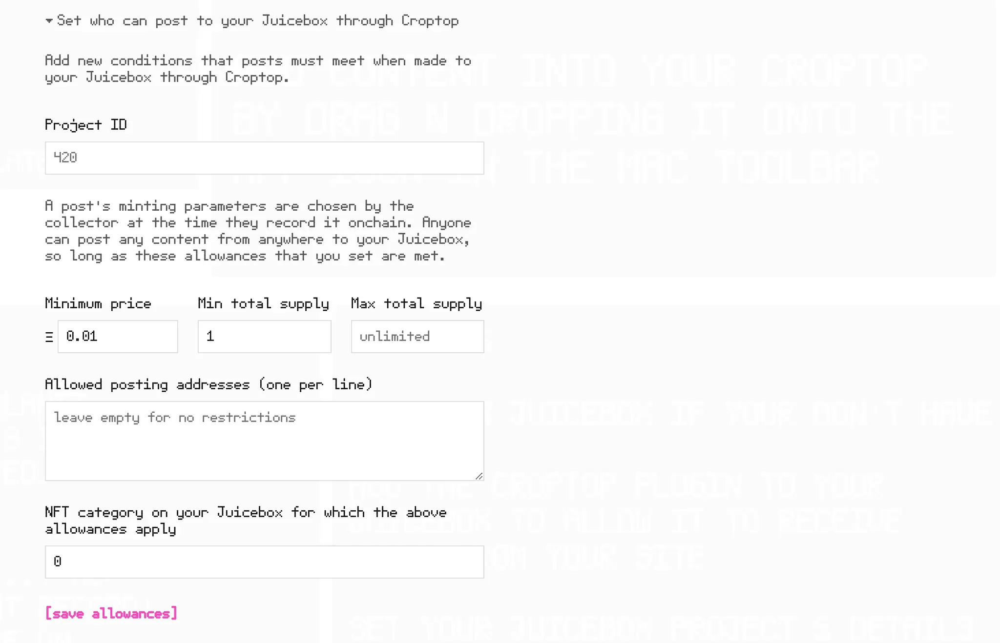
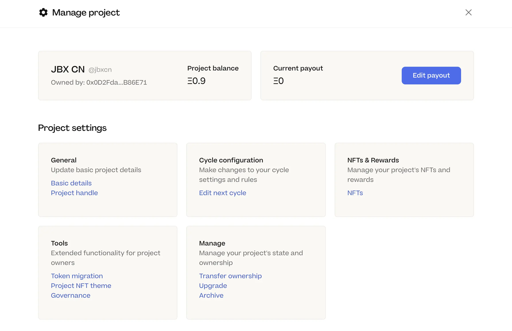
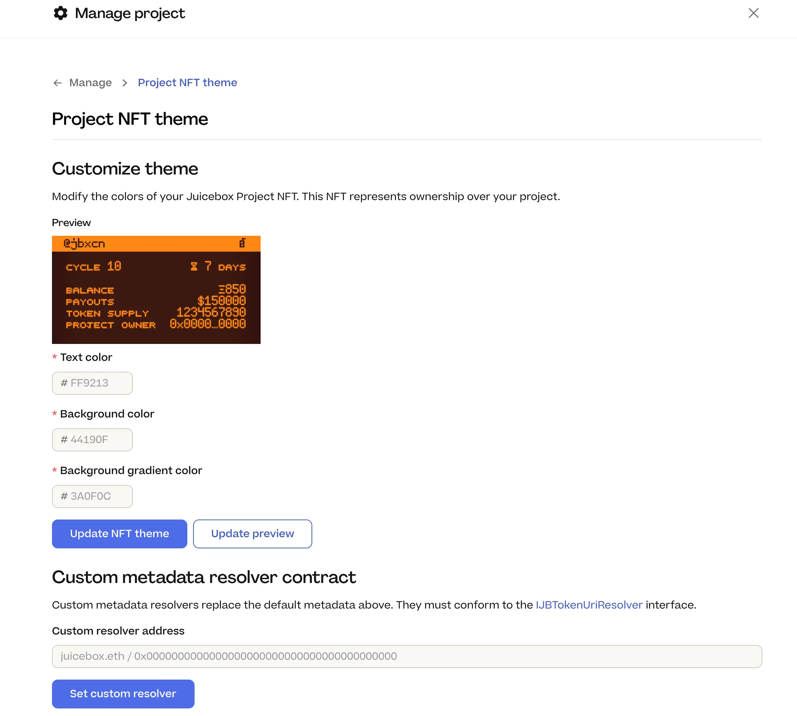
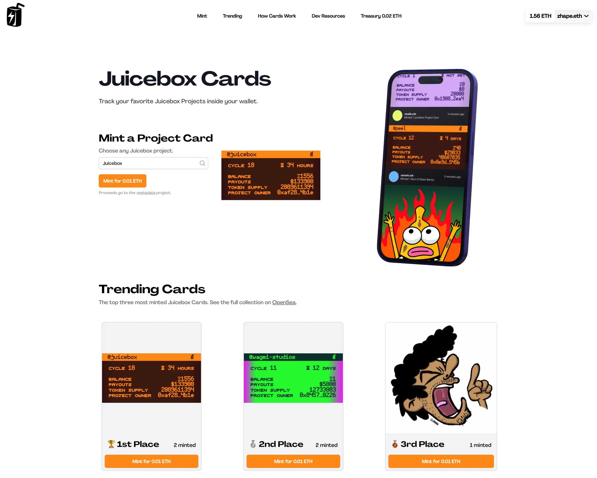
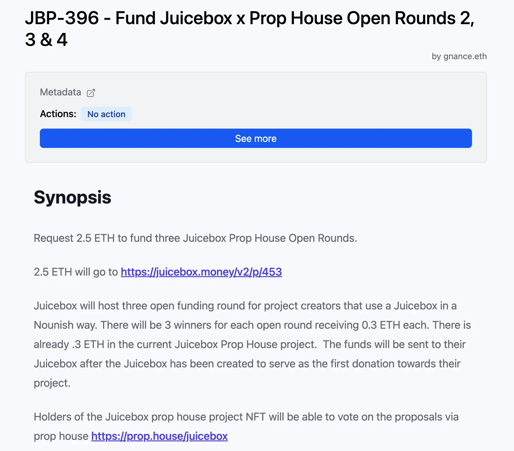
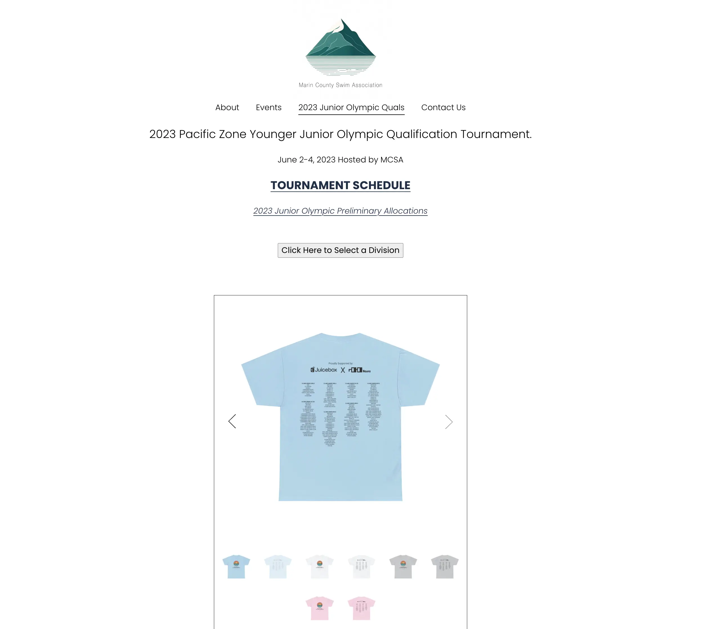

## Croptop 工作报告 - Jango

Croptop 的开发工作已接近尾声，总体已逐渐成型，Jaogo 很期待完成后正式发布并看看反响如何。

如果想尝试下当前版本的 Croptop 功能，你可以去到 [croptop.eth](https://croptop.eth.limo/) 并按步骤操作即可。

Jango 介绍，每个使用 Croptop 模板的网站都会在网页右上角有一个 `Fork` 按钮。点击这个按钮，大家就可以按以下步骤使用 Croptop 合约去中心化地把内容发布及铸造到区块链。

1. 选择你想要部署的区块链。目前仅支持 Goerli 测试网，接下来将很快会部署以太主网、Polygon 及其他 L2 网络。

2. 点击 "Make a new Juicebox"，可以快捷创建一个 Juicebox 项目，以便大家发布内容时向你支付费用。快捷创建流程中需要填写 NFT 系列的名称及符号，还有这个 Juicebox 项目的项目方地址。另外，还可以设定在你的项目上发布内容的最低价格、最低发行量和最大发行量等限制条件。人们在你的项目上发布内容时，可以自行设定该内容的价格及发行量等参数，但这些参数都必须符合你作为项目方最早设定的限制条件。

   

3. 下一步就是授予 Croptop 合约在你的项目上相当于操作员的发布权限。上一步创建项目完成之后，获得项目的 ID 并在这里填写并确定，就可以授予 Croptop 在项目上发布 NFT 的权限。

   

4. 最后一步是可选项，设置可以使用 Croptop 在你的 Juicebox 项目上发布内容的钱包地址，以及可以发布 NFT 的类别。

   

目前我们仍需要使用 Planet 应用来实现 Croptop 这个筹款途径，但 Jango 表示将会很快推出一款专用的 Croptop Mac 应用，会更直观易用。

如何你正在使用 Mac 操作系统，并且希望使用你的 ENS 名称来创建个人筹款网站，这是一个很好的述事方式。

## Defifa 工作报告 - Jango 和 Kmac

Defifa 团队一直想举办一次针对 NBA 总决赛的锦标赛游戏，但计划一再延迟，主要是由于前端开发人员不足。Jango 非常感谢 Aeolian 最近来到项目并帮助清理了一些前端的设置，使这个 NBA 锦标赛的计划变得可行。

Kmac 表示，由于 Aeolian 的协助，Defifa 的代码库得到全面重整，创建项目流程最终产品化，让团队可以真正地小规模地试验一些不同的游戏模式。他们的初步目标是设置一次自托管锦标赛，从而确定所有组件运行正常，之后再将创建流程开放给公众使用。

Jango 重申， Defifa 的特别之处在于不需要正式的预言机来确定比赛的结果，而是可以制定自己的规则并确定相应的分配机制，相信能够带来非常具有创新性的结果。

## Peel 工作报告 - Tim

目前 Peel 有两个主要的工作项目：项目页面重整以及项目设置改进。

项目页面重整方面，Peel 正就项目页面布局及可行性改进展开新的工作，同时引入一些新的功能，类似支持添加多个 NFT 或收藏器的购物车功能等。

关于项目设置，项目设置主页面目前已经上线新的布局，使页面导航更清晰。Peel 把设置里的一些选项单独分列出来，对用户更为友好，也更容易查找。

接下来，他们会致力于项目设置页面里周期配置及支出组件的改进。

## 项目 NFT 主题及 Juicebox 卡片工作报告 - Nicholas

### 项目 NFT 主题

Nicholas 早前编写了一个代币 URI 解析器合约，让项目方可以调整自己项目的元数据，或者设置自定义解析器来彻底替换掉协议默认的元数据设定。这个功能目前已经正式整合到 Juicebox.money 网站的项目设置里面，所有项目方都可以使用。

### Juicebox 卡片

Nicholas 还开发了一个 Juicebox 项目卡片产品，一个 ERC-1155 标准的合约，可以让用户铸造 NFT 来复制任何 Juicebox 项目的元数据并保存到自己的钱包，这样就可以随时及时地了解特定项目的情况变化。

 Nicholas 没有参加这次周会，因此他委托 Matthew 代为简短介绍了这一个功能，并呼吁大家去 [Juicebox 卡片的测试网站](https://juicebox-cards.vercel.app/)尝试使用这一功能。非常大家欢迎提出任何意见或反馈。

## Juicecast 播客工作报告 - Matthew 及 Brileigh

Matthew  和 Brileigh 在周会宣布发布新一期的 Juicecast 播客节目，这期节目参访了来自 [Planet](https://www.planetable.xyz/) 的 [Livid](https://twitter.com/Livid)，最近 Jango 开发的 Croptop 就是基于这个 Planet 应用。

在节目里，他们谈到：

- Livid 是怎样打造 最活跃的中国开发者社区之一 [V2EX](https://v2ex.com/) 的；
- Planet，一款帮助人们搭建去中心化 ENS 网站的开源软件；
- [Planetable Pinning](https://juicebox.money/@pinnable)，Livid 在 Juicebox 创建的一个项目，项目致力于打造向非中心化网站提供 IPFS 固定服务的基础设施；
- Croptop，一个他与 Jango 联手开发的实验性的 Planet 模板；
- Livid 对怀旧游戏的个人情怀及他利用 Internet Archive 创建的游戏数据库。

<iframe width="560" height="315" src="https://www.youtube.com/embed/0e6lWvKM2VI" title="YouTube video player" frameborder="0" allow="accelerometer; autoplay; clipboard-write; encrypted-media; gyroscope; picture-in-picture; web-share" allowfullscreen></iframe>

## Prop House 及 MCSA 工作报告 - STVG

周会当天，STVG 还参加了 Prop House 的推特空间，谈论他发起[要求赞助更多 Prop House 公开轮提案](https://www.jbdao.org/s/juicebox/396)并获得批准的整个流程。他计划于今年6、7 及 8 月共举办三次 Prop House 公开资助轮活动。

在同一个周期，他还提交了另一个[向水球比赛活动赞助 T-恤的提案](https://www.jbdao.org/s/juicebox/397)，该提案同样获得 DAO 的支持。这些比赛活动将由 STVG 创建的非盈利性 Juicebox 项目 [MCSA](https://juicebox.money/@mcsa) 主办。他觉得这次赞助将有助于在现实生活推广 Juicebox，并对支持提案的社区成员们表示感谢。

