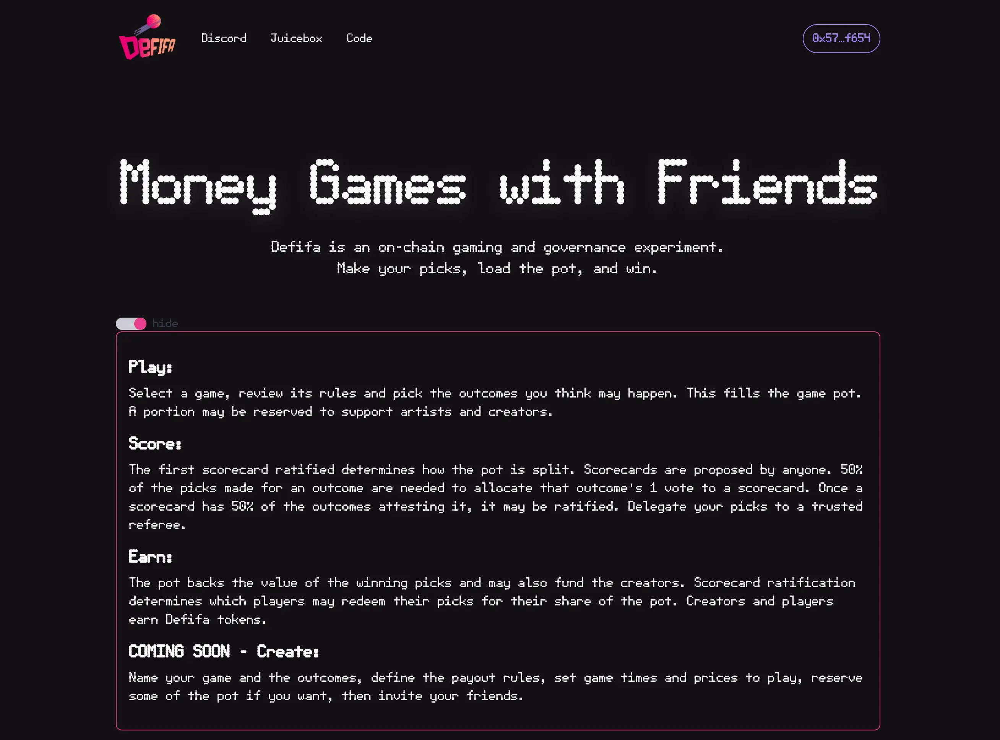
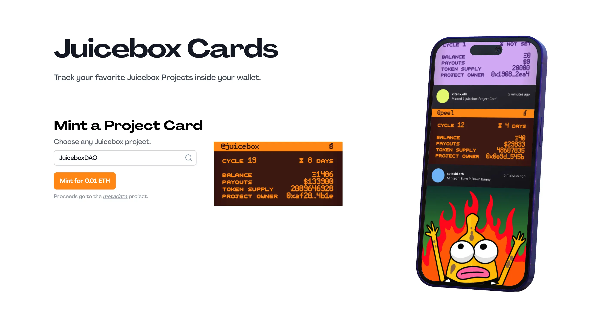
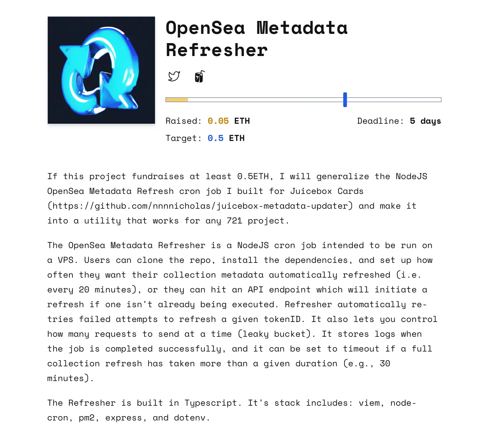
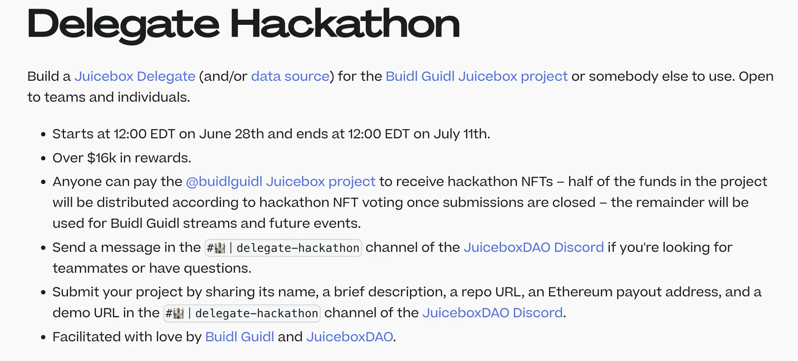

## Defifa 演示 - Kmac

Defifa 项目最近取得了许多进展，团队正准备举办一些小型的锦标赛，以确认协议机制和前端用户界面都能够正常工作，并同时希望能够获得一些用户的反馈意见。

周会期间， Kmac 邀请大家一起参与他用 Defifa 创建的一个随机抽奖小游戏。

Aeolian 最近加入 Defifa 团队，帮助修复了一些前端问题以及更新了代码库的几个子库。代码库大部分内容都是由 Blaz 和 Devian 去年 Defifa 初期的时候创建的，它们内在的技术组件与 Juicebox.money 正在使用的存在一定的差异。

据 Kmac 介绍，Defifa 的 NFT 全部都是动态生成的 SVG，可以实时反映游戏的各项信息，如 NFT 的铸造次数、游戏不同阶段等，这就意味着每个 NFT 都可以实时体现游戏的状态。

SVG 的开发主要由 Jango 负责，而 Kmac 则正在进一步推动支持用户上传图像，让这些 NFT 其中一面显示用户的定制图案，另一面则显示反映游戏状态的全链上生成 SVG。

他们希望最终能够实现在 NFT 内展示游戏的当前状态，这样一来不管用户是在钱包内还是在类似 OpenSea 这样的市场上查看这些 NFT，都能够对游戏的进度有一个大致了解，又或者在游戏结束之后可以看到 NFT 的支撑价值方便进行交易。

另据 Jango 介绍，Defifa 项目即将要实现的比赛结果认证流程是基于 Governor Bravo 合约开发的，但针对 Defifa 进行了专门的优化和改良。他认为，如果其他人如果有以状态机形式来实现的游戏机制，也可以考虑重复利用这个组件进行开发。

## 回购委托审计报告 - Dr.Gorilla

[在 Code4rena 举办的审计比赛](https://code4rena.com/contests/2023-05-juicebox-buyback-delegate#top) 已于 5 月 23 日成功结束。Dr.Gorilla 表示，审计工作流程还没有完全结束。我们的合约开发组已经复核过这些审计结果并相应地进行确认或提出质疑，现在还需等待 Code4rena 方面发布最终的审计报告。到目前为止没有找到高严重度的漏洞，发现了一些中等程度的问题和提出了一些 gas 优化建议。

Dr.Gorilla 表示他已经开始实现相关的修复和改进，计划本周末前能够完成工作。

## 元数据刷新演示 - Nicholas

Juicebox 卡片功能支持用户铸造 NFT 来复制任意 Juicebox 项目的元数据并保持同步更新。这个项目由 Nicholas 开发，目前在 [Juicebox.cards](https://juicebox.cards/) 网站上可以试用，但目前还没有最终开发完成，因为他计划重写合约来实现更多内容。

Nicholas 最近在编写一个 Juicebox 元数据的更新器。因为 Juicebox 项目的元数据是链上生成的，这些数据会随着时间和周期不断发生变化。但是这些项目 NFT 在 OpenSea 或者调用 OpenSea 数据的其他网站上展示的时候，元数据不会实时刷新，而是用储存在 OpenSea 的缓存数据来展示。这个元数据更新器能帮助刷新在 OpenSea 上的元数据，确保展示的数据都是最新的。

Nicholas 还创建了一个[针对这个功能的 Blunt 筹款活动](https://blunt.fund/rounds/519)，测试一下大家有没兴趣把这个功能通用化，支持 OpenSea 上面的所有 721 项目。

## 黑客松活动呼吁 - Filipv

Filipv 正与来自 [BuidlGuidl](https://buidlguidl.com/) 的 [Austin Griffith](https://twitter.com/austingriffith) 协调，准备在 Juicebox 上举行一次新的黑客松活动。他们计划用 [BuidlGuidl 的 Juicebox project](https://juicebox.money/@buidlguidl) 里[上次黑客松](https://docs.juicebox.money/hackathon/)的剩余资金，再加上 Filipv 计划提案向 JuiceboxDAO 申请的拨款，以 JuiceboxDAO 和 BuidlGuidl 合作的形式来实施这次黑客松活动。

此次黑客松旨在鼓励开发新的 Juicebox 委托及/或数据源，用于 Juicebox 生态系统的建设，关于此次活动的草案可在[这里](https://docs.juicebox.money/delegate-hackathon)找到。

在周会上， Filipv 呼吁对资金委托或者数据源感兴趣的人到我们的 Discord 提出意见或建议。

