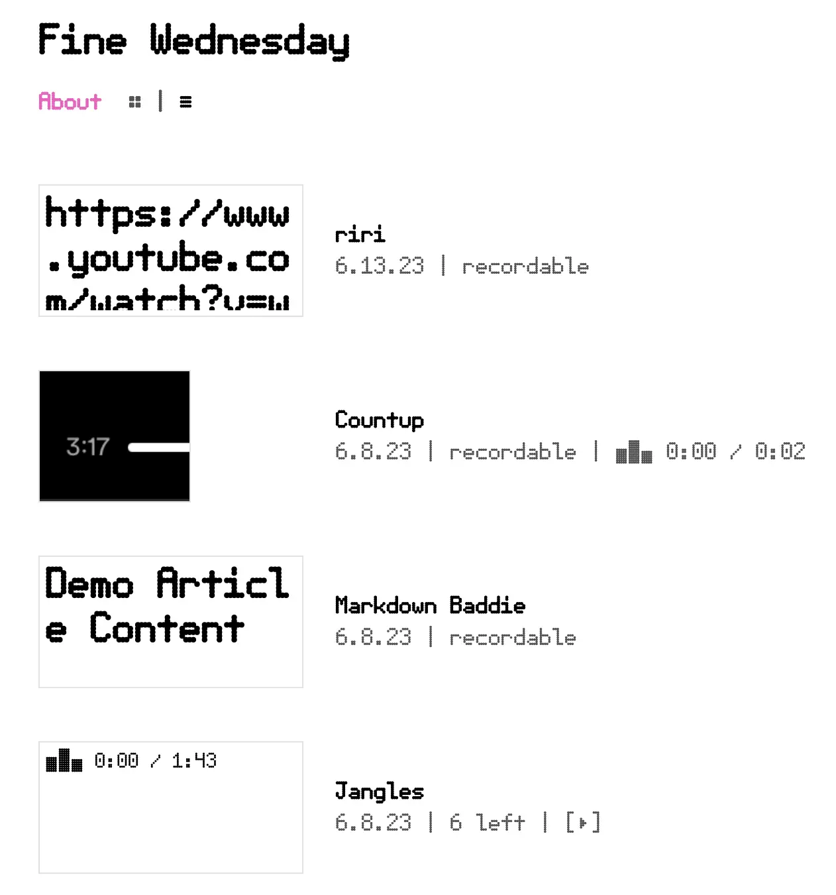
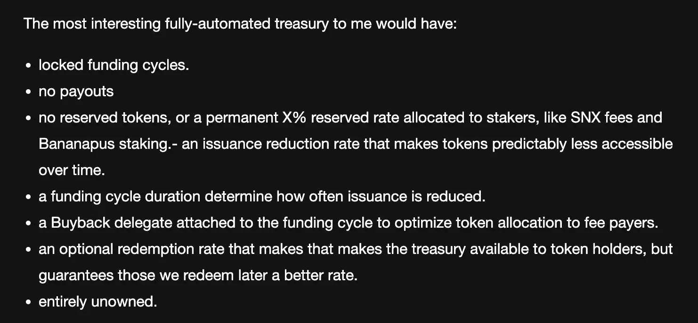
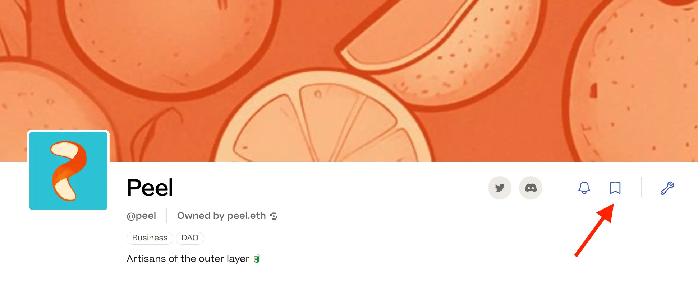
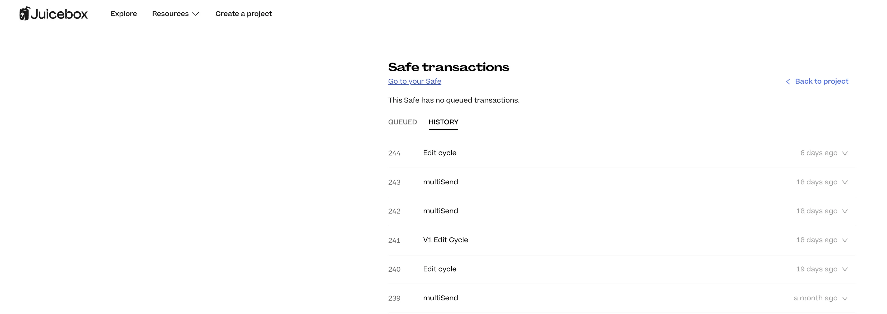

## Croptop 工作报告 - Jango

Jango 及 Livid 在 Croptop 模板上做了大量的工作，来支持音频、视频和 MD 格式的博文，这样一来，用户就可以在他们的 ENS 网站上发布各种内容并把它们连接到自己的 Juicebox 金库。

他们在 CID 上花了不少功夫来确保内容能够正确展示并传递到 NFT 的发布及铸造环节。

在周会上，Jango 向我们展示了[用 Croptop 模板创建但尚未关联到 .eth 域名的一个网站](https://ipfs.io/ipns/k51qzi5uqu5di0scaadzossc8tf6bupz2hbfvpfq56sg9g8afn5bnauuyab8zg/)， 并展示如何把网站上的不同格式的内容发布和铸造到一个 Juicebox 项目上。

Jango 最近一直在 Defifa 和 Croptop 两个项目的金库设计上尝试一些不同的做法，在这个过程中触发了他对 JuiceboxDAO 早期金库设计的一些反思，延伸到他在这方面的心得、将来应该着重考虑哪些事情以及他渴望要做的新试验等。Jango 在他个人的 ENS 域名网站上撰写了博文[金库设计反思](https://blog.jango.eth.limo/38C20F69-0391-4C54-AA5F-9658265A204C/)来解释他的这些想法。

文中，Jango 提出了一些他觉得应该在类似 Croptop 和 Defifa 的项目上行之有效的一些金库设计方案。但他同时也认为，这些设计仍需进一步进行探讨，因此他鼓励有疑问或感兴趣的人加入讨论并分享自己的思路，希望大家能够共同在这个方面实现更好的解决方案。

周会上，Jango 举例说明一个潜在的 Croptop 金库设计方案。

任何人使用 Croptop 模板来发布内容到 Juicebox 项目，[Croptop 发布网络项目]((https://goerli.juicebox.money/v2/p/1016))都会收取 5% 的费用，然后按 100 万个 $CPN 代币 / ETH 的比例向付款方发行项目代币，发行比例每个周期（28天）递减 4%，两年内把 10% 的 $CPN 总发行量保留给项目的多签钱包，再预配置一个两年后生效的周期去除保留代币分配；70% 的赎回比率让 $CPN 代币持有人必要时可以选择赎回金库内自己的份额，最好再在周期内附加上回购委托来保证付款能以最优价格获得 $CPN 代币。

然后抛弃掉项目的所有权，或者转到没有变更配置权限的某个钱包地址。我们用这个试验来测试是否能够找到足够的激励方案来把 $CPN 代币分配给愿意参与项目管理的开发者。这个方案会把大部分资产保管在金库内，让为项目付出（捐款或工作）的人感到一定的保障，金库内的 ETH 也可以用于某个特定的用途，而每个人都按相似的规则来参与其中。

如果能够实现，Jango 希望“开发者乐于开发、社区安于凝聚以及网络真正实现协同效应”，大家不会有太多的顾虑，所有人利益是平等一致的。

## ETH 上海线下聚会构想 - LJ

LJ 介绍，他正计划在 6 月26 - 30 日ETH 上海期间举办一个 Juicebox 中文社区的线下活动。这个活动的计划如下：

1. 举办线下欢乐时光，并提案寻求 DAO 在资金上的支持；
2. 与其他构建公共产品的 DAO 一起举办研讨会，介绍 juicebox.money 及大家可以如何利用 Juicebox 来筹集资金，并一起探讨现有 Juicebox 项目治理方案的改善；
3. 在一些商品（如 T-恤）上印上 Juicebox 的图案。

## Peel 工作报告 Aeolian

Latest work by Peel team: 最近 Peel 团队的工作成果如下：

1. Peri 开发的收藏项目功能。在项目页面上，用户连接钱包之后，可以点击“收藏”按钮把项目保存到个人帐户里面，方便以后查找。

2. JohnnyD 对项目的 Safe 多签页面做的改进。如果某个 Juicebox 项目由多签钱包控制，在 juicebox.money 界面会有专属的 Safe 页面，人们可以查看多签执行的交易或者所有的交易记录。

3. 由 Wraeth 做的项目页面改善。

4. Aeolian 实现了网站对新的 JBTiered721Delegate V3.3 合约（NFT 奖励）的支持，新创建项目将会使用最新版本的相关合约。

## Juicecast 播客新节目 - Matthew 及 Brileigh

Matthew 及 Brileight 最近接受 Tally 的 Frission 主持的 DAO Talk 的采访，谈论了关于 Juicebox、关于作为 DAO 贡献者的感想、关于去中心化媒体以及如何为 DAO 创作内容等方面的话题。

<iframe width="560" height="315" src="https://www.youtube.com/embed/GS-qoOZQ7F0" title="YouTube video player" frameborder="0" allow="accelerometer; autoplay; clipboard-write; encrypted-media; gyroscope; picture-in-picture; web-share" allowfullscreen></iframe>

同时，他们也邀请来自 Tally 的 Tommy 和 Frission 二人组来接受 Juicecast 播客节目的采访，嘉宾们发表了他们对于链上 DAO 未来的一些看法。新的一期播客节目于周会后不久已经正式发布。

<iframe width="560" height="315" src="https://www.youtube.com/embed/aIoPZD2ki7Y" title="YouTube video player" frameborder="0" allow="accelerometer; autoplay; clipboard-write; encrypted-media; gyroscope; picture-in-picture; web-share" allowfullscreen></iframe>

## 回购委托工作报告 - Jango

Jango 介绍，Dr.Gorilla 最近一直针对 Code4rena 审计中发现的问题进行改进，Jango 也于本周参与了这些改进的审核。目前情况进展良好，我们的合约团队处理完审计中发现的问题之后，回购委托就可以用于 Juicebox 的各个项目了，任何人也都可以提案建议 DAO 来使用这个产品。

Jango 希望先在一些试验性的项目上尝试使用这个委托，但表示并不急于提案让 JuiceboxDAO 正式部署使用。他表示尽管自己很希望早点产品化这个产品，但同时由于这个委托有一些非常重要的功能，他会更谨慎保守地对待它的正式使用。

他同时表示，由于在保留代币及对外代币发行机制上的变化，这个委托可能会对贡献者管理、平台费用收取以及投资者运营等方面带来重大的改变。
