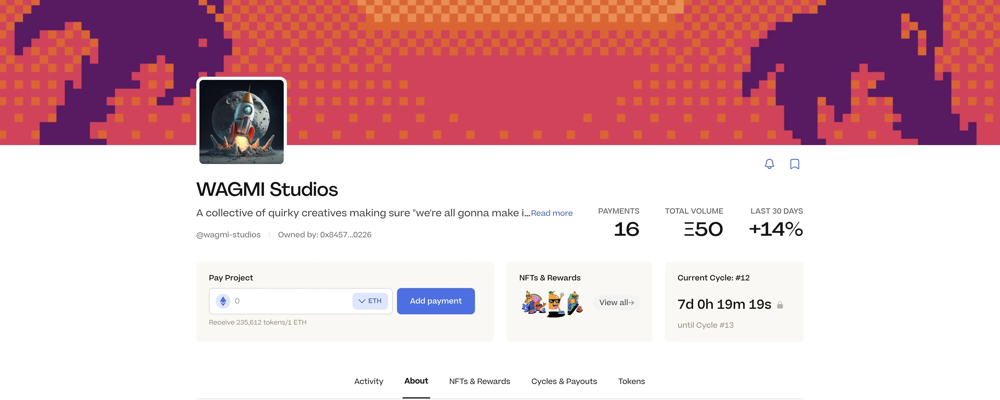
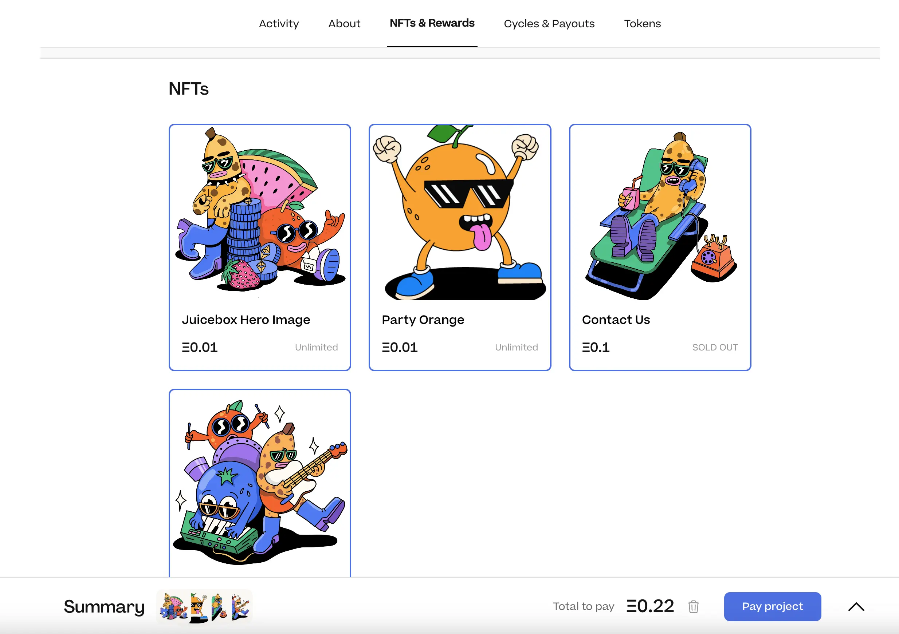
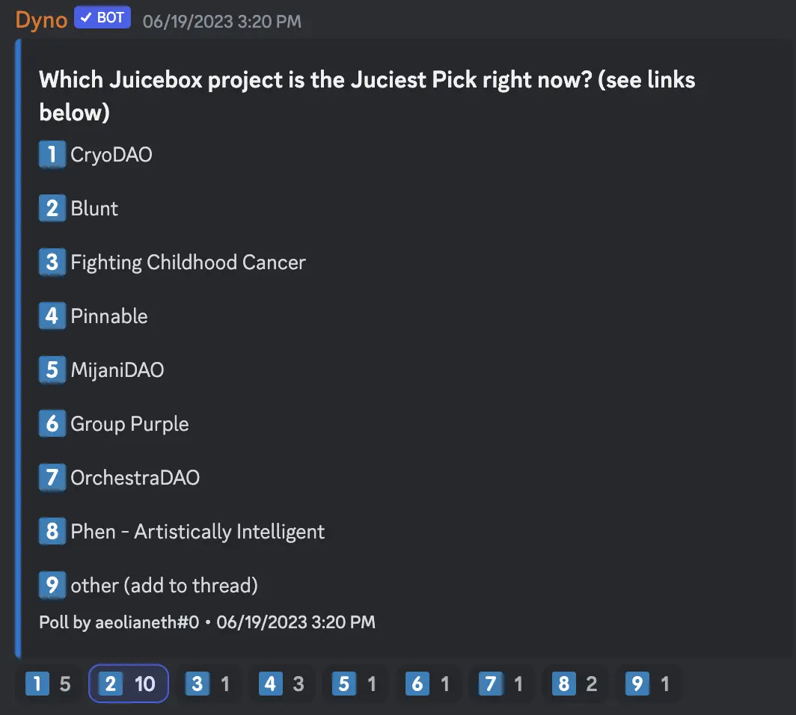
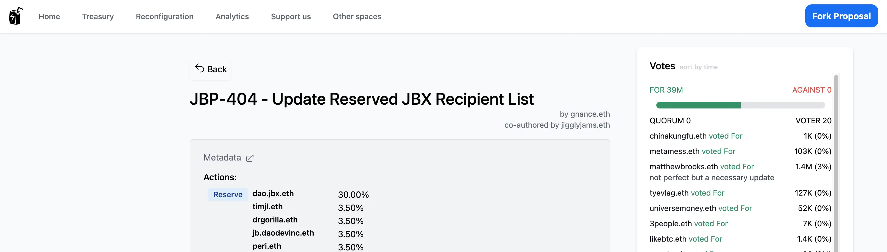
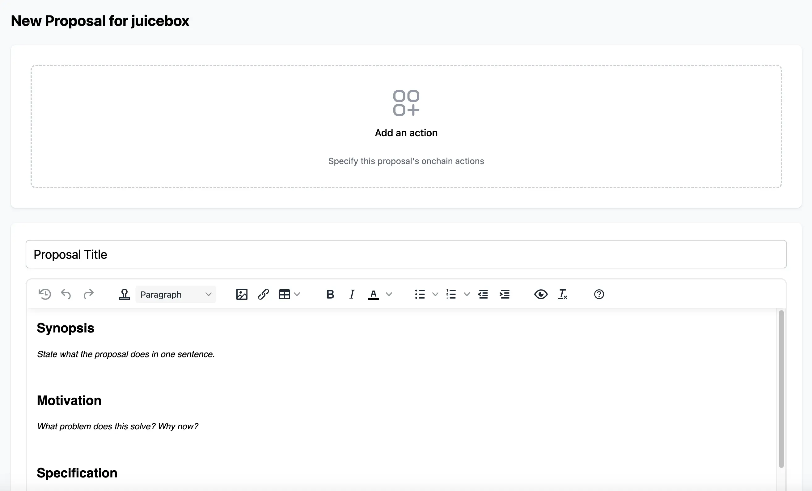

## Peel 工作报告 - Tjl

TJl 简单介绍了一下 Peel 团队最近对项目页面做的变更，这个工作是整个团队共同努力的结果。

部分主要的变更目的是要突出项目的核心信息，并把其他信息整合到不同的标签，如活动、关于、NFT、周期、代币等等。同时还提供了 NFT 和奖励的快捷链接，方便用户导航。

最大的变化是 NFT 购物车，类似我们在现实生活里的购物体验，用户现在可以添加多个 NFT 到购物车，再一次性地进行付款。

接下来的两周还会有一些新增的功能推出，其中包括支持项目方在项目页面上发布项目的动态更新，同时也支持社区成员添加评论来参与互动。

同时“关于”区域将很快会重新调整，支持添加富文本 markdown 功能，用户将可以添加标题及其他不同的文本风格、图像等等。

## 果汁精选投票 - Aeolian

Aeolian 在我们 Discord 的讨论频道发起了一个投票活动，让社区成员们投票选出我们主页上的果汁精选区块将要展示的项目。

以下是果汁精选区块目前的展示情况，很快将会按以上票选结果来重新上架不同的项目。

## ETH 上海聚会报告 - LJ

LJ 介绍，他原本在 ETH 上海的活动期间举办研讨会的计划取消了，这是因为 ETH 上海的主办方由于某些原因把所有的活动都更改到了线上举行。

但他预期仍然会有一些人这个期间会去到上海，所以他计划届时举办一个线下 Juicebox 欢乐时光的休闲聚会。

LJ 还介绍，他一直与 Filipv 合作推出一些法律文书的模板，这些模板将会提供给项目方用于创建他们的合规实体。他们最近在搭建一个网站，支持下载这些模板并通过加密货币钱包来进行签署，与此同时他们还创建了 GitHub 代码库，大家可以通过合并请求来提交自己的模板并，并让其他人来审核及批准。

## ETH Waterloo 演讲 - Nicholas

Nicholas 将于 6 月 23 日 在 [ETH Waterloo](https://ethglobal.com/events/waterloo2023) 活动上发表演讲，介绍他开发的代币解析器、Juicebox 协议元数据合约。他还计划详细说明这些合约的工作机制，介绍通过链上元数据实现的 Juicebox 项目卡片这样的炫酷功能，以及分享一些大家可以轻松复制并编写自己的元数据的模板合约。

## Nance 工作报告 - Nicholas

Nicholas 介绍，最近以来 Nance 团队对我们的专用治理网站 jbdao.org 进行了大量的改进。

其中新增了一个 “分叉提案”的功能，大家使用这个功能可以很容易地复制任意某个提案，并生成自己的新提案。

另一个功能是支持提案作者在提案内添加行动（执行细节），包括具体的链上交易或者重新配置参数等等，提案通过之后应该就会按这些细节来执行。这些执行细节会以数据参数的形式显示在提案的顶部，随着 Nance 的迭代，以后可能会支持通过新的接口传送到协议，就可以直接对项目进行重新配置，无须再手动创建相关的交易，相应降低执行提案时候出错的风险。

