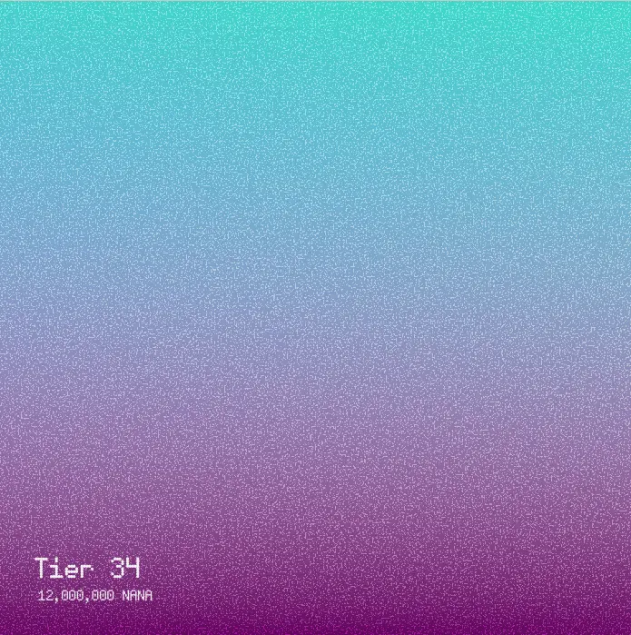
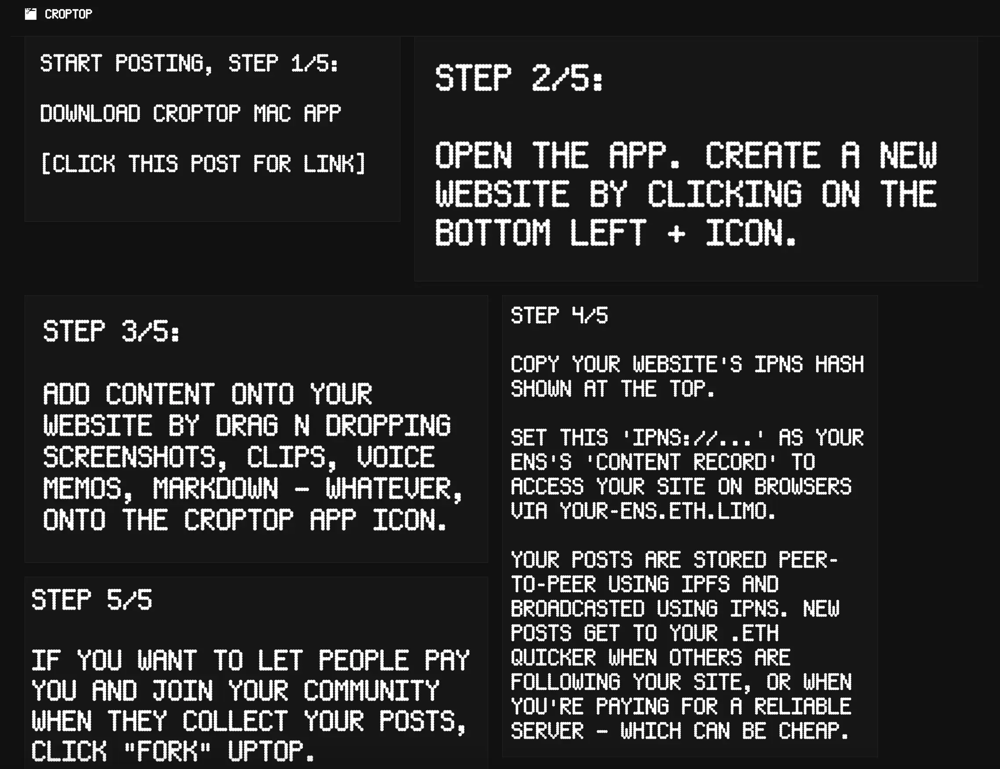
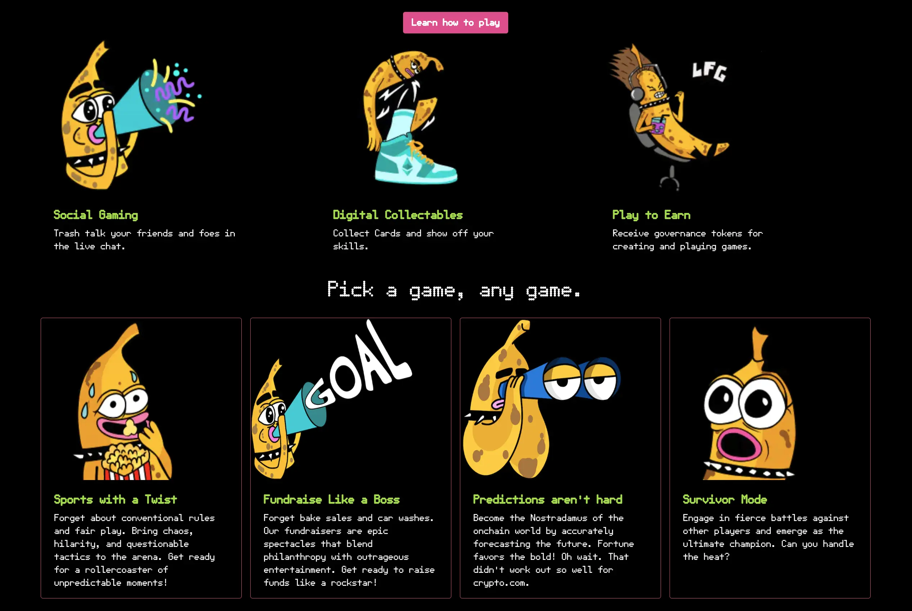
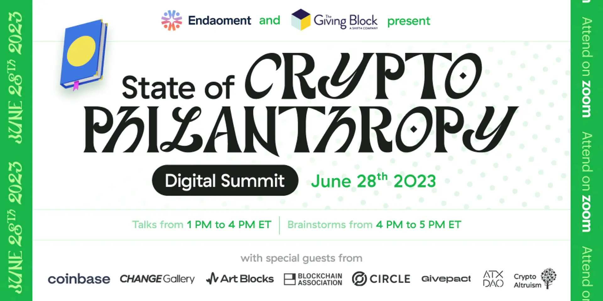

## ETH Waterloo 报告 - Nicholas

Nicholas 上周参加 ETH Waterloo 活动并发表了演讲。演讲的内容主要包括代币 URI 解析器以及用户如何使用链上元数据来创建自己的解析器。

同时他还参与了黑客松并创建了一个链上 SVG 的项目，他的项目是活动中获得奖励的 11 个项目之一。

ETH Waterloo 活动上有一些赞助商，包括 Gnosis Chain、World Coin、Polygon、Sismo 及 Hyperlane 等，在活动上分别推广零知识或跨链的叙事和应用。Nicholas 觉得赞助这一类活动对推广协议或者 API 的应用是有正收益的，或许我们可以考虑赞助此类活动并把参与要求规定得具体一点，让参与者使用并深入了解我们的 Juicebox 协议。

对此， Jango 表示赞同，并表示，即使从审计的角度来看，我们也可以从这些活动与用户的接触、来自他们的反馈及因此实现的产品迭代中获益良多。鼓励更多人尝试在我们的协议上搭建还能够帮助我们提升文档质量及开发者的体验。

Nicholas 觉得赞助活动对我们最大的挑战可能会是如何现场配备技术人员，既可以提供黑客松的技术支持也可以参与比赛的评审工作，这非常有助于用户在构建时更多地整合我们的协议。

他还觉得 ETH Global 是一个很值得我们合作的活动，而且因为 ETH Global 每个月都有新的活动举办，我们一旦做出参与的决定，不用等待太长时间就可以付诸实行。

## Delegate 黑客松工作报告 - Jango

我们和 Buidl Guidl 合作举办的 Delegate 黑客松将于本周正式开始。Jango 很乐意与其他有意向开发 Delegate 的人一同过一遍开发的流程。Delegate 亦即委托，基本上就是一些执行特定任务的代码块，每次金库收到付款或者有人尝试从金库赎回时，这些代码就会被触发。

他很期待能见到一些更了解我们生态系统其他方方页面的人来参与合约代码的编写。这些委托既可以用于一些非编程目的，也可以用于炫酷的编程项目。

之前，TJL 问到关于这次黑客马拉松的前端应如何处理，又或者每个参赛者都需要创建 Juicebox 项目来参与。Jango 认为由于这次黑客松的举办，下周可能会出现很多 Goerli 项目，其中不乏一些看起来非常古怪的，主要是由于它们部署的委托可能还不太完善的缘故。如果我们发现一些有趣的个案需要我们在前端给予支持的时候，我们肯定希望提醒大家伸出援手的。总的来说，当前我们的前端支持所有委托的触发的。

对于 juicebox.money 本身而言，很难提前预计黑客松具体会引发什么样的情况。即使前端辨认不出来某个项目的某个数据源或委托，但还是可以进行调用的，所以人们还是可以进行付款，并且清楚是正在试验自己的原型化产品。

Jango认为可以考虑为其中一些项目提供轻量级、单屏界面，更加针对具体用例。他指出，最坏的情况下，我们还可以通过提供一些良好的文档。

## Bananapus 演示 - 0xBA5ED 及 Jango

Jango 介绍，Bananapus 是一个专注于L2（二层网络）开发的项目，它尝试实现 Juicebox 在 L2 网络的正常运作。而其中的重要部分如何让关心某个代币或组织的人的跨链操作变得合理可行。

这个系统的先决条件是要为 Juicebox 项目代币构建一个质押组件。尽管这些代币可能还有其他用途，但实现跨链对我们的 L2 部署将非常有帮助。

Bananapus的质押工作方式是，与当前以 ETH 为作为 NFT 的定价基准不同，它将使用任意 Juicebox 项目的 ERC-20 代币作为支付终端的定价基准，例如 JBX 支付终端。Bananapus 的质押心理模型是，用户可以向 Juicebox 金池支付 ERC-20 代币来铸造 NFT，也可以赎回 NFT 从金库取回这些代币。我们可以沿用 juicebox.money 的用户界面和金库的所有功能来建模这一流程。

用户通过质押 ERC-20 代币铸造出来 NFT 之后，我们还可以为 NFT 添加更多用途，如把其他项目金库的保留代币分配给质押者。比方说，我们可以将 JuiceboxDAO 的 10% 保留代币分配给当前质押了 JBX 并持有相应 NFT 的人。

在周会上，0xBA5ED 展示了他们最近生成的一些 NFT 图像。这些图像是链上随机生成的 SVG 文件，文件内还包含一些区块链的信息，例如该 NFT 的层级和购入成本等。

这些 NFT 是 Bananpus 的默认设置，因此任何人都可以轻松部署自己的项目代币质押方案，并将质押奖励发送到这些 NFT 内。

就合约而言，从 ERC-20 支付终端铸造和赎回 NFT 基本上已经准备就绪，随时可以部署和使用，但目前仍需要前端支持才能在用户界面中使用这个 ERC-20 支付终端。

这将是我们首个使用 ERC-20 支付终端的具体用例，Jango建议我们可能应该考虑先一起把 JB ERC-20 终端整合到一个项目（Bananpus）中，并测试其工作是否正常，然后再添加到项目的创建流程中，开放给所有项目创建者使用。我们还可以开发一个项目部署合约，支持轻松创建内置质押解决方案的完整项目，着重于创建质押相关的项目。

## 回购委托工作报告 - Jango

Jango 对 Dr.Gorilla在 Code4rena 审计比赛后清理代码工作表示感谢，同时也肯定了 Viraz 为解决一些边缘案例编写最终测试的工作。

合约团队针对一些不足之处进行了改进，以便让类似支付委托的部署使用变得更加简单。数据源如果可以访问并向其调用的委托传递信息将可以让使用进一步简单化。因此，团队最近一直在加紧推进支付终端版本 3.1.1 的开发工作。他们正处于最后阶段，计划部署到 Goerli 测试网并进行一些测试工作。

由于回购委托是代币运作的核心功能，Jango 认为对这些不足的处理需要更加谨慎，确保代码更加清晰易懂，让人们可以理解并构建类似的功能。

此外，由于 Croptop 和 Defifa 这两个项目都是无主项目，并不会进行外部支付，而是更加着重于赎回机制的使用，而赎回率可以看作对赎回代币持有人收取的费用，并且赎回也会导致资金从生态系统中流出。因此在探索这些项目的金库设计模型的过程中，Jango 考虑，对于类似 Croptop 或 Defifa 这样赎回为主的项目，如果项目设置的赎回率低于 100%，应该同样收取 2.5% 的 Juicebox 费用，费用的收取可以通过回购委托来进行操作。

## 法律模板仓库 - LJ

LJ 正在与 Filipv 合作开发一个法律模板网站，网站会构建一个模板库，收集及展示经律师事务所审核的法律模板。

他们希望让这一努力更具合作性质，因此他们将创建一个 GitHub 代码库，人们可以通过 PR 提交模板。这些模板经过某个委员会的审核批准后，将被发布在 GitHub 代码库及模板网站上，那些不熟悉 GitHub 操作的人可以在网站下载自己需要的模板。

有些项目创建者可能不清楚自己需要哪种类型的模板，他们可以访问网站并按不同类别来查找，类似雇佣合同和投资合同。目前，他们主要提供商业和企业合同，但以后他们希望提供更多格式，例如供自由职业者和工作室的从业人员使用，类似顾问协议或服务协议这样的合同。

成立建立这个模板空间之后，他们的下一步计划是涉及传统世界中的法律结构，例如帮助 DAO 根据不同司法管辖区的不同需求创建一组实体的法律包装。

LJ还表示，他们还希望能够开发一个可以执行法律模板的编码合约，这也是他们的工作目标之一。这样一来，他们不仅可以提供纸质合同，还可以提供与法律合同协作或同步的智能合约。

## Croptop 模板工作报告 - Jango

Croptop 的新版 Mac 应用程序已经开发好了。请访问 [croptop.eth.limo ](https://croptop.eth.limo/)并按照下图的说明进行操作，就可以尝试“自行搭建，可通过 .eth 地址访问，并自带内容源和收入流功能的个人网站”。

目前有一个 [Goerli 测试网版本的 Croptop 发布网络](https://goerli.juicebox.money/v2/p/1016)，它是一个主网络项目，向创建自己的 Croptop 网站并铸造 NFT 的人收取一定的费用。

这些 .eth 域名网站的所有者可以通过点击使用 Croptop 模板创建的网站上的“fork”按钮，来创建自己网站相应的Juicebox项目，并授权 Croptop 合约来代表他们铸造 NFT。同时他们还可以设置在自己的项目上发布 NFT 的条件和参数。

## Defifa 工作报告 - Jango

在周会上，Jango 分享了关于 Defifa 的一些进展情况，这个项目更注重金库的管理，特别是以赎回为主金库的管理。他一直在探索以合法和符合会计准则的方式处理这个问题，并与一些值得信赖的法律专家进行了相关的讨论。

Jango 对在 Defifa 和 Croptop 在确保合法性和规范性的同时实现这一概念感到非常兴奋。如果这个方向证实可行，我们将与我们的社区，还有像 Blunt 这样运行更开放式资金管理的项目，来分享这些经验。我们肯定可以选择逐渐实现自动化的方式，但目前来说，我们先要验证这些想法。

与此同时，Aeolian 和 Kmac 一直在进行一些卓有成效的前端加强工作，Filipv 在改进 Defifa 和 Blunt 的使用指引方面做了非常出色的工作，降低了用户理解门槛。请访问 [defifa.net](https://www.defifa.net/) 了解我们产品原型的当前状态。

Croptop 和 Defifa 都需要一个回购委托（buyback delegate），而回购委托本身则依赖于支付终端作为前提条件。我们当前的重点是确保这些功能尽快推出，一旦这些功能就位，我们可以预期将会创建出很多类似的项目。

## 使用案例视频 - Matthew 及 Brileigh

Matthew 和 Brileigh 在这次周会的当天发布了用于慈善和非营利组织的第二个 Juicebox 使用案例视频。接下来，他们计划制作另一个用于开源软件的 Juicebox 使用案例视频。

<iframe width="560" height="315" src="https://www.youtube.com/embed/FfXhLQ_rtEU" title="YouTube video player" frameborder="0" allow="accelerometer; autoplay; clipboard-write; encrypted-media; gyroscope; picture-in-picture; web-share" allowfullscreen></iframe>

## 加密慈善现状活动 - Bruxa

Bruxa 介绍说她正在为 Endowment 策划一个名为“加密慈善现状”的活动，这对她来说是一个非常愉快的经历，因为活动邀请到慈善加密生态系统中的很多知名人士，他们来自 Coinbase、Art Blocks、Change Gallery、Blockchain Association、Circle、Givepact 等平台。

Bruxa表示希望能够创建一个关于可行性、数据和未来预测等方面吸引眼球的对话。她邀请关心这些问题的人参加这个活动，因为她认为对所有创建的人来说都是相关的，而且这是一个很好的提问机会。

