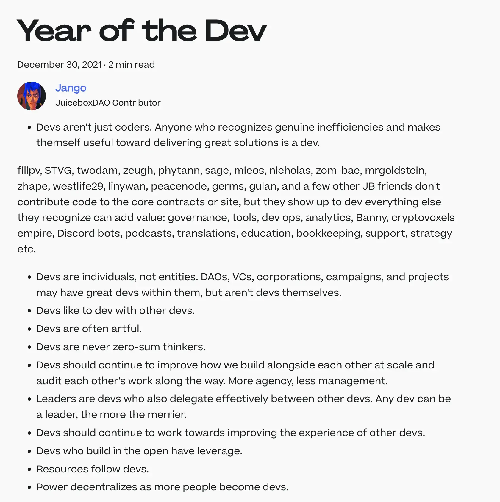

## Juicebox 两周年回顾

### 发展历程

At the beginning of this town hall, Jango reminded us that, July 15th this week marks the 2nd anniversary of the deployment of the Juicebox protocol. It was an excellent opportunity for us to reflect and share our feelings about this journey.

周会开始时，Jango提醒大家，本周 7 月 15 日是 Juicebox 协议发布两周年纪念日。这是我们一起回顾并分享这段旅程感受的一次绝佳机会。

Jango appreciated how this community tended to manifest mostly on GitHub in general, which has been a theme since the beginning. This, along with propogating Bannys, had been our two primary modalities. However, he suggested we consider how we might relate more to the events in various local communities, and to ourselves as individuals spreading around the world with our own respective local communities. As we shift towards more application-oriented development, building stronger relationships will play an very important role.

Jango 很高兴我们社区主要在 GitHub 展现各项内容，从最开始这就是我们的一个主题。这一方式，以及通过 Banny 传播，成为我们的两种主要展现自我的方式。然而，他建议我们考虑如何更多地参与到不同地域社区的活动，并作为遍布全世界各地的个体在各自的社区进行行传播。随着我们的开发工作转向更偏向应该，更紧密联系的建立将会起到非常重要的作用。

The consistent cohort of individuals who feel a sense of agency over their contributions has been impressive. It's inspiring to witness organizations like Krause House building projects on Juicebox which are relating back to their own DAOs. We had been exploring our role as a Juicebox community and whether we should define it with specific objectives, or keep evolving organically.

Jango prefers that we take a flexible approach to our general value sets and our goals, while revisiting and discussing them on a week-to-week basis without rigid constraints, and being open to critiques along the way.

The Juicebox protocol started with a finite purpose, facilitating fundraising. And then that played itself out in the first year with some early research into how it might evolve.

In the second year, about this time a year ago, we were working on the early prototypes or pre-prototypes of the NFT delegate. We had the idea about what V2 would be and how it should evolve from V1 to support those open-ended delegates, so people can pursue more open-ended  projects. And then we created projects such as Defifa, Croptop and Blunt etc. as pockets of experimentation, allowing users to express themselves creatively while exploring different treasury designs.

As a community, we'll reflect on other people's visions, support their concepts, and envision what challenges and opportunities lie ahead a year from now. Jango emphasizes that we have many expressions of treasury design that our users might appreciate, but we need to ensure they can easily grasp the possibilities and benefits.

While the base protocol offers infinite ways to schedule and structure treasury designs, Jango encourages us to remain open-minded and creative. As we continue this exciting journey, we look forward to shaping the future of JuiceboxDAO and embracing the ever-evolving landscape of decentralized finance.

那些始终对自己的贡献工作抱着主动意识的团体成员令人印象深刻。看到像 Krause House 这样的组织在 Juicebox 上构建与他们 DAO 关联的项目，也令人非常鼓舞。我们一直在探索作为 Juicebox 社区应该扮演怎样的角色，我们是否为这一角色制定具体的目标，还是要随着发展有机地进行演变。

Jango 倾向于采取灵活的方式来确定我们的价值观和目标，以周为单位来进行宽泛的检讨和议论，并且对批评的意见持开放的态度。

Juicebox 协议最初是为了支持筹款这个有限的目标而诞生的。然后随着第一年的发展和早期的研究，我们有了大致的演进方向。

在第二年，大约一年前的这个时候，我们还在致力于 NFT 委托的早期原型化工作。我们对 V2 发展目标有了清晰的思路，并且明白应该如何从 V1 演化到支持各种开放式的合约代理，从而支持人们创建各种更具潜能的项目。然后我们创造了 Defifa、Croptop 和 Blunt 等这些项目来开展一些实验性的试验，让用户在探索不同的金库设计的创意表达方面有更多自由。

作为一个社区，我们应该反思其他人的愿景，支持他们的理念，并预见未来一年可能面临的挑战和机遇。Jango 强调，我们对金库设计的许多表达方式用户可能会感觉认可，但我们也需要确保他们能够轻松地理解这些表达能带来的可能性和好处。

尽管基础协议为金库设计的安排和架构提供了无数的可能性，Jango 鼓励我们仍应保持开放态度和创造性。在这个激动人心的旅程，我们寄望塑造 JuiceboxDAO 的未来，并拥抱不断演变的去中心化金融的发展。

### L2 部署

Jango believes that there are clear market opportunities for Layer 2 solutions to build applications on. However, he recognizes that it would be challenging for a centralized entity like JuiceboxDAO to deploy across all these networks. Addressing issues like documentation and project owner relations would be very complex.

In his view, Ethereum is the most challenging environment, and he wants to ensure it is deployed correctly on the mainnet before rushing into other networks. The true value of Juicebox lies in creating organizations that are truly owned by their users. If it succeeds on the mainnet, it should succeed on other networks too.

Currently, there are no blockers preventing Juicebox from deploying to Layer 2 solutions. The team's focus is directed elsewhere at the moment. However, once other aspects are ironed out, and the core protocol gains enough traction, it would be beneficial for all applications to deploy on other environments in Layer 2 and make them accessible from there as well.

Jango 认为为 Layer 2 解决方案构建应用场景的市场机会是显而易见的。然而，他也意识到只靠 JuiceboxDAO 在所有的二层网络上进行部署将是非常具有挑战性的。类似跨链文档和项目方关系等问题的处理都会非常复杂。

在他看来，以太坊才是最具挑战性的环境，他希望首先要确保主网部署各方面运转正常，在此之前不应急于实现其他网络的部署。Juicebox 协议的真正价值在于创建由用户真正自主的组织。如果它在主网上能够获得成功，在其他网络上也应该不存在问题。

目前，Juicebox 部署到 Layer 2 的解决方案并不存在任何障碍。但我们团队目前的工作重点仍在其他的方面。一旦其他方面的问题得以解决，同时核心协议获得足够的关注，把所有的应用程序部署到其他的 L2 环境供用户使用将可以带来许多的好处。

### 来年展望

Jango pondered on the possibilities for the upcoming year and wondered if the focus would be on Layer 2 and technical solutions or on integrating existing tools to unlock new opportunities. While he recognized the importance of Layer 2 solutions, he was more intrigued by the idea of organizations acting as intermediaries between Ethereum, Juicebox (as a database), and users.

He saw the next year as a time to bridge the gap between real-world users and use cases, moving beyond building generic infrastructure and sculpting it into specific and enabling toolsets that people could readily adopt for their projects.

Mieos expressed his belief that our current economic system was insufficient for a better future for people and the planet. He foresaw a significant shift in how businesses and innovation revolve around economics. He was particularly excited about Juicebox serving as a toolset ready for a cultural shift, empowering new ideas around economic models, business strategies, and user incentivizations.

Jango shared Mieos's enthusiasm and saw Juicebox as a programming language for money, allowing users to create new relationships between customers and producers, ushering in a promising era of possibilities.

Jango 对未来一年的可能性进行了思考，考虑我们的重点是应该放在 Layer 2 和相关的技术解决方案上，还是应该整合现有工具来创造新的机遇。尽管他对 Layer 2 解决方案的重要性表示认同，但他更偏向于在以太坊、Juicebox（以数据库的形式）和用户之间充当连接桥梁的想法。

他把来年看作弥合现实用户和各种用例之间差距的一个时机，构建通用基础设施之余，再将它雕琢成人们可以轻松取用的细分赋能工具集。

Mieos 认为我们当前的经济体系不足以为人类和地球带来更美好未来。他预计企业和创新围绕经济发展的方式将发生重大转变。他对满怀激情地相信 Juicebox 将作为一个迎接范式转变的工具集发挥它的作用，为经济模型、商业战略和用户激励等方面的新思想保驾护航。

Jango 对 Mieos 激情深表认同，他把 Juicebox 比作一种金融的编程语言，帮助用户们构建客户和生产者之间的新关系，为我们带来了一个充满希望和可能性的时代。

### "开发者之年"

Jango looked back on the blog post [Year of the Dev](https://docs.juicebox.money/updates/year-of-the-dev/) that he wrote about a year and a half ago, realizing that its essence still resonates strongly with the community today, despite some changes. He cherished the fact that we are a developer-oriented community, where individuals build with their unique perspectives and support each other throughout the process.

As diverse individuals, we bring our own artistic approaches to making things happen, with values that may differ but contribute to our collective growth. Jango emphasized the importance of learning from one another, as well as from the diverse experiences and viewpoints beyond our commonalities, which continuously drive us forward.

Jango 回顾了他大约一年半前写的博客文章[《开发者之年》](https://docs.juicebox.money/zh/updates/year-of-the-dev/)，尽管情况发生了一些变化，但文章精髓依然能够在今天的社区引起强烈共鸣。他珍视我们作为开发者导向社区的这个事实，在这里，每个个体以自己独特的视角参与建设，并在此过程中共同互助互勉。

作为充满多样性的个体，我们以各自的色彩勾勒这一幅理想的画卷，虽然价值观不尽相同，但同样为集体的发展做出了点滴贡献。Jango 强调了互相学习和求同存异的重要性，认为这样才能推动我们持续前行。

Jango expressed deep gratitude and excitement for the past year of building, acknowledging that it came with its fair share of challenges. However, the team successfully navigated through those obstacles and embarked on a journey of showcasing new aspects of the project. They highlighted their tasteful discoveries and emphasized financial value sets that held great significance to them.

With confidence, Jango believed that these developments would propel the project forward for many years to come, and he felt a genuine sense of excitement to be actively involved in its ongoing development.

对过去一年构建工作，Jango 表示内心深怀感激和振奋之情，承认这是充满挑战的一年。然而，团队成功地跨越了这些障碍并踏上了展现项目新貌的征程。团队凸显了自己高格调的探索发现，并出突出对自己意义非凡的金融价值观。

Jango 深深地相信这些开发工作将推动项目未来的长远发展，并对自己可以积极参与项目的持续发展感到由衷的兴奋。

