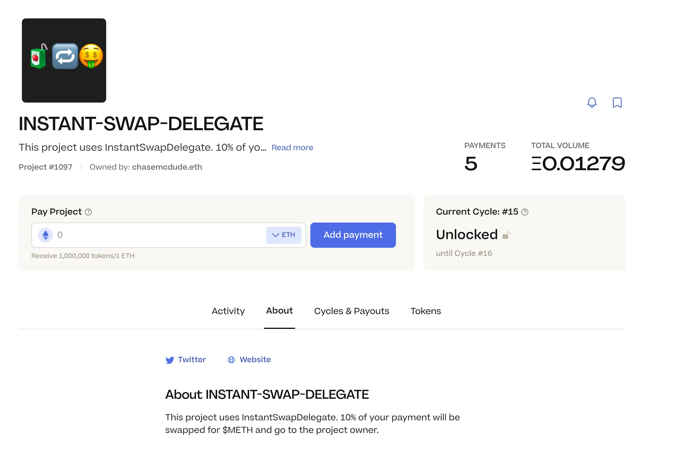
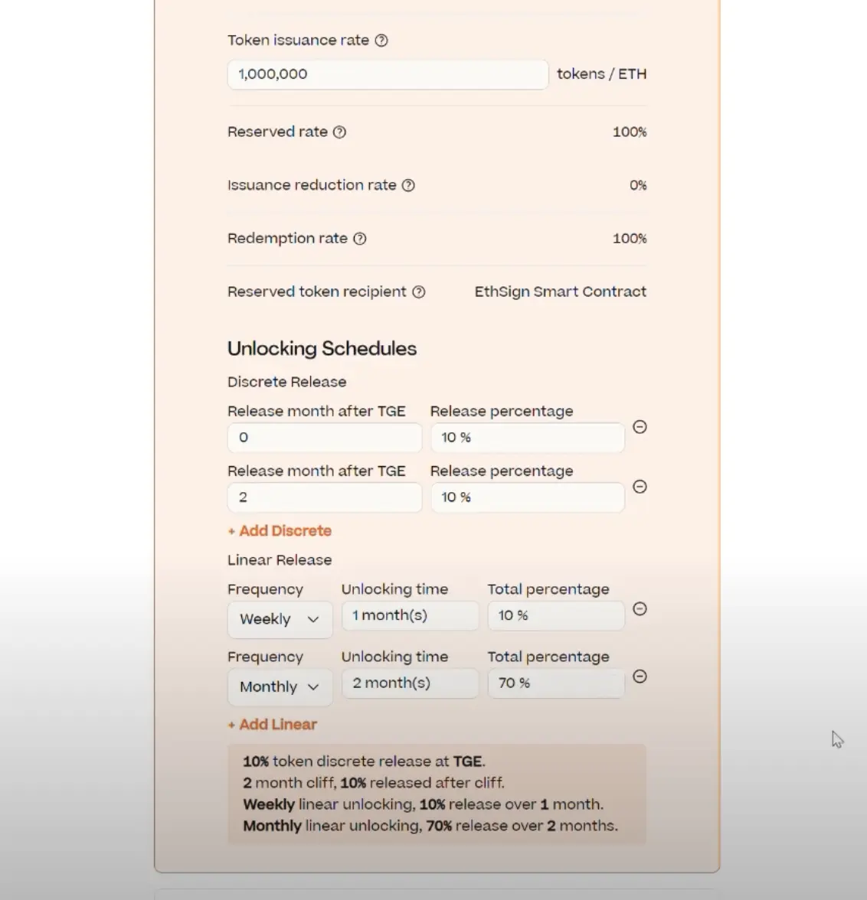
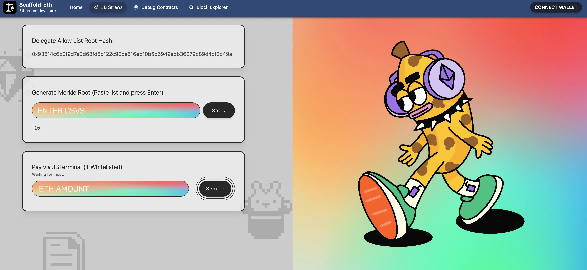
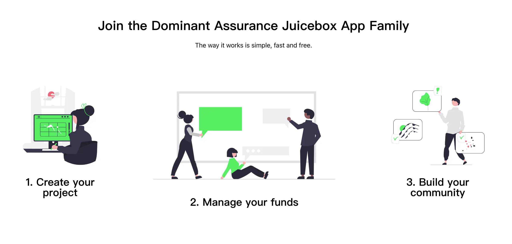
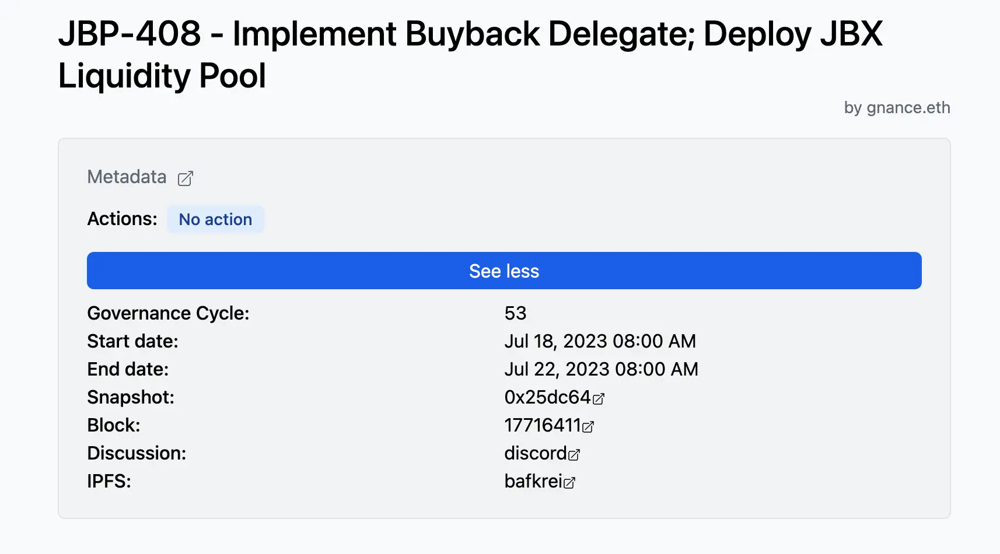
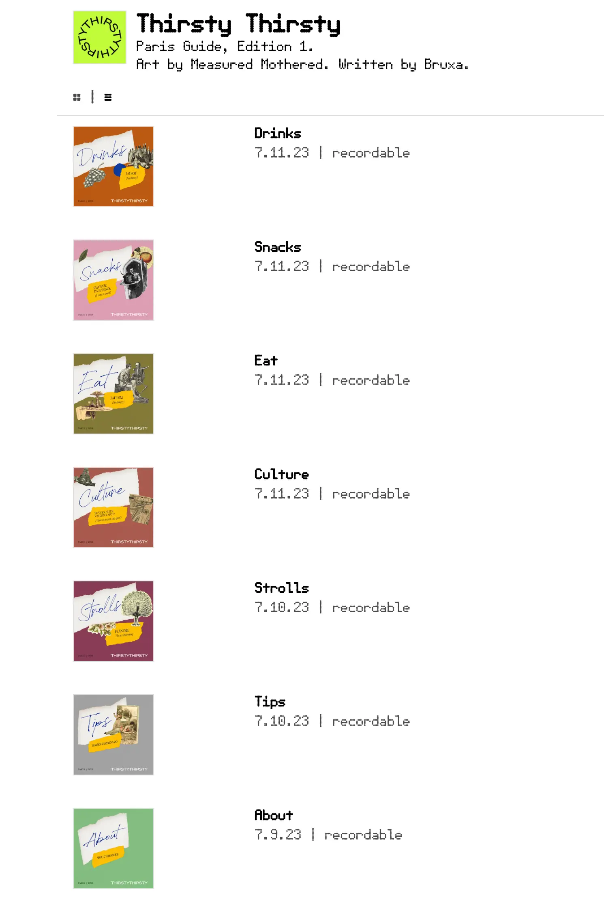
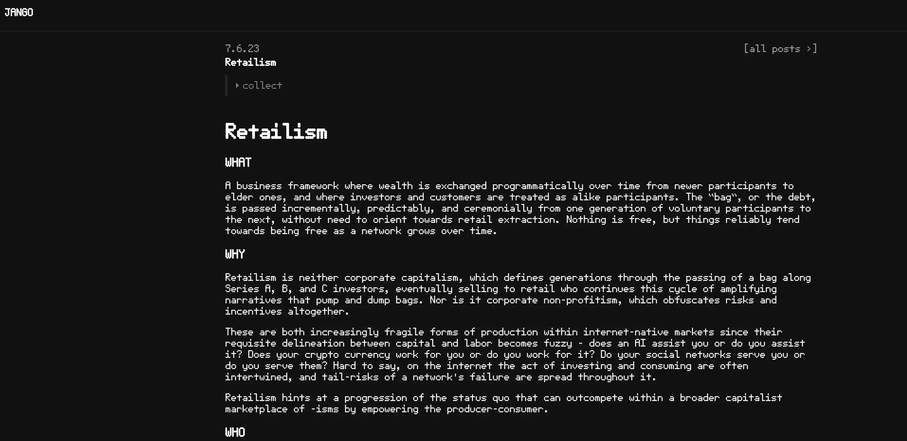
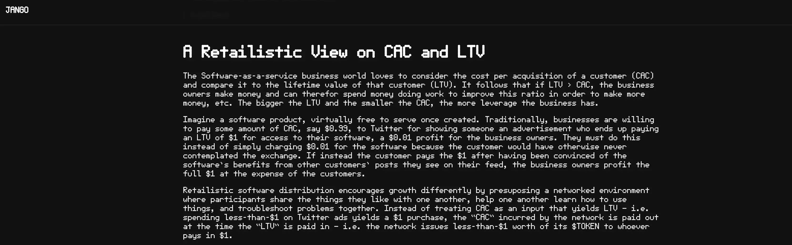
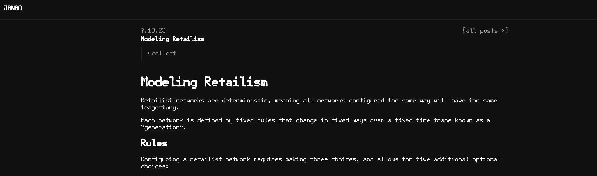
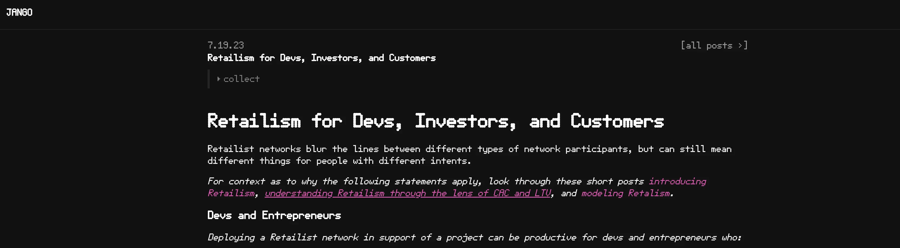

## 黑客松参与者关于官方文档的反馈

Nowonder 是黑客松其中一位参赛者，建议应该制作一些关于支付终端、合约委托和所有配置选项的视频材料，他认为有助于理解协议运作的整个流程，并降低需要查看所有文档内容的负担。

实际上，我们之前发布了一个关于创建委托代码仓库的视频教程，并得到部分参赛者的肯定和认同。但由于没有在文档的合适页面上发布，导致有些参赛者未能看到，Filipv 承诺将处理这个问题。

Jango 认为，部分黑客松项目同时制作了介绍视频或完善的自述文件，这样可能有助于将来其他人的参考或使用。他还建议，我们应该把参赛者编写的开源委托整理出一个目录，附上作者的链接，日后如果这些项目经过社区的审核，我们可以在某个专门的位置对它们进行宣传推广。

## 黑客松提交作品详情

### 1. Instant Swap Delegate （即时兑换委托）

提交人: Aeolian

简介： 协议的一个支付委托，自动进行金库代币的兑换。

代码仓库： https://github.com/tomquirk/juice-delegate-hackathon

演示项目： https://goerli.juicebox.money/v2/p/1097

团队的 Juicebox 项目： https://juicebox.money/@etherfunkio

### 2. JuiceTable （代币授予台账）

提交人： LJ

简介： Juicebox 协议与 EthSign TokenTable 的整合版本，为项目提供定制化项目代币解锁授予安排，并且仍可通过 Juicebox 协议的安全性来确保筹款活动的顺利开展。

代码仓库（智能合约）： https://github.com/boyuanx/JuiceTable

代码仓库（前端）： https://github.com/jbettenc/juicetable-interface

演示视频： https://youtu.be/XFwiadWq0YI

团队的 Juicebox 项目： https://juicebox.money/v2/p/540

### 3. JBStraws (默克尔树白名单)

提交人： nowonder

简介： 一个起白名单作用的数据源，允许项目方视需要上传新的默克尔树根证明。通过 JBOperatable 实现准入控制，从而允许管理员设置新的默克尔树的根证明并启用/禁用白名单。

代码仓库（智能合约）： https://github.com/simplemachine92/JBStraws-Contracts

代码仓库（前端）： https://github.com/simplemachine92/JBStraws-Interface

演示页面： https://juiceystraws.vercel.app/example-ui

团队的 Juicebox 项目： https://juicebox.money/v2/p/542

### 4. JUICYBONUS （捐款奖励机制）

提交人： Meme Man

简介：一个简单且高度灵活的合约委托，允许项目方根据捐赠的 ETH 数量给予捐赠方代币奖励（或扣减）。

代码仓库： https://github.com/Narwhal8/galactic-brain-delegate-just-trust-me-bro

演示视频： https://youtu.be/dyB58nUyAkk

团队的 Juicebox 项目： https://juicebox.money/v2/p/539

### 5.DominantJuice （主导退款补偿）

提交人： Armand

简介： 该项目的主要亮点是为 JB 项目增加一个主导保证（dominant assurance）托管合约选项，该合约同时兼备 JB 数据源、JB 支付委托和 JB 赎回委托的作用。主导保证合约采用了Alex Tabarrok的“主导保证”合约理念，通过项目方主动存入资金承诺筹款活动失败时额外提供退款补偿，从而最低限度减轻“搭便车问题”的影响。如果筹款成功达到目标，捐赠方的捐款承诺将转化为项目发展的资金，项目方则可以从托管合约或 JB 数据源取回最初存入的额外退款补偿。这个替代机制可以扩展至资助任何类型的众筹活动或公共产品。

代码仓库（智能合约）： https://github.com/Starmand6/dominant-juice-hack

代码仓库（前端）：https://github.com/electrone901/Dominant-Assurance-Juicebox

演示页面： https://dominantjuicebox.netlify.app/#/

团队的 Juicebox 项目： https://juicebox.money/v2/p/543

### 6. JuiceboxDataSourceAggregator

提交人： weaver

简介： 该项目的目标是为多个数据源提供简单的数据聚合功能。项目包含实际用例，展示了多数据源衍生平均权重的使用及多数据源准入名单的实现。该项目接口及实现很简单，可以进一步扩展用于其他用途。

代码仓库： https://github.com/calcifer11/JuiceboxDataSourceAggregator

团队的 Juicebox 项目： https://juicebox.money/v2/p/544

### 关于 JBM 前端支持的想法

Jango 认为最好能考虑在 Juicebox.money 的创建流程和重新配置流程添加一个自定义数据源地址的可选项，为部署这些合约委托并希望在 JBM 提供相应创建流程的开发者提供便利。

Filipv 同意这个建议，并表示最好我们能开发出更具体且通用化的前端界面，例如黑客松专用的前端仓库，用作与 Juicebox 合约协同工作的模板。

## 回购委托提案介绍 - Jango

在本次周会期间，Filipv 提交的[关于在 JuiceboxDAO 项目内实现回购委托的提案](https://www.jbdao.org/s/juicebox/408)正处于投票表决的治理阶段。

Jango 认为有很多事情都取决于这个回购委托的部署，在许多工作上都有些令人期待的结果。本提案提议这个委托的实现，将有助于我们对这个产品的实现效果做出应对。

该提案还要求将 JuiceboxDAO 当前的回购委托版本从 3.1 迁移到 3.1.1，迁移将导致 JuiceboxDAO 以后的 JBX 代币赎回将会被收取额外的费用。由于额外收取的费用对赎回将产生 1% 的负面影响，Jango 表示迁移更多是出于开发方便的考虑，把协议内所有的回购委托版本完成统一。

Jango表示，这个提案执行的第一步将仅限于回购委托的迁移，待我们在类似 Defifa 或 Croptop 等低风险项目上试验成功之后，合约团队再通知 DAO 配置到 JuiceboxDAO 的项目上。

回购委托要起到作用，我们还需要创建一个 ETH / V3 JBX 交易对流动池并相应添加资金。Jango 预计届时 Uniswap 上 JBX 的交易量将会变大。

总的来说，Jango 认为部署回购委托是一个高风险的举措。如果提案获得 DAO 的批准，就意味着 DAO 充分认识到了这些风险，并同意继续向这方面推进。

## 面向开发者的视频及新播客节目 - Matthew 及 Brileigh

### 回购委托介绍视频

在以下由 Matthew 负责录制的视频中，JuiceboxDAO 的合约团队成员，包括 Jango、Dr.Gorilla 和 Viraz，共同演示了回购委托合约的使用方法，并解释它的工作原理。

<iframe width="560" height="315" src="https://www.youtube.com/embed/ZFZ03Jj5mKM" title="YouTube video player" frameborder="0" allow="accelerometer; autoplay; clipboard-write; encrypted-media; gyroscope; picture-in-picture; web-share" allowfullscreen></iframe>

这是向开发者提供更多相关内容的工作之一。他们还计划与 Peel 共同制作另一个视频，介绍 Juicebox 前端界面、已解决问题和 Subgraph 查询等方面的内容。

### 采访 Nicholas 的新一期播客节目

他们还发布了最新一期 Juicecast 节目，采访嘉宾为 DAO 的贡献者 Nicholas。节目中，Nicholas 介绍了关于链上 SVG、Juicebox 元数据合约、代币 URI 解析器、Juicebox 卡片项目，以及他在 ETH Waterloo 上开发的新ERC-6551标准项目等方面的内容。

<iframe width="560" height="315" src="https://www.youtube.com/embed/1tQpVhB7qdo" title="YouTube video player" frameborder="0" allow="accelerometer; autoplay; clipboard-write; encrypted-media; gyroscope; picture-in-picture; web-share" allowfullscreen></iframe>

## EthCC 指南 - Bruxa

Thristy Thirsty 将在 EthCC 期间举办活动，Bruxa 用 Croptop 模板在他们的 ETH 域名网站 [thirstythirsty.eth](https://paris.thirstythirsty.eth.limo/) 上创建了一个活动的指南。这个指南将向他们的社区成员发布，同时支持以 NFT 的形式来收藏这些内容，无需对这些内容设置代币门槛。

Bruxa 表示，这种传播方式非常适合引导赞助人或客户向他们的项目付款，再以此来支付提供地面服务人员的报酬。他们计划通过这种方式展示社区金库的公开透明，希望吸引更多赞助人、合作伙伴和社区的新成员。她对这个做法充满期待，很高兴能够通过 Croptop 和 Juicebox 来启动。

## 零售主义 （Retailism) - Jango

零售主义是 Jango 最近在思考 Defifa 和 Croptop 等项目的金库设计时提出的一个概念。对于使用这些框架创建的项目，与其从应用的角度把各个 Defifa 游戏项目和 Croptop 系列作为单独的金库来管理，倒不如把这些应用收取的费用纳入一个统一的金库，比如 Defifa 网络金库及 Croptop 网络金库，从而鼓励开发者专心开发和网络专心经营。

实质上，零售主义描绘了在 Juicebox 协议背景下的一种项目构建方式，项目金库不设置任何支出，金库所有收到的资金都会相应对外发行代币，而唯一可以获取金库资金的方式是销毁代币从金库进行赎回。

在这个框架下，开发者应如何处理他们通常面临的流动资金需求，包括获得自己的报酬？如何帮助投资建立信心，这样他们才愿意投资而且对投资的价值心中有数？如何平衡推动项目发展所需的能量？

本期周会前，Jango 撰写了 4 篇博文来阐述他对这个概念的一些看法。

### [零售主义 Retailism](https://jango.eth.limo/9E01E72C-6028-48B7-AD04-F25393307132)

第一篇博文是对这个概念的概述，在概念、动机、目标人群、时机及方式上解释了 retailism 如何应用，并在更广阔的资本主义市场中获得成功，同时如何避免造成对后期参与者的盘剥。

### [从零售主义的角度看待 CAC 及 LTV](https://jango.eth.limo/572BD957-0331-4977-8B2D-35F84D693276)

传统软件即服务的商业盈利模式来自 CAC（获客成本）和 LTV（用户终身价值）之间的差异，与此不同，零售主义的软件分发模式通过不同的方式来获得增长。这个方式预设一种网络环境，在那里，参与者彼此分享喜欢的事物，相互帮助学习使用这些事物，并共同解决问题。

### [建模零售主义](https://jango.eth.limo/B762F3CC-AEFE-4DE0-B08C-7C16400AF718/)

这篇文章描述了塑造零售主义网络的各种规则。不同变量的组合成的规则决定网络的不同发展轨迹，同时这些规则对网络增长率和退出率的影响也可能会产生一些对立。

此外，文中提供了一个[电子表格](https://docs.google.com/spreadsheets/d/1R-3PyyF2chmsf_t3IdVi7oEWD0i0IHTcDNwQj4DEKaA/edit#gid=424465074)，让大家尝试输入不同的变量值来观察零售主义网络的不同发展轨迹。

### [零售主义对不同人群的意义](https://jango.eth.limo/3EB05292-0376-4B7D-AFCF-042B70673C3D)

最后一篇文章分析了为何零售主义网络适合适哪些网络参与者，为何对其他参与者不适用。

这个概念目前还欠缺的一环是回购委托，随时间发展，回购委托可以降低进入成本（发行比率）和离场成本（赎回比率）之间的价格波动。等这些最后的合约组件开发完成，我们将通过 Defifa 和 Croptop 开展一些实践性试验。对试验的效果实时监控研究，确定哪些有效哪些无效，再进一步进行改进，然后就可以把这个框架提供给不同类型的软件项目来使用。

## Peel 工作报告及演示 Tjl

Peel 团队在 Juicebox.money 的项目页面上推出了一个新功能，允许项目方发布通知，让他们的社区了解最新的动态，例如公告、事件、合作伙伴关系、开发里程碑等。

通知还会显示发布时间和发布消息的钱包地址。项目方可以删除某个更新及发布新一个更新，但不可以对已发布通知进行编辑。

