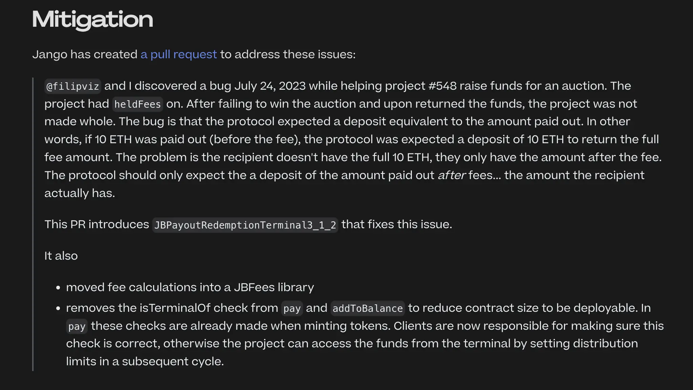

## 瑞波诉讼案讨论及问答

本次周会我们邀请了一位证券律师 Rob， 作为特邀嘉宾来分享他对最近瑞波诉讼案的一些看法。大家认为这个案件在加密货币行业引起了重大影响。

*请知悉，本周会中涉及的任何法律事务讨论仅代表参与讨论者个人观点，并不构成任何投资建议。*

### 诉讼结果介绍

Rob 认为美国证券交易委员会（ SEC）之所以对加密货币持敌对态度，其主要原因之一，来源于担心一些劣质代币向个人投资者的兜售可能引致他们储蓄损失，使这些人群变成“国家的受抚养人”，从而造成国家的管理负担。

这次诉讼，SEC 起诉 Ripple Labs 及其两位高级领导者，指控其违反证券法，从事非法证券的销售。法官 Analisa Torres 裁定，瑞波针对机构投资者的 XRP 销售属于证券范畴，但 XRP 代币本身并不属于证券。

法官还区分了三类销售情况：

- 机构销售，针对风险投资、对冲基金等大型投资者的销售。
- 程序化销售，通过数字资产交易所向零售投资者的销售。
- 向员工或合作伙伴分发代币。

虽然机构销售被视为证券且违反了证券法，但法官裁定向零售投资者进行的程序化销售并不违法，因为买家无法确定他们究竟是直接从瑞波公司，还是从二级市场其他卖家手中购得。由于买家不清楚他们购买的源头在哪里，也就不能合理地期望从瑞波公司获得利润，因此这类销售未能通过豪威测试（Howey Test) 中对证券的要求条件。

法官还裁定向员工或合作伙伴分发代币也未通过豪威测试，因为这个过程并未涉及货币的交换。

如果我们从字面上理解 Torres 法官的意见，似乎可以通过把代币投放到 AMM（如 Uniswap）的相应流动池来实现发行，而不是直接通过某个公司或发行人来开展销售。由于人们无法确定购自何方，代币也就不符合作为证券的要件。

### 程序化代币分发

Jango 很好奇，现在是否对程序化代币分发已经有了一个清晰的定义，还是说这只是一个宽泛的术语，底下还会有更多的解释层面。

对此，Rob 的回答是，在目前这个案例的法律意见中，程序化分发等同于暗标买卖，这种模式下交易者无从确定对手方是谁。

他认为无需许可的去中心化加密货币更像是一种无记名资产，与法院可以裁定归属的合同权利不是一回事。因此，豪威测试在这个场景并不能适用，除非其中涉及货币的交换，以及对他人的管理或经营努力的所产生利润的合理预期。

甚至 SEC 自己也承认，不能把二级销售定义为投资合同。从法律角度来看，这是没有意义的，因为人们不能因为随机从其他人那里购买某个东西而自动受到合同约束。

### 对 Juicebox 社区的法律影响

Jango 表示，对我们来说，这是一个非常有意思的案件。因为我们花了很多时间来构建这些开放协议，以不同的方式把合约性约束硬编码进协议里面。他认为我们所做的事情大部分都是开放式的，存在许许多多不同的表现方式，而每种表现方式在法律层面都可能造成不同的影响。

目前在 Juicebox 生态系统里面，既存在一些项目方可以根据配置参数随着时间的推移进行调整的项目，也有一些无主的且不受相关人员意志左右独立运作的项目。不同的设置方式，还会存在许多不清晰的地方和潜在的问题。

Rob 认为我们可能仍然需要等到这个案例走完所有的法律程序，那时法官的法律意见将最终成为正式的法律条文或形成有效判例。

### 案件的全球影响

LJ 问到，Rob 是否认为这个案件会从全球的层面产生更多的影响，因为参与 Juicebox 或其他以太坊平台的人可能来自其他不同的司法地区。他想知道其他的司法地区，尤其是那些对加密货币更加友好的地区，如迪拜、新加坡或香港等，是否会跟进对这个案件做出响应。

Rob 认为这个案件可能有助于缓解某些公司对美国参与者的地理封锁，这些封锁源自监管环境的不确定性及美国政府对加密货币的敌对态度。

他认为其他地区，如迪拜和香港，可能不太会参考美国的做法。再加上豪威测试是一种非常美国式的做法，其他地区可能并不会赞同这样的法律诠释方式，这些地区可能会根据自己的利益来制定相关的加密货币政策。

### 对 DAO 的潜在影响

StudioDAO 的 Kenbot 想知道这个判例是否会对 DAO 产生影响，对此，Rob 表示这个案件可能会使 DAO，尤其是那些资源有限的 DAO， 更难于对抗监管机构的决定。

对于许多 DAO 喜欢采用的非注册非营利组织（UNA）的这一组织结构，这个案件可能有助于它们减少组织成员的责任，实现一定程度的组织治理，甚至任命管理者和雇佣法律代表。

如果 Torres 法官的法律意见将来正式成为判例，DAO 可能可以通过向机构客户销售并申请私募发行豁免的方式来发行代币，然后甚至让这些机构来负责代币的二级分销，同时还可以用奖励的方式向贡献者或合作伙伴分发代币，等等。这似乎会是一个相对简便的代币发行模式。

### Impact on Designing Treasuries And Decentralized Projects 对设计金库和去中心化项目的影响

Jango表示，我们设计金库尝试重构互联网各方的预设关系，从这个角度来考虑将会很有意思。区块链的情况下，这种重构通过预先约定的一组规则来实现。

他认为我们会倾向于按照瑞波案例中的模式来开展工作，因为案例给我们提供了某种意义上的清晰指引。但是，他认为我们仍然有很多创造和探索的空间，这些关系的发展也还有许多表达的方式。

Rob 补充说，这是一个经过拥有非常高影响力的法官充分审议的诉讼案件，因此我们或许可以把诉讼结果视为代币是否应归为证券相关法律的合理告知。

## 支付终端 3.1.1 版本升级 -- Filipv

上周，[JuiceboxDAO 部署回购委托的提案](https://www.jbdao.org/s/juicebox/408)已获得 DAO 批准通过。执行该提案的第一步是将 JuiceboxDAO 的支付终端从 3.1版本升级到 3.1.1 版本。

这个新版本的支付终端修复了一些错误并优化了 gas 的使用，同时还会在项目的赎回比率低于 100% 时，对该项目的赎回交易收取 Juicebox 会员费用。

周会上 Filipv 现场进行操作，成功地把支付终端切换到最新版本。

## 缓缴费用计算错误的事后剖析 -- Filipv 及 Jango

我们在 [Legend](https://juicebox.money/v2/p/548) 项目的筹款活动期间，发现了 `JBPayoutRedemptionPaymentTerminal3_1` 一个中等严重性的持有费用计算错误。该项目启用了缓缴费用功能，并在筹款活动结束后将筹集的资金转移出去参与一个拍卖。拍卖失败之后，当他们把这些资金退回项目并开展全额退款时，由于支付终端的计算错误，导致实际的退款比例略微低于原定的 100%。

Filipv 发表了[关于这个问题的事后剖析](https://docs.juicebox.money/dev/resources/post-mortem/2023-07-24/)，对这个错误的原因以及解决方法进行了详细解释。

截至周会之前，Jango 已经发起了一个[拉取请求 （PR）](https://github.com/jbx-protocol/juice-contracts-v3/pull/51)把支付终端升级到 3.1.2 版本来修复这一错误。Filipv 建议，新的 3.1.2 版本支付终端部署之前，项目方尽量避免使用缓缴费用这个功能。

## 回购委托工作报告 -- Filipv 及 Jango

Code4rena 即将发布关于回购委托的审计报告。我们还需要对合约进行一些最后的改进和升级，回购委托应该能够在几个筹款周期内完成部署。

Jango 对 0xBA5ED 在最近的一段时间里在合约审核方面做出的巨大贡献表示肯定，同时还对 Viraz 和 Dr.Gorilla 对开源协议组件做出的非常基础性的工作表示感谢。

