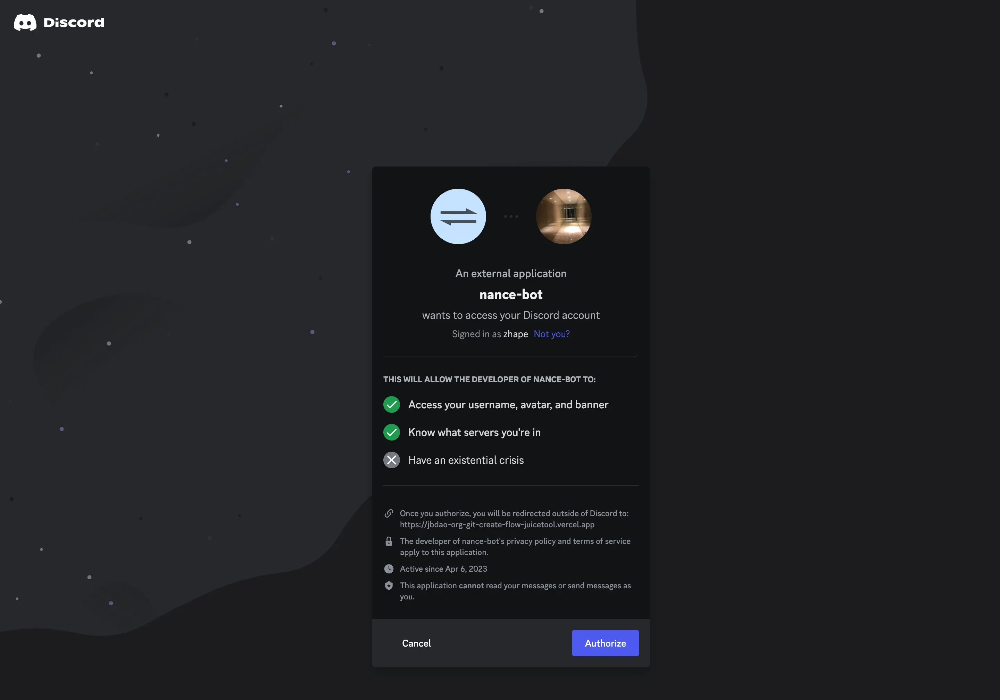
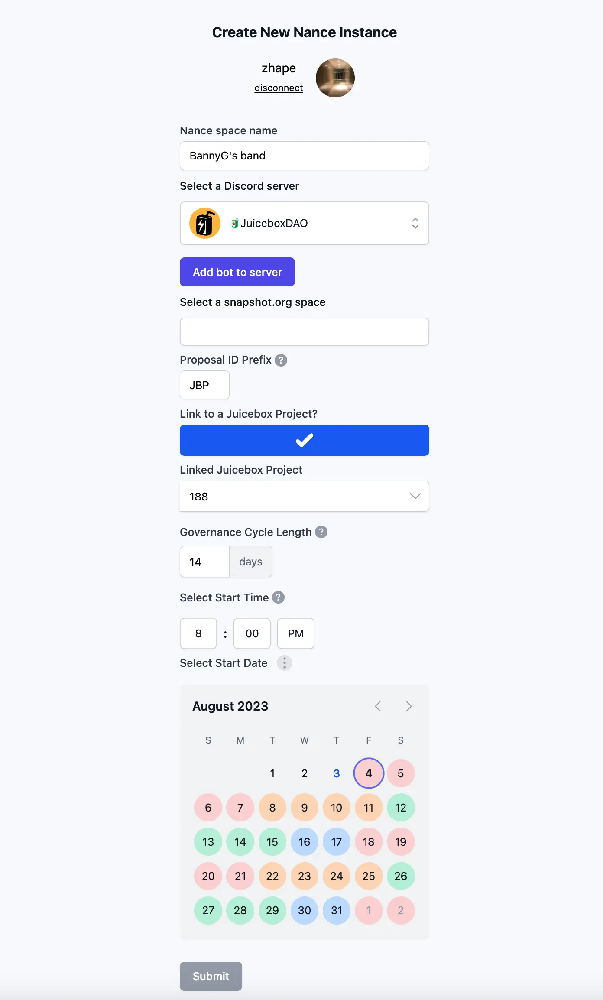

## 社区能见度工作报告 -- Matthew 及 Brileigh

### Solidity Sesh 系列新节目

Matthew 和 Brileigh与我们的合约团队成员 Jango、Dr.Gorilla、Viraz 和 0xBA5ED 一起推出了新的视频系列节目Solidity Sesh，介绍 Juicebox 协议的不同内容，包括各个具体的合约或者协议本身的架构。

这个系列的第一集节目上个月已经发布，讲述的主题是回购委托合约及合约的详细工作机制。

今天，他们发布了第二集，Payment Terminal Inheritance Structure，主要介绍支付终端的继承结构以及用户应怎样构建自己的 ERC-20 标准代币支付终端。

<iframe width="560" height="315" src="https://www.youtube.com/embed/CWkmCh0wjdg" title="YouTube video player" frameborder="0" allow="accelerometer; autoplay; clipboard-write; encrypted-media; gyroscope; picture-in-picture; web-share" allowfullscreen></iframe>

Jango 介绍，制作 Solidity Sesh 的灵感源自那些一直尝试在 Juicebox 协议上进行开发的人。例如，关于继承结构的新节目就是受 Nicholas 在开发 Juicebox 的项目 NFT 期间遇到的问题所启发。

希望通过这个系列节目，我们能够帮助用户更好地理解 Juicebox 协议。非常欢迎大家提出任何关于这个系列的反馈意见或具体节目要求。

### 新一期播客节目

他们本周还发布了 Juicecast 播客的新一期节目，本期节目的采访嘉宾为 NFT 网红 [DeeZe](https://twitter.com/deeze)，在节目中他分享了自己作为一个 Web3 OG 的一些有趣的经历。

<iframe width="560" height="315" src="https://www.youtube.com/embed/R5xoInP0JxE" title="YouTube video player" frameborder="0" allow="accelerometer; autoplay; clipboard-write; encrypted-media; gyroscope; picture-in-picture; web-share" allowfullscreen></iframe>

## Nance 创建流程演示 --  Jigglyjams

周会上，Jigglyjams 演示了新 Nance 实例的创建流程，流程的开发工作仍在进行，他希望能够获得大家对这个产品原型的意见或反馈。这个创建流程将帮助其他 Juicebox 项目实现他们的治理过程，使 Nance 成为 Juicebox 生态内可供使用的通用治理工具。通过这一工具，项目可以建立从起草提案、Discord 社区温度检查，到使用项目代币进行 Snapshot 投票等的整个治理流程。

   创建 Nance 实例的初步流程如下：

   1. 用户需要授权将 nance-bot 添加到他们拥有管理员权限的 Discord 服务器。
   2. 然后，他们可以选择让 nance-bot 在指定的频道发布新提案，并在该频道开展提案的社区温度测试。
   3. 用户还可以将 nance-bot 连接到他们的 Snapshot 空间并添加为成员，这样 nance 就可以自动代为把通过社区温度测试的提案发布到 Snapshot 页面，从而进入投票阶段。

在这个创建流程中，用户可以命名自己的 Nance 空间，自定义提案 ID 前缀，并把 Nance 空间与他们现有的 Juicebox 项目进行关联。同时用户还可以指定治理的具体起始日期，并在治理日历中查看不同治理周期各个阶段的日期。

Jango 建议 Nance 团队将来可以考虑做一些产品迭代，支持用户付费从 Nance 项目铸造代币，再将这些代币用于支付 Nance 治理服务使用量。

此外，他认为 Nance 可以更紧密地与 Juicebox.money 网站合作，甚至可能考虑整合到项目创建流程，以便项目方可以轻松对接项目的治理系统。Jigglyjams 对此表示赞同，并表示他一直在考虑一个做法，社区先创建他们的 Snapshot 空间 和 Discord 服务器，然后通过使用 Nance 展开社区提案投票，并按投票结果来启动他们的 Juicebox 项目。

最后，Jango 提到了即将推出的类似 Defifa 和 Croptop 等零售主义项目使用 Nance 服务的可行性。这些项目将不设项目方，在项目启动后的一段预定时间内按一定比例保留项目代币并发放给某个多签账户，用作给予创始团队的奖励。

## 付款终端迁移和治理

周会最后，Nowonder 提出了一个关于付款终端迁移的执行是否需要经过治理过程的问题。

对此，Jango 解释说，协议的运作方式允许任何人部署他们觉得合适的任何合约，并不需要事前征求 JuiceboxDAO 许可。但是，如果他们希望 DAO 使用这些合约或者想要 DAO 报销合约的部署费用，就必须提交一个相应的提案并获得 DAO 的批准认可。

付款终端的迁移只是将新的付款终端添加到合约库的过程。只要它遵循接口，任何人都可以调用迁移函数。其他项目不需要从 JuiceboxDAO 处获得许可，可以视自己需要自由创造新的东西并将他们的项目迁移过去。