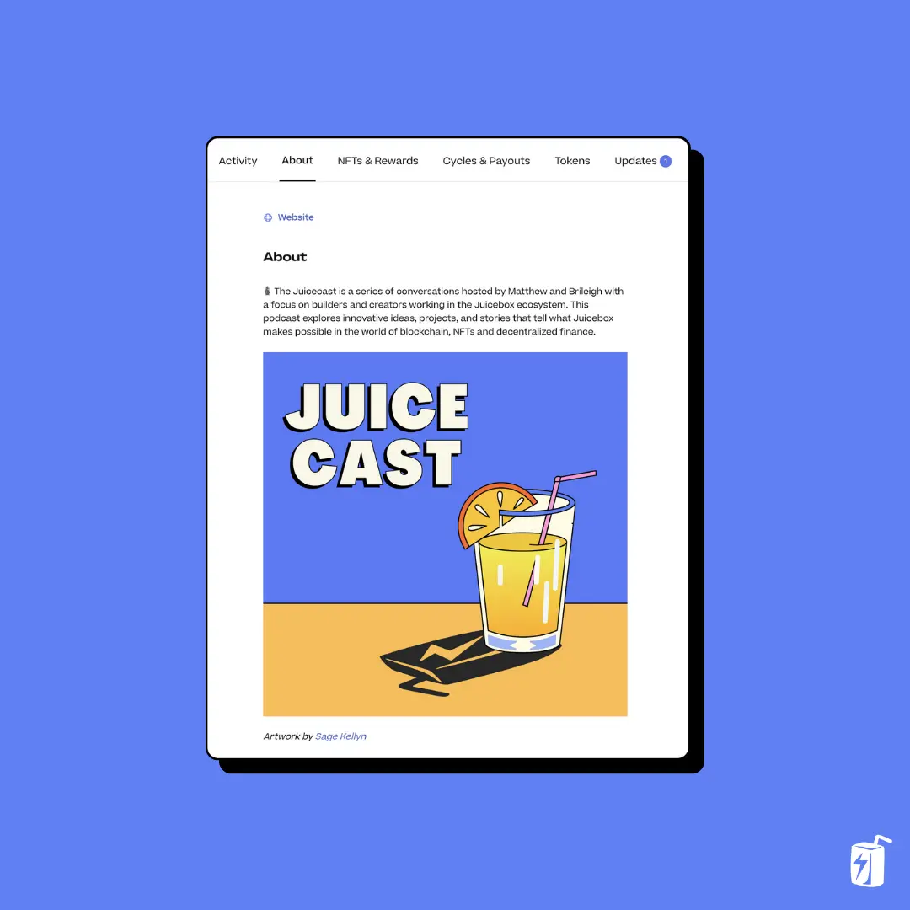
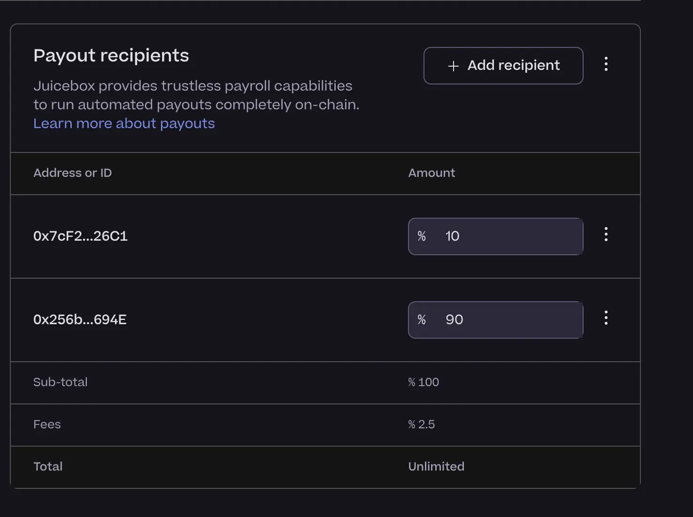
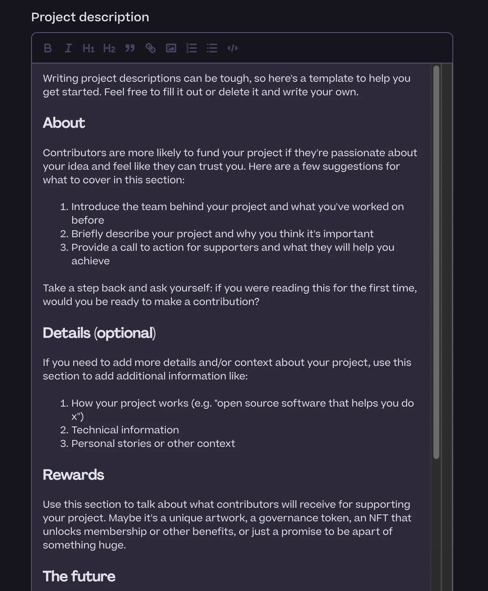
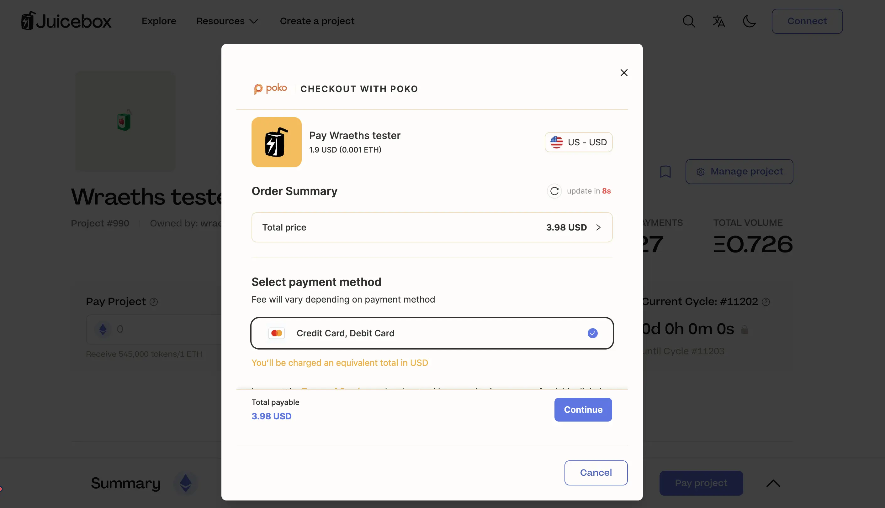
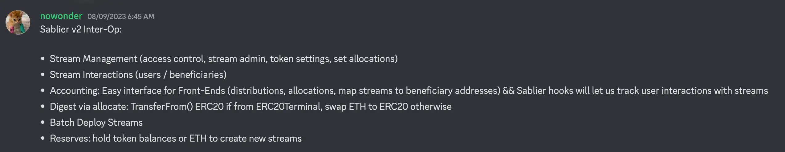
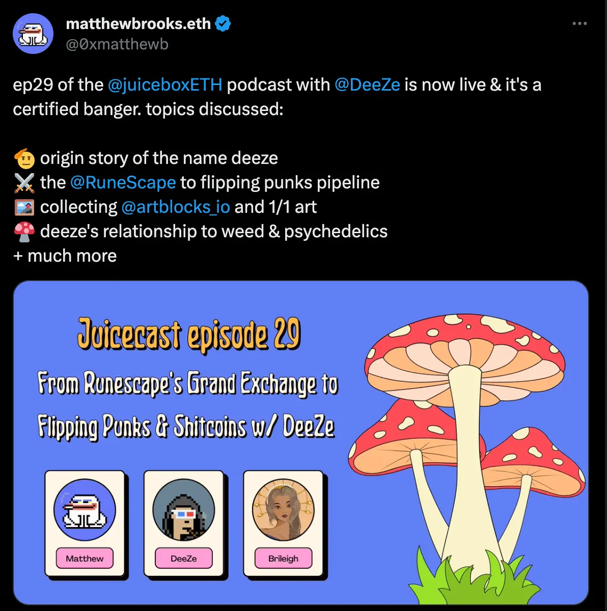

## Peel 前端工作报告

### 富文本编辑器 -- Tjl

这是一个许多项目要求的功能，更好地支持自定义管理项目的详情介绍。通过这个新功能，项目方可以使用Markdown 格式、图像和链接等来编辑他们的项目描述。

希望这个功能可以有助加强项目的“关于”部分，并为项目方提供更高的自由度来充分展示项目的详细信息。

目前这个功能还存在一些问题，Peel 团队将尽快进行修复，一切准备就绪后将会正式部署这个新功能。

### 新支出表格演示 -- JohnnyD

目前，如果项目方想要编辑某个受益者的支出信息，他们需要每次点击进入一个单独页面来调整这项支出的金额。

JohnnyD 最近一直在开发新的编辑周期表单，他设计了一个新的支出管理表格，让编辑这些支出项目变得更为简便。项目方无需理逐一点击打开每个单独页面，直接可以在表格内编辑每个受益者的支出项目。

这将有助于项目管理员更直观地了解金库支出的准确金额，更重要的一点，在编辑这些支出信息时，支出实际产生的 Juicebox 费用也会同步进行更新。

希望这个新的支出管理表格能够更好地了解项目分配限额内的明细信息，以及这些支出相应产生的 Juicebox 费用情况。

Peel 团队仍在努力最终产品化这一表格，目前还需要经过进一步的审核和测试来确保其工作正常。

### 创建流程辅助预览 -- Tjl

Peel 团队一直致力于从用户教育的角度来改善项目的创建流程，Strath 主要负责这项工作。他们最终的目标是让用户无需过多依赖贡献者团队的支持或帮助，自己能够全程创建他们的项目，尽可能实现创建流程自助化。

这方面最大的挑战之一显然是如何把其中最为费解的 Juicebox 原生概念更加直观、更易理解地融入到创建流程中。

Peel 团队还设计了其他一些内容来帮助提高项目的质量。

首先，用户点击创建新项目时，初始页面会为他们提供一些创建项目小知识等的建议。

团队还将引入草稿功能，这样项目创建者可以在所有细节敲定前不断进行调整，无需即时启动项目或创建项目后再反复进行更改配置。

他们将会在创建流程页面的右侧增设一个小型教育面板，如果用户觉得不需要，可以点击折叠起来，同时清楚自己可以选择了解这些信息。

### Keyp 整合及法币支付 -- Peri

[CupOJoseph](https://twitter.com/CupOJoseph)，Game Wallet 的创始人，计划在 Juicebox 上推出一个项目，销售 Gameboy 卡带的硬件钱包。目前 Game Wallet 的意向名单已有约 10,000 人，但项目团队仍在最终确定一些细节，其中之一就是希望除了以太坊之外，还可以用法币来支付，从而进一步扩大产品的受众。

Peri 主要负责对接支持 Game Wallet 项目，他指出这个即将推出的项目有两个很重要的组件。

第一个组件，同时也是 Game Wallet 主要关注的，关于整合法币支付的问题，因为现在付款给 Juicebox 项目仍仅限于使用 ETH。Peel 团队目前的整合方案是利用 [Poko平台](https://www.pokoapp.xyz/)，用户支付项目时，可以点击跳转一个嵌入式表单来使用法币付款。这个方案的底层原理其实就是代付款人购买以太币，并自动把这些以太币转到相关的 Juicebox 项目。

但问题在于，我们仍需要付款人连接加密钱包到项目，用来接收付款时铸造出来的项目代币。这时就出现了这个项目的第二个重要组件。我们将整合 [Keyp](https://www.usekeyp.com/)，这个服务允许用户通过邮件地址进行身份验证并创建帐户，从而获得一个加密钱包地址。整合之后，用户在 Juicebox 应用上点击连接钱包按钮时，可以在标准的 EOA 钱包或 Keyp 钱包之间两者选其一。Keyp 钱包与普通的 EOA 钱包的作用完全相同，包括发送交易或查看余额等功能。

Tjl 认为我们可以进一步讨论如何把这种功能整合通用化，让所有其他项目都可以使用，而且在这方面可能还有一些预想之外的潜力可以发掘。

### 黑客松合作讨论

Tjl 介绍说，Peel 团队一直在与一些黑客松公司和平台进行接触，探讨合作的可能性，希望能够将一些黑客松项目引入 Juicebox 平台，帮助他们筹集资金以进一步谋求发展。

他表示，我们已经与 ETH Global 和 Devfolio 两家达成了口头协议，从九月中旬到一月期间展开试点合作。如果处理得当，我们可以成为面向黑客松的工具平台，不断会有开发者进来创建项目。

Mieos 表示，WAGMI 团队正在思考，如何来利用黑客松活动这种绝佳的品牌宣传时机来推广 Juicebox，除了从技术的层面，还可以通过酷炫的 Juicebox 文化、氛围和艺术来进行传播。

Jango 建议，整个生态系统里的社区成员都可以参与到这个方面的工作。他还觉得，通过不同的活动（例如合约团队在黑客松中的积极响应及支持），以及与其他社区展开合作，我们能够找到利益共同化和协同合作的契机。

他还以 Thirsty Thirsty 这个擅长组织饮食导向活动的社区为例，说明我们可以怎样获得切入黑客松和线下活动的灵感，怎样来鼓励跨领域的多生态共生，从而形成 Tjl 的工作方向的支持。

Jango 认为，Banny 显然绝对是一个创造用户认知的入口，尤其是参考我们上个月举办的合约委托黑客松所获得的经验和反馈之后更是如此。但要真正深刻理解如何实现它的实用化并进行正确的引导，还需要一定的时间。

## 回购委托工作报告 -- Jango

我们现在更新了一个新的回购委托版本，更容易部署并附加到项目上。合约团队正在最后编写相关合约，合约将适用于所有的项目。

721 委托的元数据标准目前已经得到完善。我们的合约团队将与前端团队就新标准下元数据向委托或支付函数的传递展开协同合作，让项目可以同时附加多个委托并实现信息清晰正确传递，从而满足项目同时部署回购委托及 721 委托的需求。

团队计划在本周末之前完成所有部署，但肯定还需要时间来衡量最后的折衷方案，在一次性实现还是逐步迭代之间作出取舍。

现在我们剩下的主要是风险管理相关的一些问题，但总体上一切感觉良好，很快就能推出这个产品，这让 Jango 感到非常兴奋。这个委托可能会解锁许多发展潜力，我们未来几个月将会看得到它们带来的成果。

希望我们能够为 Juicebox.money 提供一个可遵循的严格规范，从而实现新功能的尽早整合。

Jango 认为，只要回购委托证明切实可靠，JuiceboxDAO 将会很快部署使用。大家参与相关提案的讨论和投票，令各个终端达到最稳健的状态，他对此深表感激。

## Bananapus 工作报告

Jango 认为在接下来的几周内我们可能会推出一些原型化产品。他非常期待能尽快看到一些原型可供大家测试，因为他认为这将是 Juicebox 未来日益重要的一环，尤其是我们开始更多地举办黑客松让人们可以在活动中创建项目来赢取报酬。我们需要确保人们可以在成本较低的链上创建项目并继续向外发展。

Bananapus 的好处在于，我们基本上是在创造条件让项目可以选择在某条特定链上启动，再轻松地在生态系统中进行演化。这是一种非常灵活的模式。这个概念对大多数人来说很抽象，因此 Jango 表示愿意继续在 Solidity Sesh 系列节目中讲解 Juicebox 协议的工作机制，希望帮助人们加深理解并尝试他们的想法。

他还希望 Bananapus 的开发能与前面提到 Peel 团队正在开发的简便钱包连接和法币付款功能非常好地进行融合。当然，这是一个更长期的工作，但他坚持我们应该不断深入理解这样能对整个生态系统产生的意义。

尽管他认为以太主网仍是大型试验的首选，但我们肯定需要把协议扩展到主网以外，才能让很多东西真正得到改善以及降低进入的门槛。我们正朝着这个方向逐步推进，帮助人们先在成本较低且交易旺盛的环境下启动项目，再慢慢地向跨链发展，听起来非常令人兴奋。

## Sablier 协同运作工作汇报 -- Nowonder

Nowonder 的提案已经获得了 DAO 的批准，周会上他对社区对他这项工作的支持表示感谢。

Sablier 协同工作其实就是一个分割分配器，允许项目方部署 Sablier 支付流，按时间推移来实现项目代币分发的精细化管理。

根据 Nowonder 的说法，功能整合的主要应用场景是项目方希望招募新的贡献者，但又不能确定给他们的报酬是否值得的时候。这种情况下，项目方可以向新晋贡献者发放代币流，如果工作结果未能令人满意，可以随时取消这些代币流。基本上他的主要观点是，将所有内容都包含在同一个合约（分割分配器合约）内，合约既是管理员面板，也可以是人们从属于自己的代币流中提取代币的用户界面。项目管理员和用户都可以与同一合约进行交互，来实现各自不同的目的。

Nowonder 还考虑添加的另一个功能是 ETH 储备或项目代币储备，允许项目方或他们的操作员添加新的代币流，哪怕分配器当初部署时没有实例化这些代币流。

Jango 认为对于原型设计来充分利用这个机会来说，这个做法看起来很稳妥也很棒。同时希望他能够多向我们社区介绍更多关于 Sablier 的情况，也向 Sablier 社区介绍 Juicebox，还有为什么 Nowonder 即将开发的工具会值得项目尝试使用。

Jango 还建议，我们可以考虑制作一集 Juicecast 节目或在 Juicenews 上进行报道，以一致的方式双向支持和启发社区成员。他认为整体来说， Juicebox 项目发展下一个重要的环节实际上在于与其他社区的互相整合。

Nowonder 和 Matthew 都同意这个想法，并表示愿意共同努力制作一集 Juicecast 节目。

Nowonder 还宣布他计划构建分割分配器模板来用于开发文档用户，以便人们可以了解如何开始编写测试及模拟自己的分割分配器。

## Juicecast 新播客节目 -- Matthew 及 Brileigh

上周，Matthew 和 Brileigh 发布了一集新的 Juicecast 节目，采访嘉宾为 NFT 网红 DeeZe。

他们还计划在下周三与 [The Dapp List](https://twitter.com/thedapplist) 合作举办一场Twitter Space。The Dapp List 几乎可以看作是 Web3 的Dapp 目录和分类展示窗口，Juicebox 也位列其中。他们将在这个 Twitter Space 上谈论 Juicebox 的工作原理以及使用方法。

Jango 对 Juicecast 团队（Matthew 和 Brileigh）的努力表示认可和赞赏。他认为 Juicecast 频道现在给人一种温暖和连贯的感觉，找到了令听众非常喜欢的节奏和风格。Jango 还感谢他们记录了各种工作，包括鼓励开发人员录制技术讲解内容，然后再负责后期制作工作。

Jango 认为，由于每个人都在忙于自己的项目，很多有深度和教育性的内容被忽略了。他鼓励我们的社区进行跨领域的合作，共同为 Juicecast 频道做贡献。

