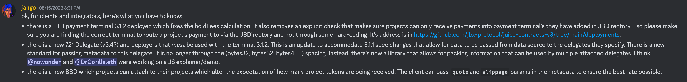
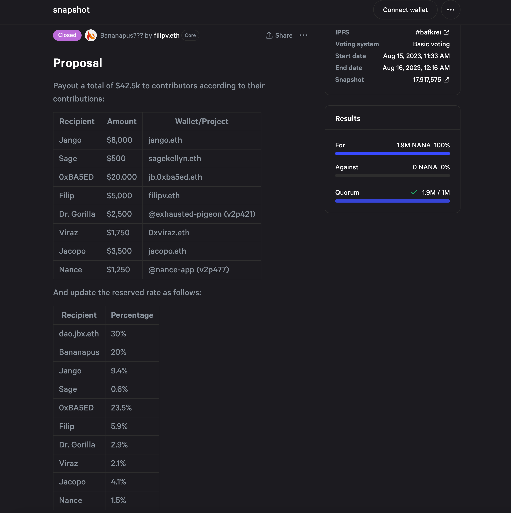
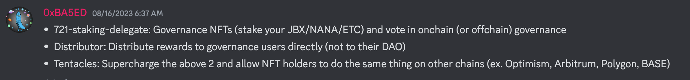
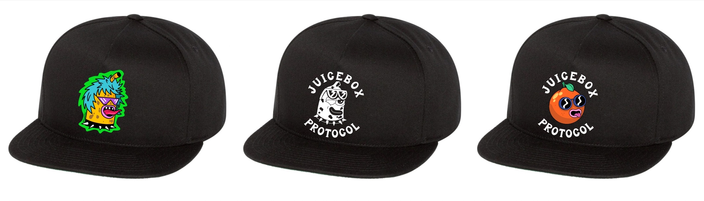

## 回购委托部署 -- Jango

Jango 宣布，我们已经成功部署了回购委托合约，并解决了一些重要的细节问题。目前唯一要做的就是将它配置到某个项目内并它的实战表现如何进行观察。

支付给项目的款项究竟会中转到 AMM 购买代币，还是会转回 Juicebox 合约铸造新的项目代币，在很大程度上受到相关流动性池当前情况的影响。

同时委托的使用还会受到支付函数调用方式的影响，既可能从外部类似 juicebox.money 的网络客户端进行调用，也可能由协议中的其他智能合约进行调用。

第一种情况，外部调用的情况下，Web 客户端可以将预期的交易价格和交易滑点传递给回购委托，这一点对于在合理范围内执行交易非常重要，否则交易可能会受到区块链上恶意交易对手的 MEV 攻击影响。

另一种情况，支付函数作为其他操作的一部分被调用时，例如有人调用 `distributePayoutsOf`来分配支出会触发支付 Juicebox 费用的行为，这种时候就很难做到同时传递报价和滑点。因此，合约团队决定改用 TWAP（时间加权平均价格）预言机来确定合理的报价和滑点范围，从而设定交易的合理边界。

合约对这两种情况进行了非常深入的研究，但在测试环境中很难覆盖所有的可能性。因此我们仍然需要在现实世界中对这个委托进行实战测试，然后再尝试解决可能出现的缺陷。

接下来合约开发团队将会与 Peel 团队展开合作，想办法实现允许付款人对各项交易参数的设定，或者至少以某种方式在前端提供报价范围和预期平均滑点，供他们做出选择。

合约团队编写了一个库，不仅允许客户端向一个委托传递数据，同时还支持 Juicebox 项目同时附加多个合约委托，如同时附加回购委托及 NFT 委托等。

回购委托为所有的相关方都带来了价格效率的提升，这其中也包括保留代币接收人。向项目支付 ETH 款项时，项目部署了回购委托且二级市场价格更好的情况下，项目金库不再接收 ETH 款项并相应铸造新代币，而是把这些资金中转到二级市场以最优的价格购买代币后，再在付款人和保留代币接收人之间进行分配。

除了回购委托的部署，团队还部署了新的 3.1.2 版本支付终端来修复[缓缴费用计算错误的 bug](https://docs.juicebox.money/dev/v3/resources/post-mortem/2023-07-24/)。他们还对 721 委托进行了更新，使用新的元数据模式来支持项目附加多个委托，并支持 3.1.1 支付终端从数据源传递数据到委托的技术规范。

## Bananapus 工作报告 -- Jango 及 Filipv

### 第一次治理投票

本周，Bananapus 社区对他们的第一个治理提案进行了投票，向为该项目作出贡献的工作人员分发报酬，并更新现有贡献者的保留代币比率。

### Bananapus 的工作机制

Bananapus 项目由三个主要组件组成，分别是[Bananapus 721质押委托](https://github.com/Bananapus/bananapus-721-staking-delegate/tree/feat/concept)、[Bananapus 分发器](https://github.com/Bananapus/bananapus-distributor/tree/juice-distributor-alt)和[Bananapus 触手](https://github.com/Bananapus/bananapus-tentacles)。这些将分别在以太坊主网和其他 Layer 2 网络中运行。

**主网 - 第一步**:

1. 代币发行。Juicebox 项目 A 接受 ETH 并相应发行项目代币（代币 A），如果项目有溢出，代币 A 可以用于赎回金库中的部分 ETH。项目 A 的运作与当前普通的 Juicebox 项目完全一致。例如，你可以向 [JuiceboxDAO 项目](https://juicebox.money/@juicebox)付款来获得 JBX 代币。
2. 代币质押：然后我们对应项目 A 创建一个新的项目 B。项目 B 的规则非常固定，不设项目方也没有任何支出，它接受代币 A 并相应地发行分级 NFT。这些 NFT 可以用于链上或链下的治理投票，还可以用于赎回代币 A。这个过程是由 Bananapus 的 721 质押委托实现的。例如，你可以抵押 JBX 代币并获得代表抵押份额的 NFT。
3. 质押奖励：项目 A 或任何其他项目可以将它们保留代币的一部分作为质押的奖励，分配给质押者或 NFT 的持有人。这个部分由 Bananapus 分发器实现。例如，JuiceboxDAO 现在可以将保留的 JBX 代币的 10% 分配给抵押 JBX 的人。
4. 解锁授予：质押奖励在一段固定的时间内分阶段授予。用户解除质押的话，任何未授予的代币都将会收回重新分配，使项目能够实现与做出长期持有承诺的代币持有人分享增长。

**二层网络 - 第二步（原型化阶段）** :

1. 代币铸造：第一步中代表质押份额的 NFT 可用于铸造一个 ERC-20 代币，然后把代币跨链到特定的二层区块链。这由 Bananapus 的跨链触手合约实现。例如，抵押的 JBX 的 NFT 可用于铸造 OPJBX 代币，最多可以铸造出与抵押的 JBX 数量相等的 OPJBX，然后再跨链到 Optimism 区块链上。

2. 代币质押：在 Optimism 上的 JuiceboxDAO 项目中，可以使用 Bananapus 的 721 质押委托合约对 OPJBX 进行质押，操作与主网质押一样。

3. 质押奖励：然后 Optimism 上的 JuiceboxDAO 项目或任何其他 Juicebox 项目可以通过部署的 Bananapus 分发器合约，将其保留代币的一部分分配给 OPJBX 的质押人。

4. 解锁授予：与第一步相同。

由一个机构在不同的网络上发行同一个代币，然后再基于总的代币发行量来分别计算不同网络的赎回，这个做法会带来很高的复杂性和管理难度。与其这样，项目可以选择在不同的链上部署对应的金库，然后从基地网络部署的触手来把代币延伸至任意数量的网络。任何人都可以部署自己的跨链操作网络，无需获得许可。

我们将在接下来的几周内使用 Bananapus 的项目代币 $NANA 展示一个完整的端到端实例。项目的所有组件都已准备就绪，目前正加紧测试，并争取开发出友好的用户界面来平滑整个流程。

这种机制可以扩展到任意数量的链上交互，因为一个在主网上的 JBX 质押份额可以分别在不同的 L2 链上创建许多触手。但是，如果要解锁主网的 JBX 质押，质押者必须撤回部署的所有触手，从本质上来说，亦即需要销毁所有的跨链触手才能取回原始的 JBX 代币。

## Juicebox 主题商品 -- Sage

Sage 发起的[制作和分发 Juicebox 商品的提案](https://www.jbdao.org/s/juicebox/422)，目前正在 Snapshot 投票阶段。提案的目标是在九月的 ETH NY C活动上分发 Juicebox 主题的商品，如贴纸、帽子、T恤等，帮助传播 Juicebox 生态系统。

同时，Sage 还考虑将活动剩余的商品，或者直接保留 25% 至 30% 的商品，分发给未能参加 ETH NYC 活动的人。Jango 建议我们可以考虑批量发给某些个人，让他们参加会议或活动时可以派发。

Sage 从 DAO 申请的拨款为 4,000 美元，已包括所有的分发成本，基本上人们可以免费获得这些商品，不必再支付任何费用。

Jango 和 Sage 都同意，可以发起一个简单的投票，让社区选择出一些设计图案印刷在商品上。欢迎大家踊跃提出关于商品设计的任何意见或建议。
