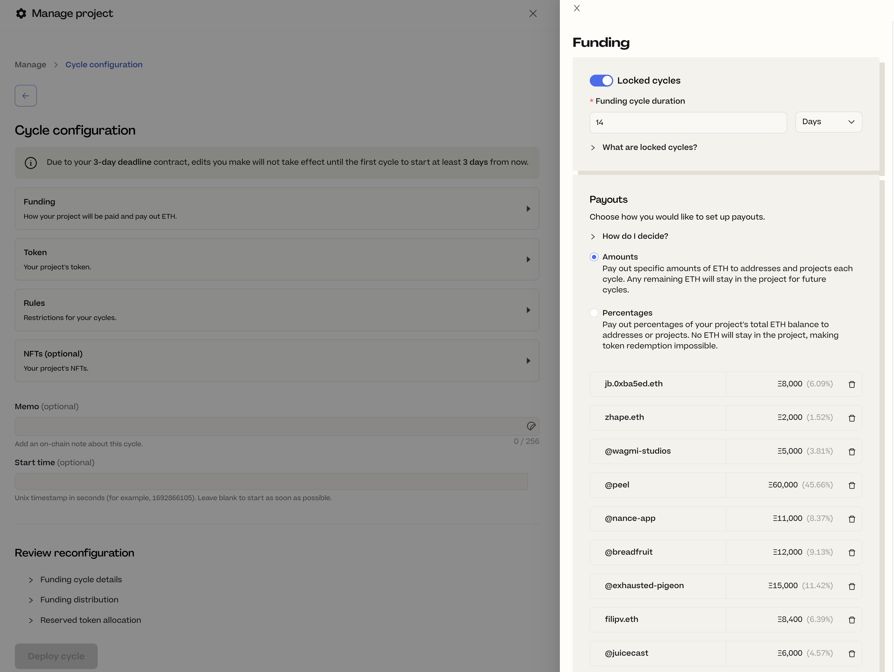
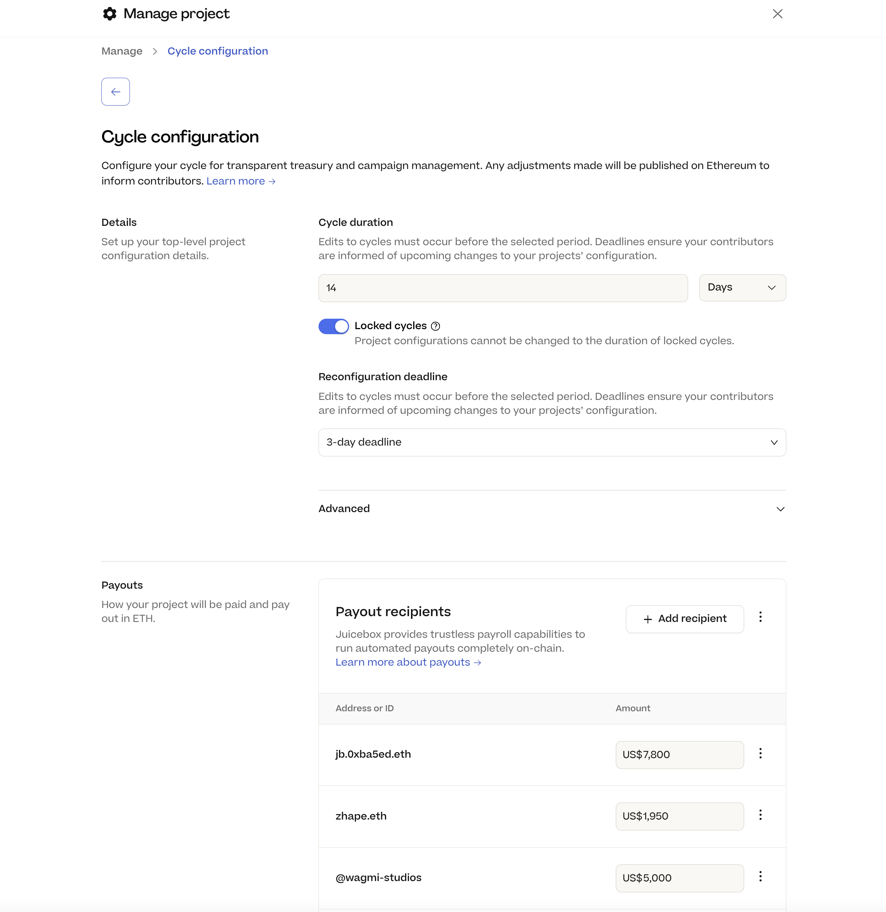
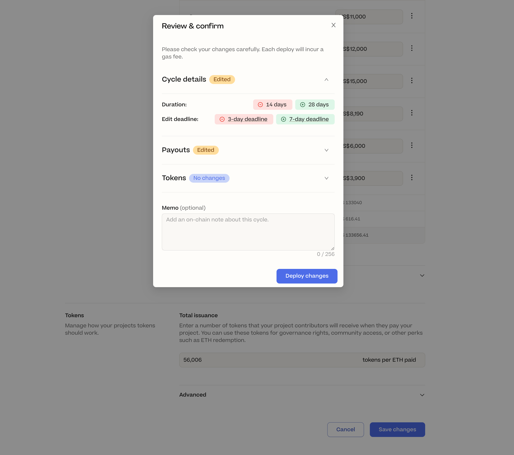
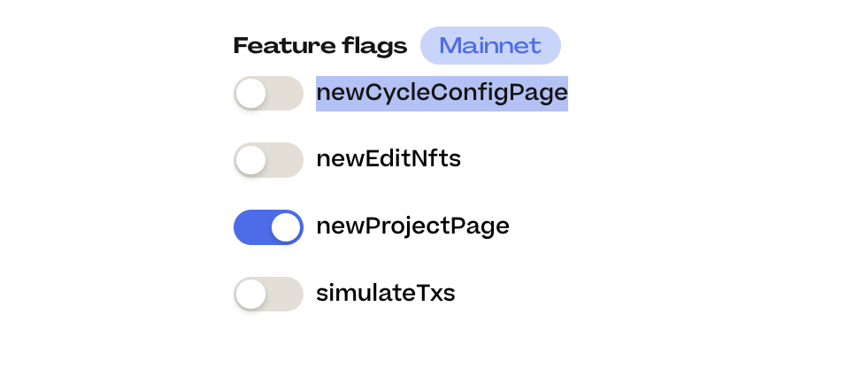

## 回购委托工作报告 -- Jango

Jango 上周宣布回购委托完成部署。之后，合约团队发现一个小的优化可以改进这个委托的工作逻辑，因此他们决定重新编写代码并添加这个细节，之后再正式推出这个委托功能，并建议大家附加到他们的项目上使用。

人们向项目付款并预期回购委托工作的情况下，这个优化会允许委托把用户指定的部分资金中转到 AMM 兑换代币，剩余部分则转回项目金库并铸造新代币。

按照之前的方案，相关代币流动性池流动性不足时，回购委托会跳过流动池兑换代币的操作，把所有资金转回项目金库并铸造新的代币。通过这个更新，回购委托可以先最大程度利用流动池里的可用流动性，然后才将剩余资金转回项目的金库。

## 新周期配置页面 -- JohnnyD

JohnnyD 在周会上对当前的周期配置页面与开发中的新页面之间的差异进行了比较。

旧的配置页面由四个主要选项（资金、代币、规则 及 NFT）组成，点击某个选项会在侧边展开该部分的下一级配置内容。

在新的设计中，所有内容整合到同一个表单内，不同的部分划分到页面中不同的区域。

Peel 团队把之前的四个选项减少到了三个，包括详情、支出及代币，他们计划将 NFT 的相关内容从周期配置页面中分离出来，创建一个专属的页面。此外，他们还在页面上增加了一些教学内容的链接，帮助项目方在创建过程中更好地理解 Juicebox 协议的一些原生概念。

新的周期配置页面上，编辑完成并点击保存的时候，将会弹出一个“审核和确认”窗口，列明修改的各项内容，以便用户在最终部署变更上链之前可以清晰了解。

截止本次周会，这个页面仍在开发中，JohnnyD 呼吁各位成员尝试使用并向 Peel 团队提供反馈。要尝试这个新功能，您可以前往Juicebox的 [功能开关页面](https://juicebox.money/experimental/flags)，启用`newCycleConfigPage`，然后刷新 [JuiceboxDAO的设置页面](https://juicebox.money/@juicebox/settings/cycle) 或其他项目的设置页面。

## 税务问题问答 -- Zactt

Zactt来自 [TokenTax](https://tokentax.co/)，他参加了我们的周会并帮助回答社区成员的税务相关问题。他的观点仅代表个人的看法，不构成任何税务或财务建议。

### 礼品卡的税务影响

被问及使用加密货币购买礼品卡是否与出售同等数量的加密货币具有相同的税务影响时，Zactt 的回答是肯定的。他解释说，每次进行任何交易时，实际上都是在出售某样东西来购买其他东西。因此，如果你使用 ETH 购买礼品卡，实际上你在出售 ETH 购入美元，然后立即将这些美元存进礼品卡里。

从较高层面来看，在大多数国家，出售或处置任何加密货币都是应税事件，在美国更是如此。

### 不同成本计算方法的影响

Zactt 还介绍，在出售加密货币时，使用不同的库存/成本计价方法可能会在应税收入/收益方面产生非常大的差异，相应导致非常不同的税额。

他举了一个例子，假设我们按时间顺序以不同价格购买了三个比特币，一个价格为 1000 美元，一个价格为 50000 美元，另一个价格为 10000 美元。如果我们卖出一个比特币，使用不同的成本计价方法可能会产生非常不同的报税情况。例如，假设比特币的当前市场价格为 30000 美元，那么：

- 如果我们使用 FIFO（先进先出）法，则成本为 1000 美元，资本收益为 30000 - 1000 = 29000 美元。
- 而使用 LIFO（后进先出）法，应税的资本收益为：30000 - 10000 = 20000 美元。
- 第三种选择是特定识别法，这个方法对所有特定项目的成本逐项记录，如果使用最高那项成本，资本收益将完全颠倒过来：30000 - 50000 = - 20000 美元。

如果把所有资产同时卖出，选择什么成本估值方法不会产生太大的差异。否则的话，使用不同的成本核算方法会令资本收益的实现时机有所不同，不管怎样，把需要交的税往后延总归是更好的选择。

### 普通收入及资本损益

如果人们为某个组织工作并以以太币或其他加密货币的形式获得报酬，但他们不打算出售这些加密货币，而是计划长期持有，他们仍然需要报告收入并在同一季度内缴纳预估税款。税额将按照获得收入时加密化币的价格进行计算。

如果将来以太币价格出现下跌，并且他们折扣出售持有的加密货币，差额将被视为资本损失。由于资本损失不能用于抵消普通收入，他们仍需要根据收入的原始价值支付所得税，而每年只有 3000 美元的资本损失额度来抵消普通收入。但是，如果他们有其他资本收益，则可以将这些资本损失一次性用来冲抵。

举个例子，如果你获得了 30 个以太币的收入，以太币的价格为 3000 美元。你必须在同一季度内向美国国税局（IRS）缴纳这 9 万美元收入的所得税。如果以太币的价格下跌了50%，你在 1500 美元的价格卖出这些以太币，你将仍需按 9 万美元收入缴纳所得税，但同时产生了 4.5 万美元的资本损失。

因此，Zactt 建议，如果你以加密货币的形式获得报酬，即使你真的相信某个项目的未来发展，把一半的收入换成法币并将其保留起来用于税款的支付，仍将是一个明智的做法。

在美国，每年的四个季度缴纳税款截止日期分别为 4 月 15 日、6 月 15 日、9 月 15 日和次年的 1 月 15 日。

### 欧盟贡献者提出的问题

我们有一些欧盟的贡献者想知道他们收到报酬时应该向什么主体开具发票，因为 DAO 并不是一个法律实体，而且因为 JuiceboxDAO 没有明确的司法管辖权地区，他们不知道是否应该按欧盟区外实体来缴纳增值税。

Zactt 回答说，每个国家都有自己的规定，但他建议这些在欧盟国家的贡献者以自雇个体经营的方式向他们的政府申报收入。

至于增值税，他建议他们研究一下自己所在国家的增值税法规，并在纳税时采取更保守的做法。

## Sablier 协同工作报告 -- Nowonder

Nowonder 开发的 [Sablier](https://sablier.com/) 协同工作合同是一个分配器，可以作为周期支出的一部分部署到  Juicebox 项目。分配器接收到支付终端的 ETH 付款后，会按项目周期内预设的方式来部署代币流的分配。这个产品支持项目把某一种代币的支出转换成多个不同代币流来进行分配。例如，某个项目的金库资产是 ETH，但他们可以用不同的代币（如ETH、USDC、JBX 等）向多个受益人实施代币流的分配。

这个分配器使用了与回购委托相同的兑换逻辑，Nowonder 觉得这样做是最好的做法，因为委托合约经过审计，可靠性更有保障。分配器收到项目支付终端支付的 ETH 时，会获取项目预设的分配代币的实时报价，再用 ETH 来兑换这些代币。

协同工作合约支持所有 Sablier 的[代币流类型](https://docs.sablier.com/concepts/protocol/stream-types)，如线性时长流、线性数量流、带增量动态流和带关键节点动态流，控制向指定受益人解锁授予代币的不同方式。

Nowonder 还在代码库中添加了持续集成（CI）功能，让有兴趣参与项目开发的人可以一起进行合作。

最后，Nowonder 表示他还将向 Sablier 社区展示这个项目，希望能引起他们对 Juicebox 协议以及如何在社区内开展应用的兴趣。

Matthew 和 Brileigh 还采访了 Sablier 合约的主要作者 Paul，对 Sablier 协议的具体定义，以及 Nowonder 正在开发的 Juicebox 和 Sablier 之间的协同工作功能进行了讨论。访谈涵盖了开发工作的高度概括，与 Juicebox 共同应用的具体方式，以及向我们社区进行了关于 Sablier 的介绍 。

编写这份周会概要的时候，Matthew 和 Brileigh 已经在 [JuiceboxDAO 的 YouTube 频道](https://www.youtube.com/@JuiceboxDAO)上发布了这个采访节目。

<iframe width="560" height="315" src="https://www.youtube.com/embed/2Pq6u4JgSf4?si=M-2BJ1xRbKltAsXA" title="YouTube video player" frameborder="0" allow="accelerometer; autoplay; clipboard-write; encrypted-media; gyroscope; picture-in-picture; web-share" allowfullscreen></iframe>

