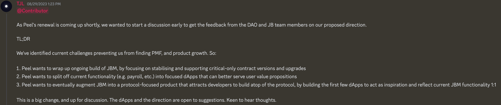

## Juicebox 主题商品讨论

Jango 认为我们可以考虑给欧洲、澳大利亚等地的贡献者批量发送一些主题商品，让他们可以在将来参加活动或会议时，以更精细的方式进行分发。

但如果通过货运运输，我们还必须注意可能会产生的进口关税和相应的海关申报流程。

Sage 表示她很愿意和他们分享图像文件以及订制商品的一些网站，以及部分 DAO 的拨款，让不同地区的人们能够在当地安排订制，从而减轻全球范围内的运输和进口成本。

Filipv 还建议，将图像文件上传到 GitHub 或其他地方，并在一些订制网站上创建页面，这样人们就可以直接去订购这些商品。

尽管 Peel 团队最近一直在推动我们与 ETH Global 或 Devfolio 等组织的黑客松合作伙伴关系，我们也有些成员提出在即将举行的如 ETH Istanbul 等活动中分发这些商品，但由于 Peel 团队仍在努力改进前端的一些功能和设计，最好能够继续执行当前的主题商品分发计划，无须等待黑客松合作活动的实现。

## Sablier V2 协同工作报告 -- Nowonder

Sablier V2 协同工作是 Nowonder 开发的一个协议扩展。主要目的是要帮助 Juicebox 项目方按自己的需要在项目附加支出分配器，为贡献者提供多种代币流的报酬支付方式，以实现对支出的分配和授予的精细化控制。

Nowonder 告诉我们，Sablier 协议首席作者 Paul 最近过来帮助审查 Sablier 协同工作合约的代码库，并提交了相关修改的拉取请求，同时还重新构建了合约里的导入代码，从而大幅减小代码库的体积并提高运行效率。Paul 也对 Nowonder 在创建 Sablier 和 Juicebox 之间的互操作性产品表示了充分认可。

Nowonder 最后表示，他将继续开发，并争取尽快以 Juicebox 项目金库扩展功能的形式发布这一产品，以便感兴趣的项目可以用来向新的贡献者分发报酬。

由于我们目前 Juicebox.money 没有相应的前端用户界面支持这个扩展，Jango 建议 Nowonder 可以考虑先尝试通过 Etherscan 或类似的其他方式将这个扩展附加到 Juicebox 项目上。当大家开始使用这个产品并在 Juicebox.money 之外与 Juicebox 协议进行交互时，可能会导致 Juicebox.money 上的项目页面上无法查询及正确反映相关交易，造成网站项目页面出现错误，这样就可以让 Peel 团队优先考虑在项目页面上创建一个专门的用户界面，来支持这个扩展功能的实现。

上周，Matthew 和 Brileigh 发布了 Juicecast 的新一期节目，他们与来自 Sablier 的 Paul 还有 Nowonder 进行了讨论，讨论主要围绕介绍 Sablier 协议以及它与 Juicebox 协议的互操作性展开。根据 Nowonder 的说法，Sablier 社区对这个集成工作非常感兴趣，希望这个产品可以成为推动社区之间开发者关系发展的良好起点。

<iframe width="560" height="315" src="https://www.youtube.com/embed/2Pq6u4JgSf4?si=aj-FIVuKtHpVquKT" title="YouTube video player" frameborder="0" allow="accelerometer; autoplay; clipboard-write; encrypted-media; gyroscope; picture-in-picture; web-share" allowfullscreen></iframe>

Jango 认为这一期节目成功将其他的声音引入了我们的 Juicecast 频道，对此表达肯定。至于 Nowonder 开发的协同工作扩展功能，我们可能会在形成明确的产品策略或者用户强烈的使用意愿之后，才会着手制定产品的营销及程序界面战略等工作。

但这是一个继续开展研发工作的良好契机，可以寻找两个社区的共同兴趣点并创建通用性用例。如果 Sablier 和 Juicebox 协议组件之间存在协同效应，或者这个方向的发展有足够的吸引力，我们就有理由来共同开发新产品并为两个社区募集更多资金。

### Nance 的潜在用例

Jigglyjams 最近在寻找创建 Nance 项目商业模式的解决方案，允许用户向 Nance 项目付款来获得项目代币，再将代币用于 Nance 服务使用费用的支付。由于Nance 提供的服务涉及持续的订购和使用，Jigglyjams 考虑是否有可能使用 Sablier 代币流来作为 Nance 收取费用的一种形式。

Jango 认为，Sablier 协同工作的当前模型是一个项目向外支出的分配器，而 Nance 的需求则是许多用户支付的费用向一个项目的归集，因此似乎 Nowonder 目前正在开发的产品可能不能直接应用到 Nance 项目。

Nowonder 认为，如果将类似 Nance 这样的项目设置为代币流的接收方，可能存在一定的可行性。他认为 Jigglyjam 的想法很酷，这样用户就可以使用代币流来订购项目的某些服务，并可以通过取消代币流来随时取消订购。Jigglyjams 同意他的观点，认为我们协议目前正缺少支持用户连续付款的一种机制，这个可能是一个很好的研发方向。

## ETH Global 合作工作报告 -- TJL

Tjl 提到他们一直在考虑与 ETH Global 合作举办黑客松活动，并取得了一些很好的进展。但经过 Peel 团队的内部讨论，他们得出的结论是，鉴于当前有些问题亟待解决才能实现 PMF（产品市场适应性），现在可能不是立即与 ETH Global 展开合作的最佳时机，因为我们可能暂时无法以最佳方式同时满足活动中数百位开发人员的各种需求。

因此，Peel 团队提出对前端开发的重大改进建议，呼吁社区成员阅读 [Peel 团队的提案](https://grand-popcorn-c81.notion.site/Peel-Renewal-Proposal-September-23-2eb418b4bf17417db9cdeef5e0111369)并提出建议和反馈。

