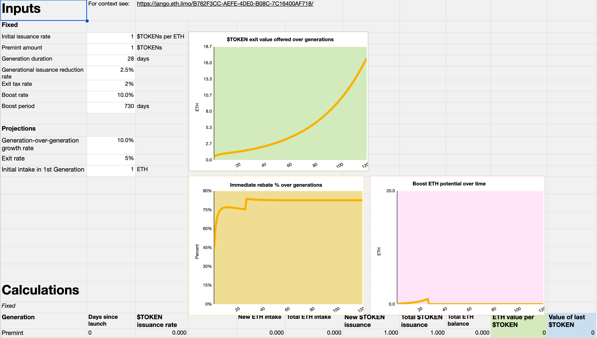
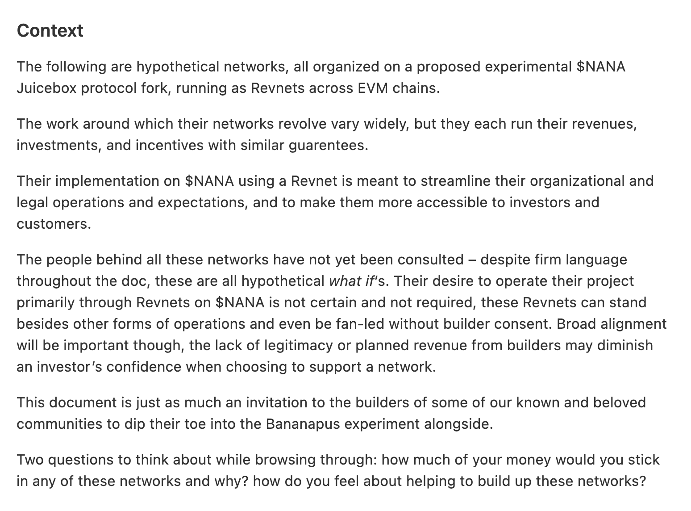
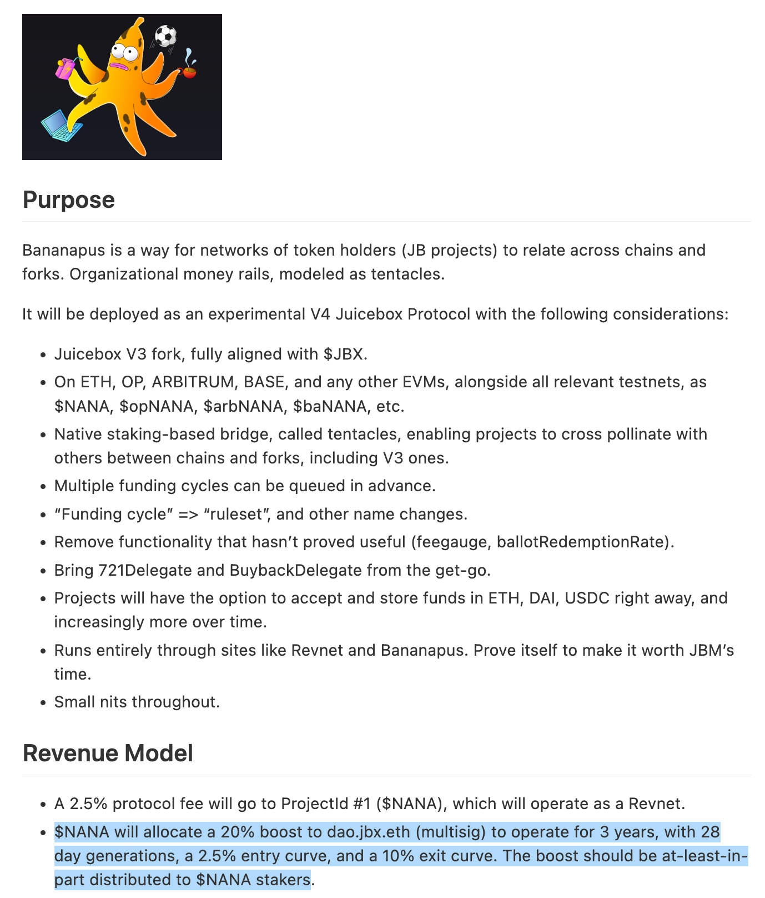
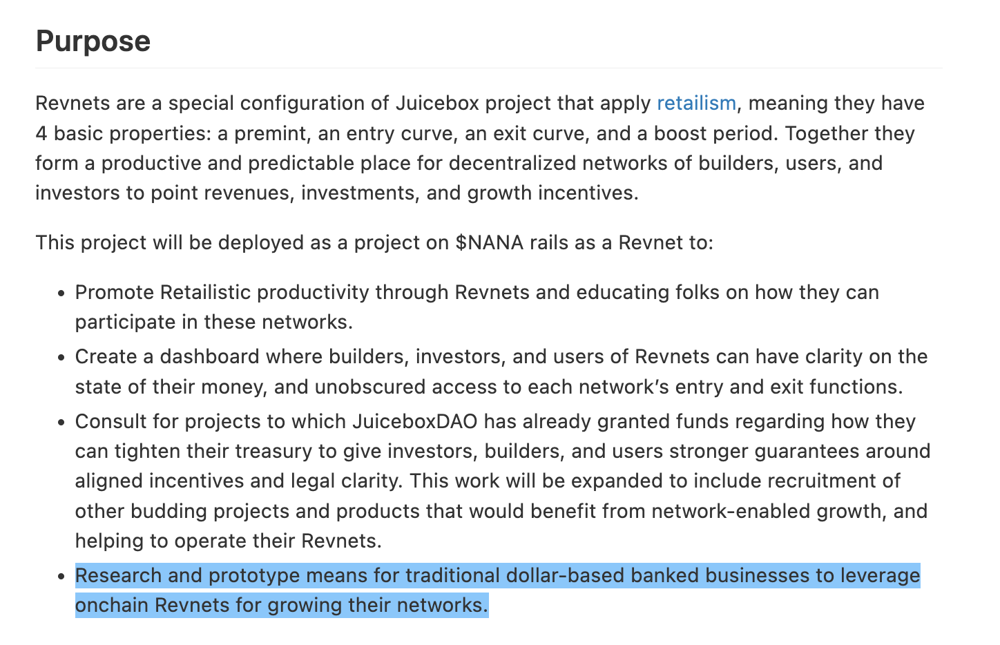

## 回购委托工作报告 -- Jango

回购委托合约进展良好，目前正在进行最后一轮的测试，然后我们就会着手把这个委托部署到 JuiceboxDAO 项目上去。

如果有很多人对这个产品的合约机制感兴趣，Jango 表示他将很乐意录制一期 Solidity Sesh 节目来逐条解释合约的运作原理。

审核合约非常重要，因为这个合约会按照回购委托中设置的规则，授予代表付款人铸造任意数量项目代币的权限。总的来说，这个产品的功能非常敏感，需要在部署和使用时加倍谨慎。

Jango 说，我们原计划首先在实验性项目（如 Defifa 或 Croptop）中附加回购委托，以便正式部署到 JuiceboxDAO 项目前对它进行一些实战演练。但是随着 Bananapus 和跨链互操作性的开发逐渐成型，我们仍需视开发的结果才能决定 Defifa 和 Croptop 将具体部署到哪一个网络，所以我们可能选择直接在 JuiceboxDAO 项目上部署回购委托，经过了合约团队这段时间的边缘测试，合约感觉非常稳定。

## Revnet：Retailism 的产品化 -- Jango

Jango 在七月份的周会上分享过他对 Retailism 概念的一些想法及相关的[博客文章](https://docs.juicebox.money/zh/town-hall/23-07-18/#%E9%9B%B6%E5%94%AE%E4%B8%BB%E4%B9%89-retailism---jango)。

根据 Jango 的说法，Revnets 其实是应用了 Retailism 概念的一个 Juicebox 项目的特殊配置模式，这个模式包括以下参数：

1. 这个 Juicebox 项目既不设项目方也没有费用支出，项目收到付款时相应铸造出新的项目代币。
2. 这个项目的保留代币比率，我们在这时称之为助推（boost），同时一个筹款周期时长改称为一个世代（generation)。
3. 在这种模式中，发行减少率将被称为进入曲线，当网络收到一个单位的付款，发行的代币数量将减少某个百分比。
4. 退出曲线，即赎回比率，指的是持币人销毁代币可能获得金库资金的百分比，同时也会留下部分资金供后面销毁代币的人获取。

许多实验性项目，例如 Defifa、Croptop、Blunt 或 Bananapus，都拥有一些非常好的概念可供运用，但它们也需要找到一个场所来归集网络收取的费用，并按社区的意愿把这些资金用于将来的发展，以促进整个网络的持续增长。

与 JuiceboxDAO 正在实施的治理模式不同，JuiceboxDAO 一直会设置保留代币，项目由多签控制并定期执行社区治理的决策。而像 Defifa 或 Croptop 这样的项目较少管理导向的配置参数，着重对建设者、投资者和客户激励的一致性，从而确保网络的持续增长，有些社区可能不愿花费太多时间来进行这些长尾金库的治理。

以下是可能适用这些网络的工作机制：

- **客户** 支付费用，他们可以通过马上赎回获得的代币来获得部分退款。但是，如果他们长期持有代币而且网络实现了增长，那么代币的价值将随着网络的增长而升高。
- **建设者** 可以通过助推阶段（boost period)来补偿他们在创建网络时做的工作，在这个阶段里，网络的一部分增长将保留并分配给他们。例如，如果一个项目启动时设置了 28 天的筹款周期和 2 年的助推阶段，筹款周期将一直保持每 28 天的速度滚动更新，但 2 年期满时会有一个预设的项目配置生效，把这个助推参数删除掉。
- **投资者** 不再需要担心他们投资资金的去向，因为项目不存在项目方或者多签来更改项目的配置参数。

我们在这些不用的作用中找到平衡，让项目能够以无需信任及无需许可的形式开展运营，像 Defifa 和 Croptop 这种项目甚至可以进一步提升和发展出自己的模式，来决定如何使用和对接它们的收入。

我们仍在想办法让其他人也可以尝试开展积极的试验，一起来开拓我们以后的发展方向。

### Retailism 机制演示

周会上 Jango 还展示了一份[ Retailism 财务建模的表格文件](https://docs.google.com/spreadsheets/d/1R-3PyyF2chmsf_t3IdVi7oEWD0i0IHTcDNwQj4DEKaA/edit#gid=424465074)，大家可以尝试输入项目的初始发行率、世代时长、进入曲线和退出曲线等参数，来测试一下项目的工作机制，看看 Retailism 财务模型的运作是怎么样的。

## Bananapus 行动计划 -- Jango

Jango 表示，尽管 Bananpus 项目的开发工作有点令人困惑和带一定的技术复杂性，但我们希望把它打造成一个具体核心特性的工具盒。

开发团队承诺将展开它作为各个 EVM 链的二层网络连接点的实验，通过在诸如 Optimism、Base或其他适合的二层网络运行，为跨链运营项目找到可靠运行的机制。

例如，Juicebox 作为 L1网络协议，如何可以同时二层网络上运行，并帮助保持跨链应用和跨链实现的财务社区统一性。比方说，我们在类似 Optimism的 EVM 上部署另一个 JuiceboxDAO 金库并发行专属的代币。这对于 JBX 代币会带来什么影响？我们应该怎样建立依靠 JuiceboxDAO 收取费用架构的一致性模式，从而满足主体工作的发展，让每个人，包括建设者、用户和投资者都能够参与其中？

我们或许能够将项目的保留代币比率（在 Revnet 背景下我们称之为助推）一定的百分比指向另一个 EVM 链上的项目，分发给项目的代币持有人而不是它的项目方，来实现网络的相互支持共同发展，不管这些网络是在同一区块链内还是横跨了不同区块链。例如，如果我们在一个 L2 上部署另一个 Juicebox 协议，我们可以找到一种方式，让现有的 JBX 持有人可以分享 L2 版本的协议的发展成果。

但是，跨链桥接和多代币管理操作的风险极高，因此我们可能不希望直接在 JuiceboxDAO 项目上直接进行操作，以免对现有项目产生不可预料的风险和风险。

因此，我们可以在 Bananapus 项目中部署 Juicebox 协议的分叉，来试验这些跨链的试验，包括代币的质押和跨链桥接，跨链多金库管理，以及基于 Retailism 理论的 Revnet 网络运营，不用损害现有主网 Juicebox 协议本身的稳定性和安全性。

提到与 Bananapus 交互的网站，Jango 认为不一定要在 Juicebox.money 网站上实现并马上满足商业化的需求，因为 Bananpus 试验存在一定的风险，不值得这样做。

Jango 表示，我们可能会创建专用的网站来试验各种想法。例如，创建一个 Bananapus 网站来支持质押操作和代币桥接，人们可以在这个网站质押代币来获得 NFT，并用于领取奖励，再通过 Bananpus 触手合约来铸造其他区块链使用的代币。

### Bananpus 网站演示 -- Filipv

Bananapus.com 是一个用于展示 Bananapus 项目开发进度的窗口，同时也是用户与项目合约进行交互的网络客户端。

在周会上，Filipv 演示了 bananapus.com 网站仍在制作中的的各个页面，并解释了质押代币和领取奖励的一些流程。

Bananapus 项目包括三个主要组成部分，分别是 [Bananapus 721质押委托](https://github.com/Bananapus/bananapus-721-staking-delegate/tree/feat/concept)、[Bananapus 分发器](https://github.com/Bananapus/bananapus-distributor/tree/juice-distributor-alt)和 [Bananapus 触手](https://github.com/Bananapus/bananapus-tentacles)等三个合约。

用户可以使用 Bananapus 质押合约来质押持有的 Juicebox 项目的 ERC-20 代币，相应地他们将会得到代表质押持仓的 NFT，这些 NFT 可以随时用于解除质押来获取原来的 ERC-20 代币。

Bananapus 分配器合约支持任何人把 ERC-20 代币的质押奖励发送到合约，让上面提到的代币质押人使用持有的 NFT 按时间进度来领取这些质押奖励。

此外，NFT 持有者还可以与 Bananapus 触手合约进行交互，铸造各个 L2 链的相应代币，并将它们桥接到这些 EVM 链上，以便获得 L2 链的质押奖励或用于其他可能的用途。

## Bananapus 及 Revnets 网络

### Revnet 网络背景

在周会上，Jango 分享了他对一些不同网络的看法，这些网络将会在 Bananapus 项目的 Juicebox 协议分叉上面进行创建，并在不同的 EVM 链上以 Revnet 的形式来运行。可以在[这里](https://hackmd.io/@jango/networks)阅读他关于这些网络的具体阐述。

Bananapus 项目将尝试部署一个 Juicebox 协议的分叉，在这个分叉启动及运营的网络会在多个 EVM 链上对收入管理、代币抵押和奖励分发、跨链桥接等方面展开试验。

首先，Jango 介绍了使用 Revnet 模型在 Bananapus 协议创建网络的理念背景，强调这个概念的目标是要加强在组织架构和法律合规方面的运营和前景，使产品更容易被投资者和用户所接受。

此外，他还表示，不会强制现有项目转到 Bananapus 上以 Revnet 的方式来运营，这些 Revnet 模式可以独立于项目现有的运营模式，甚至可以抛开原项目建设者就可以由项目的支持者另行创建一个 Revnet 网络。 话虽如此，保持建设者和支持者利益的一致性也非常重要，支持者另行创建的话，没有原建议者支持，新网络的合法性或收入流都会大打折扣，可以会降低投资者支持网络时的信心。

最后，Jango 还鼓励社区成员积极参与新的各种网络的建设，并在建设中争取担任更积极更有意义的工作角色。

### Bananapus 的目标

Bananapus 项目是一种支持（Juicebox 项目）代币持有者网络在不同区块链和协议分叉之间进行关联的方式，用一种 “触手” 的方式来实现各个不同轨道上的资金互通。

Jango 解释说，Bananapus 项目将会对 Juicebox 的 V3 协议进行分叉 ，因此它与当前的主网 Juicebox 协议的代码是一样的，终端和控制器等都是最新的版本。这个分叉将部署到以太坊主网、Optimum、Arbitrum、Base 和其他 EVM 链，我们将在其中一个区块链上展开试验 ，然后再逐步向其他地方扩展。

我们将通过实现原生质押跨链桥来支持项目的跨链交叉汇集，并且支持提前配置项目的多个周期，这样项目启动之前之前就可以预先配置好将来需要作出的变更。

此外，部署 Bananapus 还涉及其他考虑因素，比如删除使用不多的功能、集成 721委托和回购委托、支持接收和保管 ETH、DAI、USDC 或其他代币的资金等。

### Revnet 的目标

Jango 介绍，Revnets 是一种 Juicebox 项目的特殊配置方式，应用了 Retailism 逻辑，项目的启动和未来运营以 4 个基本属性为特征，即预挖代币、进入曲线、退出曲线和助推阶段。这些基本属性有助于为建设者、用户和投资者积累资源，进一步推动社区的增长。

Revnets 的目的包括提高生产力和社区参与度、提高资金管理透明度和资金取用的便利性、帮助 Peel 和 Nance 等现有项目为他们的社区提供更多的激励和法律明确性，以及为传统银行业务提供研究和原型化的途径。

### 结语

Jango 对项目的未来发展感到非常兴奋。他表示最近几个周期将发起提案，希望提案可以在社区中引发更多关于这方面的讨论，共同决定是否支持这个试验及我们应该如何参与。

Jango 认为，我们当中的许多人一直相互交流各种想法、金库设计和产品理念，因此其实我们都在朝着一个共同的兴趣点努力，也希望 JuiceboxDAO 在这些领域进行投资。现在我们找到可以更把握地控制风险和归集资金的方式，我们可以尝试着探索一些未知的因素。

同时我们也可以持续关注现有的项目，了解人们对什么感兴趣，然后再去接触零售投资者和风险投资者，重新建立与他们的关系。
