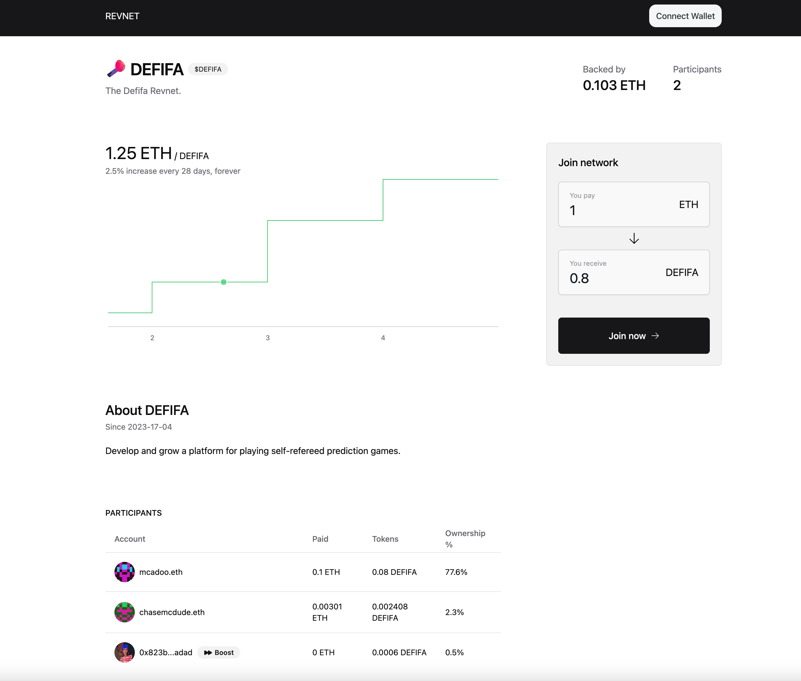
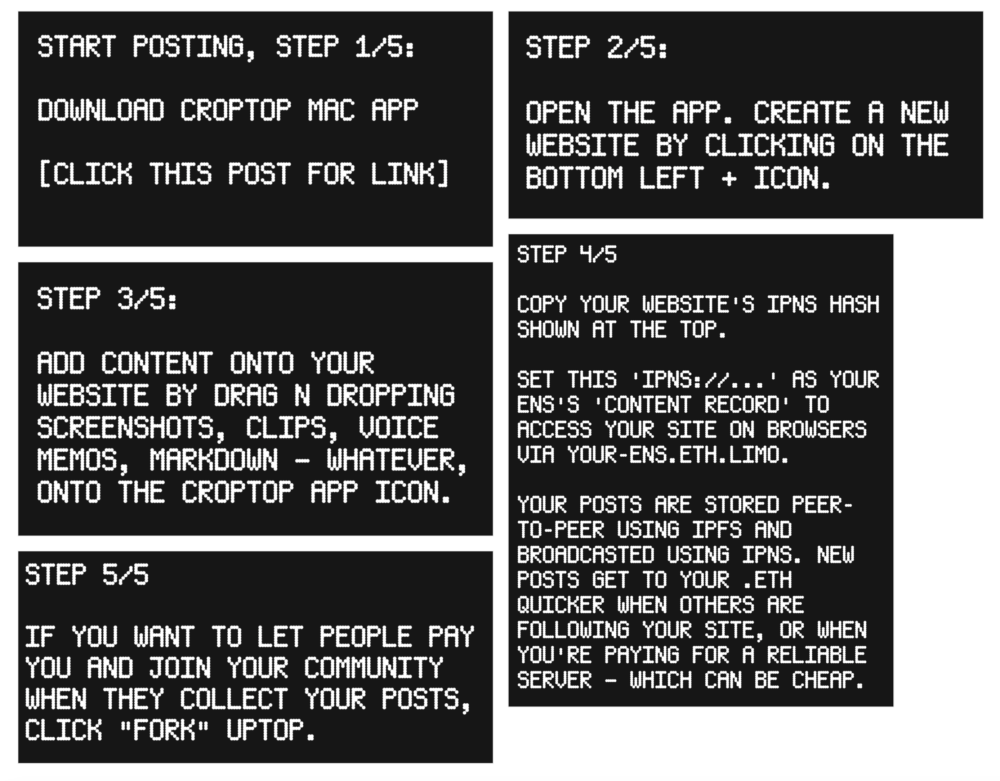

## 回购委托部署计划 -- Filipv 及 Jango

回购委托原计划在当前的筹款周期内部署，但出于谨慎考虑，由 Jango 领导的合约团队决定这个周期先暂缓部署。

合约的开发工作已经基本完成，合约团队也已经进行过一段时间的审查和边际案例测试。Jango 认为这个合约的感觉非常良好，下一个周期部署没有任何问题。

但是，由于回购委托合约需要能够管理代币供应，因此它的设计是附带发行任意数量代币权限的。理论上来说，如果出现意外的边际情况，有可能会出现代币发行量恶性膨胀的情况。这个时候如果同时开启了金库的赎回功能，新增代币可能会大量赎走项目金库内 ETH 资产。

因此，Jango 认为在部署回购委托前关闭赎回功能是明智之举，他计划下个周期提交一项提案提议这一方案。提案如果得到批准并执行关闭赎回之后，我们可以马上把回购委托附加到 JuiceboxDAO 金库。具体的执行时间为下下个周期开始，大约三周之后。

## Juicebox 项目加速器基金提案 -- Filipv

Filipv 表示，他和 [Artizen](https://www.artizen.fund/) 的联合创始人 René 最近发起了一个 [Juicebox 项目加速器基金提案](https://www.jbdao.org/s/juicebox/438)，计划由 Juicebox 和 Artizen 共同出资启动一个配套基金，支持人们创建社区驱动的各种前沿创新项目。如果提案获得批准，Artizen 将投入与 JuiceboxDAO 拨款金额一致的资金，上限为 5 万美元。Juicebox 项目加速器基金将用于资助潜在项目方创建 Juicebox 项目。

此外，Filipv 还与 René 合作，计划在 Juicebox 协议上发行 Artizen 平台的社区治理代币。

按照 Filipv 的说法，JuiceboxDAO 和 Artizen 之间的合作细节仍然没有最终敲定。他欢迎社区成员积极提出反馈或建议，帮助完善这个计划。

## Bananapus 及 Revnet 工作报告 -- Jango

Jango 在本次周会上分享了 Revnet 网站的原型化产品。

Jango 介绍，部署 Revnet 项目的一些数据仍在编写之中，但基本合约已准备就绪，同时也在进行基础网络客户端的搭建工作。

团队计划从现在开始进行为期六周的开发冲刺，首先将 Revnet 网站部署到测试网对 Bananpus 和 Revenet 网络进行测试，测试网测试顺利通过并且确保可靠性之后，希望能够在这个时间框架内实现主网的部署。

目前，合约团队正在开展 Bananpus 项目的开发工作，主要围绕 L2 区块链的部署进行试验。Filipv 正在帮助撰写一些正式文件，用于与偏学术层面的受众进行沟通。Jango 正在制作操作教程以及一些视频内容，用于解释与 Bananpus 及 Revnet 相关的概念。

Jango 认为，很多人对我们在 L2 上的开发工作很感兴趣，这个工作将对 Juicebox 将来的发展起到非常重要的作用。我们正在进行的试验，尽量不影响 Juicebox协议在主网上现有的部署，以免对现有产品产生一些负面的影响。我们希望已经实现的产品能够保持稳定，从而允许 Peel 进行更多细分的前端开发。如果我们的 L2 试验进展顺利并且获得足够的信心，还可以把这些前端开发产品指向 L2 分叉来开展应用。

## Croptop 工作报告 -- Jango

大家可以访问 [Croptop网站](https://croptop.eth.limo/)，了解更多关于这个项目的信息。也可以直接在[这里](https://pinnable.xyz/dl/croptop)下载专用的 Mac 应用程序，并按照以下说明进行操作：

最近，团队成功开发了 Croptop 的聚合功能，支持在一个 Croptop 聚合页面汇总许多其他 Croptop 应用托管的信息源内容，这样用户无需自行对各自的信息源进行托管。这个功能对社区创作内容的集中展示非常有帮助。除此之外，它还支持用户从多个客户端如PC、手机或平板电脑上发布内容，再把发布的内容统一汇总到一个托管网站。

此外，这个功能也支持把任意的 RSS 源，无论是否在 Croptop 站点发布，都可以汇总到指定的 Croptop 网站，在很大程度上扩宽了社区内容的来源。

这一功能同时真正开启 Croptop 展示内容信息源的能力，而且不会产生任何费用或者交易成本，它可以作为网络客户端来托管和广播这些内容。

Croptop 项目已经成功部署到 Goerli 测试网，下一步等待 Revnet 完成部署之后就会正式产品化，从而为人们提供免治理、高效的解决方案来实现网络费用的归集。

## 回购委托工作机制解释 -- Jango

如果一个 Juicebox 项目部署了回购委托，每次项目收到付款时，这个委托或者把资金中转到项目金库来铸造新代币，或者中转到 AMM 交易所兑换代币，又或者在某些情况下两者同时进行，具体的操作取决于代币的内部发行价格和市场价格之间的差异，以及相关流动池流动性是否充足。

以 JuiceboxDAO 金库为例，回购委托将会按以下三种情况下发挥作用：

1. 当付款以捐款的形式支付到 JuiceboxDAO 项目时，类似  juicebox.money 这样的网络客户端会把元数据传递给回购委托，元数据的信息包括例如最低的兑换数量和最少需要支付的金额，回购委托会按照这些指示来执行兑换交易。

2. 资金以内部支付（例如，项目向协议外分发资金将需要支付 2.5% 的协议使用费给 JuiceboxDAO 项目）的形式支付到项目金库时，将不会发生向回购委托的元数据传递。在这种情况下，回购委托将使用 TWAP（时间加权平均价格）作为定价标准来执行兑换代币交易。

   项目方可以调整部分 TWAP 的参数，设定预言机定价的激进程度。如果定价过于激进，实际兑换最终超出了 TWAP 的建议范围，合约则会默认把资金转回项目金库铸造新代币，而不会在公开市场上进行兑换。

3. 如果项目收到的付款超过 AMM 流动池中的可用流动性，网络客户端可以对资金进行分割，使用一部分资金来尽可能利用流动池里的流动性，剩余的部分会转回项目金库铸造新代币。

总体而言，这个合约核心部分比较简单，但覆盖了一些较重要的边缘情况，并添加了一些灵活强大的边缘案例功能。它帮助人们在与 JuiceboxDAO 金库互动时能获得更多的 JBX 代币，将来还可以为生态系统内的其他项目提供服务。我们可以想像，如果达到一定规模的项目希望为社区提供最佳代币价格，这将会成为它们非常核心的一部分。
