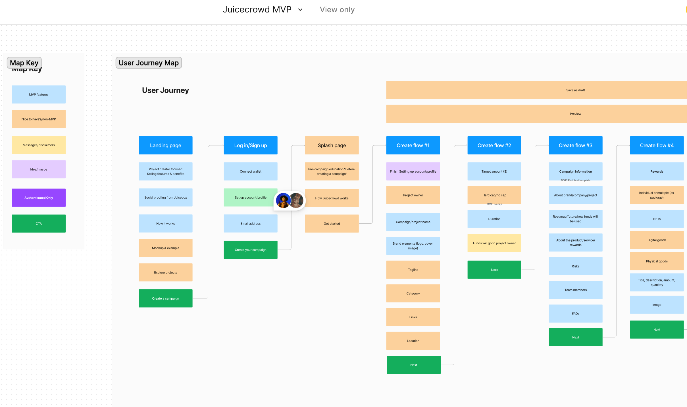
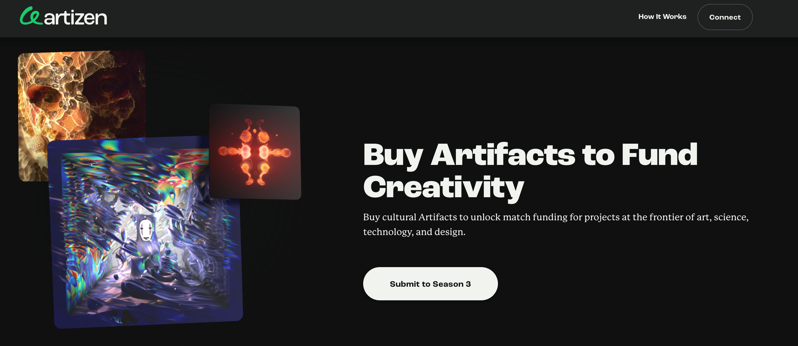
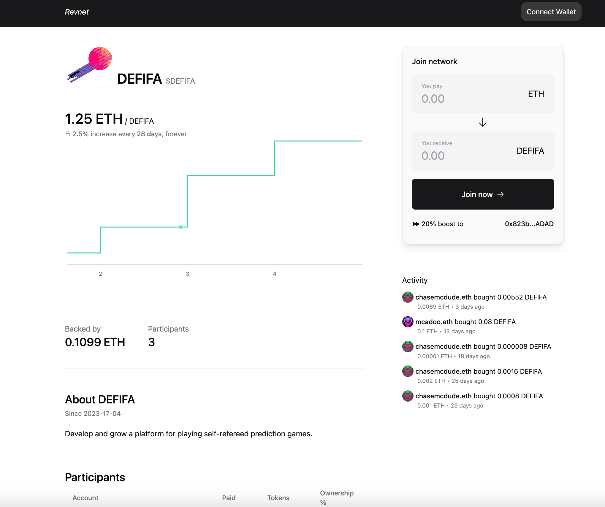
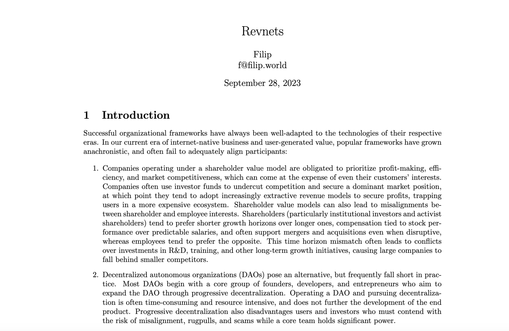
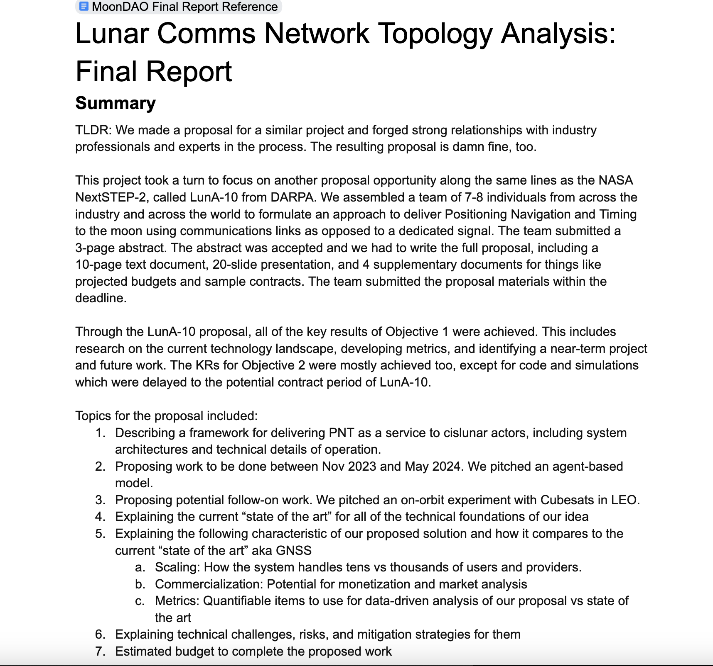

## Peel 工作报告 -- Tjl

Tjl 介绍，Peel 团队目前正在开发 Juicecrowd 的专用前端，这是一个更为具体、Blunt 风格和类似 Kickstarter 的筹款工具。截至本次周会，团队已经完全定义了该项目，并将在接下来的几天进行测试和原型化设计。

## Artizen 介绍 -- René

René 是 [Artizen](https://www.artizen.fund/) 的联合创始人，这是一家致力与各个以使命为驱动的品牌展开合作的基金，旨在发现和资助艺术家、科学家和各种创作者，以帮助他们发展自己的组织生态或实现自己的使命。

René 介绍，Artizen 围绕着让许多不同的利益相关者一起策划项目、共同提供资金来奖励最有前景项目的理念，打造成一个由 Artizen 社区自行融资和策划展示项目的平台。

他表示对与 Juicebox 合作非常感兴趣，一方面是出于对 JuiceboxDAO 开发产品的认同，另一方面是因为 Artizen 和 Juicebox 社区有很多方面是共通的。他认为，两个社区的合作对于各自社区汇集资源、资助有才华的创作者，并鼓励他们使用 Juicebox 开展筹款活动是有很大意义的。

在 JuiceboxDAO 的当前周期，René 在 Filipv 的帮助下提交了一个名为 [Juicebox 项目推进器基金提案](https://nance.app/s/juicebox/438)，旨在启动一个 Juicebox 和 Artisen 合作的配套基金，以支持 Juicebox 中以社区为驱动的项目发展。

## Bananapus 工作报告 -- Jango

0xBA5ED 目前已经完成了 721 委托、奖励组件（允许人们将代币中转分配给质押者）以及触角组件（允许质押者将代币桥接到其他链以通过类似的机制获得质押奖励）的实现。

Dr.Gorilla 一起在进行对 721 委托测试的清理工作，721 委托是一个非常复杂的合约。在部署回购委托到 JuiceboxDAO 项目过程中，他将负责各种测试的调整工作。

合约团队已经针对 V3 合约的代码库发起几个拉取请求，这些更改将用于 Bananapus 项目的分叉，而不是要对目前的 Juicebox 标准协议进行调整。我们将把这个 Juicebox 协议分叉用于Bananapus项目的实验。

其中最有意义的变更之一，是要允许在同一个区块中排队多个周期的配置交易，允许项目方在部署项目时就部署好多个周期配置，不再需要在该周期生效前通过触发公共交易来执行这个周期的配置交易。

### Bananapus 的审计工作

Matthew 在会上问到，Bananapus 的开发工作完成之后是否会考虑对合约进行审计。

Jango 回答说，Bananapus 项目是对 Juicebox V3 协议的一个分叉，而 V3 协议去年已经通过了 Code4rena 的审计，因此无需对分叉再重复审计。但他也表示会考虑审计新的 Bananapus 专用组件，包括 [Bananapus 721质押委托](https://github.com/Bananapus/bananapus-721-staking-delegate/tree/feat/concept)、[Bananapus 分配器](https://github.com/Bananapus/bananapus-distributor/tree/juice-distributor-alt)和 [Bananapus 触角](https://github.com/Bananapus/bananapus-tentacles)等合约。

Bananapus V4 分叉实际上是 Juicebox V3 协议的一个全新实现，主要进行了一些小的专用调整，因此 Jango 认为我们应该定期监控这些调整，并在一定时间重新评估它们是否值得进行正式审计。总的来说，他认为当前的 Juicebox V3 协议已经走完产品化的审计及固化的整个流程，而且我们也开发了强大的版本控制来保证协议稳定状态。

Jango 还认为，想要 Bananapus 的试验得到广泛的信任，就应该用良好的经济模型来进行部署，如果将来这个协议分叉确实赢得了大家的信任，我们的持续向前发展的贪心就可以更加坚定，并且当前的 JBX 持有人也能很好地理解这个分叉的经济模型的原理。但他强调，中短期内任何关键任务的试验，仍然应该以主网的 V3 实现为指向。

Jango 表示，大家总会觉得审计越多越好，直接开展试验反而需要进行一些心理建设。如果从一开始就赋予产品太多的合法性，开发进入到产品化而且我们最不为意的时候，可能就会出现一些奇怪的问题。更为理想的做法是，在开发的过程中不断向用户提示存在的所有风险，等将来必要的时候再动用社区资源来做审计赋予产品更高的合法性。

## Revnet 工作报告 -- Jango

Jango 介绍说，Revnet 的产品化进展相当顺利。在周会上，他分享了 Revnet 网站的更新原型，原型化产品使用了真实的数据和 Revnet 合约，合约的底层实际上对多个现有的 Juicebox 合约进行了利用。

他还改进了一些用于部署 Revnet 的 Juicebox 合约，可以在 [Revnet 的 Github 代码库](https://github.com/rev-net/revnet-contracts) 中找到。

Filipv 一直致力撰写关于 Revent 较为正式的文件，对 Revnet 的工作机制进行详细的描述。他呼吁大家查看这个[文件](https://github.com/rev-net/revnet-writing/blob/master/whitepaper/revnet.pdf)并提供反馈，以便帮助改进这份文件的内容。

Jango 觉得我们应该考虑一下，如何才能把这个产品的概念传播给那些打算运营项目、或者正为他们的开源软件或其他应用寻找货币化途径的人群。

Jango 说，他最近同时参与的几个应用开发工作都是基于当前协议的，这些应用互相之间应该都能受惠。随着试验的进一步推进并从不同的用例中汲取经验，我们将可以发现哪些受众将会更加被这些不同类型的应用所吸引。

## Juicecast 工作报告 -- Matthewbrooks

Matthew 和 Brileigh 推出了 Juicecast 的第 31 期节目，邀请到的嘉宾是来自 Seed Club的 Jess 。Seed Club 作为一个风险投资 DAO，主要资助初创创始人构建各种加密产品。

<iframe width="560" height="315" src="https://www.youtube.com/embed/iJz1w9evs-E?si=A_J2T-yJILMbb7pg" title="YouTube video player" frameborder="0" allow="accelerometer; autoplay; clipboard-write; encrypted-media; gyroscope; picture-in-picture; web-share" allowfullscreen></iframe>

接下来他们还将发布采访来自 Seed Club 的 Peacenode 的下一期节目，探讨构建 Seed Club 品牌及其图形设计方面的内容。

## MoonDAO 信息分享 -- Pablo

Pablo 是 MoonDAO 的联合创始人之一，他参加了我们的这次周会，并分享了 MoonDAO 开发工作的一些最新进展。他介绍说，他们最近一直致力于对月通信网络拓扑结构的研究，这是一种从地球到月球的消息传递方式。这种方式符合以太坊区块链的原则，通过一种非常中立、自下而上的方式进行，而不是依赖于少数关键基础设施节点。

Pablo 还在会上表达了对 Juicebox 的感激之情，因为 Juicebox 帮助他们成功开展筹款并构建了自己的项目和社区。同时他也非常高兴地看到，Juicebox 还帮助实现了其他许多令人惊叹的事情。

