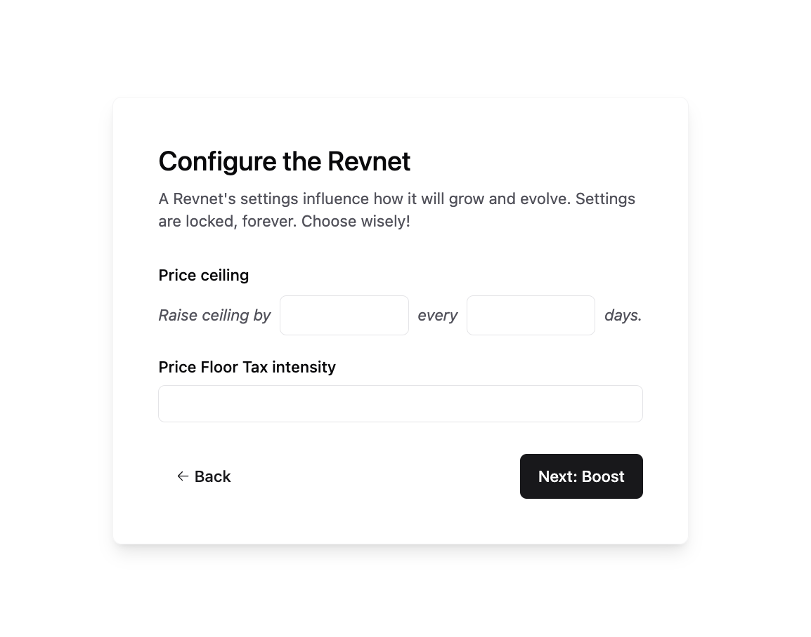
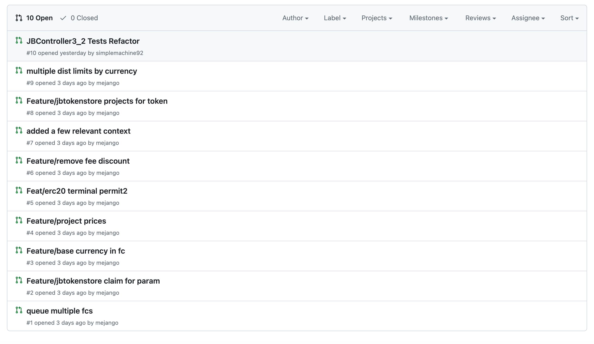
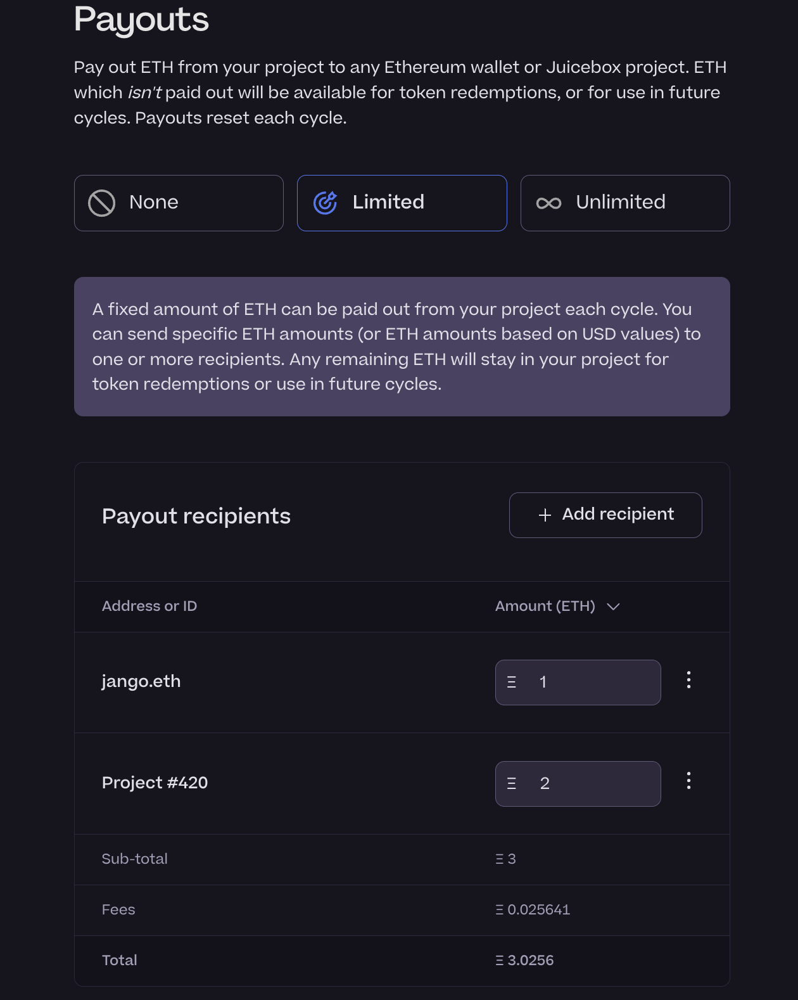
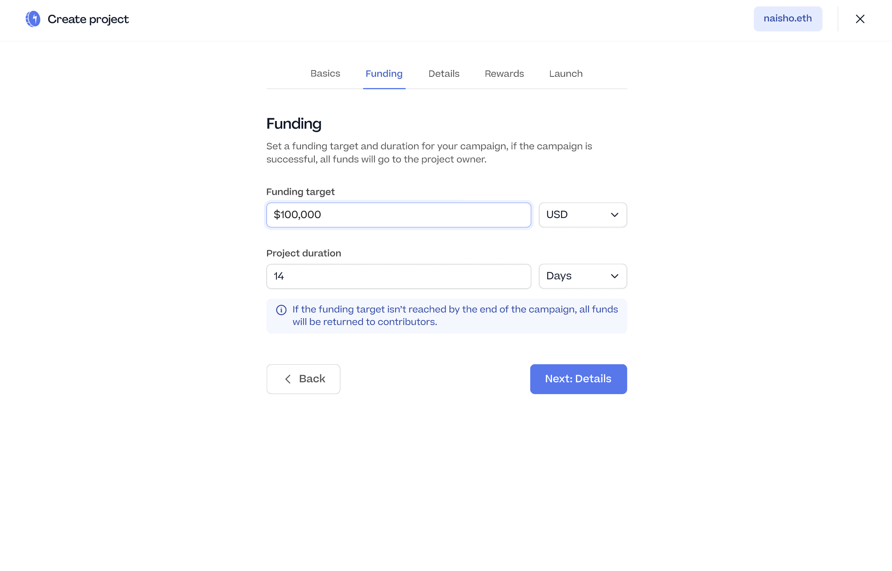

## Revnet 及 Bananapus 工作报告 -- Jango

### Revnet 创建流程

团队最近开发了 Revnets 创建流程的原型，可以填写 Revnets 的所有概念参数，例如价格天花板、价格地板税收强度、预铸代币、团队激励和团队激励期限等。

这个创建流程开发更加完善之后，Jango 期望开发团队将更加集中于 Revnets 的项目面板开发工作，争取让页面展示更多维度的信息。

此外，他们仍将制作一些数据可视化的内容，Jango 认为下周这个工作的完成度会更高一些，这些内容可以用于嵌入各个页面使用。

### Bananapus 新代码库

在 Bananapus 的 GitHub 代码库中，我们新建了一个偏试验性且权限较宽松的新库。这个库的有些拉取请求仍有待处理，Jango 预计这些工作会在一周左右完成，然后就合并到 Bananapus GitHub 主 V4 代码库。

Bananpus 是一个 Juicebox V3 协议的分叉，预计将在多个区块链如主网、Optimism 等上面部署，将非常具有可扩展性。这是一个对 V3 协议某些内容进行修订的公开机会，其中包括增加在项目部署时提前一次性安排多个周期配置的功能，而不是像目前这样必须在每个新的周期开始之前手动触发重新配置的交易。因此，项目方可以通过部署自动更新每个周期各项规则的项目，来提出一些新的游戏玩法。

在 Bananapus 上使用的经济模型不会对 JBX 造成直接影响。从风险的角度来看，我们可以在不危及 JBX 的前提下开展 Bananapus 的实验。Bananapus 的 Revnet 网络会对应现在 JBX 供应量提前铸造一些代币，并将这些代币分配给 Juicebox 多签钱包，由 JBX 持有人共同进行管理。

## 回购委托工作报告 -- Jango

部署回购委托的交易已与 JuiceboxDAO 新周期的重新配置一起排队等待执行，将在下个周期开始的时候开始生效。Jango 认为，这个功能将立即为保留代币受益人及向 JuiceboxDAO 支付费用的其他项目支付红利。

回购委托的使用将会增加我们对 JBX 代币以及作为价值支持的项目金库的信心，我们可以更多依托于 JBX，同时不需要过多干涉 JuiceboxDAO 的总体发行属性 。希望在未来，其他项目也可以发展到一定的规模并通过类似的方式使用这个功能。

## Peel 工作报告 -- TJL

### 支出表格

由 Peel 团队的 JohnnyD 开发的支出表格已经实现到 Juicebox 的项目创建流程。项目创建者现在可以以表格的形式添加项目的支出接收方，指向某个以太坊钱包地址或另一个 Juicebox 项目。如果项目设置了支出限额，可以指定向他们支出的具体金额，如果支出调整为无限额，则这里会自动更改为按百分比进行分配。

### Juicecrowd 原型化

Juicecrowd 是 Juicebox 的精简版本，专门为那些想在 Juicebox 上进行众筹，但又觉得当前的项目创建流程的功能对于他们来说过于复杂，很难开展工作的人打造。

这是一个简单化的筹款工具，有点类似不设代币发行的 Blunt 项目，但提供了 NFT 功能（可选项）来作为给予捐款人的奖励。与当前的 Juicebox 创建流程相比，它还将项目底层的多个筹款周期简化为单一周期，并用简单的提取资金代替较复杂的多周期重复支出。

Peel 团队已经开发出 Juicecrowd 的原型化产品，可以在[这里](https://www.figma.com/proto/fV02sJ1bihdNgjR1T3JCSR/Juicebox-Apps-Exploration-–-Sep23?page-id=434%3A19818&type=design&node-id=499-36268&viewport=427%2C-525%2C0.13&t=vZFc1ycVdpxCAtb9-1&scaling=scale-down&starting-point-node-id=759%3A86140)查看。 Peel 团队接下来将对这个原型化产品进行持续的改进。

## 关于整合 Patreon 和 Juicebox 的想法 —— Jango

Jango 介绍，[Patreon](https://www.patreon.com/home) 上有大量的内容创作者每月向粉丝收取订阅费用。他一直在探索让这些创作者在继续使用 Patreon 的同时，把他们收到的资金转到 Revnet 项目的可行性，因为 Revnet 网络确定性更高，对资金支配的限制或影响则比 Patreon 要低得多。

他同时还思考，是否可能通过一种追溯的方式来给予曾向某个 Patreon 项目付过款的人进行奖励。这样，我们就可以创建一个代为接收 Patreon 资金的中间服务，把这些资金带入区块链世界，并向付款人发放属于他们份额的代币。

Jango 觉得，很多人喜欢使用 Patreon，因为它在支持用户按自己意愿付款方面做得很好。但显然 Patreon 同时对资金有很大的控制权，可以做出不向某些账号付款等的决定。最好我们能开发出一些原型化产品，供一些有意愿整合 Juicebox 服务的 Patreon 项目进行尝试，Jango 希望能够探索一些在银行账户和区块链账户之间提供中间服务的解决方案。

Jango 承认，在涉及到大笔资金转移的时候，可能需要大量的管理、运营，也存在很多潜在的故障点，他正在试图了解这种商业模式会存在怎样的法律和逻辑影响。

此外，他正在研究，是否会有一种模式可以与当前 Web2 现有的业务模型和服务进行连接，并为一些类似 Revnets 这样的想法提供更广泛的市场解决方案。但是要有足够的启动能量让那些已经有很高知名度的项目愿意进来尝试，也不是一件容易的事情。

