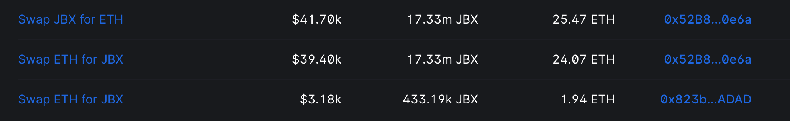

## 回购委托工作报告 -- Jango

回购委托已经部署到 JuiceboxDAO 当前的周期，目前工作正常。如果有人向 JuiceboxDAO 捐款，或者其他项目向生态外付款从而需要支付 Juicebox 费用时，他们都会因此而获益，因为付款相应获得的 JBX 代币更多。但这样做的代价是，因为支付进来的款项都中转到了二级市场去购买 JBX，JuiceboxDAO 金库的 ETH 余额将不会再持续增加。

JBX 的能量到这个阶段得到最大的释放。随着项目量能同时向上发展，JBX 刺激生态系统向前发展的作用现在变得更具有实际意义。

下一步我们将计划与 Juicebox.money 整合推出支出流程的报价机制，确实人们可以以最优的价格获得代币。最近也有一些人咨询是否可以把回购委托部署到他们的项目上面，我们会持续关注这方面的需求，希望能从合约开发及用户的角度来继续对这个产品进行调整。

### MEV Sandwich MEV 三文治攻击

如果 Juicebox 的项目向生态之外分配支出，需要向 JuiceboxDAO 支付 2.5% 的 Juicebox 协议费用，回购委托会把收到的费用跳转到 AMM 池购买 JBX 代币，这个时候可能会受到 MEV 机器人的三文治攻击并被盗取去一定的价值，除非触发分配支出交易的地址在钱包内配置了反制 MEV 的 RPC。

造成三文治攻击的原因是，以协议费用形式支付到 JuiceboxDAO 的款项不带有元数据，我们无法指定这些费用应该按什么价格去购买代币，所以回购委托合约在这里使用了 TWAP （时间加权平均价格）预言机来盯住交易池最近的价格。

这个 TWAP 预言机有两个参数我们可以进行调节。第一个是 TWAP 的时间窗口，例如 30 分钟或 24 小时等，这个指的是回购委托向前取值的时间长度，再用得出的平均值来决定执行交易的价格。第二个参数则是我们可以接受从这个平均价格偏离的滑点范围。

通过这个参数，我们可以自动确定期望的成交价格。但期望价格和实际价格之间的差异仍可能存在套利的可能性，尤其是波动性比较大或者池子比较浅的时候。如果中转到 AMM 交易池的 Juicebox 费用是 10、100 或 200 美元的规模，同时流动性深度有 3 万美元左右的话，交易造成的冲击不大，套利的机会也相对比较小，不太会出现 MEV 攻击。只要交易价值相对池子的流动性比较低，或者大家像 Jango 一样向池子添加流动性，MEV 三文治攻击的机会就会慢慢地减少。

### 关于分配机器人的问题

最近社区内有些想法，考虑我们是否应该开发一个机器人来监控协议内的支出分配行为并对函数进行调用，避免 MEV 机器人的调用和攻击。

Jango 以最近 JuiceboxDAO 的分配支出为例，这次支出产生了 1.94 ETH 的 Juicebox 费用（是的，包括 JuiceboxDAO 在内的所有项目，只要向生态之外付款，都需要支付 Juicebox 费用）。这次 MEV 攻击的总交易额大概在 8.5 万美元左右，1% 的池子产生超过 800 美元的流动性费用。类似这种行为会鼓励人们向池子添加流动性，相应地就会降低之后的套利机会。

我们当然也可以选择自己开发一个机器人来利用我们信息不对称的优势，但 Jango 认为我们还有比这个更重要的事情值得去做。当然，如果有人对这方面感兴趣，也可以发起相关的提案，只要社区同意，他是持开放的态度的。

Jango 计划下个周期发起一项提案，建议 DAO 向 JBX 流动池添加更多流动性，从而降低回购委托工作时受到 MEV 套利攻击的可能性。

## Juicecast 播客工作报告 -- Matthew 及 Brileigh

Matthew 及 Brileigh 发布了新一期的 Juicecast 节目，采访嘉宾是来自 Seed Club 的 Peacenode，他们在节目中谈论了 Peacenode 在 Seed Club 作为创意总监的具体工作情况，他如何帮助建立 Seed Club 品牌，以及他们社区如何通过创造者带动的维度来开展品牌塑造工作。

<iframe width="560" height="315" src="https://www.youtube.com/embed/3OLk_pMTzrg?si=vrEf6Ui0vcpikWWt" title="YouTube video player" frameborder="0" allow="accelerometer; autoplay; clipboard-write; encrypted-media; gyroscope; picture-in-picture; web-share" allowfullscreen></iframe>

Matthew 还表示，他们正计划与 Seed Club 展开某种形式的合作，争取吸引该社区一些早期项目的创建者过来 Juicebox 创建他们的项目。他们制作这一系列的播客，目的就是要在与其他社区之间建立起沟通的渠道，并在将来能够利用这些联系来开展工作。

Brileigh 补充说她更喜欢跨社区生态的思路，比方说，项目可以在其他平台上开展筹款并进行摸索，之后也可以转到 Juicebox 来管理他们的金库，或者将 Nance 用于他们社区的治理。项目可以创建于某个平台，但发展起来之后，他们应该可以自由地使用各种不同的工具，例如 Juicebox 提供的各种工具，来进一步推动项目的发展。

来自 Thirsty Thirsty 的 Bruxa 同意，与 Seed Club 的合作机会可能对建立相互之间的关系极为重要，尤其是在围绕 DAO 及金库构建的教育引导方面。Jango 也对以播客的形式通过开展对话来维护社区之间关系的重要性表示认同，即使这些努力在短期内未必会获得太大的成效。

## Nance 工作报告 -- Jigglyjams

Nance 最近的提案在温度测试阶段收到一些反馈，团队针对这些意见开展了 Nance 系统简单化的工作，以便更易于发展新用户，或吸引新社区来使用 Nance 的服务。

同时，他们还将实现新的提案编辑器，这是一个纯净的 Markdown 编辑器，它将会取代目前在 HTML 格式和 Markdown 格式之间大量进行转换的旧编辑器。旧的编辑器似乎在其他如 Snapshot.org 等的地方会有一些兼容性问题，提案的格式显示有乱码，团队正在努力改善这个 bug 来支持更好的提案展示。

非常欢迎提出关于 Nance 的反馈意见，Nance 团队包括 Jigglyjams、Twodam 和 Zeugh 将会积极朝大家感兴趣的方向展开努力。

## Thirsty Thirsty 发展分享 --  Bruxa

Thirsty Thirsty 社区一直以来都在持续地努力创建新的社区基础架构，特别是围绕他们的 TT 代币。

Bruxa 几个星期前在他们社区内发起了一项提案，要求社区向她分发代币来补偿她所作出的贡献，这个提案获得了批准。他们决定 10 月 20 日让其他 Thirsty Thirsty 的贡献者们也一起为自己的贡献申请补偿。

Bruxa 还说，构建社区治理的以来，她和很多非常酷的人，以及 Juicebox 生态内开发的产品产生过互动，这是一个非常奇妙的旅程。

## Juicebox 主题商品的想法 -- Matthew

Matthew、Brileigh 及 Sage 一直在讨论发行 NFT 的细节，这些 NFT 将用于赎回获取一些 Juicebox 主题商品。同时他们还在敲定的最后细节，希望能制造一些高质量的商品，如连帽衫、T 恤、刺绣图案帽子等等。他们计划把这些商品带到明年二月举行的 ETH Denver 活动上去。

Mathew 还介绍，他们正准备与一个咖啡品牌建立合作关系，争取在咖啡袋上面印上 Banny 的图案。他觉得咖啡是一个进入门槛比较低的产品，因为喜爱咖啡的人群很大，可能比较容易展开推广工作。他们可能将咖啡包装作为一个切入点，慢慢把 Banny 呈现到更多不同的产品上去。

