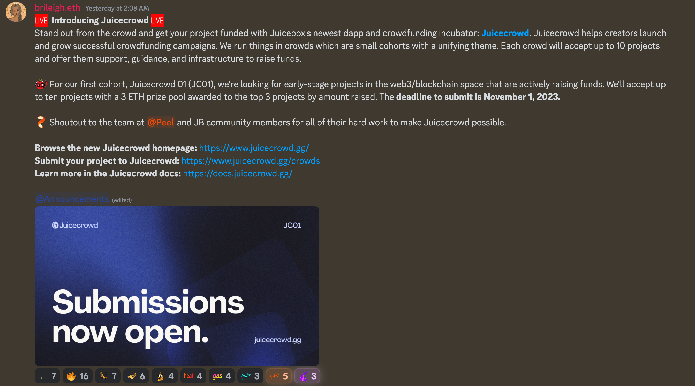
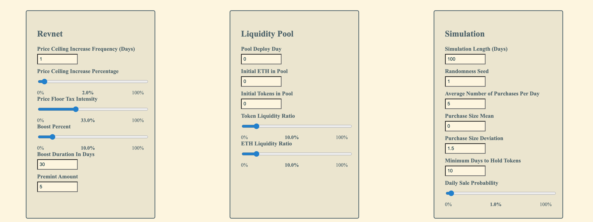
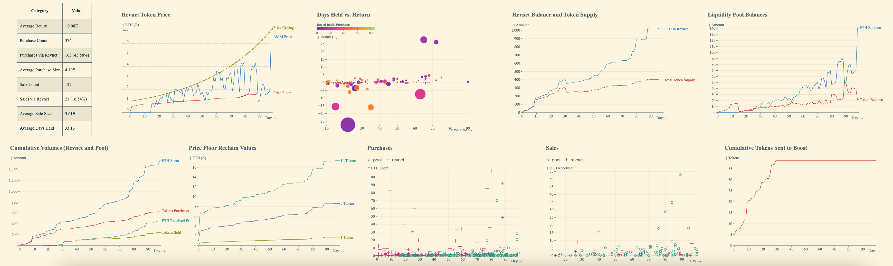

## Juicecrowd 工作报告 -- Tjl

在 Peel 团队构建 juicebox.money 网站的过程中，他们留意到，某些特定的众筹案例，项目启动之后通常需要一些协助来吸引关注，而 juicebox.money 上的某些功能对这个方面诉求的针对性并不高。因此，Peel 团队开发了一个新的去中心化应用 Juicecrowd，用于细化的众筹用途。

Juicecrowd 应用部署的同时，他们还推出了一个名为 Crowd 的活动，每次接受最近 10 个项目提交申请，帮助他们创建和完善自己的 Juicebox 项目，对他们的宣传给予支持，在每次为期 30 天的活动期间让他们获得尽可能多的曝光，从而帮助项目获得发展所需的动力和资金。

TJL表示，感谢 Peel 团队过去两周的出色工作，感谢 Matthew 和 Brileigh 创建 Juicecrowd 01 活动，也感谢 Filipv 给予的支持。

## Artizen 合作 -- Nene

提议 Juicebox 和 Artizen 一起合作建立配套基金的[提案](https://www.jbdao.org/s/juicebox/443)已经获得批准。

按照 Nene 的说法，Artizen 推出了 Artizen 基金的第三季比赛，其中有超过 50 个项目符合申请 Juicebox 项目加速器的资格。接下来他们将计划对这些项目进行引导，帮助它们创建自己的 Juicebox 项目，用于接收 Artizen 基金的资金。

Tjl 认为此举对整个生态系统是个利好，能够吸引一批艺术相关的项目，同时与 Artizen 建立合作关系。他预计最近会有许多项目进入 Juicebox 并开启他们的筹款之旅。

Nene 介绍说，所有款项将首先支付到 [Artizen 的 Juicebox 项目](https://juicebox.money/v2/p/580)，然后通过创造者自己的 Juicebox 项目分发给他们。

此外，Nene 表示他们将通过 Juicebox 协议推出 Artizen 代币，并且非常期待把社区的所有权及资金与投资者和社区一共分享。

## 更名计划工作报告 -- Filipv

我们的合约团队最近致力于 Juicebox 协议的一些升级，用于 Bananapus 项目的 L2 部署。团队同时讨论了更改合同中某些名称的可能性，因为有些合约中使用的术语与前端及其他地方的不同，可能会让刚接触协议的开发人员或其他人感到困惑。

Filipv 对一些当前的名称进行了简要解释，并在周会进行简单的投票，让社区成员选择他们认为合适的名称。

#### ERC-20 vs. IJBTokens

目前 Juicebox 协议中存在两种形式的代币，一种是内部映射代币，由代币合约进行追踪，另一种是实际按 ERC-20 标准进行领取的代币，Filipv 认为两个版本之间的区别令人非常困惑。他建议我们把它们统一称为 ERC-20 代币，并在所有代币相关的表述中使用 ERC-20，但极少数情况下这种命名方式可能会产生一些误解。

Jango 对这一建议表示反对，理由是代币不一定只是 ERC-20 标准，例如一个 ERC-1155 标准代币也可以封装成 IJBTokenERC20。

这个问题的背景是这样的：在 V1 协议中，内部记账的代币称为票据，而代币合约则称为票据窗口，从而与已领取代币形成区别。在 V2 协议中，我们认为票据这个叫法令人感觉困惑，因为大家把两种形式都统一看作为代币，因此票据窗口改成了代币合约，同时用未领取代币和已领取代币来区分它们的不同状态。

#### Project Payer vs. Pay Relay vs. Payment Router

项目支付器指的是将资金转发到项目的合约，例如，以太坊支付到这些合同之后，将会被转发到各个项目。

Filipv 提供了一些名称的选项，如支付中继（Pay Relay）、资金转发器（Fund Forwarder）、支付路由（Payment Router）等。

#### Issuance Reduction Rate vs. Decay Rate

发行减少率以前称为折扣率，但发行减少率这个叫法似乎并没有被广泛采纳。

Filipv 认为“衰减率”似乎是一个好的替代方案。

#### Funding Cycle vs. Cycle vs. Ruleset

我们现在使用[筹款周期](https://docs.juicebox.money/v4/deprecated/v3/learn/glossary/funding-cycle/)或周期来定义一个项目的一组规则，这组规则会以周期时间为有限期限，如果项目没有设置周期时长，则会一直生效至被更改。

Jango 认为 Ruleset （规则集）或许可以更准确地描述这个概念，但这个叫法跟我们当前讨论时的表达方式有些差异。

#### Ballot vs. Approver

[选票 ](https://docs.juicebox.money/v4/deprecated/v3/learn/glossary/ballot/)合约是一个管理项目配置更改的合约，由它来批准或拒绝对项目配置的编辑。

#### State vs. Approval status

选票合约的批准或拒绝状态现在称为 State，这个 State 可以是已批准、已拒绝、待处理等。

#### Weight vs. Issuance rate

权重（Weight）是我们目前在合约中用于代表发行比率（issuance rate）的术语，而发行比率指的是每个周期一个以太币发行出来的代币数量。Filipv 理解之前把它命名为权重的主要原因是，权重不一定只对应发行比率，因为合约非常模块化，大家可以用其他的方式来调用这个数值。但由于目前为止它的使用仍仅限于代币的发行，所以 Filipv 认为我们应该直接使用发行比率，让这个概念更加清晰。

#### JBProjects vs. JBProjectNFTs

[JBProjects](https://docs.juicebox.money/v4/deprecated/v3/api/contracts/jbprojects/) 是一个 NFT 合约，用于铸造代表 Juicebox 项目所有权的管理权限 NFT 代币。

#### Operator vs. Admin

[JBOperatorStore](https://docs.juicebox.money/v4/deprecated/v3/api/contracts/jboperatorstore/) 是一个允许项目方地址授予任何其他地址权限来代表他们与协议交互的合约。Filipv 认为我们可以称其为管理员而不是操作员，因为获得授权的地址实际上执行的是代表其他人进行的管理工作。

#### JBDirectory vs. JBContractDirectory vs. JBContractRegistry

[JBDirectory](https://docs.juicebox.money/v4/deprecated/v3/api/contracts/jbdirectory/) 这个合约可以看作是项目与它们正在使用的控制器和终端之间的一个映射。Filipv 建议在名称中添加“合约”以明确它合约目录的性质。

#### JBController vs. JBProjectManager

[JBController](https://docs.juicebox.money/v4/deprecated/v3/api/contracts/or-controllers/jbcontroller3_1.md) 在某种程度上类似于一个表面层合同，人们可以直接跟它进行交互来管理项目的规则和代币等等。人们启动或重新配置项目的时候，就会与 JBController 合约进行交互。另一个可选名称是 JBProject Manager。

#### Distribution Limit vs. Payout Limit

特定周期内，可以从项目支付出去的最大金额。

#### Payment Terminal vs. Payment Processor

支付终端是管理任何特定项目资金的流入和流出的合约。人们向项目付款或从项目赎回的时候，都会与这个合约进行交互。

#### Overflow vs. Excess Tokens vs. Redeemable Tokens

[溢出](https://docs.juicebox.money/v4/deprecated/v3/learn/glossary/overflow/) 指的是项目在特定周期内超过分配限额部分的金库 ETH 资产。Bananapus 在不同的 L2 上的部署之后，原生代币可能就不一定再是 ETH，而是 Matic、OP、ARB 等，因此把溢出改称为超额代币可能更可取。

#### Refund Held Fees vs. Unlock Held Fees

当项目提取资金到 Juicebox 生态系统之外的时候，需要缴纳提款金额 2.5% 的 Juicebox 费用。项目可以选择在提取资金时启用 Hold fees 功能，将这些费用保留在项目金库内暂时不进行处理。如果项目之后通过“add to balance”方法将这些资金返还到项目金库，这些待收取的费用也将会取消，这些款项就可以再用于项目的赎回或支出。

#### Process fees vs. Collect fees

Filipv 认为，启用 Hold fees 功能时，费用暂时保留在项目的金库余额内，因此从 JuiceboxDAO 的角度来看，“收取费用” 将比“处理费用” 更为准确。

#### Data Source vs. Data Provider

数据源是一个可以在发生向项目付款或从项目赎回的时候提供某些自定义数据的合约。支付或赎回发生之后，数据源可以选择性地对委托合约，实现委托接口或定义执行某些自定义功能函数的另一个合约，进行调用。

#### Delegate vs. Hook vs. Callback

委托合约就是由数据源进行调用的扩展合约。

## Revnet 模拟 -- Filipv

Revnet 是 Jango 及其他成员最近致力于开发的一个概念，它的思路是创建预先设定好各项参数的无项目方项目，让项目随时间的发展按照这些预设的规则来自行演变。同时还会视情况需要部署回购委托，把项目收到的付款中转到 AMM 交易池购买代币。

想要搞清楚所有的参数怎样协同工作不是一件容易的事情，所以 Filipv 开发了一个Revnet 模拟器，让大家可以输入一些参数来观察 Revnet 在模拟状态下如何进行演变。现在可以到 [sim.revnet.app](https://sim.revnet.app/) 使用这个Revnet 模拟器。

参考社区成员 Kmac 的建议，这个模拟器设定为可以在模拟参数区域输入相同的随机种子，使随机产生的买入卖出代币数量具有确定性。因此，其他参数不变的情况下，即使用其他计算机也可以通过相同的随机种子让图表完全一致，这样可以更容易对某些场景进行再现。

按住键盘上的向上箭头来增加流动性池的部署天数，可以看到这些图表随时间变化的动态效果。

Filipv 正在考虑添加导出或导入所有模拟参数的功能，让大家可以将这些参数分享给其他人进行比较。他表示会先在 revnet.app 实现 JSON 文件的兼容，希望以后也能够在 Nance 或 juicebox.money 的前端得到支持。Jigglyjams 建议，除了文件导入/导出功能之外，还可以考虑把模拟参数编码成 Base64 URL 形式，也能够实现模拟情景的轻松复制。

