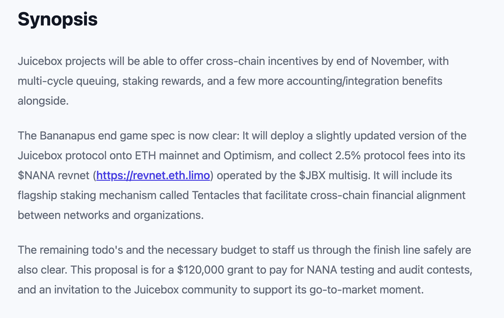
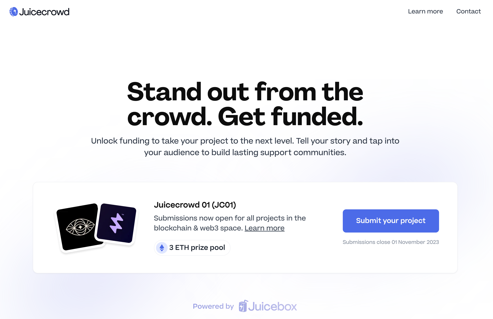

## Bananapus 工作报告

Bananapus 项目将使用和部署的 Juicebox 协议分叉仍在项目的 [GitHub 代码库](https://github.com/Bananapus/juice-contracts-v4/pulls)中进行开发工作。其中最重要的 PR （拉取请求）是[一次性配置多个周期](https://github.com/Bananapus/juice-contracts-v4/pull/1)，其他则主要是出于方便整合和多币种支持的考虑。

根据 Jango 的说法，Bananapus 的 Juicebox V4 协议分叉将会在以太坊主网和 Optimism 进行部署，部署前将分别先在相应的测试网络进行测试工作。

Bananpus 开发的具体路线图可以参考 Jango 发起的关于资助 [Bananpus 项目的提案](https://www.jbdao.org/s/juicebox/444)，该提案已在上一个周期获得 DAO 的正式批准。

Bananapus 的质押奖励组件的开发相对比较复杂。Jango 认为我们可以让它的工作逻辑紧密并且合理，这样人们就可以获益于他们所质押网络的发展。

Filipv 表示，目前在 Bananapus GitHub 库里的前端（bananapus.com 仓库）最初只是基于一个项目与合约交互时基本测试的需要。如果 Bananapus 由多个项目跨多条链使用，目前的设计就很难满足需要，我们可能必须开发更好的版本来提供使用。

## Juicecrowd 工作报告 -- Matthew

目前已有一个项目申请参加 [Juicecrowd 01 筹款孵化活动](https://www.juicecrowd.gg/crowds)。这个项目名为 Brume Wallet，目的是要开发一个内置实现 Tor 协议的私人以太坊钱包。

这个孵化活动的申请截止日期为2023年11月1日，Matthew 预计届时我们将会看到有更多的项目提交参加申请。

他介绍说，活动截止日期之后，团队将从收到的申请中挑选出最终能够参与这个活动的项目，然后会向这些项目开放 Juicecrowd 项目的创建流程。所有 Juicecrowd 项目创建完成之后，将在 Juicecrowd 页面上进行公开展示。

尽管 Juicecrowd 去中心化应用的最终目标是要实现完全无需许可的项目创建，但团队希望早期从一组项目开始。这样做的想法是为了保持早期使用 Juicecrowd 项目的高质量，团队将会所有项目提供大量的支持、指导，尽可能帮助它们更成功完成筹款计划，以便 Juicecrowd 能够创建一些优越的过往筹款记录，希望有助于将这个产品推向更广泛的受众用户。

在 Juicecrowd 上启动项目的运作方式与在 Juicebox.money 上创建项目的完全相同，只是 Juicecrowd 项目创建流程将更简化，并专门针对众筹的需求进行了一定的优化。代币经济学方面，这些项目将不会有 ERC-20 代币的发行，捐款者可能会收到一个 NFT 来证明他们对项目做出的贡献。

Matthew、Brileigh 和 Filipv 还讨论了与不同的加密组织合作，或申请与多个L2链（如BASE、Arbitrum 或 Optimism 等）合作配套基金的可行性和能够带来的好处。他们一致同意，值得尝试与其他 L2 开展合作，扩展 Juicecrowd 的运营范围。

## 回购委托工作报告 -- Jango

回购委托部署到 JuiceboxDAO 项目已经有一段时间了，Jango 表示到目前为止一直运行良好。他近期计划发起一个提案，对回购委托的某些参数进行微调，并向相关的 AMM 流动池添加更多流动性。

如果其他项目想要部署回购委托，我们也可以帮助他们进行设置。等近期所有的 Revnet 都启动之后，这些项目也将会自动部署好回购委托。因此，我们预计会有更多的项目对回购委托这个产品开展实际的应用。

管理我们 Juicebox.money 的前端团队 Peel 也在努力开发，争取在网站显示回购委托启用时从 AMM 交易池实际兑换到的代币数量。

## 治理合约实现的讨论

Jigglyjams 在会上提出，我们在 Bananapus 项目中是否仍然有使用治理合约的需要。

Jango 表示，目前正在使用的 Bananapus Juicebox 项目属于临时性质，用于管理 Bananapus 的开发工作。这个项目的治理原计划以 Revnet 试验的形式在链上开展，而 Revnet 属于无项目方的项目模式，无需进行治理。

但是 JuiceboxDAO 预计将在 Bananapus 的 Revnet 启动后获得大量 $NANA 代币，而这些代币将由 JuiceboxDAO 的多签进行管理。虽然短期内不需要考虑太多，但 Jango 对长远探索如何用 JuiceboxDAO 持有的 $NANA 代币来开展链上治理表示了深厚的兴趣。如果 Bananapus 项目获得成功，并且 JuiceboxDAO 拥有大量 $NANA 代币，则需要进行一定的处理，例如分发给 $JBX 持有者、共同治理或进行某种代币兑换等等。

Jango 认为，我们的最终目标肯定不是由六个多签成员来执行 DAO 的各项决定，而是要争取链上治理的真正实现。如果以后试验取代多签的方向，那么长时间锁定代币来获得治理权限，或者让解除锁定取回代币更加正式化等想法会更有意义。但他同时认为，Revnet 才是我们努力向前发展的终极目标所在。

