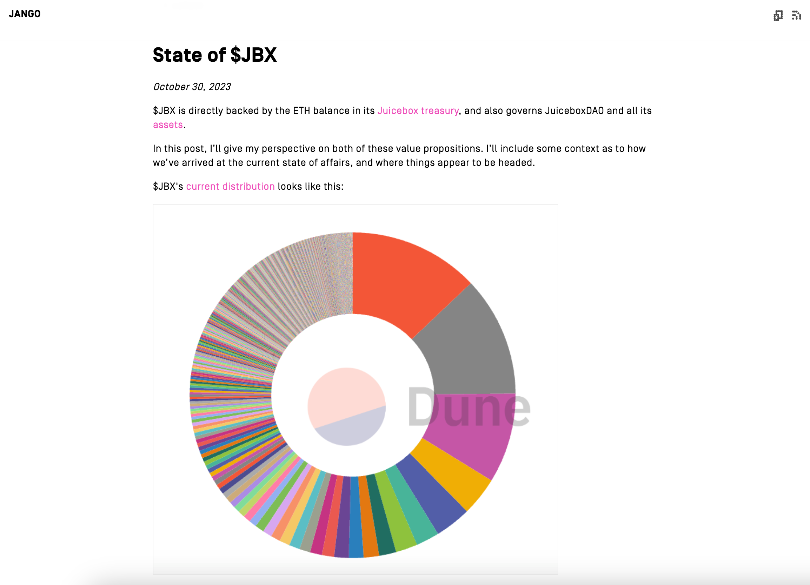
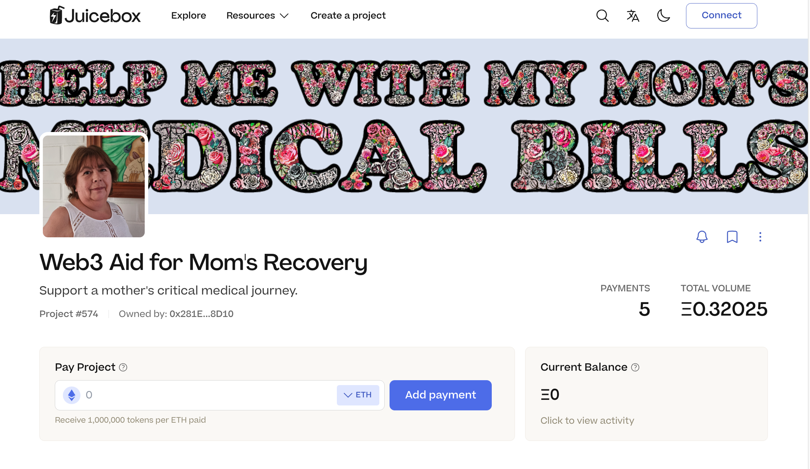
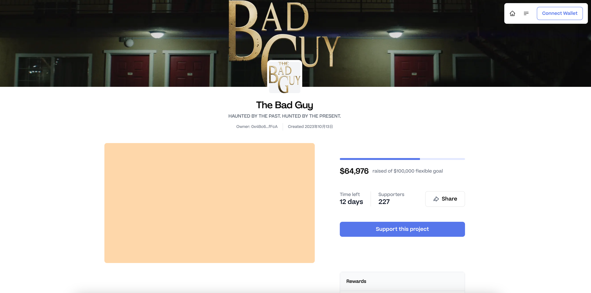
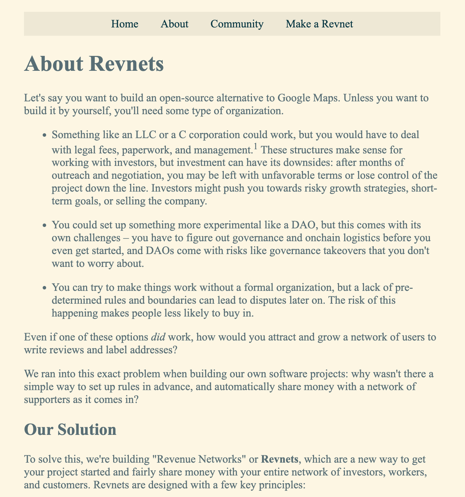
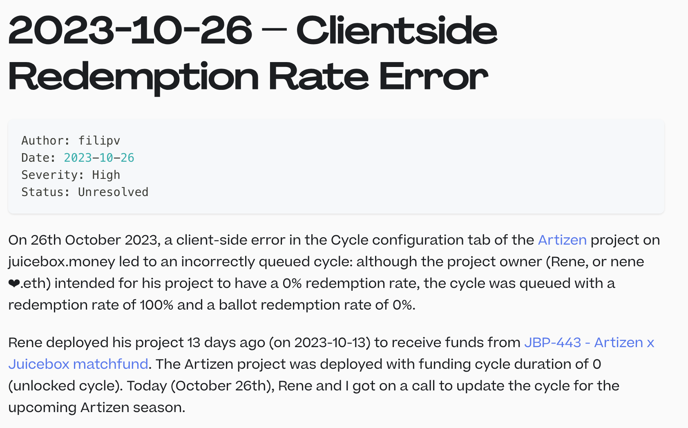

## $JBX 现状 -- Jango

周会上，Jango 分享了他最近撰写的一篇[文章](https://jango.eth.limo/0B0EE09E-54B5-453E-8897-C4A4D8093743/)，谈论他对 JBX 代币的一些想法。

Jango 觉得，随着回购委托的安装使用，现在是合适的时机来反思我们社区的当前发展状态，社区有治理责任并管理着 JBX 持有者共同组建的金库。一直以来我们利用这个金库做很多了不起的事情，但我们也需要时常停下来进行反思。

感谢所有 JBX 持有者的耐心，是他们让我们走到今天并一直推动我们向前，使我们得以完成大量的版本控制工作，从而真正实现协议最近这些跨越式发展。我们还需要多一点时间来理解用户的体验，以便让更多人在这里启动项目、建立社区并确定社区的各种需求。

目前我们的金库里大约有一百万美元等值的以太币，按目前的水平每两周大约需要支出 12 万美元。过去的几年里，我们取得了很多的成绩，但现阶段我们需要设法通过 JBX 代币真正推动我们下一阶段包括 Bananapus、Revnets 和 Juicecrowd 等项目的发展。很大程度上这些都是我们目前工作的延伸，但我们还需要弄清楚采取哪些措施才能真正释放社区的潜在能量。

在 Jango 写的这篇文章中，他反思了对于 JBX 代币的两个价值主张，一个是作为以金库内 ETH 为价值支撑的代币资产，另一个则是作为管理 JuiceboxDAO 及其所有资产的治理代币。

### $JBX 作为以 ETH 为价值支撑的代币

每次有资金流入金库时，都会相应地发行出新的 JBX 代币，也可以通过销毁这些代币从金库里获取资金。

十月份我们部署回购委托之后，收到的付款会中转到去中心化交易所购买代币，直到代币的市场价格与协议的发行价格持平。如此一来，付款人可以获得更好的收益，而保留代币接收人的激励也得到更好的体现。但是如果投资者想要获得最优的 JBX 价格，他们应该去 AMM 而不是在协议上购买，这样就不用承担保留代币的成本。

在过去的一段时间里，我们一直从金库支出费用，因此 JBX 的 ETH 价值支撑越来越低，JBX 的地板价格也由于我们的支出一直不断下降。 

### $JBX 作为治理代币

过去的几年里，JBX 作为治理代币也经历了不少起伏，从一开始的一无是处，到现在有了一个可预见性非常强的步调来配置周期、参与治理及执行决策，这个发展对于我们所有建设者来说，是一个巨大的进步，正是这个进步帮忙我们走到了今天。

我们还拥有相当可观的 JBX 代币余额，这是除了金库里的 ETH 之外我们最大的一个资产。Jango 认为，我们可以更创造性地运用这些 JBX 资产，从而赋予网络更多的力量来推动自身向前发展。

### Jango 的观察及建议

我们已经完成了很多基础性的技术搭建，支持以多种方式来实现资金的金融管理。Jango 认为我们开始意识到必须摸索高效增长的途径。同时，我们也有责任通过有利于我们实现使命的方式来管理金库中剩余的 ETH。

如果我们想要赋能 JBX 代币，我们就必须增加而不是减少它的底层资产。这就好像踩钢丝一样，两边都很重要。我们想要向前发展的话，我们所做的工作需要付出的时间、精力、注意力和热情才能实现。我们必须在这里找到一个平衡点，如果我们做不到，可能就需要承担因此带来的后果。

他还建议，我们从保留代币名单移除各个实体，让更多的保留代币流入 DAO 的金库，然后每个人都必须通过提案的形式来进行申请，这比直接向保留代币受益人分配的方式更具可扩展性。

### 结语

Jango 认为，我们向未来迈进的时候，同时一个展开创造性思考的机会。这个过程中可能会带来一些痛苦，但这是正常的。

Jango 表示他会尽力带头提出一些建议，尝试建立一些运作的模式，并与外部投资者和其他社区建立关系，争取在财务上也能够实现前进的推动力。

### 关于 JBX 交易池的看法

LJ 问及 Jango 对 JBX 二级市场表现的看法，因为 JBX 代币的交易池流动性还比较低。他对 Jango 考虑利用 JBX 而不是仅花费 ETH 的想法表示认同，但他认为我们也应该关注 JBX 的二级市场表现，因为活跃的二级市场有助于吸引更多关注并引入更多零售用户。

Jango 表示同意，增加更多流动性固然可以带来更多价格稳定性，但 AMM 上的价格都是暂时性的，经常发生波动。他表示我们真正可以依赖的是代币的地板价，也就是 JBX 代币的支撑价值，其他都只是源于我们的工作产生的叙事及对 JBX 两种价值主张认可。

## 医疗帐单的众筹 -- Felirami

Felirami 最近启动了一个名为 [Web3 Aid for Mom's Recovery](https://juicebox.money/v2/p/574) 的 Juicebox 项目，为他因严重疾病在 ICU 住院的母亲筹集资金。

在周会上，他对 Juicebox 平台及曾向他的项目捐款的人表示感谢。但他也表示，不知道应该如何让更多人知道这个项目来获得更多的帮助来支付他母亲的医疗费用。

TJL 表示，我们目前正在设法帮助项目更好地讲述它们的故事、制定更具激励性的奖励、开展市场推广并启动项目。他邀请 Felirami 加入 Juicecrowd 的 Discord，并承诺将向他介绍最近的 Juicecrowd 01 计划的具体内容。希望能够帮助 Feliram 了解更多促进筹款效果的办法，以便改进他的筹款活动并获得更多的关注。

## Juicecrowd 工作报告 -- TJL

Peel 团队发现， juicebox.money 的目标用户种类过多，存在很高复杂性，因此他们希望能够推出一个专用产品来更好地迎合众筹用户的需求并确保更高成功机率。出于这个想法，Peel 团队着手构建一个更专注于众筹的去中心化应用，也就是 Juicecrowd，以帮助引入一些高质量的项目，同时从更全面的角度来审视筹款活动。

Peel 从整体的角度来分析筹款活动成功所需要具备的各种要素，比如他们的故事、使命、愿景，项目的结构，贡献者的激励方式，以及他们的营销方式等等。除了这个细分用途 Juicecrowd 去中心化应用，他们还启动了一个孵化计划，招募高质量项目并帮助他们完备众筹活动所需的各种细节。

截至本次周会，他们已成功收到了 16 个项目申请参加 JC01 计划。目前项目的申请截止期限已经延长到 11 月 8 日，希望最后能收到 20 个以上项目的申请。

TJl 预计他们下周会推出一个测试项目用于展示用途，而 JC01 计划将于两周后正式启动。

此外，他对 Matthew 和 Brileigh 为推出计划以及吸引项目参与所做的工作表示赞赏，同时也肯定了 Wraeth、Aeolian 和 JohnnyD 在整合 Juicecrowd 项目页面所做出的工作。

## Juicecrowd 海报及铸造 -- Matthew

Sage 和 Strath 合作制作了 Juicecrowd 01 计划的宣传海报，这张海报在 Zora 上免费提供铸造。Matthew 认为我们应该不断尝试各种不同的策略，寻找链上展示我们部分艺术作品的方式，而不是像目前这样，仅限于网站上的使用。

Jango 认为制作海报的活动非常好，他认为 Juicecrowd 不仅是专为众筹而设计的产品，也是设定时间期限、朝着目标努力的一种尝试，同时也是在推广中开展创意活动的体现。

## Revnet 介绍 -- Filipv

Filipv 最近在 Revnets 模拟网站上更新了关于 Revnet 的详细介绍，具体说明什么是 Revnet，以及为什么人们应该创建和使用 Revnet 。Filipv 表示他会尽量使这些信息尽可能普遍适用于各种不同的项目。

## Artizen 项目工作报告 -- Filipv

上周，Artizen 项目的项目方 Nene 和 Filipv 一起对项目进行重新配置时，前端出现了一个小问题，导致了该项目新筹款周期的赎回率错误设置为 100%。

为了避免这个项目发生意外情况，大家决定将该项目归档并创建一个新的配置正确的 Artizen 项目来替代旧的项目。由于旧项目的周期时间配置为 101 天，金库里的资金短时间内无法取出，Jango 和 Filipv 决定先用他们的个人资金进行垫付，稍后再向 DAO 发起提案要求报销这些费用。

Wraeth 和 JohnnyD 创建了一个 PR 并已经进行合并，目前这个错误已经得到解决。可以在[这里](https://docs.juicebox.money/dev/v3/resources/post-mortem/2023-10-26/)查看有关发现、处理这个问题的整个过程。

Tjl 稍后会与 Nene 碰头，一起审查申请 Juicebox 和 Artizen 配套基金的项目，有任何最新情况将会进一步报告。

## Bananapus 工作报告 -- Jango

Jango 说，Bananapus 对 Juicebox V3 协议的分叉，也就是 V4 协议的开发可能会在本周内完成。下周合约团队将会进入密集的合约审核模式。内部审核完成之后，他预计我们将会安排一次 Bananapus 合约的Code4rena 比赛来进行公开的审计。

Bananpus 项目将有可能在 11 月底正式上线，届时至少会先完成在测试网络的部署。由于 Nowonder、0xBA5ED 和 Dr.Gorilla 进行的各项审查工作，Jango 表示他对合约及之后的部署充满信心。

## Origin Ether 整合 -- Slagathor

Slagathor 来自 Origin 协议，他在会上提到希望能在 Juicebox 的后端集成他们的 Origin Ether 代币。根据他的介绍，Origin Ether 是部署在以太坊主网上的一个收益聚合器，本质上是由 ETH 和几种 LSD（流动性衍生品质押）提供 1:1 支持。用户的抵押物将会投入到部分协议上获取收益，再把这些收益返还给 OETH 代币的持有人。

Jango 表示，我们正在探索跨链运营，并计划以一种细分的模式实现多种代币的支持。希望在不久的将来，我们可以为 Origin 协议提供一条更为直接的途径，让他们无需要任何许可就能够把他们的代币整合到 Juicebox 协议上。
