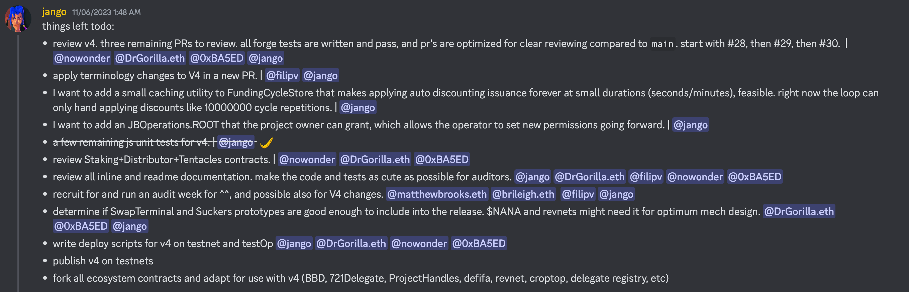

## MoonDAO 工作报告 -- Jango

MoonDAO 大约两年前创建于 Juicebox 协议。筹款活动成功之后，他们购买了两张 Blue Origin 太空飞船的机票。在 2022 年 8 月，他们成功地将一名成员送上 Blue Origin 飞船进入外太空，这是一个 DAO 首次实现的壮举。

去年，MoonDAO 还举办了一场抽奖活动，从免费铸造的 “Ticket to Space” NFT 随机抽取一名社区成员，活动的幸运儿是来自中国的 MoonDAO 社区成员 Yan，他赢得了第二张太空之旅的机票。但是尽管 MoonDAO 多次努力帮助，由于种种原因，Yan 一直未能成功获得前往美国的签证。最终，社区决定重新抽奖，选出另一位社区成员进行这次外太空之旅。

MoonDAO 同时正在进行许多项目，并与 NASA 等机构保持着紧密的关系。MoonDAO 的创始人之一 Pablo 始终致力于完成社区的使命，希望实现进入太空并在月球上建立一个基地的野心计划。与此同时，Pablo 一直密切关注 JuiceboxDAO 最近的工作，并分享一些建议。Jango 在周会上表示对 MoonDAO 及 Pablo 为追求目标而持之以恒的努力表示敬佩。

## Juicecrowd 工作报告 -- Matthew

Juicecrowd 的 JC01 计划截止本次周会时已收到了 35-36 个项目的申请。Matthew 呼吁社区成员帮助宣传，并推荐一些他们了解的项目申请参与这个计划。

Peel 和 JuiceboxDAO 的贡献者将会对这些项目进行投票，以帮助选择哪些项目将符合 JC01 计划的资格。Juicecrowd 团队将与第一批选中的项目展开合作，而这些项目将于 11 月 17 日启动他们的 Juicecrowd 项目。

下周，团队计划每天举办一到两个小时的研讨会，邀请第一批项目的团队分享他们打算如何制定策略开展筹款活动、启动项目、推广及提高可见度。Tjl、Brileigh、Matthew 及一些其他贡献者，将在此期间通过某种课程形式分享一些关于众筹的知识。

所有项目启动后将会运行到 12 月 15 日，围绕筹款的成果展开竞争，最后产生的前 3 名项目将从 3 ETH 的奖金池中获得奖励。

## Bananapus 及 Revnet 工作报告 -- Jango

短期路线图是要在本月底之前在主网和 Optimism 上实现测试网部署，今年内先在测试网上运行，与此同时，团队将继续编写大量的测试和技术文档，确保一切准备就绪，并将这些部署用于生产环境的测试。

以下是下周预计要完成的工作，这些工作将确保我们在月底前完成一个稳定的测试网部署，用于进行 Bananapus 试验的 Revnet 运营。那样我们就可以为任何有兴趣把项目构建成 Revnet 的人运行测试网实现。

Jango表示，团队原本计划针对 V4 协议（Juicebox V3协议的一个专门用途的分叉）的合约举行一次 Code4rena 审计比赛，但由于 Code4rena 此次审计比赛的报价高达 80,000美元，我们感觉太昂贵不值得。因此，我们计划自行提供一些奖励，邀请我们熟悉的审计者或生态系统内希望提供帮助的人，来协助审核这个经过精心编写和测试的代码库，让这个项目尽可能更完善，以便在假期结束后将项目部署到主网。

## Juicebox V4 命名工作报告 -- Filipv

在 10 月 17 日的周会上，Filipv 分享了 V4 协议（Bananapus 项目对 Juicebox V3 协议的分叉）命名方案的工作报告。Filipv 在会上提供了一些命名的备选方案，并解释了重新命名的一些原因，然后在我们的 Discord 频道中进行一些简单的投票，让大家做出选择并留下自己的反馈。

上周，Jango 与 Filipv 逐一核对那次周会上大家的反馈，并按照这些意见进行了一些修改。在本次周会上，Filipv 展示了相关的修订版本，并进一步征求大家意见。

#### JBTokens

当项目使用 JBTokens 合约的默认实现来部署可领取代币时，这些实现方法将在名称中添加上 ERC-20，如 `deployERC-20TokenFor(...)`，而其他实现则仅称之为 token，如 `setTokenFor(...)`，来进行区分。

我们现在的做法是，用未领取代币和已领取代币来区分内部映射的代币和正式的 ERC-20 代币，这个命名方式让很多人感到相当困惑。Jango 建议我们把未领取代币称为 "token credits（代币余额）"，这些余额可以随时领取为正式代币，而把那些正式的代币称为 "tokens（代币）" 来消除歧义。

#### JBRulesets

大家似乎普遍支持将 Funding Cycle（筹款周期）改称为 Ruleset（规则集合），也就是在一段固定或无限的时间长度内生效的一组规则。例如，我们将把 `JBFundingCycleStore` 更改为 `JBRulesetStore`。

现在的折扣率，我们将改称为 “衰减率”，因为它所体现的是发行比率或发行权重的衰减。

#### JBPermissions

这个合同目前的名称是 JBOperatorStore，它的作用是授权其他人代表项目方来管理项目或与协议进行交互，因此把它改称为 JBPermissions 意思更准确，但在各种方法的名称中，仍然会沿用 Operator（操作员）这个术语，例如 `setPermissionsForOperator(...)`，会比 `setOperator(...)` 更清晰一些。

#### JBController

这个合约我们只是做了少量更改。例如，`reservedTokenBalanceOf` 会读取待分配的预留代币数量，因此把它重命名为 `undistributedReserveTokenBalanceOf` 听起来更加清晰。

#### Payout Limit

把分配限额改成支出限额的想法似乎得到了大多数人的支持，它表达的是项目在一个周期内可以从终端支出的 ETH 或其他代币的最大金额。

#### Runway vs. Overflow

这个变更在本次周会中仍然具有争议。

Jango 认为，overflow （溢出）是一个有趣的 Juicebox 特色用词，就像一个满溢的果汁杯一样，它传达的概念是，某样事物装满了之后就会满溢出来。但是，许多项目也将溢出解读为 “runway（跑道）”，刨开项目的定期支出或一些应付款项，剩下的就是项目的跑道。跑道这个叫法清晰传递了，除了项目按照配置需要使用的部分之外，社区捐款人一直可以获取社区剩余资源的概念。

Matthew 认为跑道往往会给人一种项目还可以存续多长时间的暗示，它并没有包含反映项目支出之外剩余资金的含义，而 overflow 则带有这层含义。

Filipv 认为 runway 更易于向第一次接触项目创建流程的人来进行传达，在满足他们支出需要之余，超出的部分全部都是项目的跑道。如果项目有很多多余的跑道，社区就可以用他们的代币来进行赎回。人们也往往把跑道视为将来可用于项目的资金量。

#### Terminals

我们稍微缩短终端的名称，从`IJBPaymentTerminal`改为`IJBTerminal`，因为终端的基本实现仅为支持付款，不需要重复说明。

由于 V4 协议将在多个区块链上部署，因此许多 ETH 术语需要相应地进行更改，例如从`JBETHPaymentTerminal`更改为`JBNativeTerminal`，来反映目标区块链的原生代币。

与`JBERC20PaymentTerminal`相比，`JBERC20Terminal`表达更全面，因为通过这个终端还可以进行其他不同的操作，并不仅限于支付功能。

#### JBERC20Token

目前这个合约叫 JBToken。

#### JBProjectPaymentForwarder

这个合约目前称为 JBProjectPayer，用于收到的 ETH 付款转发到各个项目。我们认为在这种情况下使用“forwarder” 表达更准确。

#### Hooks

我们在考虑怎样才能更清晰地表达数据源和委托的概念，这个概念经常让人感到困惑。从上次讨论中的投票结果来看，大家似乎觉得在不同的编程背景下，“hook （勾子）” 的意义更加符合要求。

数据源提前向支付函数提供数据的一个函数，而委托则是在支付函数或基本支付逻辑完成之后的实际行为。我们决定将它们分为提供数据的“pay data hook（支付数据勾子）”和执行操作的 “pay action hook（支付执行勾子）”。赎回数据勾子和赎回执行勾子等作相同的处理。

当前的 Ballot （选票合约）是批准新筹款周期之前检查各个条件是否符合的一个合约，用户也可以定义其他所需的任何行为。我们认为，把所有这些行为放到勾子的框架下面，可以清晰地传达人们可以轻松地编写自己的合约版本并对协议进行扩展的概念。因此，“Ballot” 改称为 “Ruleset approval hook（规则集审核勾子”，而 “ State”（描述批准或拒绝的状态）称为 “approval status（审核状态）” 表达更加准确。

## Artizen 工作报告 -- Filipv

大约有 75 个项目通过 Aritizen 的审核并符合 Juicebox 项目加速器的申请资格。

Filipv 认为我们在设定项目申请资格规则时存在一些模糊的地方。在以后的类似活动中，最好能让项目通过 Juicebox 更有意义地将项目的所有权或治理权分配给他们的社区。

Aritizen 上的项目以艺术类项目为主，他们能够使用 Juicebox 协议真的非常好。但是其中有一些项目之前就已经进入加密货币行业，并发行了他们的代币，他们当中的大部分目前并不真的需要使用 Juicebox。因此，Filipv 建议在以后类似的活动中采取更严格的要求，确保参与的项目能够更有意义地利用 Juicebox 协议，而不是仅仅部署一个项目了事。

总体而言，Filipv 认为相关工作进展顺利，有许多很有潜力的项目。他还认为，Juicebox 项目加速器基金可能是我们迄今为止最好的资助项目之一，很可能会产生一些非常好的结果。

