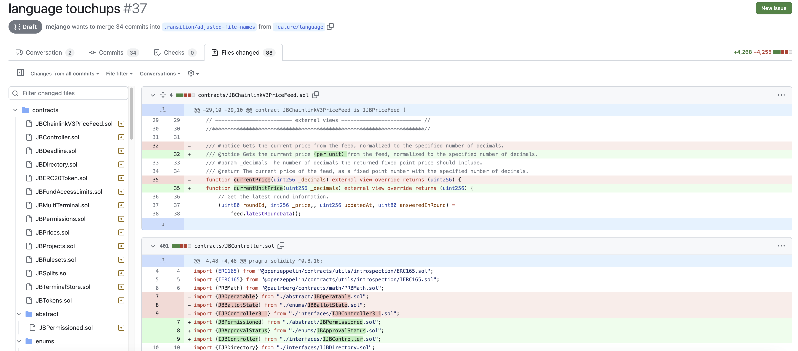

## Juicecrowd 工作报告 -- Matthew

Juicecrowd 去中心应用已经部署并运行了几个星期。Juicecrowd 团队，包括 Matthew、Brileigh、TJL 和其他 Peel 成员，启动了一个 Juicecrowd 计划，协助具有 Web3 或区块链愿景的项目来组织他们的筹款活动，加强能见度及促进社区的发展。

截至目前，Juicecrowd 计划的第一批项目全部成功创建并已经部署到区块链上进行运营。

Juicecrowd 团队还为早期的项目支持者提供了一些激励措施，包括获得由 Sage 和 Strath 制作的独家纪念 NFT 的空投，以及参与抽奖赢取 25万个 JBX 的资格。获得早期支持者资格的截止日期已延长至 2023 年 11 月 08 日，确保更多人有机会参与活动并向 JC01 项目捐款。

Matthew 呼吁社区成员帮助传播这些项目并进行宣传。他同时介绍，团队将与这些项目密切合作，争取扩大它们的影响力，从而获得更多支持，甚至可以包括申请其他平台资助等。

Filipv 认为，这批项目里面有很多感觉发展潜力巨大，他很希望能看到这些项目在这个计划帮助之下获得动力并实现自己的发展。

## Bananapus 分叉工作 -- Jango

所有待合并及将在测试网进行部署的 Bananapus 变更内容都已经整合到项目的 [GitHub存储库](https://github.com/Bananapus/juice-contracts-v4)。

目前仍有两个拉取请求（PR）最后等待合并。其中一个是 Filipv 已经着手进行一段时间的合约术语调整，这些更改之前也在我们的周会上进行了审议讨论。

另一个拉取请求则是要在支付终端上启用元交易，从而允许客户在选择中继节点时更加灵活。通过元交易，最终用户可以签署一条消息来表明意图，并将消息传递给中继节点，中继节点则代表用户提交交易并代为支付执行交易所需的 gas 费用，同时在合约层面上保持交易消息发送方的记录准确一致。

随着这个工作在接下来的几天内完成合并，Jango 期望可以在本周末实现这个 Juicebox 协议的 V4 分叉在Optimism 及以太坊测试网的部署。之后，我们将可以把它用作 Revnet 合约、Defifa 合约、721Delegate 合约，以及 Croptop 合约等的核心协议依赖。所有这些应用随后也将会在测试网上启动并进行最终的测试。

然后团队将在 12 月展开全面的测试，同时会着眼于 revnet.app 和 defifa.net 等客户端的开发工作，争取把它们全部集成到各自的测试网部署，以便进行测试并发现可能存在的错误。

另外还有一点值得关注，据 Jango 介绍，团队对支付终端架构进行了重构，争取将来实现单个支付终端的多代币管理。Bananapus 分叉将以实现多终端及多代币支持为目标，来满足项目和其他跨链组织的需求。

## Token Table Revnet 开发工作报告 -- LJ

TokenTable 团队之前关于[资助 JuiceTable（TokenTable）团队与 RevNet 核心团队进行共同开发](https://snapshot.org/#/jbdao.eth/proposal/0x740cc558c73fc33c93df4150493583112890f78e99e51983bdec5cdd3b0891c1) 的提案已经获得 DAO 批准，他们将会开发专为 Revnet 上的项目创建者和捐款人定制的代币解锁合约和 Telegram 机器人，产品预计将分成三个阶段进行交付，DAO 的拨款也会同步进行支付。

LJ 报告说，他们第一阶段的工作取得了显著的进展，创建了 Telegram 机器人的 Figma 线框图，并在开发中听取了社区的反馈意见。他们计划近期将发表更多关于 Revnet 的一些想法。

## Nance 工作报告 -- Jigglyjams

Nance 团队正在开发一个新的创建流程，预计将在下周初完成。如果有新项目希望创建他们的 Nance 自动化治理页面，可以与团队取得联系。我们希望能有一些真实的用户积极参与并帮助测试这个产品。

## Banny Warhol 工作报告

Jango 介绍，JuiceboxDAO Discord 服务器的 Banny Warhol 频道实现了重大更新。用户可以与频道的 Banny Warhol 机器人进行互动，通过提供简单的提示语或问题，生成一些 Banny 相关的图像或者咨询 Juicebox 协议相关的一些信息。

Jmill、Genekogan 和其他 Eden 团队成员计划将他们的生成艺术服务转变成一个能够为用户打造主题角色的平台。他们将以 Banny 为原型来开展这个创新性转变的尝试。

Jmill 在讨论中的发言更好地诠释他们这个工作的愿景，“我们正在向着自助生成角色系统的方向发展，争取能够开发出可以按用户需求风格实现对话、答疑及创建图像的主题角色。”

Jango 认为这是一个具有很大潜力的工具。除了在制作图像、项目标志或生成娱乐性的内容方面的应用之外，它还可以帮助塑造和扩展类似我们 Bannyverse 这样的具体角色的衍生概念。

Filipv 表示，Stable Diffusion 最近推出了一个新的 SVD 模型，如果将来可以整合到 Banny Warhol 中，这个产品可能会实现一些非常好的效果。