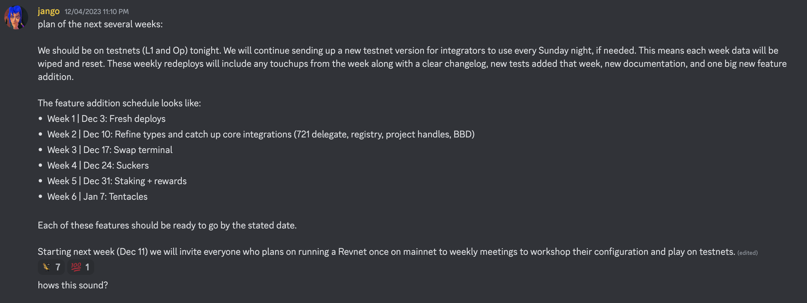

## V4 术语变更工作报告 -- Jango

Bananapus 对 Juicebox V3 协议的分叉已经正式清理完毕，最后还剩下一个术语变更的拉取请求。这个拉取请求共涵盖 95 个文件的名称更改，但不会涉及任何合约实现上的变更。

这个工作主要归功于 Filipv 过去几个月以来的辛勤工作，所有变更都在之前的周会及相关的讨论组里进行了集体审核。

本次周会上面，Jango 着重介绍了这个拉取请求所包含的部分比较重要的变化，同时指出，协议在测试网部署之后，下面几个星期会有越来越多人开始尝试对 V4 协议的整合，因此我们将会经常接触到这些合约变更之后的名称。

#### Rulesets 规则集

筹款周期现在改称为规则集，这样我们可以用项目当前的规则集和后面排队等待生效的规则集来对项目来进行表述。

目前 V4 协议支持同时排队交易多个项目规则配置的设定，项目方可以一次性排队多个不同的规则集，例如，他们可以部署项目，并提供清晰的指引，告知社区成员之后一年内项目的规则将如何发生不同的变化。Jango 很期望能看到人们使用这个灵活的功能来展开各种各样的建设工作。

#### Tokens and credits 代币及点数

我们之前用未领取代币（协议内部追踪统计的代币）和已领取代币（由持有人自行保管的 ERC-20 标准代币）区别代币不同的状态，现在改用点数及代币来分别表述这两个不同的状态。

默认情况下，项目收到付款时，会向付款人分配相应的点数。如果项目方日后选择签发 ERC-20 标准代币或者引入已发行代币，这些点数就可以用来领取成相应数量的代币。

#### Decay rate 衰减率

我们现在用衰减率取代折扣率来描述项目代币发行减少的速度。

#### JBPermissions 

我们把 JBOperator 改称为 JBPermission，通过这个合约，项目方可以委托其他地址来代为管理不同的合约。合约同时还引入了一个根权限，允许项目方授权其他人代为执行全部操作，甚至包括向其他操作员的授权行为。

## Bananapus 实施计划 -- Jango

随着合约重命名的拉取请求即将合并，Jango 计划在以太坊的 Sepolia 测试网及 Optimism 测试网上执行 V4 协议的部署，实现协议 L1 和 L2 区块链的同时部署。

Jango 计划每周日晚上把上一周所有大家讨论并通过的变更收集起来，必要的时候甚至可以重新进行合约部署，这样我们新的一周基本都可以把上周的问题清理干净，并继续在最新版本进行迭代。

每周我们都会创建一些新的拉取请求，类似命名调整、小规模的合约实现或者其他计划中的优化工作等，慢慢把它们合并到合约里面。我们将会在测试网上扮演培育者的角色，并通过编写清晰的每周变更日志来把曾经做过的改进记录交待清楚。

我们还会继续执行大量的测试来确保合约尽可能完善，同时争取提供高质量的相关技术文档。

我们每周还将增加一个过去几个月开发的一些新功能，实现它们的产品化并整合到协议里面。新功能的整合会按 Jango 在讨论区分享的以下步调逐步进行。

兑换终端是一个支持项目接受任何虚拟货币付款的组件。接收到的虚拟货币将会自动兑换成项目的金库资产货币，对需要通过多种代币来收取费用的项目来说非常有用。

[Sucker 合约](https://github.com/Bananapus/bananapus-sucker/tree/master)支持项目之间的跨链代币转账，使用信使进行沟通并通过赎回机制来实现代币的交换。

## Revnet 测试研讨会 -- Jango

有很多人希望以 revnet 的形式来运营他们的项目，而且我们也正在筹备第一批 revnet 项目的创建，Jango 计划举办一些 revnet 的测试研讨会，让大家一起来探讨怎样配置一个 revnet 并对其加以测试，这对协议来说是一个双赢的局面，有助于改进合约术语命名及全面改善 V4 协议的功能。

到明年 1 月中或月底，我们希望能够推出一个产品化模型，供各个筹备中的 revnet 项目如 NANA、Revnet、Defifa、Croptop 或 Juicecrowd 等用于各自项目的测试和试验。

## 项目发展报告 -- Filipv

Filipv 介绍，[CryoDAO 项目](https://juicebox.money/@cryodao)正在做一些很令人兴奋的事情，他鼓励我们的社区成员加入他们的 Discord 服务并更多地参与到这个项目里去。

Roman Storm 项目计划于下周启动。Artizen 的 Rene 也计划在同一期间发表项目启动文案及为 Artizen 项目展开宣传。

## 电报群 -- Jango

Jango 介绍，我们目前创建了一个电报群用于代币交易等方面的讨论。Jango 说，他最近已经不再在 JuiceboxDAO 领取定期报酬，接下来的一段时间里，他很乐意更多地参与到 JBX 的叙事和教育方面的工作。

他认为，大家提出了一些很好的问题，我们应该正面面对这些问题、诚实回应并提醒存在的风险，同时也可以让大家更多地了解我们之前努力开发的产品，它们所拥有的机会。我们大家都应该认识到 JBX 的真正价值所在。

