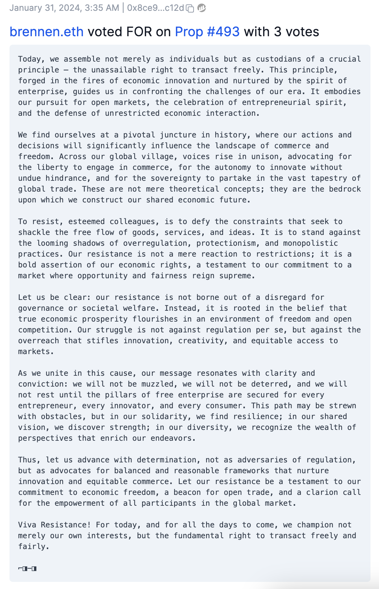

## 部署计划工作报告 —— Jango

#### Bannyverse

目前 Bannyverse 的 revnet 部署仍需要的东西包括媒体内容、裸体 Banny、Banny 服装配件、宣传资料，以及在外部联系、社交媒体和市场推广方面的一些工作。

Bannyverse 部署的时间安排如下：

- 目标测试网产品化备选将于 2 月 12 日左右在以太主网、Optimism 甚至 Arbitrum 上进行部署；
- 产品化部署将于 2 月 17 - 20 日进行。

这次的产品发布包含很多先决条件及其他因素，所以需要在许多参与开发人员和许多微妙的基础设施之间进行协调。按以上的时间规划，团队还有三个星期来实际推进产品化的工作，把所有的东西部署到测试网上，尽可能地测试和查漏补缺，最后再正式拉开这个专项试验的序幕。

把 Bannyverse 作为第一个项目来进行部署，是出于 Banny 可能比我们任何人都更适合解释 Revnet 和 Bananapus 工作原理的考虑。通过各种 Banny 的 NFT 和其文化渗透，艺术创作的参与以及屏幕上几个简单的按钮，我们就可以把所有强大的工具传递给新用户，这些工具可以扩展用于解决生态系统内任意的其他问题。

目前团队仍在致力于开发一些与 Bannyverse 交互体验相关的早期原型化产品。

#### Revnet

Aeolian 正在开发 Revnet 的网站 revnet.app。应该还有一些框架搭建工作需要进一步完善。

从用户体验的角度来看，我们需要在支持 revnet 设置不同的阶段，这也是 Bannyverse 最后进入产品化的唯一一个影响因素。

类似 Bannyverse 这样的 revnet 将在各自网站上展开自己不同的叙事，但如果人们对这些 revnet 的经济模型更感兴趣，或者 $BANNY 或其他代币的持有人希望获得自己网络金库中的收入，他们可以跳转回来 revnet.app 上对应的项目页面进行操作。

#### Bananapus

从 Bananapus 的角度来看，我们需要在协议将要部署的地方，如以太主网、Optimism 或者 Arbitrum 等，创建收取费用的一号项目。在展开经营活动之前，我们需要设置好金库来收取协议使用的费用。

Dr.Gorilla 开发了一个兑换终端产品，让项目可以允许任何人使用任意代币进行支付，然后兑换成项目用于结算的代币。鉴于 Bananapus 将于多个不同的区块链进行部署，它需要配置这个兑换终端，因为人们究竟会用什么代币来支付费用很难提前确定。用于支付费用的代币并不一定总是 ETH，可能是不同区块链自己的原生代币。因此，我们希望确定 Bananapus 作为收取费用的主项目，可以配置好兑换终端并能够接受不同代币来支付费用。

另一个我们希望在 Bananapus 上配置的基础设施，是由 0xBA5ED 负责开发的跨链吸币器。项目可以在任意链上获得收入，然后收入及相应的代币发行将会被吸取到负责发行项目代币的主网络。很显然，这一设施对于进行 Banny 的多区块链销售，以及 Bananapus 多区块链收取费用并归集到 $NANA 代币都很必要。Bananapus 部署之后, JuiceboxDAO 在这个项目的权益敞口也主要集中在 $NANA 代币的持有上。

其他我们可以进一步推进但偏社会性多于技术性的事情，则是争取与其他部署目标区块链环境，例如 Optimism、Arbitrum、Base、Zora 等展开合作。我们可能会不请自来，他们可以在了解情况后，视自己的需要决定是否共同展开流量的引导。

我们将会在 Bananapus 上执行大量的测试工作。当我们把 Bananapus 精简至 revnet 的形式进行启动时，从避免攻击的角度来看，我们基本上会移除四分之三的 Bananapus 代码库。通过其中一个项目来启动，我们可以集中精力进行测试，从而确保代码同样在所有其他 revnet 上工作无误。

#### 其他

各项条件基本已经就绪，现在只等正式启动，确保一切工作良好及互相配合，并且清晰明白容易记录，等等。

Jango 在当前周期提交了一个[提案建议 JuiceboxDAO 向即将启动的 Bannyverse revnet 支付 40 ETH 并获取项目的裸体 Banny NFT 和 $BANNY 代币](https://nance.app/s/juicebox/473)。他同时在周会上表示，不管提案是否获得通过，由于 JuiceboxDAO 早期对 Banny 的投资及开发工作，它仍将通过品牌资产及获得预挖 $BANNY 代币分配的形式，在这个项目中实现利益关联。

Filipv 建议，我们应该配备人手来向不同的 L2 网络，如 Optimism 或 Arbitrum，编写申请资助提案来支持 Bananapus 和 Revnet 的发展，由于这些 L2 网络的申请流程各有不同，这项工作可能会非常耗时耗力。Jango 表示，我们早期应该集中精力在 Optimism 进行申请，因为我们计划会先在 Optimism 部署销售 Banny NFT。Matthew 及 Brileigh 都在编写资助提案方面有一定的经验，加上他们目前现在 Arbitrum 走提案流程争取为 [Free Alexey & Roman](https://juicebox.money/@free-pertsev-and-storm) 获得更多支持，他们表示愿意帮忙从事这方面的工作。

## Nouns 提案工作报告 —— Matthew 及 Brileigh

Matthew 及 Brileigh 成功在 Nouns 社区发起一项关于 [Free Alexey & Roman](https://juicebox.money/@free-pertsev-and-storm) 项目的提案，倡议 NounsDAO 向项目捐款 40 ETH，共同支持两位 Tornado Cash 开发者的法律辩护工作。

Matthew 呼吁在 Nouns 社区有人脉资源的成员帮忙为这个提案争取更多的支持。他表示，Nouns 社区如果能共同参与这个捍卫编写代码和隐私权利的斗争，将会是我们工作的一大胜利。同时他也很希望能看到 Nouns 第一次向某一个 Juicebox 项目捐款并与 Juicebox 协议进行交互。

在周会上，Matthew 还分享了一篇由 Nouns 社区一位叫 brennen.eth 的开发者撰写的投票意见。Matthew 表示对这篇文章极为赞赏，认为它清晰表达了当前这个筹款运动的一些想法，同时也反映了大家对我们为支持两位 Tornado Cash 开发者所做工作的深切认同。

