## Bannyverse 部署脚本工作报告 —— Jango

Jango 最近正在编写 Bannyverse 的部署脚本。Bannyverse 是一个表面层项目，这个项目把我们最近所做过的工作全都串了起来。听起来确实很酷，但同时也意味着它包含了非常多的组件，例如 721 钩子（标准 JBNFT），通过 revnet 和 Juicebox V4 协议附加的回购委托，还有一些其他 Croptop 元素，基本上都整合到这一个项目里面。

Jango 介绍，在 [Banny 合约](https://github.com/mejango/banny-contract)内，有一个组件是 Bannyverse 独有的，也就是[ 721TokenUriResolver](https://github.com/mejango/banny-contract/blob/main/src/Banny721TokenUriResolver.sol)，这个代币 URI 解析器把不同各类的 NFT 糅合在一起，使整个 Bannyverse 成为可能。它通过显示代币 URI、SVG 数据和裸体 Banny 的服装配件 ID，支持我们给自己拥有的 Banny NFT 穿戴服装配件，实现裸体 Banny 穿戴不同服饰的可视化效果。

在周会上，Jango 逐行解释了 [Bannyverse 的部署脚本](https://github.com/mejango/banny-contract/blob/main/script/Deploy.s.sol)的具体内容，在分享最近一段时间团队工作成果的同时，也让其他社区成员尝试从程序员的角度来增加了解。这个部署脚本目前仍欠缺最后两个非常重要组件，跨链吸币器和兑换终端，等两个组件开发完成之后，很简单就能添加到这个脚本里面。

#### 确定区块链

由于 Bannyverse 基本上可以在任何区块链上进行部署，我们首先需要确定即将部署的具体某个区块链。

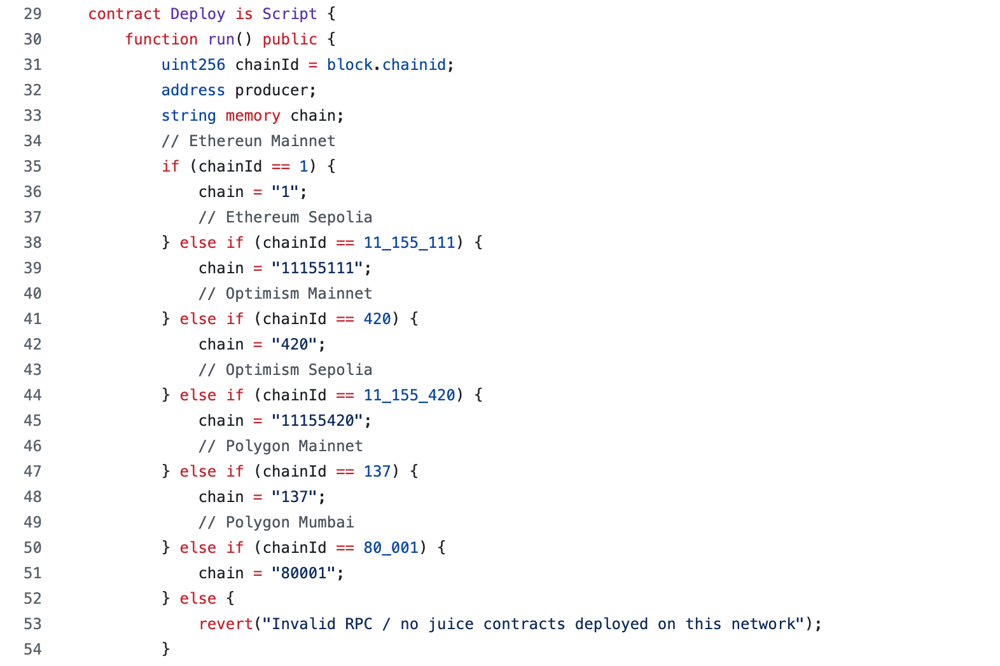

#### 依赖代码库

从依赖代码库调用的所有合约如下：

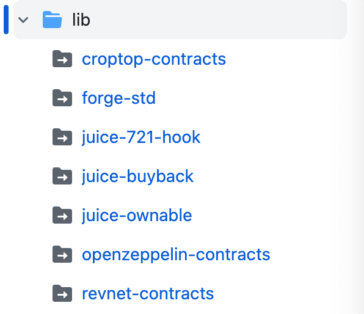

#### 加载地址

然后我们就会确定多终端、规则集、回购钩子、NFT 钩子、钩子商店以及 revnet Croptop 部署器等的合约地址。

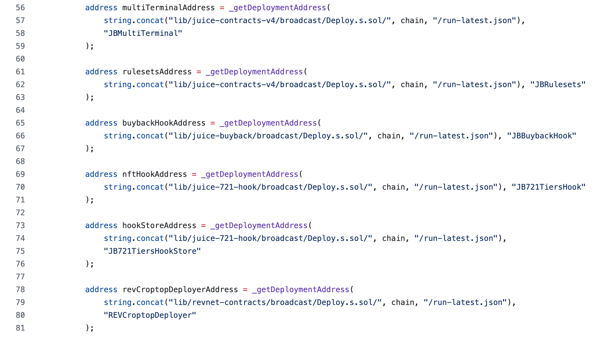

#### 顶层元数据

我们还要定义包括 logo 及其他所有元数据在内的一些顶层数据，这些数据将会在类似 Juicebox.money 这样的前端网站上进行显示。

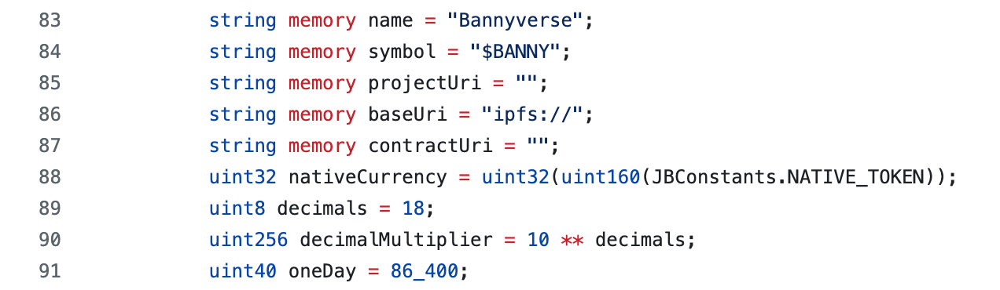

#### 接收资金的代币

我们将通过以下代码来设定项目将要接收资金的终端，它将被设定为接受当前区块链的原生代币。这里设定的是以太坊或其他区块链上的 ETH。

我们会在这个部分增加支持用其他代币接收资金的其他终端，即将完成的兑换终端也会出现在这里。

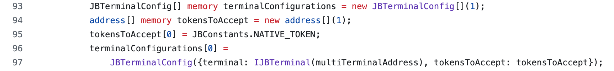

#### Revnet 阶段设置

以下我们将配置 Bannyverse revnet 的不同阶段，它正式启动时将会预设好两个阶段。每个阶段都会配置各自的起始时间、操作员分配比例、初始发行比率、天花板价格和地板价税率，等等。

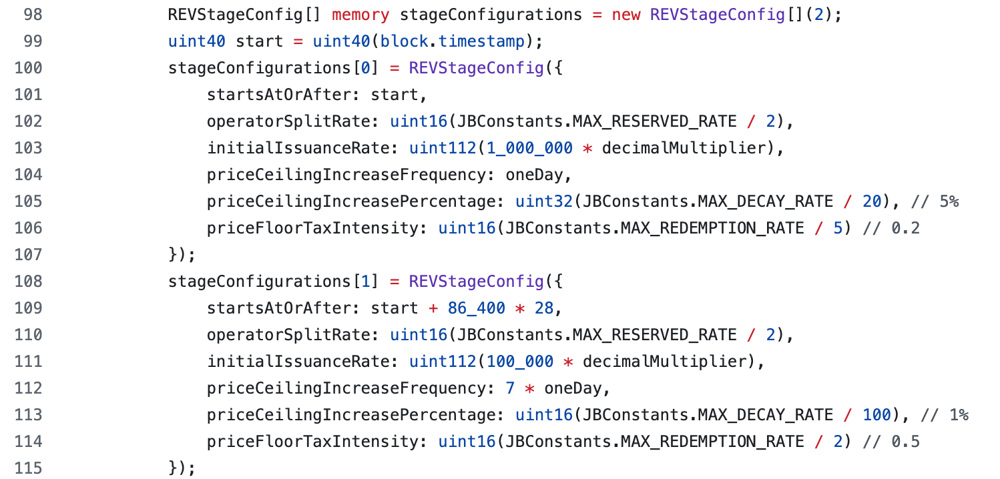

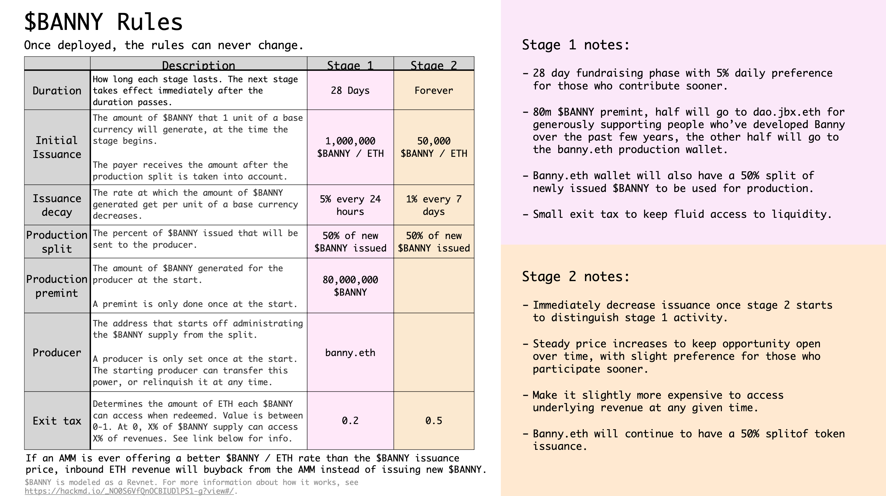

#### Revnet 配置

在 revnet 的主要配置中加入阶段设置信息后，我们接下来会设定基础货币、预挖数量以及初始操作员。

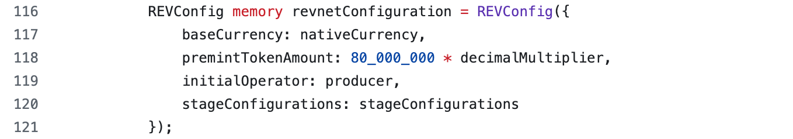

#### 回购钩子配置

然后我们会对回购钩子进行配置，设定参数来决定实现回购的具体价格。我们还将定义流动性池及 TWAP （时间加权平均价格）等参数。

下面的部分，我们对回购钩子的配置进行引用，并同时明确回购钩子的合约地址。

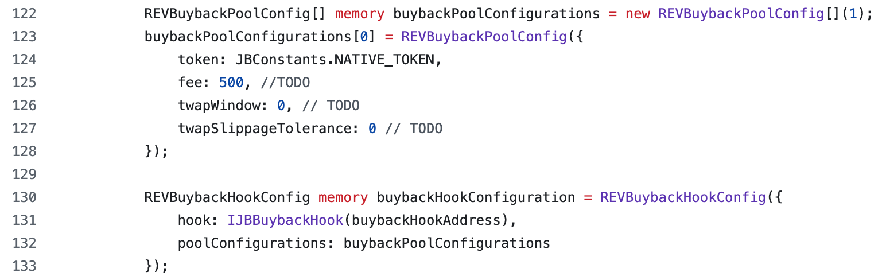

#### NFT 等级

这里我们将预加载 4 个不同稀有程度的裸体 Banny NFT，它们的价格不同，发行量也不一样。

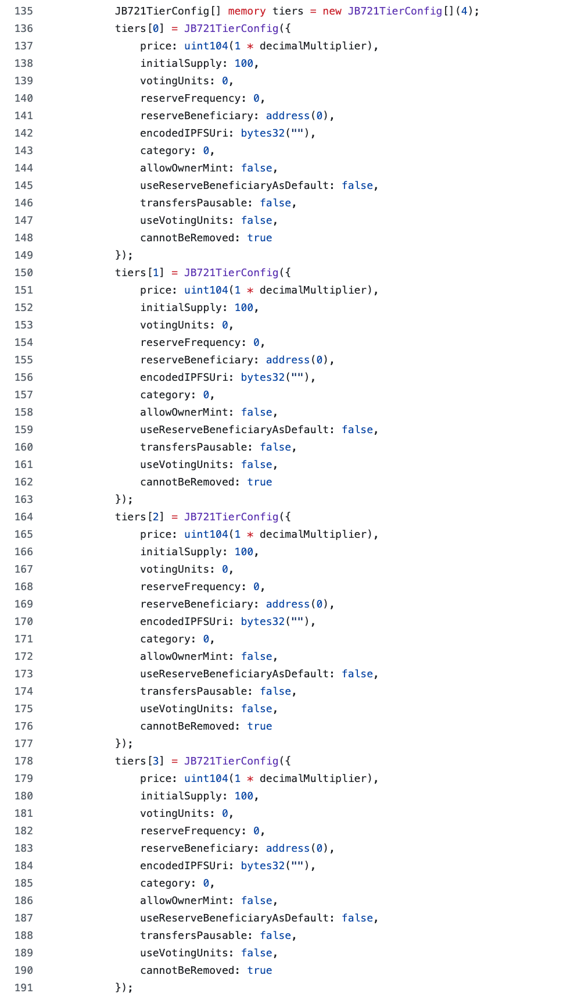

#### Croptop 参数

以下这些参数用于允许人们把自己的服饰配件发布到项目的 NFT 系列。项目方不再是唯一有权在 Bannyverse 发布新物品的人，最终 Bannyverse 将发展成为一个每个人都能够发布收藏品的世界。

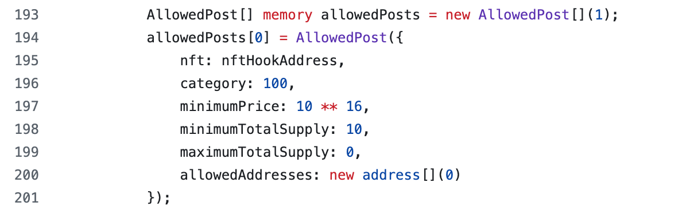

#### 广播上链

至此，我们已经设置好所有的细节，接着就要把项目广播到链上。我们会发送两个交易。第一个交易是部署 URI 解析器，也就是[专用的 Banny 解析器合约](https://github.com/mejango/banny-contract/blob/main/src/Banny721TokenUriResolver.sol)。第二个交易则是通过 `deployCroptopRevnetFor()` 函数来部署 revnet, 函数会正式启动这个项目，并把诸如名称、符号、项目 URI、revnet 配置、终端配置、回购钩子配置、NFT 钩子配置及 Croptop 发布等 Croptop 相关的参数传递进去。

运行这个脚本之后，一个销售裸体 Banny 的 Bannyverse revnet 应该就创建成功了，除了使用正常的 Juicebox 协议组件，将来还会增加 Banny 服饰的支持。

We will also use a similar script for the Bananapus project, which is the fee collecting project of the protocol, but without NFTs or Croptop features. 

接下来的 Bananapus 项目我们也会使用类似的部署脚本，Bananapus 是协议的收费项目，但项目内不会包含 NFT 或 Croptop 等功能。

## Bannyverse 背景介绍 —— Jango

从视觉角度来看，Bannyverse 重生于我们制作于一年半前一整套非常丰富的 Banny 材料。

原本这些材料计划用于一个更着重于治理用途的项目，这个项目允许 JBX 持有人质押他们的代币来相应获得 veBanny NFT，再按他们锁定 JBX 的时间长度及数量来决定这些 veBanny NFT 的治理投票权重。由于种种原因，项目一直没能实现产品化。

在这一期间，JuiceboxDAO 一直在致力于解决一些确保协议稳健的先决条件，例如协议版本控制、安全相关工作、风险控制工作以及最近的 Revnet 开发，正是因为这些工作优先级更高的原因，Banny 项目一直被搁置至今。

Jango、Mieos 和 Lurmoth 等人最近经过讨论后决定，重启 Bannyverse 项目及将其应用当前环境的时机已经成熟。他们开始构想，如何让 Banny 不仅 Web3 NFT 的形式，反而更多作为生态系统的相关角色，来展示在屏幕上讲述 Juicebox 的故事。当前的工作主要围绕如何能够把各种因素整合到一起，在过去的几个周期，这些想法通过提案的形式提交到 JuiceboxDAO 一起展开了讨论并得到改善。

最初，Bannyverse 将会作为人们在以太坊主网和 Optimism 上铸造裸体 Banny 一系列 NFT 的展示窗口，以后我们将会进一步扩展到更多的其他区块链。

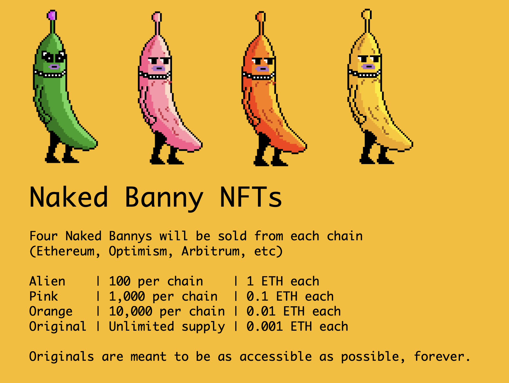

四个等级不同稀有度的裸体 Banny 将作为基础角色，而 Mieos 将会主导将来制作、展示各种各样 Banny 服饰的工作，让持有裸体 Banny NFT 的人可以购买服饰配件并按自己的喜好来装扮自己的 Banny。同时 Lurkmoth 还会制作一些动画短片来配合这些 NFT 系列的销售，共同来为 Bannyverse 的推广做宣传。

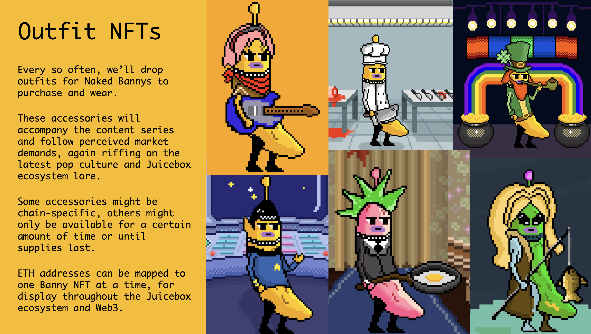

感谢 JuiceboxDAO 一直以来在这个工作上的支持，Bannyverse 有望成为我们很好的起点，但同时我们也希望开启一个良性循环，帮助把兴趣和注意力引导回 Juicebox 文化，并吸引更多的捐款人、新项目和新想法的出现。我们将坦诚面对未来的各种不确定性。

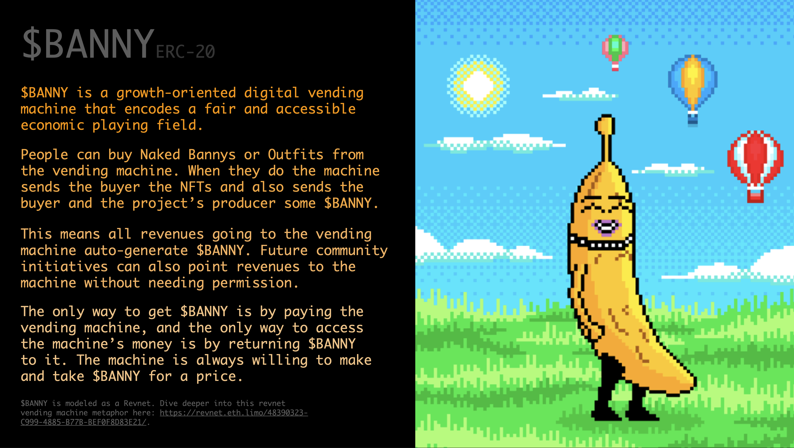

## Juicebox V4 单元测试报告 —— Nowonder

Nowonder 最近致力于 Juicebox V4 协议的单元测试工作，以尽可能小的方式来覆盖每个合约的所有逻辑分支，基本上等于部署一个单一合约来对其他合约进行其他调用，模拟这些调用并返回数据，确保所有工作逻辑都运行无误。鉴于 Juicebox V3 协议已经是一个非常全面的软件，他预计测试最多能找到一些少量的优化结果。但他也表示，如果将来协议的实现发生变化，单元测试将有助于准确发现变化的内容，并能确定这些变更都是安全无害的。

Jango 对此深表感谢，他表示这方面的工作正是我们可以进行更高层次艺术抽象的原因所在，因为我们背后有一大群贡献者，他们做了许许多多不为人所知的工作。

## Nouns 493 号提案报告 —— Matthew

[Nouns 493 号提案](https://nouns.wtf/vote/493)，建议向 [Free Alexey & Roman project](https://juicebox.money/@free-pertsev-and-storm) 项目捐款 40 ETH 支持两位 Tornado Cash 开发者的法律辩护工作，这项提案已经高票获得 Nouns 社区的通过。这是 Nouns 社区首次通过提案形式直接从 Nouns DAO 金库向某一个 Juicebox 项目进行捐款。

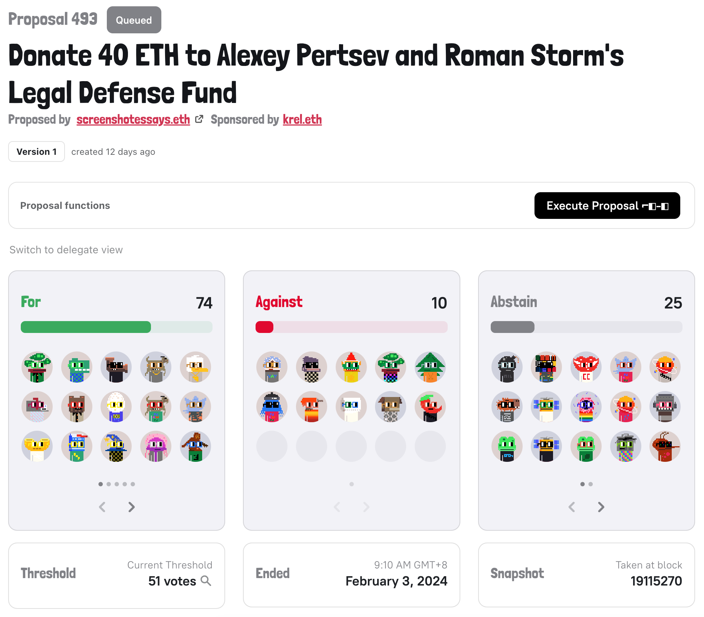

很不幸运，由于 Nouns 治理前端的一个错误，执行这项提案的交易失败了。尽管问题已经进行了修复，提案仍然需要重新提交到社区再次接受投票。Matthew 表示，他并不太担心需要重新走一次同样的治理流程，因为上次投票结果显示这个提案赢得了大多数人的支持。

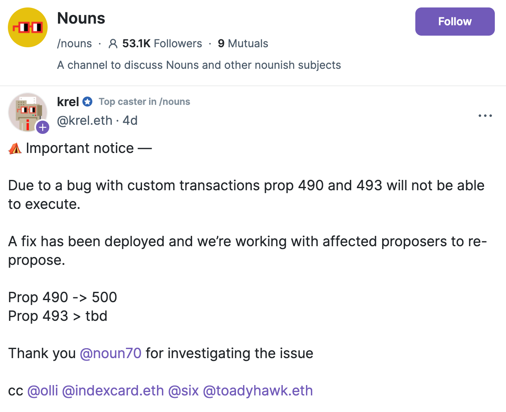

Matthew 和 Brileigh 认为他们可以设法说服其他 DAO 来支持一个好的 Juicebox 项目，并表示这项工作的重点在于与借助合适的人帮助以及与目标社区的有效沟通。他们计划将面向一些更大型类似 Arbitrum 及 Optimism 等 DAO 组织实施这一战略，希望能够成功找到更多 DAO 金库来与 Juicebox 协议进行交互。

